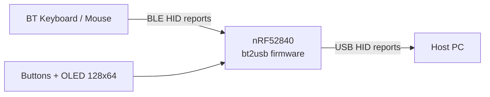
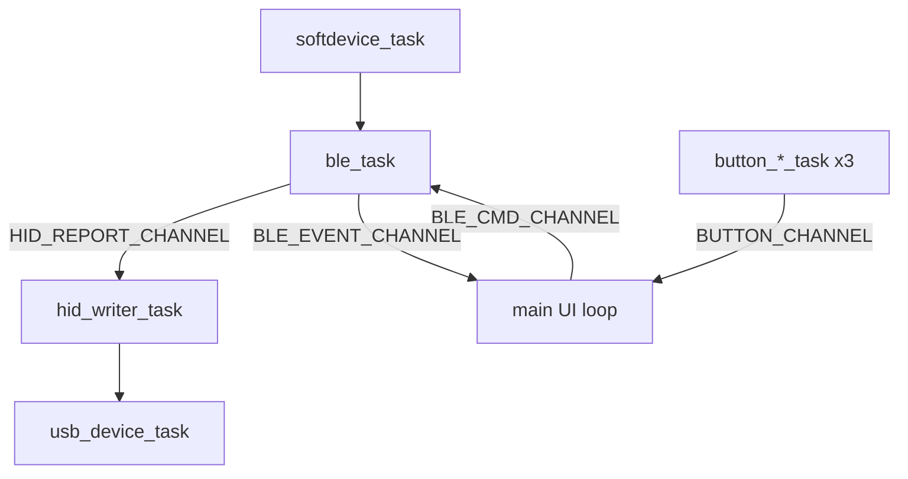
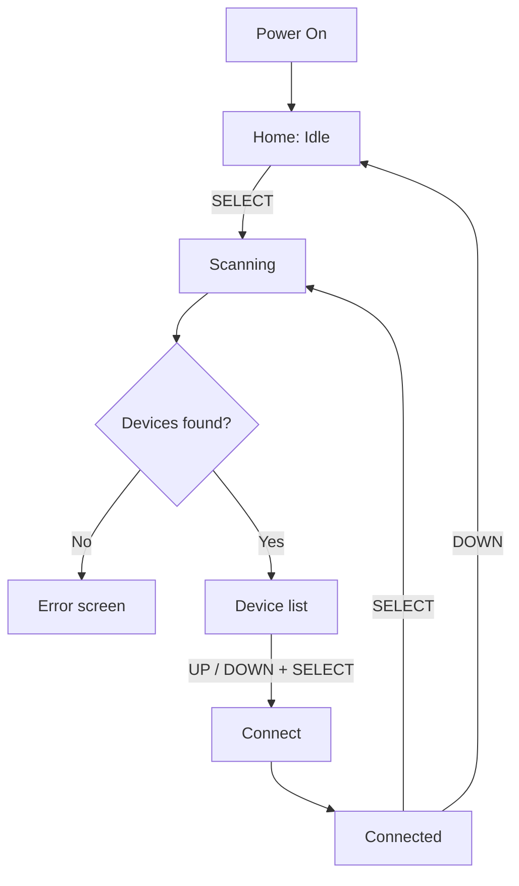
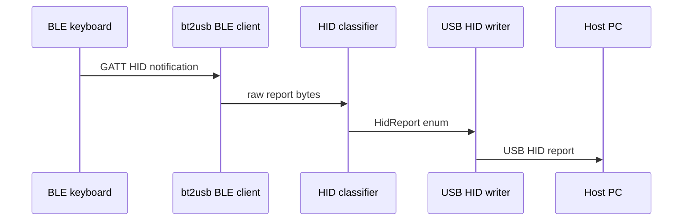

# bt2usb

A driverless, bare-metal Rust Bluetooth-to-USB HID bridge that leverages any monitor's USB hub into a seamless "Bluetooth-KVM" for sharing peripherals across multiple hosts. Support for two simultaneous Bluetooth connections (one keyboard + one mouse). Switching a monitor's input source automatically switches the active Bluetooth connection, allowing a single Bluetooth keyboard and mouse to control multiple PCs without re-pairing.



---

## Hardware

### Bill of Materials

| Component            | Example Part                   | Purpose                          |
|----------------------|--------------------------------|----------------------------------|
| MCU                  | **nRF52840-DK**                | BLE 5.0 + USB 2.0 FS on-chip     |
| OLED Display         | SSD1306 128x64 I2C module      | Device list & status display     |
| Buttons x3           | 6mm tactile switches           | UP, DOWN, SELECT                 |
| Wiring               | Dupont jumpers or custom PCB   | Interconnect                     |
| Enclosure            | 3D-printed case                | Protection & mounting            |

> The DK (Development Kit) provides easy access to the nRF52840's USB and I/O pins, making it ideal for development. For a more compact final product, consider a custom PCB with an nRF52840 SoC or module.
> A USB cable extension may be needed to be able to manage pairing process while the device is plugged into a monitor with a USB port that is not easily accessible. A USB-C to USB-A adapter may also be needed depending on the monitor's USB port type.

### Default Pin Mapping (nRF52840-DK)

| Signal         | Pin     | Notes                        |
|----------------|---------|------------------------------|
| Button UP      | P0.11   | Active-low, internal pull-up |
| Button DOWN    | P0.12   | Active-low, internal pull-up |
| Button SELECT  | P0.24   | Active-low, internal pull-up |
| I2C SDA        | P0.26   | SSD1306 data                 |
| I2C SCL        | P0.27   | SSD1306 clock                |
| Status LED     | P0.06   | On-board LED (unused)        |
| USB D+/D-      | On-chip | nRF52840 native USB          |

> Pin assignments are configured in `src/config.rs` and instantiated in `src/main.rs`.

---

## Memory Requirements

The nRF52840 has **1 MB internal flash** and **256 KB RAM**; no external memory is required.

### Memory Map (design target)

| Region               | Size       | Usage                             |
|----------------------|------------|-----------------------------------|
| SoftDevice S140      | ~152 KB    | BLE stack (fixed)                 |
| Application code     | ~80-120 KB | Firmware (release build with LTO) |
| Device storage area  | 16 KB      | Pairing/persistence region        |
| Remaining flash      | ~700 KB    | Future features / DFU             |

### RAM Usage (design target)

| Component      | Size     | Notes                                           
|----------------|----------|-------------------------------------------------|
| SoftDevice RAM | ~24 KB   | Reserved in linker script (actual use ~8-12 KB) |
| Static buffers | ~4 KB    | HID reports, display buffer, channels           |
| Task stacks    | ~16 KB   | Embassy tasks                                   |
| Remaining RAM  | ~212 KB  | Headroom for future features                    |

### Why No External Memory?

- Internal flash endurance is sufficient for pairing metadata.
- SSD1306 framebuffer is only 1 KB.
- No heap is required in current architecture.

---

## Software Architecture

```
src/
|-- main.rs
|-- config.rs
|-- error.rs
|-- power.rs
|-- power_logic.rs
|-- storage.rs
|-- hid/
|   |-- mod.rs
|   |-- keyboard.rs
|   |-- mouse.rs
|   |-- consumer.rs
|   |-- report_protocol.rs
|   `-- tests.rs
|-- ble/
|   |-- mod.rs
|   |-- adv_parser.rs
|   |-- scanner.rs
|   |-- hid_client.rs
|   `-- multi_conn.rs
|-- usb/
|   |-- mod.rs
|   `-- hid_device.rs
|-- ui/
|   |-- mod.rs
|   |-- display.rs
|   |-- buttons.rs
|   `-- input_logic.rs
```

### Async Task Model (Embassy)



All inter-task communication uses Embassy channels (`Channel<CriticalSectionRawMutex, T, N>`).

| Channel              | Direction     | Type        | Size |
|----------------------|---------------|-------------|------|
| HID_REPORT_CHANNEL   | BLE -> USB    | HidReport   | 16   |
| BLE_CMD_CHANNEL      | UI -> BLE     | BleCommand  | 4    |
| BLE_EVENT_CHANNEL    | BLE -> UI     | BleEvent    | 8    |
| BUTTON_CHANNEL       | Buttons -> UI | ButtonEvent | 4    |

### Key Design Decisions

| Decision                      | Rationale                                         |
|-------------------------------|---------------------------------------------------|
| `#![no_std]` + `#![no_main]`  | Deterministic bare-metal runtime                  |
| Embassy async executor        | Efficient I/O-bound concurrency for BLE + USB     |
| Nordic SoftDevice S140        | Production-grade BLE stack                        |
| Static allocation             | No allocator/fragmentation issues                 |
| `defmt` logging               | Compact embedded logging                          |
| `probe-rs` toolchain          | Unified flashing/debug/log workflow               |

### Why Embassy Instead of an RTOS?

| Aspect           | Embassy (this project)       | Typical RTOS                        |
|------------------|------------------------------|-------------------------------------|
| Scheduling       | Cooperative (`.await`)       | Preemptive                          |
| Context overhead | Lower                        | Higher                              |
| Memory model     | Static/no heap by default    | Kernel/task overhead                |
| BLE integration  | Native with `nrf-softdevice` | Often additional integration layer  |

---

## Getting Started

### Prerequisites

```bash
rustup target add thumbv7em-none-eabihf
cargo install probe-rs-tools flip-link defmt-print cargo-llvm-cov mask
```

### Hardware Setup

1. Connect SSD1306 OLED to I2C (SDA -> P0.26, SCL -> P0.27)
2. Wire 3 buttons to P0.11, P0.12, P0.24 (other leg to GND)
3. Connect nRF52840 USB to host PC
4. Connect a debug probe (J-Link, CMSIS-DAP, or on-board DK debugger)

On nRF52840-DK and Feather nRF52840, USB D+/D- are routed on-board (no external D+/D- wiring required).

### Build & Flash

Follow these steps in order (simplest path):

1. **Connect hardware**
    - Plug in the nRF52840 board over USB.
    - Attach a debug probe (J-Link / CMSIS-DAP, or on-board debugger on nRF52840-DK).

2. **Confirm probe is visible**

    ```bash
    mask probe-list
    ```

3. **Build firmware (debug)**

    ```bash
    mask build
    ```

4. **Flash + run firmware (debug)**

    ```bash
    mask run
    ```

5. **For release firmware (smaller/faster)**

    ```bash
    mask build --release
    mask run --release
    ```

If flashing fails, re-check cabling/probe permissions and run `mask probe-list` again.

### SoftDevice

SoftDevice must be flashed **once per board** before running bt2usb.

1. **Download S140 v7.3.0**
    - Get `s140_nrf52_7.3.0_softdevice.hex` from Nordic's official SoftDevice release page.
    - Place it in the project root (or note its full path).

2. **Flash SoftDevice**

```bash
probe-rs download s140_nrf52_7.3.0_softdevice.hex --chip nRF52840_xxAA --format hex
```

3. **Flash bt2usb firmware**

```bash
mask run --release
```

4. **Subsequent updates**
    - You normally only re-run `mask run --release`.
    - Reflash SoftDevice only if you erase full flash or change SoftDevice version.

---

## Development

This project uses [mask](https://github.com/jacobdeichert/mask) as task runner.

```bash
cargo install mask
```

### Common Commands

```bash
mask build
mask run
mask test
mask coverage
mask check
mask ci
mask deps
```

### Devcontainer (VS Code / WSL2)

A `.devcontainer/` setup is provided:

- No hard `/dev/bus/usb` bind mount required at startup (avoids failing when no probe is attached yet).
- Container runs `--privileged` and installs embedded tools in `post-create.sh`.
- Installs: `probe-rs-tools`, `flip-link`, `mask`, `cargo-llvm-cov`, and ARM targets.

**WSL2 USB workflow**

1. Attach probe from Windows to WSL using `usbipd-win`.
2. Open project in VS Code and **Reopen in Container**.
3. Run `mask probe-list` to verify probe visibility.

### Testing Strategy

- **Host unit tests:** HID parsing/serialization/classification (`mask test`)
- **On-target integration:** Requires hardware + RTT/probe workflows
- **Coverage:** `mask coverage`, HTML/JSON outputs supported

---

## User Flow



### Screen Power Save

- OLED turns off after 2 minutes of inactivity (configurable).
- Any button touch wakes the screen immediately.
- First touch after wake is consumed for wake-up (prevents accidental actions).

## Data Flow: Keystroke Journey



---

## Project Status & Roadmap

### Implemented

- [x] BLE scan + connect + HID notification pipeline
- [x] USB composite HID (keyboard + mouse + consumer)
- [x] Consumer HID parsing in core logic
- [x] Consumer HID forwarding to USB endpoint
- [x] Device list caching in UI loop (selection state)
- [x] Explicit BLE disconnect command handling in connection lifecycle
- [x] HID report-map parsing integrated in BLE HID client for capability detection
- [x] Report-ID fallback classification path for report-protocol devices
- [x] Flash-backed paired-device load/save in BLE task
- [x] Boot-time auto-reconnect attempt from paired-device store
- [x] Power manager periodic tick integrated into main UI loop
- [x] Descriptor-guided Report ID routing for report-protocol notifications
- [x] Low-power UI redraw throttling in idle state (reduced I2C/display wakeups)
- [x] Multi-device runtime connection orchestration (`src/ble/multi_conn.rs`)
- [x] BLE bonding/encryption workflow integration
- [x] Pairing/encryption handled in normal connect flow (no separate pairing screen required)
- [x] OLED rendering + 3-button input handling
- [x] Host tests + CI + coverage workflows
- [x] Devcontainer setup for embedded workflows (WSL-aware)

### Future Enhancements

- [ ] Multiple BLE profile sets
- [ ] LED pass-through (Caps/Num Lock)
- [ ] NKRO support via advanced report protocol handling
- [ ] System tray companion app (Windows/macOS)
- [ ] OTA firmware update (DFU via USB or BLE)

---

## Configuration

All tunable constants live in `src/config.rs`.

| Constant                | Default       | Description                       |
|-------------------------|---------------|-----------------------------------|
| BLE_SCAN_DURATION_SECS  | 8             | BLE scan window (seconds)         |
| BLE_CONN_INTERVAL_MIN   | 6 (7.5 ms)    | Min BLE conn interval             |
| BLE_CONN_INTERVAL_MAX   | 12 (15 ms)    | Max BLE conn interval             |
| MAX_PAIRED_DEVICES      | 4             | Maximum stored paired devices     |
| STORAGE_FLASH_PAGE_START| 240           | First flash page for pair storage |
| STORAGE_FLASH_PAGE_COUNT| 4             | Flash pages reserved for storage  |
| USB_VID / USB_PID       | 0x1209/0x0001 | USB IDs                           |
| USB_HID_POLL_MS         | 1             | USB HID polling interval          |
| BUTTON_DEBOUNCE_MS      | 50            | Button debounce                   |
| SCREEN_AUTO_OFF_ENABLED | true          | Enable/disable OLED auto power-off |
| SCREEN_AUTO_OFF_TIMEOUT_SECS | 120      | OLED auto-off timeout (seconds)   |

---

## Alternative MCU Targets

| MCU                    | BLE             | USB Device         | Rust Support             | Notes                               |
|------------------------|-----------------|--------------------|--------------------------|-------------------------------------|
| **nRF52840** (primary) | On-chip BLE 5.0 | On-chip USB 2.0 FS | Embassy + nrf-softdevice | Best fit for this architecture      |
| ESP32-S3               | On-chip BLE 5.0 | On-chip USB OTG    | esp-hal / esp-idf        | Strong alternative                  |
| RP2040 + BT module     | External BT     | On-chip USB        | Embassy-rp               | Lower-cost, higher integration work |
| STM32 + BT module      | External BT     | On-chip USB OTG    | Embassy-stm32            | Flexible but more complex           |

---

## License

GPL-3.0 License (see LICENSE file for details)
