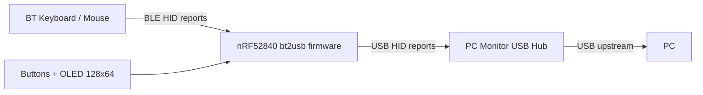
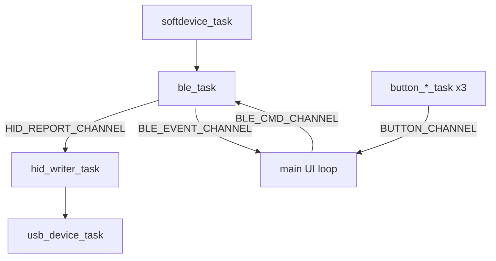
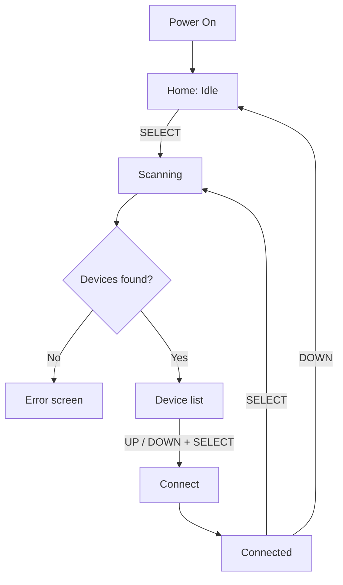
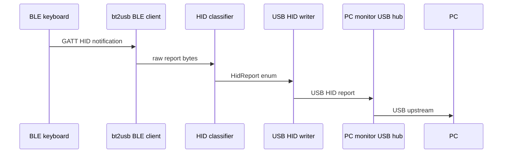

# bt2usb

[](https://www.rust-lang.org/)
[](https://embassy.dev/)
[](https://www.nordicsemi.com/Products/nRF52840)
[](https://www.bluetooth.com/)
[](https://www.usb.org/hid)
[](https://renode.io/)
[](LICENSE)

A driverless, bare-metal Rust Bluetooth-to-USB HID bridge for nRF52840. It connects to Bluetooth HID peripherals, exposes them as a USB keyboard/mouse/consumer-control device through a monitor's USB hub, and supports up to two simultaneous BLE HID links, typically one keyboard and one mouse. Paired device metadata and BLE bonding keys are stored in flash so reconnects do not require re-pairing after every reboot.


```mermaid
flowchart LR
    BT["BT Keyboard / Mouse"] -->|BLE HID reports| FW["nRF52840 bt2usb firmware"]
    FW -->|USB HID reports| MON["PC Monitor USB Hub"]
    MON -->|USB upstream| PC["PC"]
    UI["Buttons + OLED 128x64"] --> FW
```

---

## Hardware

### Bill of Materials (BOM)

| Component    | Example Part                 | Purpose                      |
| ------------ | ---------------------------- | ---------------------------- |
| MCU          | **nRF52840-DK**              | BLE 5.0 + USB 2.0 FS on-chip |
| OLED Display | SSD1306 128x64 I2C module    | Device list & status display |
| Buttons x3   | 6mm tactile switches         | UP, DOWN, SELECT             |
| Wiring       | Dupont jumpers or custom PCB | Interconnect                 |
| Enclosure    | 3D-printed case              | Protection & mounting        |

> The DK (Development Kit) provides easy access to the nRF52840's USB and I/O pins, making it ideal for development. For a more compact final product, consider a custom PCB with an nRF52840 SoC or module.
> A USB cable extension may be needed to be able to manage pairing process while the device is plugged into a monitor with a USB port that is not easily accessible. A USB-C to USB-A adapter may also be needed depending on the monitor's USB port type.

### Default Pin Mapping (nRF52840-DK)

| Signal        | Pin     | Notes                        |
| ------------- | ------- | ---------------------------- |
| Button UP     | P0.11   | Active-low, internal pull-up |
| Button DOWN   | P0.12   | Active-low, internal pull-up |
| Button SELECT | P0.24   | Active-low, internal pull-up |
| I2C SDA       | P0.26   | SSD1306 data                 |
| I2C SCL       | P0.27   | SSD1306 clock                |
| Status LED    | P0.06   | On-board LED (unused)        |
| USB D+/D-     | On-chip | nRF52840 native USB          |

> Pin assignments are configured in `src/config.rs` and instantiated in `src/main.rs`.

---

## Configuration

All tunable constants live in `src/config.rs`.

| Constant                     | Default       | Description                                         |
| ---------------------------- | ------------- | --------------------------------------------------- |
| BLE_SCAN_DURATION_SECS       | 8             | BLE scan window (seconds)                           |
| BLE_CONN_INTERVAL_MIN        | 6 (7.5 ms)    | Min BLE conn interval                               |
| BLE_CONN_INTERVAL_MAX        | 12 (15 ms)    | Max BLE conn interval                               |
| MAX_PAIRED_DEVICES           | 4             | Maximum stored paired devices                       |
| STORAGE_FLASH_PAGE_START     | 240           | First flash page for paired-device/bond storage     |
| STORAGE_FLASH_PAGE_COUNT     | 4             | Flash pages reserved for paired-device/bond storage |
| USB_VID / USB_PID            | 0x1209/0x0001 | USB IDs                                             |
| USB_HID_POLL_MS              | 1             | USB HID polling interval                            |
| BUTTON_DEBOUNCE_MS           | 50            | Button debounce                                     |
| SCREEN_AUTO_OFF_ENABLED      | true          | Enable/disable OLED auto power-off                  |
| SCREEN_AUTO_OFF_TIMEOUT_SECS | 120           | OLED auto-off timeout (seconds)                     |

---

## Alternative MCU Targets

| MCU                    | BLE             | USB Device         | Rust Support             | Notes                               |
| ---------------------- | --------------- | ------------------ | ------------------------ | ----------------------------------- |
| **nRF52840** (primary) | On-chip BLE 5.0 | On-chip USB 2.0 FS | Embassy + nrf-softdevice | Best fit for this architecture      |
| ESP32-S3               | On-chip BLE 5.0 | On-chip USB OTG    | esp-hal / esp-idf        | Strong alternative                  |
| RP2040 + BT module     | External BT     | On-chip USB        | Embassy-rp               | Lower-cost, higher integration work |
| STM32 + BT module      | External BT     | On-chip USB OTG    | Embassy-stm32            | Flexible but more complex           |

---

## Memory Requirements

The nRF52840 has **1 MB internal flash** and **256 KB RAM**; no external memory is required.

### Memory Map (design target)

| Region              | Size       | Usage                                |
| ------------------- | ---------- | ------------------------------------ |
| SoftDevice S140     | 156 KB     | BLE stack (fixed, flash 0x0–0x27000) |
| Application code    | ~80-120 KB | Firmware (release build with LTO)    |
| Device storage area | 16 KB      | Paired-device and bond-key storage   |
| Remaining flash     | ~700 KB    | Future features / DFU                |

### RAM Usage (design target)

| Component      | Size    | Notes                                                                                                                                      |
| -------------- | ------- | ------------------------------------------------------------------------------------------------------------------------------------------ |
| SoftDevice RAM | ~24 KB  | Reserved in linker script (actual use ~8-12 KB)                                                                                            |
| Static buffers | ~4 KB   | HID reports, display buffer, channels                                                                                                      |
| Task state     | ~16 KB  | Embassy task arenas (futures). The thread-mode executor runs all tasks cooperatively on a single call stack — there are no per-task stacks |
| Remaining RAM  | ~212 KB | Headroom for future features                                                                                                               |

---

## Firmware Architecture

```
src/
|-- main.rs            # firmware entry point + UI loop (imperative shell)
|-- sim.rs             # SoftDevice-free entry point for Renode
|-- lib.rs             # host-test entry point (re-exposes the pure modules)
|-- config.rs
|-- power.rs           power_logic.rs   storage.rs
|-- hid/               # report types + classification (host-tested, no_std)
|   |-- mod.rs  keyboard.rs  mouse.rs  consumer.rs  report_protocol.rs
|-- ble/
|   |-- mod.rs  adv_parser.rs  scanner.rs  hid_client.rs  multi_conn.rs
|   `-- coordinator.rs # connection-slot state machine + reducers (pure core)
|-- usb/
|   |-- mod.rs  hid_device.rs
|-- ui/
|   |-- mod.rs  display.rs  buttons.rs  input_logic.rs
|   `-- ui_logic.rs    # screen-transition reducer (pure core)
```

### Async Task Model (Embassy)


```mermaid
flowchart TD
    SD[softdevice_task] --> BLE[ble_task]
    BLE -->|HID_REPORT_CHANNEL| HIDW[hid_writer_task]
    HIDW --> USB[usb_device_task]

    BTN[button_*_task x3] -->|BUTTON_CHANNEL| UI[main UI loop]
    UI -->|BLE_CMD_CHANNEL| BLE
    BLE -->|BLE_EVENT_CHANNEL| UI
```

All inter-task communication uses Embassy channels (`Channel<CriticalSectionRawMutex, T, N>`).

| Channel                | Direction                 | Type        | Size |
| ---------------------- | ------------------------- | ----------- | ---- |
| HID_REPORT_CHANNEL     | BLE -> USB                | HidReport   | 16   |
| BLE_CMD_CHANNEL        | UI -> BLE                 | BleCommand  | 4    |
| BLE_EVENT_CHANNEL      | BLE -> UI                 | BleEvent    | 8    |
| BLE_SLOT0_CMD_CHANNEL  | BLE coordinator -> slot 0 | SlotCommand | 2    |
| BLE_SLOT1_CMD_CHANNEL  | BLE coordinator -> slot 1 | SlotCommand | 2    |
| BLE_SLOT_EVENT_CHANNEL | BLE slots -> coordinator  | SlotEvent   | 8    |
| BUTTON_CHANNEL         | Buttons -> UI             | ButtonEvent | 4    |

### Key Design Decisions

| Decision                     | Rationale                                     |
| ---------------------------- | --------------------------------------------- |
| `#![no_std]` + `#![no_main]` | Deterministic bare-metal runtime              |
| Embassy async executor       | Efficient I/O-bound concurrency for BLE + USB |
| Nordic SoftDevice S140       | Production-grade BLE stack                    |
| Static allocation            | No allocator/fragmentation issues             |
| `defmt` logging              | Compact embedded logging                      |
| `probe-rs` toolchain         | Unified flashing/debug/log workflow           |

### Why Embassy Instead of an RTOS?

| Aspect           | Embassy (this project)       | Typical RTOS                       |
| ---------------- | ---------------------------- | ---------------------------------- |
| Scheduling       | Cooperative (`.await`)       | Preemptive                         |
| Context overhead | Lower                        | Higher                             |
| Memory model     | Static/no heap by default    | Kernel/task overhead               |
| BLE integration  | Native with `nrf-softdevice` | Often additional integration layer |

---

## Getting Started

### Prerequisites

```bash
rustup target add thumbv7em-none-eabihf
cargo install probe-rs-tools flip-link defmt-print cargo-llvm-cov mask
```

### Hardware Setup

1. Connect SSD1306 OLED to I2C (SDA -> P0.26, SCL -> P0.27)
2. Wire 3 buttons to P0.11, P0.12, P0.24 (other leg to GND)
3. Connect nRF52840 USB to the PC monitor's USB hub, then connect the monitor's USB upstream port to the PC
4. Connect a debug probe (J-Link, CMSIS-DAP, or on-board DK debugger)

On nRF52840-DK and Feather nRF52840, USB D+/D- are routed on-board (no external D+/D- wiring required).

### Build & Flash

With the hardware connected (above) and the SoftDevice flashed once (below):

```bash
mask probe-list      # confirm the probe is visible
mask run             # build + flash + run with RTT logs (debug)
mask run --release   # smaller/faster release build
```

If flashing fails, re-check cabling/probe permissions and re-run `mask probe-list`.

### SoftDevice

SoftDevice must be flashed **once per board** before running bt2usb.

1. **Download S140 v7.3.0**
    - Get `s140_nrf52_7.3.0_softdevice.hex` from Nordic's official SoftDevice release page.
    - Place it in the project root (or note its full path).

2. **Flash SoftDevice**

```bash
probe-rs download s140_nrf52_7.3.0_softdevice.hex --chip nRF52840_xxAA --format hex
```

3. **Flash bt2usb firmware**

```bash
mask run --release
```

4. **Subsequent updates**
    - You normally only re-run `mask run --release`.
    - Reflash SoftDevice only if you erase full flash or change SoftDevice version.

---

## Development

Task running uses [mask](https://github.com/jacobdeichert/mask) (installed in Prerequisites).

### Common Commands

```bash
mask build
mask run
mask test
mask coverage
mask check
mask ci
mask deps
```

### Devcontainer (VS Code / WSL2)

A `.devcontainer/` setup is provided:

- No hard `/dev/bus/usb` bind mount required at startup (avoids failing when no probe is attached yet).
- Container runs `--privileged` and installs embedded tools in `post-create.sh`.
- Installs: `probe-rs-tools`, `flip-link`, `mask`, `cargo-llvm-cov`, and ARM targets.

**WSL2 USB workflow**

1. Attach probe from Windows to WSL using `usbipd-win`.
2. Open project in VS Code and **Reopen in Container**.
3. Run `mask probe-list` to verify probe visibility.

### Testing Strategy

A layered approach, because the two ends of the data path — the BLE link (the
closed-source Nordic SoftDevice + radio) and the USB device peripheral — can't be
emulated. Everything *between* them can, on the host or in a simulator:

- **Host unit + integration tests:** HID parsing/serialization/classification,
  UI/power policy, advert parsing — runs in the container/WSL with no hardware.
- **Orchestration tests:** the connection-slot state machine + command/event
  reducers (`ble/coordinator.rs`) and the UI screen transitions (`ui/ui_logic.rs`)
  are pure modules driven by host unit tests (≈99% covered). The async tasks are
  thin interpreters over them.
- **On-target simulation:** Renode runs a SoftDevice-free `sim` build to exercise
  boot, the memory map, GPIO buttons, timers and the real UI/coordinator logic on
  a simulated nRF52840. See the [Renode simulation](#on-target-simulation-renode)
  guide below.
- **Full end-to-end:** SoftDevice BLE + USB enumeration require a real
  nRF52840-DK (RTT/probe workflows; WSL via `usbipd-win`).

#### Running the tests

The host unit + integration tests (covering Layers 1–2 above) are just:

```bash
mask test          # all lib + integration tests (auto-detects host target)
mask coverage      # same, with an llvm-cov coverage report
```

`mask test` builds for the host automatically. To run a single core in
isolation: `cargo test --lib coordinator` or `cargo test --lib ui_logic`.

#### On-target simulation (Renode)

The SoftDevice-free `sim` build boots on a simulated nRF52840 in
[Renode](https://renode.io) and runs the **real** host-tested logic
(`ble::coordinator`, `ui::ui_logic`) plus the GPIO/timer drivers and boot path —
no hardware. It excludes the SoftDevice, USB, and flash stacks (those need real
silicon) and logs to UART0, which Renode prints directly (no probe or decoder).

**1. Build the sim firmware** (just needs the ARM target; no probe/board):

```bash
mask sim-build
# → target/thumbv7em-none-eabihf/debug/bt2usb-sim   (a real nRF52840 ELF)
```

**2. Install Renode** (Linux/WSL2, no root). One command installs portable
Renode plus the `renode-test` Python deps into `~/.local`:

```bash
mask sim-setup            # → bash scripts/install-renode.sh  (idempotent)
```

It puts `renode` and `renode-test` on your PATH (`~/.local/bin`); if that dir
isn't already on PATH the script tells you the line to add. Verify with
`renode --version`. On **Windows**, run it inside WSL:

```bash
wsl -d Ubuntu -- bash -lc 'cd /mnt/c/dev/workspace/bt2usb && bash scripts/install-renode.sh'
```

(Prefer a system package? Grab one from <https://renode.io/#downloads> instead;
the script just automates the portable build + test deps.)

**3a. Run it (GUI):**

```bash
mask sim                  # builds + launches Renode with renode/bt2usb-sim.resc
# …or directly:  renode renode/bt2usb-sim.resc
```

A UART0 terminal streams the firmware log — the coordinator and UI reducer
running on the simulated MCU:

```
entering sim UI loop (screen=Home)
scenario: connect device 0 (Keyboard)
  action: ConnectSlot slot=0 addr=0xa1
  action: UI Connected 'Keyboard'
button Select -> screen Scanning (selected 0)
  cmd: StartScan
```

**3b. Run it headless (CI):** the robot test boots the sim and asserts the
expected UART output, exiting non-zero on failure:

```bash
mask sim-test             # → renode-test renode/bt2usb-sim.robot
```

Buttons are driven by a synthetic stimulus task because injected GPIO edges
don't reach embassy-nrf's GPIOTE wait under Renode; on real hardware the buttons
drive `ui_logic` directly.

---

## User Flow


```mermaid
flowchart TD
    A[Power On] --> B[Home: Idle]
    B -->|SELECT| C[Scanning]
    C --> D{Devices found?}
    D -->|No| E[Error screen]
    D -->|Yes| F[Device list]
    F -->|UP / DOWN + SELECT| G[Connect]
    G --> H[Connected]
    H -->|SELECT| C
    H -->|DOWN| B
```

### Screen Power Save

- OLED turns off after 2 minutes of inactivity (configurable).
- Any button touch wakes the screen immediately.
- First touch after wake is consumed for wake-up (prevents accidental actions).

## Data Flow: Keystroke Journey


```mermaid
sequenceDiagram
    participant K as BLE keyboard
    participant B as bt2usb BLE client
    participant H as HID classifier
    participant U as USB HID writer
    participant M as PC monitor USB hub
    participant P as PC

    K->>B: GATT HID notification
    B->>H: raw report bytes
    H->>U: HidReport enum
    U->>M: USB HID report
    M->>P: USB upstream
```

---

## Project Status & Roadmap

### Implemented

- [x] BLE Central: scan, connect, bonding/encryption, and up to two simultaneous HID links
- [x] HID-over-GATT client with report-map / report-ID classification (keyboard, mouse, consumer)
- [x] USB composite HID device (keyboard + mouse + consumer)
- [x] Flash-backed pairing store with boot-time auto-reconnect
- [x] OLED + 3-button UI with inactivity power-off
- [x] Pure, host-tested logic cores (functional core / imperative shell): `ble/coordinator.rs` and `ui/ui_logic.rs`
- [x] Host tests, coverage, and CI; Renode SoftDevice-free simulation
- [x] WSL-aware devcontainer

### Future Enhancements

Ordered by priority (most impactful first).

- [ ] Never drop HID **release** reports under backpressure (coalesce, or apply backpressure) — a dropped key-up can otherwise leave a key stuck on the host (`ble/hid_client.rs`)
- [ ] Resolve bonded peers by IRK so devices using rotating Resolvable Private Addresses auto-reconnect, instead of matching the now-stale stored address (`ble/multi_conn.rs`, `storage`)
- [ ] Discover and subscribe to **all** HID Report characteristics, not just the first `0x2A4D`, so multi-report devices (e.g. keyboard + consumer keys) aren't truncated (`ble/hid_client.rs`)
- [ ] Expose a USB HID **Boot-subclass** interface so the device works in BIOS / pre-OS, not only once an OS HID driver loads (`usb/hid_device.rs`)
- [ ] Real low-power modes: relax BLE connection parameters and enter System-OFF on inactivity, and route actual HID activity (not just button/connect events) into the power manager (`power.rs`, `main.rs`)
- [ ] NKRO, high-resolution, and multi-button (>3) HID translation beyond boot-compatible reports
- [ ] LED pass-through (Caps / Num / Scroll Lock) from the host back to the BLE keyboard
- [ ] Non-blocking async-I2C OLED flush (once `ssd1306` async compiles) so a redraw never stalls the cooperative executor (`ui/display.rs`)
- [ ] Verify the SoftDevice RAM reservation against the value reported at `enable` on real hardware and tune `memory_sd.x` (currently a design estimate)
- [ ] Make the async I/O shells testable by mocking the GATT source / USB sink / flash behind traits — Layer 2 tests the decisions; this would cover the glue that executes them
- [ ] Resolve Renode GPIO→GPIOTE injection so the simulation can exercise real button presses (it currently uses a synthetic stimulus task)
- [ ] CI/CD pipeline for build, test, and firmware release
- [ ] Monitor-input-aware profile switching across multiple PCs
- [ ] Multiple BLE profile sets
- [ ] System tray companion app (Windows/macOS)
- [ ] OTA firmware update (DFU via USB or BLE)

---

## License

GPL-3.0 License (see LICENSE file for details)
