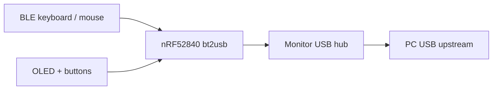

# bt2usb

**Use a Bluetooth LE keyboard and mouse through your monitor's USB hub.**

bt2usb is Rust firmware for an nRF52840. It connects to BLE HID peripherals and
presents a USB keyboard, mouse, and consumer-control device to a PC. An SSD1306
OLED and three buttons provide local pairing and status controls.


```mermaid
flowchart LR
    BT[BLE keyboard / mouse] --> FW[nRF52840 bt2usb]
    FW --> HUB[Monitor USB hub]
    HUB --> PC[PC USB upstream]
    UI[OLED + buttons] --> FW
```

The implementation supports two simultaneous BLE connections, four stored
devices, per-device input aggregation, reconnect attempts, keyboard LED
forwarding, and USB remote wakeup on a new key or button press.
These are implementation capabilities, not a compatibility guarantee. Real
peripherals, hubs, host sleep behavior, and pre-OS operation need validation with
the [hardware checklist](docs/FIRST_FLASH.md). Bluetooth Classic devices and
arbitrary HID report layouts are not supported.

This is development firmware. The [security limitations](SECURITY.md) and
[production-readiness backlog](TODO.md) describe the work required before a
managed deployment.

## Quick start

Use an nRF52840-DK, SSD1306 128×64 I2C display, a debug probe, and the board's
native USB port. The debugger USB port is for flashing/logs; the native USB port
connects to the PC or monitor hub. See [hardware and wiring](docs/HARDWARE.md).

Install Rust with rustup; the repository's toolchain file selects the tested Rust
version. Then:

```sh
rustup target add thumbv7em-none-eabihf
cargo install --locked probe-rs-tools mask
cargo test --locked --lib --tests
cargo build --locked --features embedded --target thumbv7em-none-eabihf --release
```

On a new board, follow [First flash](docs/FIRST_FLASH.md) to install Nordic
SoftDevice S140 v7.3.0, run the self-test, and validate the bridge. After that:

```sh
cargo run --locked --features embedded --target thumbv7em-none-eabihf --release --bin bt2usb
```

The equivalent task is `mask run --release`. Mask tasks use Bash; use a Bash
environment such as WSL on Windows, or the direct Cargo commands above in
PowerShell. Tool setup, coverage, and simulation are in
[Development](docs/DEVELOPMENT.md).

## Use

1. Put the BLE keyboard or mouse in pairing mode.
2. Press SELECT to scan, choose a device with UP/DOWN, and press SELECT to connect.
3. From the connected screen, press SELECT to scan for a second device. DOWN
   disconnects the current connections; it does not erase stored pairing keys.
4. Previously stored devices are selected for reconnect on the next boot.

Press UP from Home, Connected, or an error screen to manage saved devices. Choose
a device to forget, or the final **Factory reset** entry to clear all saved peers.
SELECT opens a confirmation with **Cancel** selected; choose the action with DOWN
and press SELECT again to confirm. UP selects Cancel. These actions change
pairing records, not the installed firmware. Successful completion stays visible
until acknowledged; a storage error means the change did not complete.

USB wake requires a new keyboard key/modifier, consumer key, or mouse button
press. Mouse movement, scroll, releases, and already-held input do not request a
wake. Host permission and hub power still determine whether the PC wakes.

The OLED turns off after 120 seconds without activity. While USB is active, a
button press wakes it and is consumed so waking does not trigger a menu action.
During USB suspend it stays off until the host resumes. Timing and USB settings
are in [src/config.rs](src/config.rs); pin types must also match the firmware
entry points.

## Documentation

| Document | Purpose |
| --- | --- |
| [TODO.md](TODO.md) | Prioritized open work, acceptance criteria, and completed implementation work |
| [Hardware](docs/HARDWARE.md) | Parts, wiring, configuration, and memory reservations |
| [First flash](docs/FIRST_FLASH.md) | Board bring-up and real-device acceptance checklist |
| [Architecture](docs/ARCHITECTURE.md) | Tasks, data flow, storage, and implementation limits |
| [Development](docs/DEVELOPMENT.md) | Tooling, build commands, devcontainer, and contribution workflow |
| [Testing](docs/TESTING.md) | Host tests, Renode, hardware evidence, and coverage boundaries |
| [Operations and releases](docs/OPERATIONS.md) | Updates, recovery, diagnostics, and release gates |
| [Release provenance](docs/RELEASING.md) | Exact version policy, artifact flow, and verification commands |
| [Security](SECURITY.md) | Trust boundaries, known limitations, and reporting guidance |
| [Task reference](maskfile.md) | Executable development tasks |

## License

GNU GPL v3; see [LICENSE](LICENSE). Nordic SoftDevice is a separate component
obtained from Nordic.
