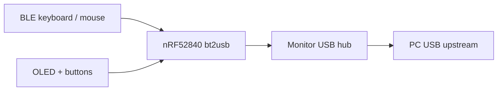

# bt2usb

**Use a Bluetooth LE keyboard and mouse through your monitor's USB hub.**

[](https://github.com/chefzaid/bt2usb/actions/workflows/ci.yml)
[](rust-toolchain.toml)
[](docs/hardware.md)
[](docs/first-flash.md#1-softdevice-once-per-board)
[](LICENSE)

bt2usb is Rust firmware for an nRF52840. It connects to BLE HID peripherals and
presents a USB keyboard, mouse, and consumer-control device to a PC. An SSD1306
OLED and three buttons provide local pairing and status controls.


```mermaid
flowchart LR
    BT[BLE keyboard / mouse] --> FW[nRF52840 bt2usb]
    FW --> HUB[Monitor USB hub]
    HUB --> PC[PC USB upstream]
    UI[OLED + buttons] --> FW
```

The implementation supports two simultaneous BLE connections, four stored
devices, per-device input aggregation, reconnect attempts, keyboard LED
forwarding, and USB remote wakeup on a new key or button press.
These are implementation capabilities, not a compatibility guarantee. Real
peripherals, hubs, host sleep behavior, and pre-OS operation need validation with
the [hardware checklist](docs/first-flash.md). Bluetooth Classic devices and
arbitrary HID report layouts are not supported.

This is development firmware. The [security limitations](docs/security.md) and
[production-readiness backlog](TODO.md) describe the work required before a
managed deployment.

## Quick Start

Use an nRF52840-DK, SSD1306 128×64 I2C display, a debug probe, and the board's
native USB port. The debugger USB port is for flashing/logs; the native USB port
connects to the PC or monitor hub. See [hardware and wiring](docs/hardware.md).

Install Rust with rustup; the repository's toolchain file selects the tested Rust
version. Then:

```sh
rustup target add thumbv7em-none-eabihf
cargo install --locked probe-rs-tools mask
cargo test --locked --lib --tests
cargo build --locked --features embedded --target thumbv7em-none-eabihf --release
```

On a new board, follow [First flash](docs/first-flash.md) to install Nordic
SoftDevice S140 v7.3.0, run the self-test, and validate the bridge. After that:

```sh
cargo run --locked --features embedded --target thumbv7em-none-eabihf --release --bin bt2usb
```

The equivalent task is `mask run --release`. Mask tasks use Bash; use a Bash
environment such as WSL on Windows, or the direct Cargo commands above in
PowerShell. Then pair a device by following
[using the bridge](docs/features.md#using-the-bridge). Tool setup, coverage, and
simulation are in [Development](docs/development.md).

## Documentation

| Guide | Start here when you want to |
| --- | --- |
| [Features](docs/features.md) | Know what the firmware does today, how to use it, and what it does not do |
| [Hardware](docs/hardware.md) | Buy parts, wire the board, or change pins, timing, or the memory map |
| [First flash](docs/first-flash.md) | Bring up a new board and record hardware acceptance |
| [Architecture and ADRs](docs/architecture.md) | Understand tasks, data flow, and why the design is the way it is |
| [Data model](docs/data-model.md) | Change the pairing-store format or a USB HID report |
| [Development](docs/development.md) | Set up tools, build, and make a change |
| [Testing](docs/testing.md) | Run host tests, Renode, and CI, or read validation records |
| [Deployment](docs/deployment.md) | Cut a release, verify provenance, flash a unit, review release gates |
| [Operations](docs/operations.md) | Diagnose, recover, or report a problem with a flashed unit |
| [Security](docs/security.md) | Review trust boundaries, controls, and limitations |
| [Security policy](SECURITY.md) | Report a suspected vulnerability |
| [Task reference](maskfile.md) | Look up a `mask` task |

## Roadmap

Open work, acceptance criteria, and completed work are tracked in
[TODO.md](TODO.md). Release gates that need a physical board stay open until
hardware evidence exists, even when the code is merged.

## License

GNU GPL v3; see [LICENSE](LICENSE). Nordic SoftDevice is a separate component
obtained from Nordic.
