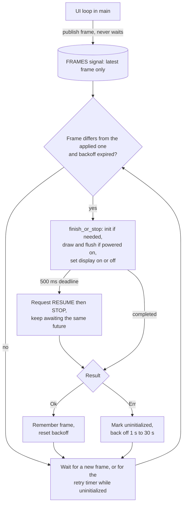

# ADR 0009: Isolate The OLED In Its Own Task With Stop-Safe I2C

- Status: Accepted
- Date: 2026-09-28

This record was written retroactively on 2026-10-09 from the source and the
commit history. The isolated task, the recovery policy, and the stop-safe I2C
wrapper landed together in `2479c79` on 2026-09-28.

## Context

The OLED is the only local user interface: it shows the pairing menu,
connection status, errors, and confirmations. It is also the least essential
peripheral. If the display fails, the BLE links, the USB HID device, and the
stored pairings still work, so a display fault should never stop typing or
reconnection.

The display path changed three times:

| Period | Display path | Problem |
| --- | --- | --- |
| Until 2026-06-24 | Blocking I2C flushes called from the UI loop in `main` | The README at `e3bc620` listed "Blocking display I/O" as a limitation: `ssd1306` 0.9's async mode did not compile in that configuration, so a redraw stalled the cooperative executor |
| 2026-06-24 (`648f99f`) to 2026-09-28 | `Ssd1306Async` over Embassy's async TWIM, still awaited inside the UI loop | The executor kept running, but the UI loop itself waited for every redraw and had no error handling: `init` and `draw_*` discarded I2C results |
| Since 2026-09-28 (`2479c79`) | A dedicated `display_task` that owns TWIM0; the UI loop only publishes snapshots | This record |

Awaiting I2C in the UI loop couples the display to work that matters more. The
UI loop in [main.rs](../../src/main.rs) drains `BLE_EVENT_CHANNEL` (capacity 8),
the 1-second housekeeping ticker, button events, and USB suspend signals. The
BLE coordinator sends its events with `event_tx.send(...).await`, so if the UI
loop is stuck in a slow or failing I2C transfer and the channel fills, the
coordinator blocks too, and with it scan results, connection bookkeeping, and
pairing persistence. A missing panel, a loose wire, or a bus held low would
have degraded the bridge, not only the screen.

Recovering from I2C errors safely is harder than it looks on the pinned
`embassy-nrf` 0.7.0 TWIM driver. In its `async_wait`, when `EVENTS_ERROR` is
set, the driver triggers `TASKS_STOP` and returns the NACK or overrun error at
once, before the peripheral reports `EVENTS_STOPPED`. Its async `transaction`
has no drop guard, so dropping the future does not stop EasyDMA. The next
transfer's setup clears `EVENTS_STOPPED`. Meanwhile `display-interface-i2c`
0.5.0 copies each command or 16-byte data chunk into a buffer that lives inside
its own async function, so that buffer is released as soon as the error
returns. Without extra care, a retry could start while the previous stop
sequence is still running, against a transfer buffer that no longer exists,
and could then see a stale completion. These driver facts were checked against
the crate sources whose checksums match `Cargo.lock`.

## Decision

Run the OLED in its own Embassy task, with a latest-state hand-off, bounded
retry, and I2C error handling that never releases a buffer before the hardware
has stopped using it.

- **Single owner.** `display_task` in [main.rs](../../src/main.rs) receives the
  TWIM0 peripheral (SDA P0.26, SCL P0.27, internal pull-ups on, a 64-byte RAM
  transmit buffer) wrapped in `StopSafeI2c`, and passes it to
  `ui::display::run`. Nothing else touches TWIM0 or the panel. The TWISPI0
  interrupt runs at priority 2, like the other application interrupts that
  `main` configures, because the SoftDevice reserves priorities 0, 1, and 4.
- **Latest-state hand-off.** The UI loop calls `ui::display::publish(&state,
  power.display_on())` after every event it handles. `publish` stores a
  `Frame` (a clone of `UiState` plus the power flag) in a
  `Signal<CriticalSectionRawMutex, Frame>` named `FRAMES` and returns at once.
  A newer frame overwrites one that has not been drawn yet. The UI loop never
  waits for I2C.
- **Render only on change.** The display task remembers the last frame it
  applied and skips a frame equal to it. A render initializes the panel when
  needed, draws and flushes the framebuffer only when the frame says the
  display is powered on, and then sends the display-on or display-off command.
- **Bounded retry with re-initialization.** A failed render clears the
  "initialized" flag and the applied frame, logs
  `OLED operation failed; retry in {} ms (bridge remains active)`, and waits
  according to `Recovery` in [display_logic.rs](../../src/ui/display_logic.rs):
  1 s, 2 s, 4 s, 8 s, 16 s, then 30 s for every later failure. The next attempt
  re-initializes the panel. A success resets the backoff and logs
  `OLED initialized/recovered` when the panel was not initialized before. New
  frames that arrive during a backoff replace the pending frame but do not cut
  the backoff short.
- **Deadline without cancellation.** Every render runs inside
  `finish_or_stop`, which races the operation against a 500 ms timer. If the
  timer wins, it logs
  `OLED I2C stalled; requesting STOP, display task degraded until DMA completes`,
  writes `TASKS_RESUME` and then `TASKS_STOP` to TWIM0 (`request_bus_stop`;
  Nordic requires RESUME before STOP for a suspended transfer), and then keeps
  awaiting the same future. It never drops a pending DMA future and never
  disables the peripheral before it has stopped.
- **Errors held until STOPPED.** `StopSafeI2c` implements
  `embedded_hal_async::i2c::I2c` around the TWIM driver. When a transaction
  returns `AddressNack`, `DataNack`, or `Overrun`, the only errors that come
  from the driver's early-return error branch, it polls `EVENTS_STOPPED` with
  a 100 µs timer between reads before returning the error. Every 5,000 polls
  (nominally 0.5 s; longer in practice, because each wait is rounded up to the
  32.768 kHz RTC1 time base that `time-driver-rtc1` selects) it logs
  `OLED I2C error: STOP not complete; requesting again` and requests STOP
  again. Only once STOPPED is set does the caller see the error and release
  its buffer.
- **Same path in the self-test.** The `bt2usb-selftest` image uses
  `StopSafeI2c` and `finish_or_stop` for its OLED address probe, initialization,
  and Home-screen render, so bring-up exercises the same driver path.

The flow inside the display task:

## Alternatives Considered

- **Keep rendering in the UI loop with async I2C** (the state from `648f99f`
  to `2479c79`). The executor no longer stalls, but the UI loop still waits for
  every redraw. A stuck transfer would stop button handling and, once
  `BLE_EVENT_CHANNEL` fills, the BLE coordinator. Error recovery would also sit
  on the UI path.
- **Blocking I2C** (the state before `648f99f`). A blocking flush stalls every
  task on the cooperative executor for the length of the transfer.
- **A bounded frame queue instead of a signal.** A `Channel` would either make
  the publisher wait when full, which reintroduces the coupling, or drop frames
  arbitrarily. Intermediate screens have no value once a newer state exists, so
  latest-wins is the right semantics for a display.
- **Cancel the transfer on timeout** (for example with `with_timeout` around
  the render). With the pinned driver, dropping the future leaves EasyDMA
  running against buffers that are being freed, and the next transfer clears
  the STOPPED event it would need. This is the hazard the decision exists to
  avoid.
- **Disable or re-initialize TWIM0 after a timeout.** Disabling the
  peripheral before STOPPED has the same buffer-lifetime problem. The source
  explicitly forbids it (`request_bus_stop` in
  [display.rs](../../src/ui/display.rs)).
- **Reset the device with a watchdog when the display stalls.** A reset drops
  both BLE links and USB enumeration to recover a non-essential peripheral.
  Watchdog policy is a separate open decision (see Consequences).

## Rationale

The bridge's job is to move input from BLE to USB. The display supports that
job but must not be able to stop it, so it gets its own task and the UI loop
gets a hand-off that cannot block. A latest-state signal matches what a screen
needs: show the newest state, skip states that are already stale.

Retrying with re-initialization covers the common real faults (a panel that
was absent at boot, a loose connector, a glitch that left the SSD1306 in an
unknown state) without hammering a missing device or flooding the log. The
cap keeps a permanently missing panel at one attempt every 30 s.

The deadline is a diagnostic and a recovery attempt, not a cancellation. With
EasyDMA, memory safety depends on the hardware having stopped reading a
buffer, and the only reliable signal for that is `EVENTS_STOPPED`. Holding the
error until STOPPED, and holding a timed-out future until it completes, keeps
every buffer alive for as long as the hardware may read it. That costs a
possibly stuck display task, which is acceptable because nothing else waits
for it.

## Consequences

Positive:

- I2C errors, a missing panel, and slow transfers no longer delay the UI loop,
  the BLE coordinator, or USB delivery.
- Display recovery is automatic and visible in RTT logs, and its policy is a
  hardware-free module with host tests.
- Retries cannot race the previous transfer's stop sequence or reuse a freed
  transfer buffer.

Negative:

- An electrically stuck bus (SDA or SCL held low) can leave the display task
  waiting forever for DMA to complete. The screen then stops updating until a
  power cycle, while BLE and USB keep working. No I2C bus-clear sequence is
  implemented, and there is no bound on electrical recovery time.
- The self-test awaits the OLED stages the same way, so a stuck bus can stop
  the self-test at the OLED stage before it reaches buttons, the BLE scan, and
  the stack report.
- The screen may briefly lag the UI state, and intermediate frames are never
  drawn. The UI state in `main`, not the panel, is the source of truth.
- TWIM0 is owned exclusively by the display task. Adding another I2C device
  needs a shared-bus design and a revision of this record.
- The stop-safe behavior depends on the error behavior of the pinned
  `embassy-nrf` TWIM driver. Upgrading `embassy-nrf` means re-checking that
  driver's error path and drop behavior, and removing `StopSafeI2c` only if
  the driver itself waits for STOPPED.

Follow-up obligations, tracked in [TODO.md](../../TODO.md):

- "ADR: watchdog and progress-based recovery" decides which tasks must prove
  progress before the watchdog is fed; "Watchdog and recoverable failures"
  then covers recovery from stuck I2C with progress-based watchdog feeding,
  without leaving held input or requiring an undocumented recovery sequence.
- "Major dependency upgrades" requires rechecking `StopSafeI2c` and
  `finish_or_stop` against any newer `embassy-nrf` before upgrading.
- The "OLED failure isolation" check in
  [first flash](../first-flash.md#6-device-management-and-degraded-display)
  needs board evidence; live-bus recovery needs a fault-injection fixture and
  a separate result record.

## Implementation

| Concern | Where |
| --- | --- |
| Task, pins, pull-ups, transmit buffer | `display_task` and the TWIM setup in [main.rs](../../src/main.rs); `UI and isolated OLED tasks started` is logged after spawning |
| Interrupt priority | `interrupt::TWISPI0.set_priority(Priority::P2)` in `main.rs` and [selftest.rs](../../src/selftest.rs) |
| Latest-state hand-off | `FRAMES`, `Frame`, and `publish` in [display.rs](../../src/ui/display.rs); called at the end of every UI loop iteration in `main.rs` |
| Render loop | `run` and `render` in `display.rs` |
| Backoff policy | `Recovery` in [display_logic.rs](../../src/ui/display_logic.rs) |
| Deadline and STOP request | `finish_or_stop` and `request_bus_stop` in `display.rs` |
| Error hold until STOPPED | `StopSafeI2c` and `wait_stopped` in `display.rs` |
| Self-test use | OLED stage in `selftest.rs`: address probe `[0x00, 0xAE]` at `0x3C`, then `init` and `draw_home` through `finish_or_stop` |
| Async driver feature | `ssd1306/async` in the `embedded` and `sim` features of [Cargo.toml](../../Cargo.toml) |

### Verification Status

- **Implemented:** everything in the table above.
- **Software-verified:** `Recovery` has two host tests in `display_logic.rs`
  (`failures_back_off_and_cap_without_blocking_new_frames` and
  `deadlines_saturate_and_wait_never_underflows`). The
  [2026-09-28 validation record](../testing.md#validation-record--2026-09-28)
  reports embedded Clippy and the release bridge and self-test builds passing
  locally; no successful hosted CI run is recorded. No automated test
  exercises the TWIM stop sequence: host tests cannot reach the driver, and
  the Renode simulation does not run the display.
- **Hardware-verified:** not yet. The repository holds no board record for the
  [first-flash](../first-flash.md) OLED checks.

## Related

- [Architecture: execution and power choices](../architecture.md#execution-and-power-choices)
- [Features: wake and display](../features.md#wake-and-display)
- [Operations: recovery and diagnostics](../operations.md#recovery-and-diagnostics)
- [First flash: device management and degraded display](../first-flash.md#6-device-management-and-degraded-display)
- [ADR 0003: Hardware-free decision modules](0003-pure-core-and-task-shell.md)
- [ADR 0004: Layered verification](0004-layered-verification.md)
- [ADR 0012: Bus-powered, no System-OFF](0012-bus-powered-no-system-off.md)
