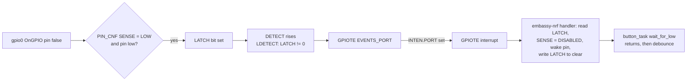

# ADR 0014: Model nRF52840 GPIO SENSE/LATCH And GPIOTE PORT Events In Renode

- Status: Accepted
- Date: 2026-09-26

This record was written retroactively on 2026-10-09 from the source and the
commit history. The SoftDevice-free simulation build and its Robot test
arrived in `e3bc620` on 2026-06-22, the root cause of the lost button presses
was recorded in `4a6975f` on 2026-06-24, and the custom models replaced the
synthetic button stimulus in `f477d4c` on 2026-09-26.

## Context

The third verification layer ([ADR 0004](0004-layered-verification.md)) runs
firmware code on an emulated nRF52840 in CI, with no board. The real firmware
cannot run there: the SoftDevice is a closed binary tied to the radio, and,
as the header of [sim.rs](../../src/sim.rs) puts it, "the nRF USBD
peripheral isn't modeled by emulators". So the project builds a
second binary, `bt2usb-sim`, from the same shared modules without the
SoftDevice, USB, or flash storage, and runs it in Renode.

The most valuable thing that binary can exercise is the path from a physical
button to the UI reducer: GPIO configuration, Embassy's async pin wait, the
debounce in `ui::buttons::button_task`, the button channel, and
`ui_logic::on_button`. Under Renode's stock nRF52840 models that path did not
work. Edges injected with `gpio0 OnGPIO <pin> <level>` never completed the
firmware's `wait_for_low`, so from June to September 2026 the simulation fed a
rotating sequence of button events straight into the channel from a
`ui_stimulus` task and bypassed the GPIO driver entirely.

The cause is how `embassy-nrf` 0.7.0 waits for pin levels. It does not use
GPIOTE IN channels for `Input::wait_for_low` and `wait_for_high`. Instead:

1. At initialization, `gpiote::init` sets `DETECTMODE` to latched detection
   (`LDETECT`) on P0 and P1, clears `LATCH` by writing `0xFFFFFFFF`, and
   enables the GPIOTE PORT interrupt.
2. A wait sets the pin's `PIN_CNF[n].SENSE` to `LOW` or `HIGH` and pends until
   `SENSE` reads back as `DISABLED`.
3. The GPIOTE interrupt handler, on `EVENTS_PORT`, clears the event, reads
   `LATCH`, and for each latched pin sets `SENSE` to `DISABLED` and wakes that
   pin's waker, then writes the bits back to `LATCH` to clear them.

The repository's notes record two shortcomings of the stock models against
that sequence. The commit `4a6975f` found, by logging the firmware's register
writes in Renode, that the stock `NRF52840_GPIO` treated the `DETECTMODE`
(offset `0x24`) and `LATCH` (`0x20`) writes as unhandled and never raised the
GPIOTE PORT event. The header of the later model refines this:
the stock models tag `LATCH` and `DETECTMODE` as unimplemented, so `LATCH`
always reads 0, the interrupt handler never finds the triggering pin, and the
wait never completes. The same header notes that the stock GPIO ignored
`OnGPIO <pin> false` on a pin that was only pulled up, so the first press was
lost. The `embassy-nrf` sequence above was checked against the crate source
whose checksum matches `Cargo.lock`.

## Decision

Replace Renode's GPIO and GPIOTE peripherals with custom C# models that
implement the pin sense mechanism, and drive the real button task with
injected edges in both interactive runs and the headless Robot test.

- **GPIO model.** `NRF52840_SenseGPIO` in
  [nrf52840_sense_gpio.cs](../../renode/nrf52840_sense_gpio.cs) follows the
  nRF52840 Product Specification's pin sense mechanism:
  - A pin's sense condition holds when `SENSE` is `HIGH` and the pin is high,
    or `SENSE` is `LOW` and the pin is low.
  - `LATCH[n]` is set while pin n's condition holds and stays set until the CPU
    writes 1 to it; a clear does not take effect while the condition still
    holds.
  - `DETECT` is the OR of all conditions in default mode, or `LATCH != 0` in
    `LDETECT` mode. A rising edge of `DETECT` raises the port's `Detect` event.
    In `LDETECT` mode a `LATCH` clear that leaves bits set produces a new
    rising edge.
  - An input pin that has never been driven reads its pull level, so buttons
    with pull-ups idle high without setup.
  - It keeps the stock behavior for `OUT`, `OUTSET`, `OUTCLR`, `IN`, `DIR`,
    `DIRSET`, `DIRCLR`, and output connections, and it honors `PIN_CNF`'s
    input-disconnect bit when reading `IN`.
- **GPIOTE model.** `NRF52840_SenseGPIOTE` subscribes to both ports' `Detect`
  events and sets `EVENTS_PORT`. Its interrupt line is high when
  `EVENTS_PORT` and `INTEN.PORT` are both set, or when any IN channel event is
  pending with its interrupt enabled. It also keeps eight IN channels with
  edge polarity, task mode (`TASKS_OUT`, `TASKS_SET`, `TASKS_CLR` driving the
  pin), and the event hook used by PPI.
- **Platform overlay.** [nrf52840-sense-gpio.repl](../../renode/nrf52840-sense-gpio.repl)
  declares `gpio0` at `0x50000500`, `gpio1` at `0x50000800`, and `gpiote` at
  `0x40006000` with interrupt `nvic@6`, the same names, addresses, and IRQ as
  Renode's stock platform. A platform file cannot redeclare a peripheral, so
  [bt2usb-sim.resc](../../renode/bt2usb-sim.resc) and the Robot test compile
  the C# file with `include`, load Renode's `platforms/cpus/nrf52840.repl`,
  unregister `sysbus.gpiote`, `sysbus.gpio0`, and `sysbus.gpio1`, and then load
  the overlay.
- **Simulation binary.** The `sim` feature in [Cargo.toml](../../Cargo.toml)
  builds `bt2usb-sim` from [sim.rs](../../src/sim.rs) and
  [sim_ble.rs](../../src/sim_ble.rs) with Embassy, the GPIO driver, the shared
  `ble` and `ui` modules, and the pure `storage` modules, but without
  `nrf-softdevice`, USB, or the flash shell. It brings its own critical-section implementation
  (`cortex-m/critical-section-single-core`) and links with
  [memory_sim.x](../../memory_sim.x) ([ADR 0010](0010-static-memory-layout.md)).
  `embedded` and `sim` cannot be enabled together. The binary:
  - spawns the real `ui::buttons::button_task` on P0.11 (UP), P0.12 (DOWN),
    and P0.24 (SELECT), active-low with pull-ups, feeding `BUTTON_CHANNEL`
  - writes readable log lines to UART0 (TX P0.06, RX P0.08), which Renode
    shows without a probe or defmt decoder
  - runs button events through the firmware's UI controller
    (`ui::controller::UiController`, since 2026-10-10; before that, through
    `ui_logic::on_button` alone), and each command it returns through a
    simulated coordinator that calls the real `ble::coordinator`,
    `ble::management`, and `storage::devices` code with connection workers,
    a radio, and flash that answer at once; a scan merges three fixed
    advertisements through `merge_advertisement`
  - every 2 s without a button press, advances a scripted BLE scenario through
    the real `ble::coordinator` reducers, with a `u32` standing in for the
    SoftDevice `Address`: connect device 0 ("Keyboard", `0xA1`), connect
    device 1 ("Mouse", `0xB2`), lose slot 0's link (`on_slot_link_lost`, which
    keeps the slot reserved; until 2026-10-10 the step called
    `on_slot_disconnected` and freed it), disconnect all, and repeat
- **Robot test.** [bt2usb-sim.robot](../../renode/bt2usb-sim.robot) builds the
  machine the same way, starts emulation, and asserts UART lines in order:
  boot, the first scenario connection (pausing emulation there), a scan and
  a connect driven by real presses on P0.24, P0.12, and P0.11, the link loss
  that keeps slot 0 reserved, the saved-device list, a cancelled and a
  confirmed Forget, a Factory reset, and the next scenario cycle; the
  [scenario map](../testing.md#renode-scenario-map) lists every step. Each
  press waits for its UART line with emulation paused before releasing, so
  presses land at deterministic points and always outlast the 50 ms debounce;
  since 2026-10-10 the emulation then runs 100 ms so the release is debounced
  too, which lets the same button be pressed twice in a row.
- **Tooling.** `mask sim-setup` runs
  [install-renode.sh](../../scripts/install-renode.sh), which installs portable
  Renode 1.16.1, Robot Framework 6.1, and the other `renode-test` Python
  dependencies into `~/.local`.
  `mask sim-build`, `mask sim`, and `mask sim-test` build, run, and test the
  simulation. CI's "Renode simulation test" job runs Clippy and the build for
  the `sim` feature, installs Renode with the same script, runs the Robot test,
  and uploads its results.

The mechanism the models implement, from an injected edge to the button task:

## Alternatives Considered

- **Keep the synthetic stimulus** (June to September 2026). It exercised the
  UI reducer but not the GPIO configuration, the async wait, the debounce, or
  the button task, which are exactly the parts a reducer test cannot reach.
- **Simulation-only button code**, such as polling `IN` in `sim.rs`. It would
  pass in Renode while the firmware's real wait path stayed untested, and it
  would add a second implementation, against
  [ADR 0003](0003-pure-core-and-task-shell.md).
- **Change the firmware to wait on GPIOTE IN channels.** It would bend the
  firmware around an emulator gap and stop the simulation from testing the
  wait path that `embassy-nrf`'s `Input` actually uses.
- **Fix the models upstream in Renode first.** That is the better long-term
  home, but it ties the project's CI to an upstream release. A local model
  loaded at runtime works with the pinned Renode version today and can be
  offered upstream separately.

## Rationale

With the models in place, the simulation drives the same code path a physical
button does, from the pin configuration register to the UI reducer, without
hardware, both locally and in the CI `simulation` job. Modeling the documented hardware mechanism,
rather than the specific register sequence one HAL version happens to use,
keeps the models valid if the HAL changes how it uses SENSE and LATCH.
Loading them as an overlay leaves the rest of Renode's nRF52840 platform
untouched.

## Consequences

Positive:

- The GPIO driver, button debounce, button channel, UI reducer, and BLE
  coordinator reducers run on an emulated ARM core, locally and in the CI
  `simulation` job.
- Developers can press buttons interactively in the Renode monitor.
- The simulation now fails if Embassy's pin wait path or the button task stops
  working, which the synthetic stimulus could not detect.

Negative:

- The project maintains about 700 lines of C# against Renode's peripheral
  API. A Renode upgrade can break compilation of the models or change the
  stock platform they replace, so change `RENODE_VERSION` only together with
  a passing simulation run.
- The models are written from the Product Specification, not checked against
  silicon. Agreement between the model and a real nRF52840 is assumed, and
  the board self-test's button stage remains the hardware check.
- The simulation covers no BLE radio, SoftDevice, USB, flash writes, OLED, or
  scan timing. Its BLE events are a script and the commands the buttons send,
  answered at once, and a simulated scan hears three fixed advertisements.
- Since 2026-10-10 the simulation runs the same `UiController` as `main`, so
  management requests and error retention are exercised; the power manager,
  the command and event channels, and the display task in `main` are not.
- Renode is downloaded without a checksum by `install-renode.sh`.
- A check of the upstream Renode source on its `master` branch, made outside
  the repository while writing this record on 2026-10-09, found `LATCH` and
  `DETECTMODE` still tagged as unimplemented in the stock nRF52840 GPIO model,
  so the custom models are still needed. The repository holds no record of
  that check, and the Renode 1.16.1 release itself was not re-examined.
  Revisit this record if upstream implements them.

Follow-up obligations, tracked in [TODO.md](../../TODO.md):

- "Broaden the Renode scenarios": since 2026-10-10 the scenario covers the
  saved-device management screens and the link-loss slot reservation; the
  OLED task is still not exercised.
- "Supply-chain and tooling maintenance": verify digests for downloaded
  non-Cargo tooling, which includes Renode.
- "Async task fault tests": deterministic tests for cancellation, full
  channels, and contention are separate from this scenario and still open.

## Implementation

| Concern | Where |
| --- | --- |
| GPIO and GPIOTE models | [nrf52840_sense_gpio.cs](../../renode/nrf52840_sense_gpio.cs) |
| Platform overlay | [nrf52840-sense-gpio.repl](../../renode/nrf52840-sense-gpio.repl) |
| Interactive script | [bt2usb-sim.resc](../../renode/bt2usb-sim.resc) |
| Headless test | [bt2usb-sim.robot](../../renode/bt2usb-sim.robot) |
| Simulation binary | [sim.rs](../../src/sim.rs) and [sim_ble.rs](../../src/sim_ble.rs); `bt2usb-sim` and the `sim` feature in [Cargo.toml](../../Cargo.toml) |
| Shared button task | `button_task` in [buttons.rs](../../src/ui/buttons.rs) |
| Memory map and feature guard | [memory_sim.x](../../memory_sim.x), [build.rs](../../build.rs) |
| Installer | [install-renode.sh](../../scripts/install-renode.sh) |
| Tasks | `sim-setup`, `sim-build`, `sim`, and `sim-test` in [maskfile.md](../../maskfile.md) |
| CI | The `simulation` job in [ci.yml](../../.github/workflows/ci.yml) |

### Verification Status

- **Implemented:** everything above.
- **Software-verified:** the
  [2026-09-28 validation record](../testing.md#validation-record--2026-09-28)
  reports the headless Robot scenario passing locally with Renode 1.16.1
  through WSL. The CI "Renode simulation test" job, which installs Renode
  1.16.1 by default and runs the same Robot file, passed on GitHub-hosted
  runners in push runs 36441995385 (`8a04b25`, 2026-09-28) and 37932436721
  (`7fc99d6`, 2026-10-09) and scheduled run 37338711407 (2026-10-05). The
  broadened scenario of 2026-10-10 passed locally with Renode 1.16.1 on Linux
  ([2026-10-10 controller record](../testing.md#validation-record--2026-10-10-ui-controller-and-renode-scenario)).
- **Hardware-verified:** not applicable to the models themselves. The button
  path they emulate is checked on a board by the self-test's button stage,
  for which the repository holds no board record.

## Related

- [Testing: Renode simulation](../testing.md#renode-simulation)
- [Development: build and check](../development.md#build-and-check)
- [ADR 0003: Hardware-free decision modules](0003-pure-core-and-task-shell.md)
- [ADR 0004: Layered verification](0004-layered-verification.md)
- [ADR 0010: Static memory layout](0010-static-memory-layout.md)
- [ADR 0013: Pinned toolchain and mask tasks](0013-pinned-toolchain-and-mask-tasks.md)
