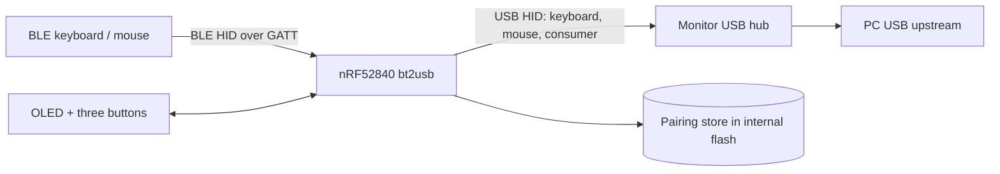
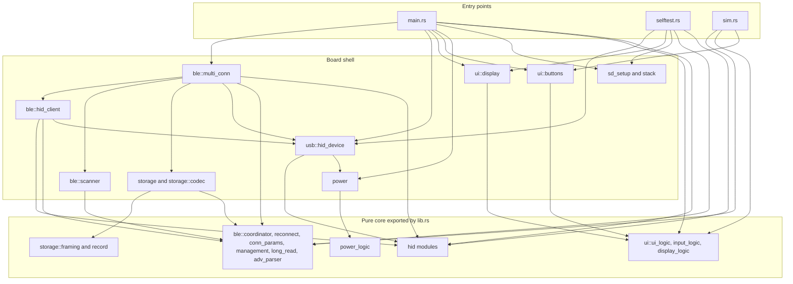
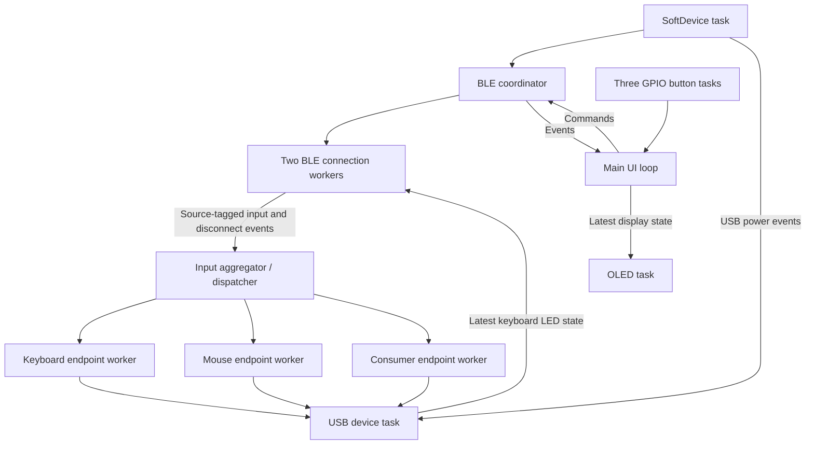
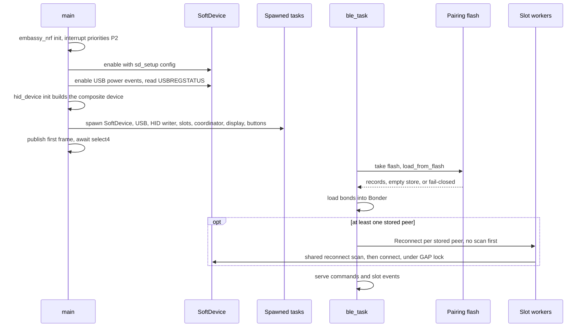
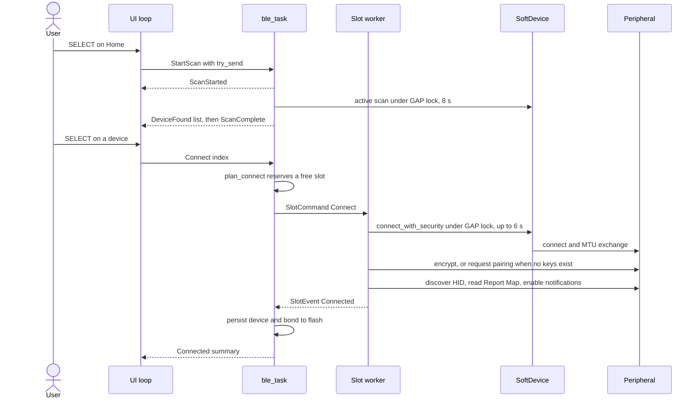
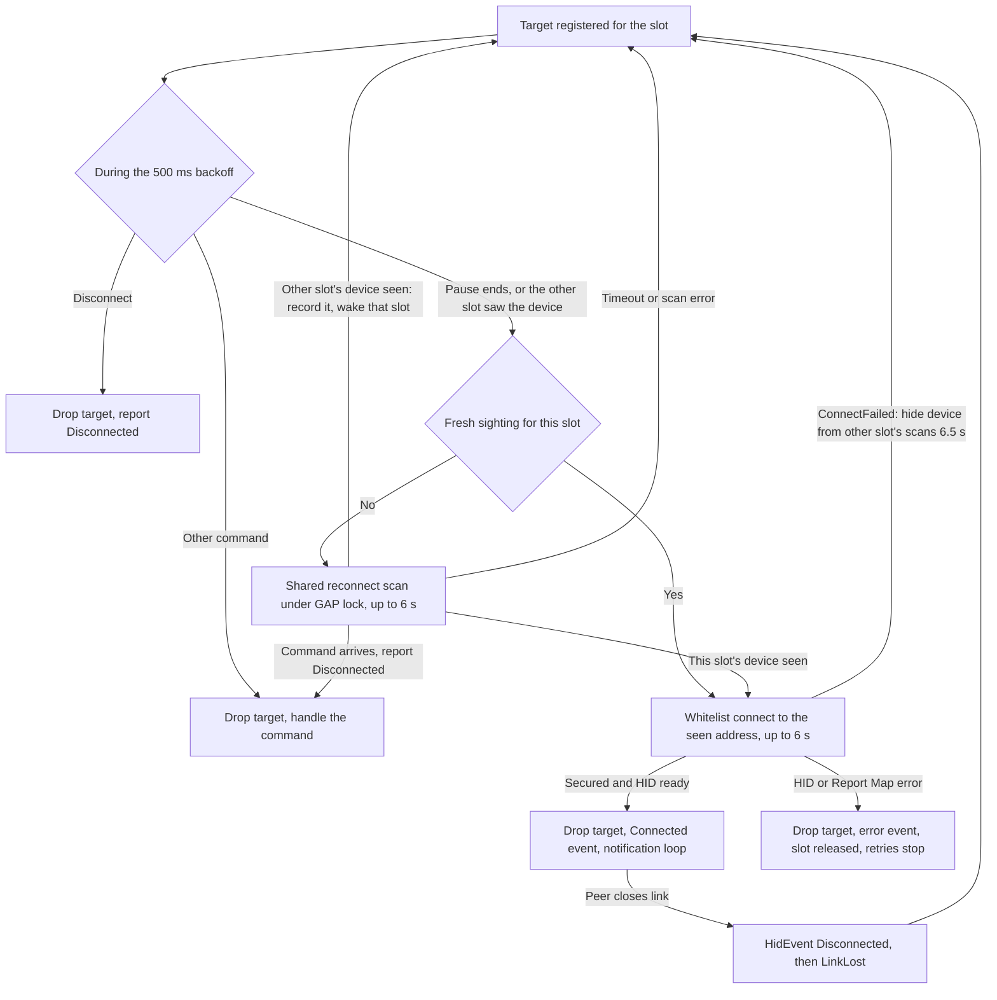
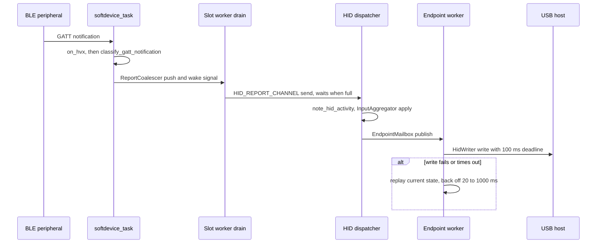
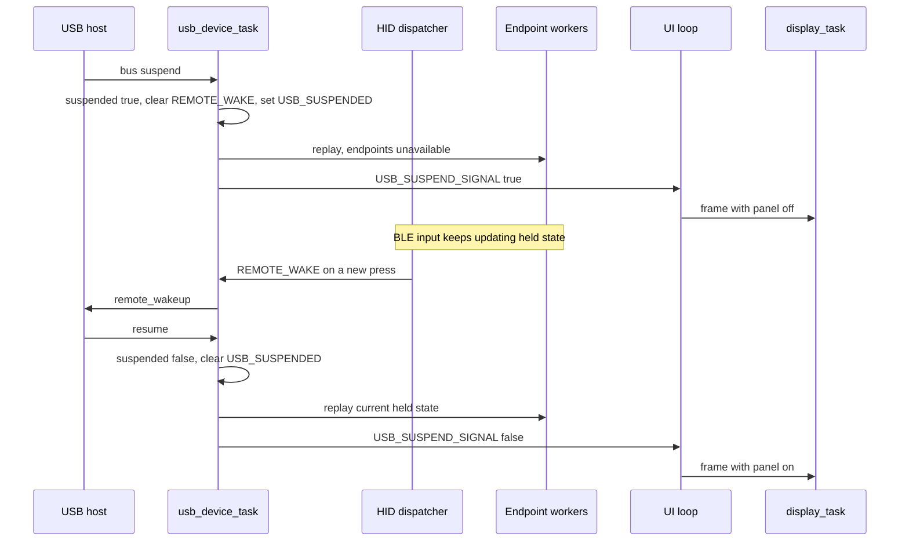
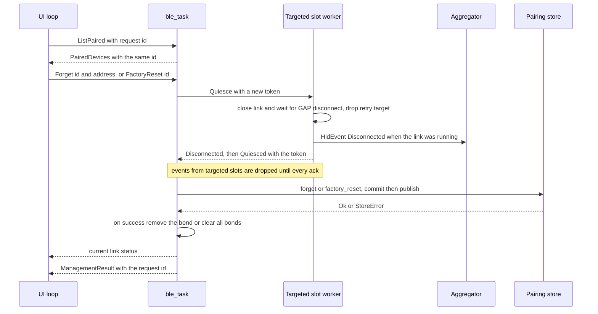
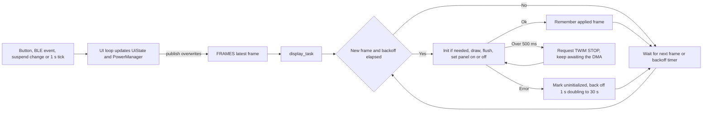

# Architecture Overview And ADR Index

This guide describes how the bt2usb firmware is put together at runtime: its
layers and tasks, the path a command or an input report takes through them, how
failures surface and recover, and the rules that keep the design testable. It
also indexes the architecture decision records (ADRs) that explain why.
Byte-level formats live in the [data model](data-model.md); pins, constants, and
the memory map live in [hardware](hardware.md); how each layer is checked lives
in [testing](testing.md).

Status words in this guide are used precisely. **Implemented** means the code is
in this repository. **Host-tested** means `cargo test --lib --tests` exercises
the logic on a PC. **Simulated** means the Renode scenario exercises it on an
emulated nRF52840. **Hardware-verified** requires a recorded
[first-flash](first-flash.md) result. The repository holds no such record yet:
the [2026-09-28 validation record](testing.md#validation-record--2026-09-28) lists
board, radio, and USB acceptance as not performed. The commit history
mentions fixes made during board bring-up (`f477d4c`), but without stored
evidence. Every lifecycle below is therefore at most host-tested or simulated.

## System At A Glance

bt2usb uses `no_std` Rust, static allocation, and Embassy's cooperative async
executor ([ADR 0002](adr/0002-nrf52840-softdevice-embassy.md)). Nordic SoftDevice
S140 supplies the BLE central stack. USB uses the nRF52840 device peripheral
through Embassy. The UI runs in `main`; a separate display task renders its
latest state over async I2C.



The repository builds three firmware binaries from one source tree:

| Binary | Feature | Purpose |
| --- | --- | --- |
| `bt2usb` | `embedded` | The bridge |
| `bt2usb-selftest` | `embedded` | Staged board bring-up; see [first flash](first-flash.md) |
| `bt2usb-sim` | `sim` | SoftDevice-free Renode build; see [testing](testing.md#renode-simulation) |

The host library (`src/lib.rs`) exports the hardware-free modules those binaries
share ([ADR 0003](adr/0003-pure-core-and-task-shell.md)). The three binaries use
the same modules, not copies: the self-test reuses the SoftDevice setup, USB
device, and display driver, and the simulation reuses the button driver, UI
reducer, and BLE coordinator reducers with custom Renode GPIO models
([ADR 0014](adr/0014-renode-gpio-models.md)).

## Source Map

| Area | Layer | Responsibility |
| --- | --- | --- |
| [main.rs](../src/main.rs) | Entry point | Hardware setup, task spawning, channels, UI loop |
| [sim.rs](../src/sim.rs) | Entry point | SoftDevice-free Renode entry point and synthetic BLE scenario |
| [selftest.rs](../src/selftest.rs) | Entry point | Staged board bring-up image |
| [lib.rs](../src/lib.rs) | Host crate | Host-test entry point for hardware-free logic |
| [config.rs](../src/config.rs) | Constants | Timing, scan, connection, USB identity, and storage constants |
| [sd_setup.rs](../src/sd_setup.rs) | Board shell | Shared SoftDevice setup and USB power events |
| [power.rs](../src/power.rs) | Board shell | Activity tracking and power state over `embassy-time` |
| [power_logic.rs](../src/power_logic.rs) | Pure core | Pure power/display policy |
| [stack.rs](../src/stack.rs) | Board shell | Painted-stack high-water measurement |
| [ble/mod.rs](../src/ble/mod.rs) | Board shell | BLE command/event types and the GAP procedure lock |
| [ble/adv_parser.rs](../src/ble/adv_parser.rs) | Pure core | HID service UUID and device-name parsing from advertisements |
| [ble/conn_params.rs](../src/ble/conn_params.rs) | Pure core | Bounds for a peripheral's connection parameter request |
| [ble/coordinator.rs](../src/ble/coordinator.rs) | Pure core | Pure connection-slot and event reducers |
| [ble/reconnect.rs](../src/ble/reconnect.rs) | Pure core | Background-reconnect table shared by both slots: targets, sightings handed between slots, scan duty |
| [ble/long_read.rs](../src/ble/long_read.rs) | Pure core | Bounded fragmented Report Map acquisition |
| [ble/management.rs](../src/ble/management.rs) | Pure core | Peer-management quiescence and transactional commit primitives |
| [ble/multi_conn.rs](../src/ble/multi_conn.rs) | Board shell | BLE coordinator, two connection workers, and the bond and connection-parameter handler |
| [ble/hid_client.rs](../src/ble/hid_client.rs) | Board shell | GATT discovery, subscriptions, HID classification, notification loop |
| [ble/scanner.rs](../src/ble/scanner.rs) | Board shell | User scan with HID advertisement filtering, and the shared reconnect scan |
| [hid/mod.rs](../src/hid/mod.rs) | Pure core | Internal report type and notification classification |
| [hid/report_protocol.rs](../src/hid/report_protocol.rs) | Pure core | Report Map parser and Report Reference descriptor |
| [hid/keyboard.rs](../src/hid/keyboard.rs), [mouse.rs](../src/hid/mouse.rs), [consumer.rs](../src/hid/consumer.rs) | Pure core | Report types, USB report descriptors, serialization |
| [hid/coalesce.rs](../src/hid/coalesce.rs) | Pure core | Per-connection backpressure coalescing |
| [hid/aggregate.rs](../src/hid/aggregate.rs) | Pure core | Per-source union of held input |
| [hid/delivery.rs](../src/hid/delivery.rs) | Pure core | Endpoint queue state and the endpoint worker loop |
| [hid/wake.rs](../src/hid/wake.rs) | Pure core | Remote-wakeup eligibility |
| [hid/host_leds.rs](../src/hid/host_leds.rs) | Pure core | Host LED forwarding: the current state when a link starts, then each change |
| [usb/hid_device.rs](../src/usb/hid_device.rs) | Board shell | Composite device, LED output, VBUS, suspend, report writing |
| [storage.rs](../src/storage.rs) | Board shell | Paired-device persistence with versioned framing and bond codec |
| [storage/framing.rs](../src/storage/framing.rs), [record.rs](../src/storage/record.rs) | Pure core | Versioned frame and record validation |
| [storage/codec.rs](../src/storage/codec.rs) | Board shell | Address and bond byte codec over SoftDevice types |
| [ui/ui_logic.rs](../src/ui/ui_logic.rs) | Pure core | Screens, button reducer, view model, management request IDs |
| [ui/input_logic.rs](../src/ui/input_logic.rs) | Pure core | Device-list window and scan spinner |
| [ui/display_logic.rs](../src/ui/display_logic.rs) | Pure core | OLED retry backoff policy |
| [ui/display.rs](../src/ui/display.rs) | Board shell | OLED task, rendering, STOP-safe I2C wrapper |
| [ui/buttons.rs](../src/ui/buttons.rs) | Board shell | Debounced GPIO button task |

## Module Layers And Dependency Rules

The code is split into a pure core and a board shell
([ADR 0003](adr/0003-pure-core-and-task-shell.md)). The split is enforced by
what `src/lib.rs` compiles: the host crate mounts only pure modules, so a pure
module that imports a hardware crate stops `cargo test` from building.

| Layer | Modules | Compiled into | Verified by |
| --- | --- | --- | --- |
| Pure core | `hid::*`, `ble::{adv_parser, conn_params, coordinator, reconnect, long_read, management}`, `power_logic`, `ui::{ui_logic, input_logic, display_logic}`, `storage::{framing, record}` | Host crate and each firmware binary that declares them | Host tests |
| Board shell | `ble::{mod, multi_conn, hid_client, scanner}`, `usb::hid_device`, `storage` and `storage::codec`, `power`, `sd_setup`, `stack`, `ui::{display, buttons}` | Firmware binaries only | Embedded build and Clippy; board self-test; hardware acceptance |
| Entry points | `main.rs`, `selftest.rs`, `sim.rs` | One binary each | Embedded or simulation build; Renode for `sim.rs` |
| Constants | `config.rs` | Host crate, each firmware binary, and `build.rs` | Review; documented in [hardware](hardware.md#configuration-defaults); the linker checks the storage range |

`lib.rs` mounts the shared files with `#[path]` attributes and re-exports them
through `pub mod ble`, `pub mod ui`, and `pub mod power_logic` facades, so a
path such as `crate::ble::coordinator` resolves the same way in the library and
the firmware. `hid` is exported whole. `storage::framing` and `storage::record`
are compiled into the library only under `cfg(test)`; `storage::codec` is not,
because it converts SoftDevice address and key types.



The edges above come from the `use` statements in each file. The rules they
follow:

- Dependencies point from entry points to the shell and from the shell to the
  core. No pure module imports a shell module.
- Pure modules import only `core`, `heapless`, and other pure modules. They do
  not import `embassy_*`, `nrf_softdevice`, `cortex_m`, or `sequential_storage`;
  `defmt` appears only behind `#[cfg(feature = "defmt")]` or `cfg_attr`.
- Where the real type is hardware-bound, the core is generic or takes a
  callback: `DeviceInfo<A>`, `ConnManager<A>`, and `Action<A>` are generic over
  the address type; `reconnect::ReconnectTable` is generic over the target and
  address types and `reconnect::owner_of` takes a matcher, so IRK resolution
  stays in the SoftDevice; `host_leds::forward_host_leds` takes the `HostLeds`
  trait and a write closure; `delivery::run_endpoint` takes the
  `DeliveryQueue`, `ReportSink`, and `RetryClock` traits; `management::commit`
  takes an async persist closure; `display_logic::Recovery` takes milliseconds.
- Pure modules size their buffers from `config.rs` where a value is shared
  with the shell (the link count `BLE_MAX_CONNECTIONS` behind
  `coordinator::MAX_CONNECTIONS` and `aggregate::SOURCES`, and the
  `UiState` list capacities `BLE_MAX_DISCOVERED` and `MAX_PAIRED_DEVICES`).
  Limits only one module uses stay in that module (`ENDPOINT_QUEUE_CAPACITY`,
  `MAX_ATTRIBUTE_LEN`) or come in as parameters. `config.rs` holds constants
  only, with no imports, because `build.rs` compiles it as well.
- Two shell links cross subsystem boundaries on purpose: the connection
  workers take a `usb::hid_device::LedReceiver` for host keyboard LEDs, and the
  USB dispatcher calls `power::note_hid_activity`.

A new module goes into the pure core when its decisions can be expressed
without hardware types; mount it in `lib.rs` and add tests with it. Task code
that wires it up stays in the shell. See also [code quality](code-quality.md).

## Tasks And Data Flow



Bounded Embassy channels use `CriticalSectionRawMutex`. The BLE coordinator sends
commands to per-slot workers; a shared GAP mutex serializes scan and connection
establishment because SoftDevice permits one such procedure at a time. A link
does not hold that mutex for its whole lifetime. A requested scan can therefore
wait for an in-flight connection attempt.

| Channel | Direction | Capacity |
| --- | --- | --- |
| `HID_REPORT_CHANNEL` | BLE workers → input aggregator/dispatcher | 16 |
| `BLE_CMD_CHANNEL` | UI → coordinator | 4 |
| `BLE_EVENT_CHANNEL` | Coordinator → UI | 8 |
| `BLE_SLOT_CMD_CHANNELS` (one per link) | Coordinator → worker | 2 each |
| `BLE_SLOT_EVENT_CHANNEL` | Workers → coordinator | 8 |
| `BUTTON_CHANNEL` | GPIO tasks → UI | 4 |

The USB keyboard LED state uses a `Watch`, so both slots can observe the latest
state. USB suspend/resume and wake requests use signals and atomic state. The
full list of signals and shared state is in
[concurrency](#channels-signals-and-shared-state).

The dispatcher does not wait for USB writes
([ADR 0005](adr/0005-two-slots-and-independent-endpoints.md)). The dispatcher
and the keyboard, mouse, and consumer workers are four futures joined inside
the one `hid_writer_task`, so they run concurrently on the executor. Each
worker has a 16-report FIFO, a 100 ms write deadline, and 20–1000 ms retry
backoff. An unpolled endpoint cannot block the other two. Reset,
configuration, resume, and protocol transitions invalidate old transfers and
replay current held state; relative mouse motion is never replayed.

## Key Runtime Lifecycles

Each lifecycle below is traced from the source. Log strings are quoted as they
appear in the code and reach the host through RTT; see
[operations](operations.md) for reading them.

### Boot And Initialization

`main` in [main.rs](../src/main.rs) runs these steps in order:

1. Logs `"bt2usb firmware starting"` and calls `embassy_nrf::init` with the
   GPIOTE and time-driver interrupt priorities set to P2.
2. Sets the USBD and TWISPI0 interrupts to P2, because the SoftDevice reserves
   priorities 0, 1, and 4 (see [interrupt priorities](#interrupt-priorities)).
3. Enables the SoftDevice with `sd_setup::softdevice_config()`: the internal RC
   low-frequency clock declared at 500 ppm with periodic calibration, two
   central links with `BLE_CONN_EVENT_LENGTH`, a 64-byte ATT MTU, no
   advertising or peripheral role, and two central security contexts. The
   vendored `nrf-softdevice` logs `"softdevice RAM: {:?} bytes"` and panics if
   [memory_sd.x](../memory_sd.x) reserves too little RAM.
4. `sd_setup::enable_usb_power_events` turns on the SoftDevice USB detected,
   removed, and power-ready events and reads `USBREGSTATUS`, logging
   `"USB power: vbus={} ready={}"`. If enabling the events fails it logs
   `"failed to enable USB power events; assuming VBUS present"` and seeds VBUS
   as present; if only the `USBREGSTATUS` read fails it also assumes VBUS
   present, without a log line.
5. `hid_device::init` builds the composite keyboard, mouse, and consumer device
   on a `SoftwareVbusDetect` seeded with those values. The serial number comes
   from the two `FICR.DEVICEID` words; remote wakeup is advertised.
6. Spawns `softdevice_task` with the VBUS detector (`"SoftDevice started"`),
   then `usb_device_task` and `hid_writer_task` (`"USB HID device started"`),
   then both connection workers and `ble_task` (`"BLE task started"`).
7. Creates TWIM0 on P0.26/P0.27 with internal pull-ups and a 64-byte RAM
   transmit buffer, spawns `display_task` and the three button tasks, and logs
   `"UI and isolated OLED tasks started"`.
8. Creates the `UiState`, `PowerManager`, management request tracker, and a
   1-second housekeeping ticker, publishes the first frame, and enters the UI
   loop.

Spawning only queues a task. None of the spawned tasks runs until `main`
reaches its first `.await`, the `select4` at the top of the UI loop, so the
order of `spawn` calls is not an ordering guarantee between tasks.

`main` does not touch flash. `ble_task` in
[multi_conn.rs](../src/ble/multi_conn.rs) loads the pairing store when it first
runs, then plans boot reconnects:

1. Takes the SoftDevice flash handle, locks `DEVICE_STORE`, and calls
   `load_from_flash`, which logs one of `"Loaded {} devices from flash"`,
   `"No paired devices in flash"`, `"Invalid or unsupported device store;
   writes disabled"`, or `"Flash read error: {:?}"`.
2. Loads every stored bond into the shared `Bonder` security handler
   (`"Loaded {} BLE bonds into security handler"`).
3. If the store is not writable, sends `BleEvent::Error(StorageFailed)`; the UI
   shows "Storage failed". The store stays read-only
   ([ADR 0006](adr/0006-fail-closed-pairing-store.md)).
4. Takes up to `MAX_CONNECTIONS` (2) records from `iter_recent()`, which
   reverses insertion order and so yields the most recently added record
   first. Updating a record does not move it, so "recent" means most recently
   added, not most recently connected (see the
   [in-memory cache](data-model.md#in-memory-cache)).
5. Reserves slot *i* for record *i* and sends it `SlotCommand::Reconnect` at
   once, without scanning first. Each worker then finds its device's current
   address as described in [background reconnect](#background-reconnect):
   whichever slot holds the radio looks for both saved devices at the fast duty
   cycle, so a keyboard can connect as soon as it advertises, whether or not
   the mouse is awake.
6. Enters its loop, which serves UI commands and slot events one at a time.



Boot publishes no scan events: the UI stays on Home until a saved device
connects, and power-up never shows a "No devices found" error. Before
2026-10-09 the coordinator ran a full 8-second scan before it sent any
`Reconnect`, so no keyboard could type for at least 8 seconds after power-up,
which can be too late for a firmware setup key.

### User Scan, Connect, Pairing And HID Discovery

1. SELECT on Home, on an error screen, or on Connected (to add a second device)
   moves the UI to Scanning and yields `UiCommand::StartScan`. `main` uses
   `try_send` for every BLE command; a full command channel shows
   "Busy; try again" instead of blocking the UI loop.
2. The coordinator runs `plan_start_scan`, which disconnects both slots only
   when both are occupied, including slots that are reconnecting in the
   background. It then calls `scanner::scan`, which sends `ScanStarted`
   *before* taking the GAP lock, then runs an active scan
   (`"BLE scan starting ({} s window)"`). Each advertisement goes through
   `merge_advertisement`: a new entry needs the HID service UUID `0x1812`; a
   later name-only scan response updates a known entry. The list holds at most
   `BLE_MAX_DISCOVERED` (8) devices.
3. The scan stops at the 8-second deadline, checked when an advertisement
   arrives, or at a 10-second wall-clock backstop
   (`"BLE scan hit hard timeout backstop"`). The GAP lock is released before
   `DeviceFound` events and `ScanComplete` are sent. The coordinator keeps the
   result as its connect snapshot.
4. The UI collects names while on Scanning and moves to the device list, or to
   "No devices found" when the list is empty.
5. SELECT on a device yields `Connect(index)`. `plan_connect` checks the index
   against the coordinator's snapshot: a stale index or no free slot reports
   `ConnectFailed`; an already connected address re-emits `Connected`; an
   address already connecting produces no action; otherwise the first empty
   slot is reserved and sent `SlotCommand::Connect`.
6. The worker logs `"slot {} connecting to {}"`, takes the GAP lock, and calls
   `central::connect_with_security` with a whitelist of that one address, a
   6-second scan timeout (`BLE_CONNECT_TIMEOUT_SECS`) at the fast duty cycle
   of a 50 ms window every 100 ms (`BLE_FAST_SCAN_INTERVAL`,
   `BLE_FAST_SCAN_WINDOW`), because the device was just seen advertising, a
   7.5–15 ms interval,
   zero peripheral latency, and a 4-second supervision timeout. The call also
   performs the MTU exchange. The GAP lock is released when it returns.
7. Security: `encrypt()` uses stored keys. If the `Bonder` holds no keys for
   the peer (`PeerKeysNotFound`) and this is a user connection, the worker calls
   `request_pairing()`. The bond handler reports no input/output capability and
   requests no MITM protection, so pairing is unauthenticated LE legacy Just
   Works ([ADR 0011](adr/0011-interim-just-works-pairing.md)). The worker
   polls the security mode every 200 ms, up to 25 times, and accepts only an
   encrypted mode (`JustWorks`, `Mitm`, or `LescMitm`); otherwise it logs
   `"slot {} failed to secure BLE link"` and fails with `ConnectFailed`. New
   keys land in the in-RAM `Bonder` through `on_bonded`, replacing that peer's
   previous keys or evicting the oldest bond when four are held.
8. HID discovery in `hid_client::discover_and_subscribe`
   (`"Discovering HID service..."`): it collects every Report characteristic
   (up to 8) and the Report Map and Protocol Mode handles, writes Report
   Protocol mode when that characteristic exists, reads the Report Map by
   offset into a 512-byte bounded buffer and parses it, then reads each
   report's Report Reference. A report without a CCCD is not subscribed; a
   keyboard output report among them becomes the LED sink. An explicit Output
   or Feature direction is never subscribed even with a CCCD, and an unknown
   report ID is skipped when the map uses report IDs. Each remaining input gets
   its CCCD set to notifications
   (`"Subscribed to {} of {} HID report characteristics"`).
9. Steps 7 and 8 race the slot's command channel. A new command closes the
   link, waiting until the SoftDevice reports the connection gone, and is
   processed next.
10. On success the worker sends `SlotEvent::Connected`. `on_slot_connected`
    marks the slot connected and returns two actions in order: persist the
    device with its bond (`store.add`, then `save_to_flash`), then emit the
    connection summary. The UI shows Connected after the flash write finishes;
    a failed write shows "Storage failed" while the link stays up.
11. The worker enters the notification loop (`"HID notification loop started"`),
    described in [one input report](#one-input-report-from-ble-to-usb).



DOWN on Connected sends `Disconnect`. `plan_disconnect` sends
`SlotCommand::Disconnect` to every occupied slot, including reconnecting ones.
A worker in the run phase closes its link and releases its held input; a
worker waiting to retry drops its target. Stored records and bonds are kept.

### Background Reconnect

A slot reconnects silently, without pairing, in three cases: the boot planner
sends `Reconnect`; an established link closes (`"slot {} link lost;
reconnecting"`), including one that the user connected; or a silent attempt
fails with `ConnectFailed`.



- Each silent attempt registers the slot's target in `RECONNECTS`, the
  `reconnect::ReconnectTable` both slots share in
  [scanner.rs](../src/ble/scanner.rs): the stored address and, for a bonded
  peer, its identity key from the `Bonder`. A record saved without a bond is
  matched by its stored address only. The target is dropped when the slot
  connects (just before `SlotEvent::Connected`), when a command other than
  `Reconnect` reaches the slot, and when an attempt ends in an error that
  stops retries, so a connected or released slot never claims an
  advertisement.
- `scanner::find_saved_peer` first takes a sighting that the other slot's scan
  recorded for this slot in the last 2 seconds (`SIGHTING_TTL_MS`), and
  connects to it without scanning. Otherwise it runs one passive scan, bounded
  by `BLE_CONNECT_TIMEOUT_SECS`, that matches every advertisement against
  every registered target: through the identity key, which follows a rotated
  private address on every attempt, or by the stored address. For each
  advertisement it copies the targets out of the table and resolves the
  address outside the critical section, because `IdentityKey::is_match` calls
  the SoftDevice's AES block. The scan accepts devices whose advertisement
  omits the HID UUID and does not change the UI's scan results.
- The scan stops at the first advertisement from any slot's device. Its own
  device is connected at once. Another slot's device is recorded for that slot
  (`"slot {} scan found slot {}'s device"`), which is woken through its
  `RECONNECT_WAKE` signal, and the scanning slot goes back to its backoff. A
  saved device that is asleep therefore cannot hold the radio while the other
  slot's device is already advertising. When both slots would match one
  advertisement, the lower slot gets it.
- After a silent attempt fails with `ConnectFailed`, the other slot's scans
  ignore that slot's device for `BLE_FAILED_RECONNECT_HOLDOFF_MS` (6.5 s: the
  500 ms pause plus one 6-second scan), through
  `ReconnectTable::attempt_failed` and the per-slot view
  `targets(scanning_slot, now)`; the slot's own scans still look for it. A
  device that advertises but will not connect, for example one paired again
  with another computer that has a filter accept list, or one that deleted its
  bond, would otherwise end every scan of the other slot at its first
  advertisement and wake its own slot for another failing attempt, so the other
  slot's device would be heard only when it happened to advertise first. With
  the holdoff the two slots alternate as they did with per-slot scans: one
  failing attempt, then one full scan for the other device.
- A slot resets its `RECONNECT_WAKE` signal when it starts a reconnect scan,
  having taken any pending sighting, when an attempt fails, which drops the
  sighting, and when its target is cleared, so a wake left from a sighting it
  already used or lost cannot skip a later backoff.
- The scan uses the fast duty cycle, a 50 ms window every 100 ms
  (`BLE_FAST_SCAN_INTERVAL`, `BLE_FAST_SCAN_WINDOW`), while any target was
  registered less than `BLE_FAST_RECONNECT_SECS` (30 s) ago, and otherwise
  the vendored default of a 312.5 ms window every 1.7 s
  (`central::ScanConfig::default()`). A retry re-registers the same device
  without restarting that window: a bonded device is the same device under any
  private address because its identity key identifies it. The window starts
  again after the device connects and its link is lost again, or at power-up.
- Between attempts the worker waits `BLE_RECONNECT_BACKOFF_MS` (500 ms) while
  listening for commands and for the other slot's wake, which leaves the radio
  free for a user scan.
- Background attempts never start pairing. A peer that has lost its keys fails
  encryption with `ConnectFailed`, which a silent attempt retries
  indefinitely; only the RTT log shows `"slot {} failed to secure BLE link"`.
  A stored record without a bond (for example one loaded from the legacy
  format) behaves the same way: `encrypt()` returns `PeerKeysNotFound`, pairing
  is not allowed, and the attempt fails with `ConnectFailed`.
- Any other error during a silent attempt (`HidNotFound`, `NotifyFailed`, or a
  Report Map error) is reported to the coordinator, which releases the slot and
  shows the error; that slot stops retrying.
- On link loss the worker first sends `HidEvent::Disconnected` so the
  aggregator releases that source's held input, then `SlotEvent::LinkLost`.
  `on_slot_link_lost` keeps the slot reserved in the connecting state, so a new
  connect request cannot take it, and the UI shows only links that are up.
- A background reconnect that reaches Connected moves the UI from Home or
  Connecting to Connected. A scan the user started keeps its picker on screen;
  an error or notice also stays until acknowledged.

### Peripheral Connection Parameter Requests

The bridge opens each link with a 7.5 to 15 ms interval, no peripheral
latency, and a 4-second supervision timeout. A peripheral can ask for other
values at any time afterwards, with an L2CAP Connection Parameter Update
Request or the Link Layer Connection Parameters Request procedure; the
SoftDevice reports both as `BLE_GAP_EVT_CONN_PARAM_UPDATE_REQUEST` and waits
for the central to answer.

1. The vendored crate's GAP event handler passes the request to the link's
   security handler through `SecurityHandler::conn_param_update_request`, a
   bt2usb patch ([ADR 0007](adr/0007-vendored-softdevice-patch.md)). Upstream
   granted every request unchanged, so a peripheral could move to a long
   interval, which delays every report, or to a supervision timeout of up to
   32 seconds, during which a key held when the link silently fails stays held
   on the host.
2. `Bonder` in [multi_conn.rs](../src/ble/multi_conn.rs) answers with
   `conn_params::bound_request` and `PEER_CONN_PARAM_LIMITS`. The interval
   range becomes its overlap with 7.5 to 15 ms (`BLE_CONN_INTERVAL_MIN`,
   `BLE_CONN_INTERVAL_MAX`). A peripheral that asks only for slower intervals
   gets its own fastest one, up to 30 ms (`BLE_PEER_MAX_CONN_INTERVAL`), as a
   single value: some peripherals, such as ones built on Nordic's nRF5 SDK
   `ble_conn_params` module with `disconnect_on_fail`, disconnect after a few
   attempts when the interval they get lies outside the range they asked for,
   and the bridge would then lose and reconnect the link every minute or two.
   Latency is capped at 20 connection events
   (`BLE_MAX_PERIPHERAL_LATENCY`). The supervision timeout is kept between
   1 second (`BLE_MIN_SUP_TIMEOUT`) and 4 seconds (`BLE_SUP_TIMEOUT`) and
   raised when needed to meet the Bluetooth Core rule that it exceeds
   `(1 + latency) × interval × 2`; latency is lowered first if even 4 seconds
   could not meet it.
3. It logs `"peer connection parameters granted: {}"` for a request inside the
   limits, `"peer asked for connection parameters {}; granting {}"` for one it
   changed, and, at warning level,
   `"peer asked for connection parameters {}; granting {}, outside its interval range"`
   when the interval is outside the requested range (only for a peripheral
   that wants nothing faster than 30 ms). The event handler then answers with
   `sd_ble_gap_conn_param_update`.

The bounds hold for the life of every link. A held key is released at most
4 seconds after a link silently fails. Input still leaves the peripheral at
the next connection event, at most 15 ms away, or 30 ms for a peripheral that
refuses anything faster, because latency only lets a peripheral skip events
when it has nothing to send; what latency delays is traffic to the
peripheral, so an LED write can wait up to 21 events, about 315 ms at 15 ms.
The policy is host-tested in [conn_params.rs](../src/ble/conn_params.rs),
including a sweep over every boundary of the policy and over values outside
the Core's legal ranges; the parameters real peripherals end up with are not
recorded yet ([TODO.md](../TODO.md#ble-central-and-pairing)).

### One Input Report From BLE To USB



1. **Notification callback.** The SoftDevice signals pending events through the
   SWI2/EGU2 interrupt, whose handler only wakes `softdevice_task`. That task
   pulls each BLE event and hands GATT notifications to the waiting
   `gatt_client::run` closure synchronously, inside its own poll. The callback
   therefore runs in `softdevice_task` and must not await. `on_hvx` drops
   indications, notifications on unsubscribed handles, and payloads longer
   than 32 bytes; it rejects rather than truncates.
2. **Classification.** `hid::classify_gatt_notification` uses the kind resolved
   from the Report Reference when there is one, and accepts only exact
   layouts: 8 bytes for a keyboard, 3–5 bytes for a mouse, 2 bytes for
   consumer control. Without a resolved kind, a numbered Report Map rejects the
   report, an unnumbered map limits the fallback to the kinds it advertises, and
   an absent map uses the legacy length rules. Anything else is dropped.
3. **Coalescing.** The callback pushes the report into the connection's
   `ReportCoalescer`, which holds at most one pending report per endpoint:
   keyboard and consumer state is latest-wins, mouse motion accumulates with
   saturation and the latest buttons. It then signals the drain future.
4. **Drain.** A future in the slot worker pops round-robin and awaits
   `HID_REPORT_CHANNEL.send(HidEvent::Report { source, report })`. Backpressure
   stops here; nothing is dropped at the channel, and the coalescer keeps the
   memory bound while it waits.
5. **Aggregation.** `dispatch_reports` in `hid_writer_task` receives the event,
   records HID activity for the power manager, and calls
   `InputAggregator::apply`. Keyboard keys and modifiers from both slots are
   unioned, with the `ErrorRollOver` array beyond six keys; mouse buttons are
   masked to five and unioned while motion comes only from this report; a
   consumer usage above `0x0FFF` is ignored and the lowest active slot wins.
   `wake::new_press` decides whether this report is a new press; if USB is
   suspended, the dispatcher signals a remote wakeup.
6. **Mailbox.** Each resulting report goes to its endpoint's
   `EndpointDelivery::publish`. The retained state drops mouse motion and keeps
   buttons. While USB is unavailable or the endpoint is recovering, the queue
   collapses to that retained state; otherwise reports join a 16-entry FIFO,
   which is cleared before the push when full.
7. **Endpoint worker.** `run_endpoint` waits until USB is configured and not
   suspended and a report is pending, discards transfers from an old epoch, and
   races the USB lifecycle signal against the write and a 100 ms timer. Success
   ends recovery. Failure or timeout replays the current state rather than the
   failed packet, logs `"USB HID endpoint unavailable; retaining current input
   state"` on the first failure in a row, and backs off 20, 40, … up to
   1000 ms. A lifecycle event (reset, configuration, suspend or resume, or a
   protocol change) ends a backoff wait early; one that interrupts a write also
   resets the backoff to 20 ms.
8. **Write.** `UsbReportSink::write` serializes into an 8-byte buffer, using
   the 3-byte boot layout for the mouse when the host selected boot protocol,
   and calls `HidWriter::write`. Success means the USB hardware accepted the
   packet, not that a host application consumed it.

When a link ends, reports still in its coalescer are discarded and the worker
sends `HidEvent::Disconnected { source }` on the same channel, after its last
report. The aggregator clears that source and publishes the new union on all
three endpoints, which releases anything the source was holding without
touching the other source. The policy is host-tested in
[aggregate.rs](../src/hid/aggregate.rs), [coalesce.rs](../src/hid/coalesce.rs),
[delivery.rs](../src/hid/delivery.rs), and
[delivery_tests.rs](../src/hid/delivery_tests.rs), which polls the real
`run_endpoint` against fake endpoints. Real-host timing is not verified.

### Host Keyboard LEDs To A BLE Keyboard

1. The host sends a one-byte output report to the keyboard interface.
   `BootRequestHandler::set_report` rejects anything else, logs
   `"Host LEDs: num={} caps={} scroll={}"`, and sends the value to the
   `KEYBOARD_LEDS` watch.
2. Each connection worker holds one of the watch's two receivers for its
   whole life, across links. When a link's notification loop starts,
   `host_leds::forward_host_leds` writes the host's latest LED state, if the
   host has sent one since enumeration, to the peer's keyboard LED output
   report, then writes each later change. Taking the latest state marks it
   seen, so it is not written twice. A keyboard that wakes and reconnects, or
   connects to a slot that already passed the latest change to an earlier
   link, therefore shows the host's state at once, as a wired keyboard does
   when it is plugged in. Writes happen only when discovery found a keyboard
   LED output report; a failed write logs
   `"Failed to write LED state to BLE keyboard"` and the next change is still
   written.
3. A USB reset publishes the default (all off) LED state the same way.

### USB Suspend, Remote Wakeup And Resume



1. When embassy-usb reports a suspend, `UsbPowerHandler::suspended(true)`
   clears any stale wake request, sets `USB_SUSPENDED`, signals the UI loop, and
   replays all three endpoints. `run_usb_device` returns from
   `run_until_suspend` and waits for either a resume or a wake request.
2. The UI loop calls `PowerManager::set_usb_suspended(true)` (`"Power:
   usb_suspended={}"`). The power state becomes low power, so the next frame
   turns the panel off. A button press while suspended counts as activity but
   is consumed and does not turn the panel on.
3. BLE links stay connected ([ADR 0012](adr/0012-bus-powered-no-system-off.md)).
   Input keeps flowing into the aggregator; each endpoint keeps only its latest
   held state.
4. Only a newly pressed key or modifier, a new non-zero consumer usage, or a new
   mouse button raises `REMOTE_WAKE`. Motion, scroll, releases, repeated held
   state, disconnect cleanup, and replays never do.
5. `usb_device_task` calls `remote_wakeup()` and logs `"USB remote wakeup
   sent"`, or `"USB remote wakeup not possible: {}"` when the host has not
   enabled remote wakeup for the device, in which case the device stays
   suspended until the host resumes the bus.
6. `UsbPowerHandler` has no separate resume callback; it relies on embassy-usb
   calling `suspended(false)` when the bus resumes (upstream behavior, not
   checked against the embassy-usb source or on hardware here). That call
   clears `USB_SUSPENDED`, signals the UI loop, and replays the endpoints. Each
   worker writes the current held state, with zero mouse motion. A key that was
   pressed and released before the resume wakes the host but is not typed; only
   input still held at resume reaches it.
7. The UI loop records the resume as activity, so the panel turns back on.

Related bus events follow the same replay rule. `reset()` (also run when the
device is disabled) clears the configured, suspended, and boot-protocol flags
and the wake request, publishes default LEDs, signals "not suspended", and
replays. `configured()` updates the configured flag, replays, and logs
`"USB configured by host: {}"`. `SET_PROTOCOL` replays the affected endpoint.
VBUS changes reach the driver as SoftDevice SoC events forwarded by
`softdevice_task` to the software VBUS detector. The wake rule is host-tested
in [wake.rs](../src/hid/wake.rs); suspend and wake on real hosts are hardware
acceptance items.

### Forget And Factory Reset



1. UP on Home, Connected, an error, or a notice shows "Please wait..." and sends
   `ListPaired`. `ManagementRequests::begin` assigns the next request ID and a
   deadline `UI_MANAGEMENT_TIMEOUT_SECS` (30 s) away, and allows one
   outstanding request. While it is pending, `main` ignores button actions.
   The 1 s housekeeping tick calls `ManagementRequests::expire`; past the
   deadline it drops the request and its saved-device snapshot, and
   `UiState::management_timed_out` shows **No reply** with a message that names
   no outcome (or keeps an error already showing). A later reply carries the
   dropped ID and is ignored.
2. The coordinator replies with `PairedDevices`, most recently added first.
   `main` accepts only the reply whose ID matches, keeps the list with its
   addresses, and shows Saved devices unless an error is visible.
3. Choosing a device, or the final "Factory reset" row, opens a confirmation
   with Cancel selected. Confirming sends `Forget { id, address }`, using the
   stable address from the snapshot rather than the list index, or
   `FactoryReset { id }`. If the snapshot no longer has the row, the UI shows
   "Device changed; retry".
4. The coordinator increments its management token and runs
   `manage_devices`. Forget finds the record by stable identity, matching the
   stored address or resolving through its IRK; a missing record fails with
   `ManagementFailed`. Forget targets the slots whose reserved address matches
   that peer; Factory reset targets both slots. Each target receives
   `Quiesce(token)`.
5. A worker acknowledges once it holds nothing. An idle worker acknowledges at
   once. A worker in backoff or a reconnect scan drops its target, and its entry in the shared reconnect table, first. A
   worker in security, discovery, or the run phase closes the link, waits until
   the SoftDevice reports the handle gone, and in the run phase also sends
   `HidEvent::Disconnected`; it then reports `Disconnected` and, on its next
   loop iteration, `Quiesced`. A worker inside the GAP connect call sees the
   command only when that call returns, within about 6 seconds.
6. The `Quiescence` barrier accepts only acknowledgements carrying the current
   token, clears each acknowledged slot in the `ConnManager`, and drops every
   other event from targeted slots, so a late `Connected` cannot re-save a
   forgotten bond. Events from untargeted slots are handled normally.
7. `DeviceStore::forget` or `factory_reset` builds a candidate store and passes
   it to `management::commit`, which publishes it only after `save_to_flash`
   succeeds. Factory reset of an unreadable store first erases the four storage
   pages. On success the `Bonder` forgets that peer's bond or clears all bonds;
   on failure the in-memory store and the bonds keep their previous contents.
8. Unless the Forget lookup failed, the coordinator sends the current link
   status. It then sends `ManagementResult` with the request ID: `Ok`, or
   `StorageFailed` or `ManagementFailed`. Factory reset also clears the scan
   snapshot.
9. The UI accepts only the matching result and shows "Device forgotten" or
   "Pairings reset", or the error message. A success notice does not replace
   an error already on screen.

The barrier and commit are host-tested in
[management.rs](../src/ble/management.rs) and the confirmation and request-ID
rules in [ui_logic.rs](../src/ui/ui_logic.rs). The worker shutdown on a board
and power loss during deletion are open
[TODO.md](../TODO.md) items. Storage rules are in the
[data model](data-model.md#write-rules).

### Display Update



1. After every event it handles, including the 1-second tick, `main` calls
   `ui::display::publish(&state, power.display_on())`. That overwrites a
   `Signal` with a copy of the view model; `main` never waits for I2C
   ([ADR 0009](adr/0009-isolated-display-task.md)).
2. `display_task` owns TWIM0 and the panel. It renders only when the newest
   frame differs from the last one applied and the retry backoff allows it.
3. `render` initializes the panel on first use and after any failure, draws
   and flushes the 128×64 framebuffer when the panel should be on, and then
   switches the panel on or off.
4. `finish_or_stop` gives each render 500 ms. On overrun it logs `"OLED I2C
   stalled; requesting STOP, display task degraded until DMA completes"`,
   triggers TWIM RESUME and STOP, and keeps awaiting the same future; cancelling
   a pending DMA future is unsafe with the pinned HAL.
5. `StopSafeI2c` holds an address NACK, data NACK, or overrun error until the
   peripheral reports STOPPED, polling every 100 µs and re-requesting STOP
   every 5,000 polls with the log
   `"OLED I2C error: STOP not complete; requesting again"`.
6. A failure marks the panel uninitialized and schedules a retry after 1, 2, 4,
   8, 16, then 30 seconds (`"OLED operation failed; retry in {} ms (bridge
   remains active)"`). New frames replace the pending frame but do not bypass
   the backoff. The next success logs `"OLED initialized/recovered"` and resets
   the backoff.
7. `PowerManager::display_on` decides the panel state. The power state is
   Active, Idle after 60 seconds without activity, or low power while USB is
   suspended or after more than 120 seconds idle with no BLE link. The panel is
   on in Active and Idle, unless the 120-second auto-off has expired. HID
   traffic counts as activity: the dispatcher sets a flag that the next tick
   folds in.

If the bus never completes a transfer, `display_task` stays blocked. The UI
loop keeps publishing, and BLE, USB, and buttons keep working.

## HID Path And Limits

Each input travels through GATT notification decoding, descriptor/report-reference
classification, a fixed internal report type, and a USB endpoint; the steps are
traced in [one input report](#one-input-report-from-ble-to-usb). Supported USB
reports are an 8-byte, six-key keyboard report, mouse buttons with signed 8-bit
movement and scroll, and consumer control. Mouse translation includes five
buttons and horizontal scrolling for compatible layouts. The keyboard and mouse
interfaces advertise the USB boot subclass and handle boot/report protocol
selection; boot mouse output uses the three-byte layout. Actual pre-OS behavior
is a hardware acceptance item.

The descriptor parser is a classifier for supported report layouts, not a full
HID bit-field translator. NKRO, 16-bit movement, and arbitrary vendor layouts need
additional translation. Descriptor parsing bounds collection/global-state
nesting and supports Push/Pop, but retains at most one report ID per supported
kind. GATT discovery and notification buffers are bounded; see the current
constants in `hid_client.rs` when adding report families.

Report Maps are read by offset across negotiated MTU boundaries into a bounded
512-byte buffer using a small vendored SoftDevice API patch
([ADR 0007](adr/0007-vendored-softdevice-patch.md)). Present but
unreadable, malformed, or oversized maps fail discovery with a specific error.
Only an absent Report Map characteristic permits legacy fixed-layout/length
classification. Neither that fallback nor report-kind classification proves
an arbitrary same-length layout is supported; field-level translation remains
open work.

The aggregator tracks each BLE slot independently. Keyboard keys/modifiers and
mouse buttons are unioned, so releasing or disconnecting one source preserves
the other's held input. More than six unique keys produces the keyboard
`ErrorRollOver` array. The one-usage consumer interface gives the lowest active
slot priority and falls back to the other slot when that input is released.
Mouse movement belongs only to the current event and is not unioned as held state.

Normal endpoint traffic retains FIFO ordering. While unavailable or recovering,
an endpoint keeps the latest absolute state. Saturated queues collapse to current
state, so intermediate taps or relative motion may be lost under sustained
overload. The policy prioritizes bounded memory and final releases. Host tests
include actual asynchronous workers with fake sinks; real-device timing and
recovery still need hardware acceptance.

## Pairing And Storage

The store records BLE addresses, names, RSSI hints, and optional bonding keys in
four reserved flash pages through `sequential-storage`
([ADR 0006](adr/0006-fail-closed-pairing-store.md)). Its codec and versioned
framing are separate from flash I/O; the [data model](data-model.md#pairing-store)
defines the layout and validation rules. An invalid, unsupported, or unreadable
store disables writes instead of being silently replaced.

Bonded records use stable peer identities. Background reconnects resolve a peer's
current advertising address on each attempt, including when its private address
rotates after boot. Up to two stored devices are selected at boot, the most
recently added first ([in-memory cache](data-model.md#in-memory-cache)). New
pairing is initiated for explicit user connections; background reconnects use
existing keys. HID discovery waits for an encrypted link, and commands can cancel
security/discovery once the connection is owned. Pairing is unauthenticated
Just Works for now ([ADR 0011](adr/0011-interim-just-works-pairing.md)).

Disconnecting closes connections while retaining their records. Separate
confirmation-based Forget and Factory reset operations stop affected workers and
wait for their source/retry cleanup before changing records. The in-memory store
and bonder change only after persistence succeeds. Factory reset can explicitly
erase an unreadable storage region to recover it; ordinary writes cannot.
Logical deletion is not a physical key-erasure guarantee. Power-loss behavior,
authenticated pairing, and physical flash protection remain release work in
[TODO.md](../TODO.md).

The coordinator task is the only writer. It owns the flash handle, and
`DEVICE_STORE` is an async mutex held across flash I/O. A write is attempted up
to three times, 20 ms apart, because SoftDevice flash operations compete with
radio activity (`"Flash write busy (attempt {}), retrying"`). `add` stores the
bond's identity address rather than the advertised private address, and skips
the flash write when only the RSSI hint changed. The full sequences are in
[boot](#boot-and-initialization) and
[Forget and Factory reset](#forget-and-factory-reset).

## Concurrency And Interrupt Model

### Executor And Tasks

Each binary runs one Embassy thread-mode executor (`embassy-executor` with
`platform-cortex-m` and `executor-thread`, started by
`#[embassy_executor::main]`). There is no interrupt executor. Tasks are
cooperative: a task runs until it awaits, and every task shares the one stack,
whose deepest use is painted and measured by [stack.rs](../src/stack.rs) and
logged from the 1-second tick, whenever it grows, as
`"stack high-water: {} of {} bytes"`
([ADR 0010](adr/0010-static-memory-layout.md)). There is no heap; buffers are
`static`, `StaticCell`, or fixed-capacity `heapless` types.

The tasks in `bt2usb`, that is `main` (`#[embassy_executor::main]`) and the
`#[embassy_executor::task]` functions:

| Task | Role | Mainly waits on |
| --- | --- | --- |
| `main` | Setup, then the UI loop: owns `UiState`, `PowerManager`, management IDs, and the saved-device snapshot | Suspend signal, 1 s ticker, `BUTTON_CHANNEL`, `BLE_EVENT_CHANNEL` |
| `softdevice_task` | Pulls SoftDevice BLE and SoC events and dispatches them; forwards USB power events to the VBUS detector; scan and GATT callbacks run inside it | SWI2/EGU2 wake-ups |
| `ble_task` | Coordinator: owns the `ConnManager`, flash handle, scan snapshot, and management token; runs scans itself | `BLE_CMD_CHANNEL`, `BLE_SLOT_EVENT_CHANNEL` |
| `ble_slot_task` (one per link, slots 0 and 1) | Connection workers: connect, secure, discover, then the notification loop, coalescer drain, and LED writer | Slot command channel, SoftDevice, `HID_REPORT_CHANNEL` space |
| `usb_device_task` | `run_usb_device`: enumeration, control requests, suspend, resume, remote wakeup | USB bus events, `REMOTE_WAKE` |
| `hid_writer_task` | `join4` of the dispatcher and the keyboard, mouse, and consumer endpoint workers | `HID_REPORT_CHANNEL`, endpoint signals, host polling |
| `display_task` | Sole owner of TWIM0 and the OLED | `FRAMES`, I2C DMA, retry timer |
| `button_up_task`, `button_down_task`, `button_select_task` | Debounce one pin each and send a `ButtonEvent` | GPIO level, `BUTTON_CHANNEL` space |

`bt2usb-selftest` spawns only `softdevice_task` and `usb_device_task` and runs
its stages in `main`. `bt2usb-sim` spawns three instances of one
`button_task` declared with `pool_size = 3` and runs its scenario loop in
`main`.

### Interrupt Priorities

The SoftDevice reserves interrupt priorities 0, 1, and 4. The comment in
`main` states the rule: "Every application peripheral interrupt must run at 2,
3, 5, 6, or 7 or it will preempt SoftDevice critical sections and fault."

| Interrupt | Priority | Set by |
| --- | --- | --- |
| GPIOTE (buttons) | P2 | `nrf_config.gpiote_interrupt_priority` |
| RTC1 (`embassy-time` driver, `time-driver-rtc1`) | P2 | `nrf_config.time_interrupt_priority` |
| USBD | P2 | `interrupt::USBD.set_priority` |
| TWISPI0 (OLED TWIM) | P2 | `interrupt::TWISPI0.set_priority` |
| SWI2/EGU2 (SoftDevice event notification) | Not set by bt2usb | Unmasked by `nrf-softdevice`; its handler only wakes `softdevice_task` |
| SoftDevice-owned interrupts (POWER_CLOCK, RADIO, RTC0, TIMER0, RNG, ECB, CCM_AAR, TEMP, SWI5/EGU5) | Reserved levels 0, 1, 4 | SoftDevice; the list is `RESERVED_IRQS` in the vendored `critical_section_impl.rs` |

The self-test sets the same four priorities. The simulation has no SoftDevice
and uses the `embassy-nrf` defaults. A new peripheral interrupt must be given an
allowed priority before it is enabled.

### Critical Sections And Locks

- **Critical-section implementation.** Firmware builds use `nrf-softdevice`'s
  `critical-section-impl`, which masks application interrupts in the NVIC but
  leaves the SoftDevice's reserved interrupts enabled, so a critical section
  cannot delay radio timing. The simulation uses
  `cortex-m/critical-section-single-core`.
- **`CriticalSectionRawMutex`** backs every channel, signal, watch, and mutex,
  and is held only for short synchronous sections.
- **Async mutexes** (`embassy_sync::mutex::Mutex`), the only locks held across
  an await: `GAP_PROCEDURE` serializes scan and connection establishment, and
  `DEVICE_STORE` guards the pairing cache during flash I/O.
- **Blocking mutex around a `RefCell`** for each endpoint mailbox's
  `EndpointDelivery`; no USB write or timer is awaited while it is held.
- **Plain `RefCell`** for the `Bonder` (shared by SoftDevice security
  callbacks, the connection workers, and the coordinator) and each
  connection's `ReportCoalescer` (shared by the GATT callback and the drain
  future). This is sound only because all of them run on the one thread-mode
  executor and no borrow spans an await.
- **Atomics** with relaxed ordering for `USB_CONFIGURED`, `USB_SUSPENDED`, the
  two boot-protocol flags, and `HID_ACTIVITY`; acquire/release for the cached
  `Bonder` pointer.

### Channels, Signals And Shared State

Channel capacities are listed in [tasks and data flow](#tasks-and-data-flow).
The other shared primitives:

| Primitive | Type | Producer → consumer | Semantics |
| --- | --- | --- | --- |
| `USB_SUSPEND_SIGNAL` | `Signal<bool>` | USB handler → UI loop | Latest value |
| `REMOTE_WAKE` | `Signal<()>` | Dispatcher → `usb_device_task` | Cleared on every suspend change and reset |
| `KEYBOARD_LEDS` | `Watch<KeyboardLeds, 2>` | USB control handler → connection workers | Latest value, one receiver per slot; each link reads the latest value when it starts |
| `RECONNECTS` | Blocking mutex over `ReconnectTable` | Both workers ↔ reconnect scan callback | One registered target, at most one 2 s sighting, and a holdoff after a failed attempt per slot |
| `RECONNECT_WAKE` | `Signal<()>` per slot | Reconnect scan callback → the other slot's worker | Wake-up between attempts |
| `FRAMES` | `Signal<Frame>` | UI loop → `display_task` | Latest frame wins |
| Endpoint `pending` and `lifecycle` | `Signal<()>` per endpoint | Dispatcher and USB handler → endpoint worker | Wake-ups; `lifecycle` is cleared when each transfer starts |
| Notification `wake` | `Signal<()>` per connection | GATT callback → drain future | Wake-up |
| `GAP_PROCEDURE` | Async mutex | Scanner and both workers | One GAP scan or connect at a time |
| `DEVICE_STORE` | Async mutex | Coordinator | Pairing cache |

Ownership of the data behind them is listed in the
[data model](data-model.md#data-ownership-rules).

### What May Block

- **Synchronous code blocks everything.** The scan callback, the GATT
  notification callback, and critical sections run without yielding. They do
  bounded work: merge into at most eight scan entries, match one reconnect
  advertisement against at most two registered targets (one AES block each),
  or classify at most 32 bytes and push one report. The simulation's UART logging is also blocking.
- **The UI loop never awaits a send.** BLE commands use `try_send`; the loop
  waits only in its `select4`.
- **The coordinator works inline.** It awaits sends to the UI event channel
  and the slot command channels, runs each scan (up to 10 seconds) and each
  flash write itself, and handles no other command or slot event meanwhile.
  Slot events queue up to the channel capacity; a worker blocks once it is
  full.
- **Slot workers.** The GAP connect call is not raced against commands, so a
  command waits up to the 6-second attempt plus the MTU exchange. The secure
  wait is bounded at 5 seconds. `close_connection` polls every 10 ms until the
  SoftDevice reports the link gone, with no deadline. The drain blocks while
  `HID_REPORT_CHANNEL` is full.
- **GAP contention.** A user scan waits for an in-flight connect attempt or
  reconnect scan. Each scans for at most 6 seconds; a connect attempt that
  finds its peer also holds the lock through connection setup and the MTU
  exchange.
- **USB.** The dispatcher never waits for an endpoint; each endpoint worker
  waits for host polling under its own 100 ms deadline.
- **Display.** `display_task` can wait indefinitely for a DMA that never
  completes; the isolation exists so that this blocks nothing else.
- **Buttons.** A button task blocks when `BUTTON_CHANNEL` is full and re-arms
  only after a stable release.

## Error Handling And Recovery Strategy

### How Errors Surface

BLE and storage failures reach the UI as `BleErrorTag` values (re-exported
from `coordinator::ErrorTag`), carried by `BleEvent::Error` or a
`ManagementResult`; `main` maps each tag to one fixed OLED message in
`ble_error_message`, and the UI adds a few messages of its own. `DeviceStore`
returns `StoreError::{Unreadable, Serialization, Flash, NotFound}`, and the
coordinator collapses every one of them into `StorageFailed`; a load failure
produces no `StoreError` but disables writes and raises `StorageFailed` once at
boot. A silent reconnect attempt that fails with `ConnectFailed` is retried
without telling the UI. Display faults never become tags: `display_task` logs
them and retries with backoff while the rest of the bridge keeps running.

The tag, every cause that raises it, and its OLED text are defined in one
place, the [data model](data-model.md#error-tags-and-ui-messages); what a user
should do about each message is in
[features](features.md#notices-and-errors).

### Retries, Deadlines And Backoff

| Path | Bound | On failure | Source |
| --- | --- | --- | --- |
| User scan | 8 s window, 10 s backstop | Results so far are used; a SoftDevice error shows "Scan failed" | [scanner.rs](../src/ble/scanner.rs) |
| Connect attempt | 6 s whitelist scan | User connect: error. Silent: retry after 500 ms | [multi_conn.rs](../src/ble/multi_conn.rs) |
| Reconnect scan | 6 s; fast duty cycle for 30 s after power-up or a lost link | Retry after 500 ms, or at once when the other slot's scan sees the device | [scanner.rs](../src/ble/scanner.rs), [reconnect.rs](../src/ble/reconnect.rs) |
| Encryption | 25 polls, 200 ms apart | `ConnectFailed` | [multi_conn.rs](../src/ble/multi_conn.rs) |
| GATT reads, writes, discovery, MTU exchange | SoftDevice ATT timeout, returned as a `Timeout` error by the vendored `gatt_client` instead of a panic | Service discovery: `HidNotFound`; Report Map read: `ReportMapReadFailed`; MTU exchange inside the connect call: `ConnectFailed`. A failed Report Reference read, Protocol Mode write, or CCCD write is logged or skipped, not fatal | [vendor/nrf-softdevice](../vendor/nrf-softdevice/README.bt2usb.md), [hid_client.rs](../src/ble/hid_client.rs) |
| Flash write | 3 attempts, 20 ms apart | `StorageFailed`; cache and bonds unchanged for Forget and Factory reset | [storage.rs](../src/storage.rs) |
| USB endpoint write | 100 ms deadline | Replay current state; back off 20 ms doubling to 1 s | [delivery.rs](../src/hid/delivery.rs) |
| OLED operation | 500 ms, then STOP and keep waiting | Re-initialize after 1 s doubling to 30 s | [display.rs](../src/ui/display.rs), [display_logic.rs](../src/ui/display_logic.rs) |
| Management request | None | UI waits for the reply | [main.rs](../src/main.rs) |

What is retried is current state, not a stale packet or a stale address: USB
recovery replays the latest held input, and every bonded reconnect resolves the
peer's address again.

### What Is Fatal

All three firmware binaries use `panic-probe` with its `print-defmt` feature
(`use panic_probe as _`). A panic prints its message through `defmt` over RTT
and then halts the core; this is panic-probe's documented behavior, not
checked against the crate source here. The firmware defines no
`#[exception]` handler, watchdog, or reset-on-panic path, so the device stays
stopped until it is reset or power-cycled. In the
simulation the message goes to the RTT buffer, not UART0. Host tests use the
standard test harness.

Panics that can occur at runtime:

- `Softdevice::enable` when the RAM reservation is too small (`"too little RAM
  for softdevice. Change your app's RAM start address to {:x}"`) or the
  configuration is rejected.
- The SoftDevice fault handler in `nrf-softdevice`, for an internal assertion or
  an access to SoftDevice-reserved memory or peripherals.
- Unexpected errors while `nrf-softdevice` fetches events.
- Programming errors guarded at startup: `unwrap!` on each task spawn, a second
  `StaticCell` initialization, and the `expect` that formats the USB serial.
- `unreachable!()` after the `join4` in `hid_writer_task` and for a quiescence
  acknowledgement already filtered out in `manage_devices`.

The memory-layout checks in `memory_sd.x` (RAM placement and the end of
`FLASH` at the pairing store) are link-time `ASSERT`s, not runtime panics.

### Not Yet Handled

- No watchdog. The nRF52840 WDT is not configured and reset causes are not
  recorded. A task stuck forever, for example in `close_connection`, needs a
  reset or power cycle; when it is the BLE task, the UI shows **No reply** 30
  seconds after a management request and stays usable, but nothing restarts
  the BLE task. This is the P0 "Watchdog and
  recoverable failures" item in [TODO.md](../TODO.md) and needs an ADR first.
- A background reconnect to a peer that has lost its keys retries without
  telling the user.
- Power loss during a flash write, during garbage collection, or during the
  Factory reset erase has no tested outcome.
- An electrically stuck I2C bus leaves the display degraded until reset.

## Execution And Power Choices

The design rules are:

- Tasks yield on I/O on one cooperative executor with no per-task stacks and
  no allocator, so blocking work in any task delays all of them
  ([what may block](#what-may-block)).
- The bridge is bus-powered and stays connected: it never enters System-OFF,
  and power states only decide whether the OLED is on
  ([ADR 0012](adr/0012-bus-powered-no-system-off.md)).
- Only a new press during USB suspend may wake the host; motion, releases, held
  state, and replays never do
  ([remote wakeup](#usb-suspend-remote-wakeup-and-resume)).
- The display is isolated: the UI publishes its latest state and never waits
  for I2C, and a stuck transfer degrades only the display task
  ([ADR 0009](adr/0009-isolated-display-task.md),
  [display update](#display-update)).

Power states, timeouts, and the declared USB current are listed in
[hardware](hardware.md#power).

## Configuration

All configuration is fixed at build time; there is no runtime settings store,
and the pairing store is the only state that survives a reset. Changing a
setting means rebuilding and reflashing.

- **Constants.** Shared timing, scan, connection, USB identity, button,
  display, and storage constants live in [src/config.rs](../src/config.rs),
  which the firmware binaries, the host crate, and `build.rs` compile. Pure
  modules size shared buffers from it (the link count and the UI list
  capacities); limits only one pure module enforces are defined in that module
  (see [module layers](#module-layers-and-dependency-rules)). Pins are chosen
  where each binary claims its peripherals, in `main.rs`, `selftest.rs`, and
  `sim.rs`. The values are listed in
  [hardware: configuration defaults](hardware.md#configuration-defaults) and
  [hardware: constants outside config.rs](hardware.md#constants-outside-configrs).
- **Builds.** The `embedded` feature (bridge and self-test, with the
  SoftDevice) and the `sim` feature (Renode, without SoftDevice, USB, or flash
  storage) are mutually exclusive: [build.rs](../build.rs) refuses to build
  both and selects the matching memory map. The library builds with no feature.
  Commands, features, and memory maps per configuration are in
  [development](development.md#build-configurations); the toolchain is pinned
  ([ADR 0013](adr/0013-pinned-toolchain-and-mask-tasks.md)).
- **Storage reservation.** `STORAGE_FLASH_PAGE_START`/`COUNT`, `memory_sd.x`,
  and the [memory map](hardware.md#memory-layout) change together; the link
  fails when the first two disagree
  ([ADR 0010](adr/0010-static-memory-layout.md)).

## Architecture Constraints

- Firmware paths use static allocation only; adding a heap needs an ADR.
- Decision logic lives in hardware-free modules with host tests; task code
  performs I/O and stays thin.
- Every buffer, queue, descriptor field, and stored record that a peer or flash
  can influence is bounded and validated before use.
- Held input must always be releasable: link loss, USB reset, suspend, and
  endpoint recovery end in a state with no stuck keys or buttons.
- The SoftDevice owns radio timing; scan and connect go through the GAP lock,
  and flash writes tolerate radio contention.
- Application interrupts run at priority 2, 3, 5, 6, or 7, never at the
  SoftDevice's 0, 1, or 4.
- SoftDevice callbacks run synchronously inside `softdevice_task`; they stay
  short and never await.
- No lock is held across an await except the `GAP_PROCEDURE` and
  `DEVICE_STORE` async mutexes.
- `memory_sd.x`, `STORAGE_FLASH_PAGE_START`/`COUNT`, and the
  [memory map](hardware.md#memory-layout) change together; the linker enforces
  the first two.
- Documentation separates implemented, software-verified, and hardware-verified
  behavior.

## ADR Process

Add an ADR when a change:

- changes task, channel, or module boundaries
- changes a persisted format, a USB descriptor, or a BLE security policy
- changes the memory map, flash partitioning, or SoftDevice version
- changes interrupt priorities, the executor model, or what may block
- introduces a material dependency, toolchain, or vendored patch
- changes input-delivery, loss, or wake guarantees
- changes how firmware is built, verified, released, or flashed

Name it with the next sequence number:

```text
docs/adr/NNNN-short-title.md
```

Statuses:

- **Proposed**: under review, not yet the project's direction
- **Accepted**: current direction
- **Superseded**: kept for history and linked to its replacement

Every ADR includes an "Alternatives Considered" section and a
"Verification Status" subsection under "Implementation" that separates
implemented, software-verified, and hardware-verified evidence, as in the
[template](#adr-template).

When an ADR or a code change alters a lifecycle traced in this guide, update
the matching [key runtime lifecycle](#key-runtime-lifecycles) in the same
change.

## Accepted ADRs

- [ADR 0001: Keep The README Short And Organize Detailed Docs By Reader](adr/0001-documentation-structure.md)
- [ADR 0002: Build On nRF52840, Nordic SoftDevice S140, And Embassy](adr/0002-nrf52840-softdevice-embassy.md)
- [ADR 0003: Keep Decisions In Hardware-Free Modules And I/O In Thin Tasks](adr/0003-pure-core-and-task-shell.md)
- [ADR 0004: Verify In Layers, From Host Tests To Hardware Acceptance](adr/0004-layered-verification.md)
- [ADR 0005: Aggregate Two BLE Sources Into Independent USB Endpoint Workers](adr/0005-two-slots-and-independent-endpoints.md)
- [ADR 0006: Persist Pairings In A Versioned, Fail-Closed Flash Store](adr/0006-fail-closed-pairing-store.md)
- [ADR 0007: Vendor A Minimal nrf-softdevice Patch At A Pinned Revision](adr/0007-vendored-softdevice-patch.md)
- [ADR 0008: Release Exact-Version Tags As Attested Drafts Of Checked Builds](adr/0008-attested-draft-releases.md)
- [ADR 0009: Isolate The OLED In Its Own Task With Stop-Safe I2C](adr/0009-isolated-display-task.md)
- [ADR 0010: Fix The Memory Map In The Linker Script And Assert It](adr/0010-static-memory-layout.md)
- [ADR 0011: Accept Just Works Bonding As An Interim Pairing Policy](adr/0011-interim-just-works-pairing.md)
- [ADR 0012: Stay Connected While Bus-Powered Instead Of Entering System-OFF](adr/0012-bus-powered-no-system-off.md)
- [ADR 0013: Pin The Toolchain And Wrap Workflows In Mask Tasks](adr/0013-pinned-toolchain-and-mask-tasks.md)
- [ADR 0014: Model nRF52840 GPIO SENSE/LATCH And GPIOTE PORT Events In Renode](adr/0014-renode-gpio-models.md)
- [ADR 0015: Reconnect Saved Devices At Power-Up With One Shared Scan](adr/0015-shared-reconnect-scan.md)
- [ADR 0016: Bound A Peripheral's Connection Parameter Requests In The Application](adr/0016-bounded-peer-connection-parameters.md)

## Decisions Needed For Roadmap Work

Write an ADR before implementing any of these [TODO.md](../TODO.md) items:

- authenticated pairing and enrollment policy (passkey or numeric comparison,
  pairing window, rejection of weaker devices)
- watchdog and progress-based recovery strategy
- power-loss-safe persistence and storage-version migration policy
- descriptor-driven HID report translation
- production USB identity and unit-identity policy
- bootloader, flash partitioning, and signed USB/BLE DFU
- provisioning, debug access, and readout protection
- multiple BLE profile sets
- persistent device settings (storage location, versioning, and defaults,
  without letting a settings record lock the pairing store)
- more than two simultaneous peripherals (would supersede
  [ADR 0005](adr/0005-two-slots-and-independent-endpoints.md) in part)
- USB interface and report extensions (System Control, NKRO, high-resolution
  mouse, battery strength, and the compatibility configuration)
- HID passthrough interfaces for device classes the fixed translation cannot
  represent
- a host management interface and how its changes are confirmed on the bridge

## ADR Template

```markdown
# ADR NNNN: Title

- Status: Proposed | Accepted | Superseded by ADR NNNN
- Date: YYYY-MM-DD

## Context

What forces, constraints, and current facts made this decision necessary?

## Decision

What did we decide?

## Alternatives Considered

Which other options were weighed, and why was each rejected?

## Rationale

Why this option over the alternatives?

## Consequences

What becomes easier, harder, riskier, or more constrained?

## Implementation

Where the decision lives in the code, configuration, and tooling.

### Verification Status

- **Implemented:** what is in the repository.
- **Software-verified:** which host tests or Renode scenarios exercise it.
- **Hardware-verified:** which recorded first-flash result covers it, or "not
  yet".

## Related

Links to guides, other ADRs, and TODO.md items.
```

## Related Guides

- [Features](features.md)
- [Data Model](data-model.md)
- [Hardware](hardware.md)
- [Development](development.md)
- [Code Quality](code-quality.md)
- [Testing](testing.md)
- [First Flash](first-flash.md)
- [Deployment](deployment.md)
- [Operations](operations.md)
- [Security](security.md)
