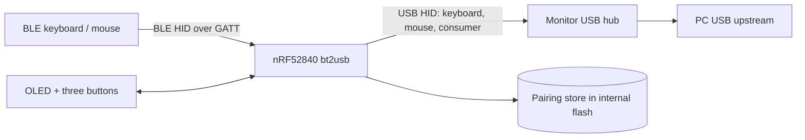
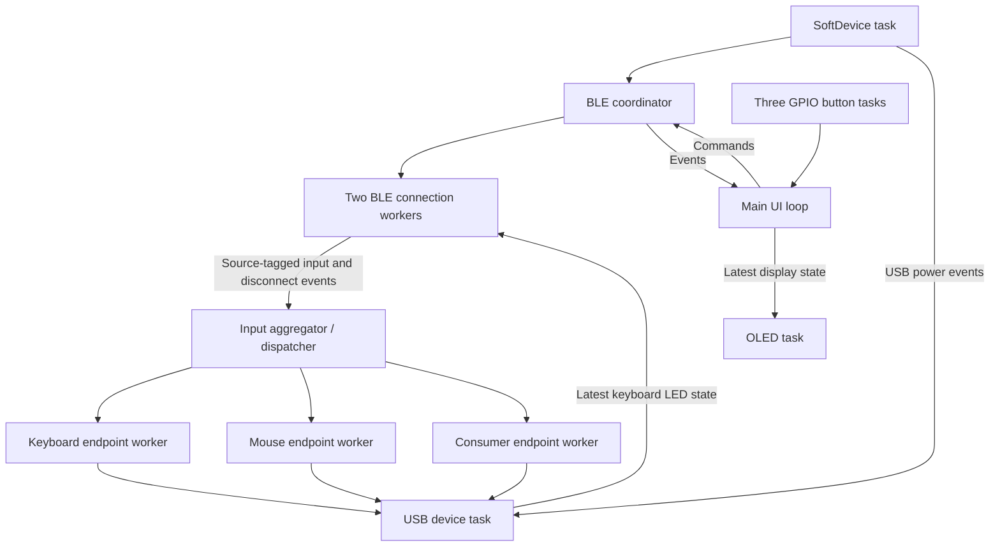

# Architecture Overview And ADR Index

This guide describes how the bt2usb firmware is put together at runtime and
indexes the architecture decision records (ADRs) that explain why. Byte-level
formats live in the [data model](data-model.md); pins, constants, and the memory
map live in [hardware](hardware.md).

## System At A Glance

bt2usb uses `no_std` Rust, static allocation, and Embassy's cooperative async
executor ([ADR 0002](adr/0002-nrf52840-softdevice-embassy.md)). Nordic SoftDevice
S140 supplies the BLE central stack. USB uses the nRF52840 device peripheral
through Embassy. The UI runs in `main`; a separate display task renders its
latest state over async I2C.



The repository builds three firmware binaries from one source tree:

| Binary | Feature | Purpose |
| --- | --- | --- |
| `bt2usb` | `embedded` | The bridge |
| `bt2usb-selftest` | `embedded` | Staged board bring-up; see [first flash](first-flash.md) |
| `bt2usb-sim` | `sim` | SoftDevice-free Renode build; see [testing](testing.md#renode-simulation) |

The host library (`src/lib.rs`) exports the hardware-free modules those binaries
share ([ADR 0003](adr/0003-pure-core-and-task-shell.md)).

## Source Map

| Area | Responsibility |
| --- | --- |
| [main.rs](../src/main.rs) | Hardware setup, task spawning, channels, UI loop |
| [sim.rs](../src/sim.rs) | SoftDevice-free Renode entry point and synthetic BLE scenario |
| [selftest.rs](../src/selftest.rs) | Staged board bring-up image |
| [sd_setup.rs](../src/sd_setup.rs) | Shared SoftDevice setup |
| [lib.rs](../src/lib.rs) | Host-test entry point for hardware-free logic |
| [ble/coordinator.rs](../src/ble/coordinator.rs) | Pure connection-slot and event reducers |
| [ble/multi_conn.rs](../src/ble/multi_conn.rs) | BLE coordinator and two connection workers |
| [ble/hid_client.rs](../src/ble/hid_client.rs) | GATT discovery, subscriptions, HID classification |
| [ble/long_read.rs](../src/ble/long_read.rs) | Bounded fragmented Report Map acquisition |
| [ble/management.rs](../src/ble/management.rs) | Peer-management quiescence and transactional commit primitives |
| [ble/scanner.rs](../src/ble/scanner.rs) | Scan and HID advertisement filtering |
| [hid/](../src/hid/) | Report types, descriptors, per-source aggregation, endpoint delivery, wake policy |
| [usb/hid_device.rs](../src/usb/hid_device.rs) | Composite device, LED output, VBUS, suspend, report writing |
| [storage.rs](../src/storage.rs) | Paired-device persistence with versioned framing and bond codec |
| [ui/](../src/ui/) | Display, button tasks, pure UI transitions |
| [power_logic.rs](../src/power_logic.rs) | Pure power/display policy |
| [stack.rs](../src/stack.rs) | Painted-stack high-water measurement |

## Tasks And Data Flow



Bounded Embassy channels use `CriticalSectionRawMutex`. The BLE coordinator sends
commands to per-slot workers; a shared GAP mutex serializes scan and connection
establishment because SoftDevice permits one such procedure at a time. A link
does not hold that mutex for its whole lifetime. A requested scan can therefore
wait for an in-flight connection attempt.

| Channel | Direction | Capacity |
| --- | --- | --- |
| `HID_REPORT_CHANNEL` | BLE workers → input aggregator/dispatcher | 16 |
| `BLE_CMD_CHANNEL` | UI → coordinator | 4 |
| `BLE_EVENT_CHANNEL` | Coordinator → UI | 8 |
| `BLE_SLOT0_CMD_CHANNEL` / `BLE_SLOT1_CMD_CHANNEL` | Coordinator → worker | 2 each |
| `BLE_SLOT_EVENT_CHANNEL` | Workers → coordinator | 8 |
| `BUTTON_CHANNEL` | GPIO tasks → UI | 4 |

The USB keyboard LED state uses a `Watch`, so both slots can observe the latest
state. USB suspend/resume and wake requests use signals and atomic state.

The dispatcher does not wait for USB writes
([ADR 0005](adr/0005-two-slots-and-independent-endpoints.md)). Keyboard, mouse, and consumer
workers run concurrently, each with a 16-report FIFO, a 100 ms write deadline,
and 20–1000 ms retry backoff. An unpolled endpoint cannot block the other two.
Reset, configuration, resume, and protocol transitions invalidate old transfers
and replay current held state; relative mouse motion is never replayed.

## HID Path And Limits

Each input travels through GATT notification decoding, descriptor/report-reference
classification, a fixed internal report type, and a USB endpoint. Supported USB
reports are an 8-byte, six-key keyboard report, mouse buttons with signed 8-bit
movement and scroll, and consumer control. Mouse translation includes five
buttons and horizontal scrolling for compatible layouts. The keyboard and mouse
interfaces advertise the USB boot subclass and handle boot/report protocol
selection; boot mouse output uses the three-byte layout. Actual pre-OS behavior
is a hardware acceptance item.

The descriptor parser is a classifier for supported report layouts, not a full
HID bit-field translator. NKRO, 16-bit movement, and arbitrary vendor layouts need
additional translation. Descriptor parsing bounds collection/global-state
nesting and supports Push/Pop, but retains at most one report ID per supported
kind. GATT discovery and notification buffers are bounded; see the current
constants in `hid_client.rs` when adding report families.

Report Maps are read by offset across negotiated MTU boundaries into a bounded
512-byte buffer using a small vendored SoftDevice API patch
([ADR 0007](adr/0007-vendored-softdevice-patch.md)). Present but
unreadable, malformed, or oversized maps fail discovery with a specific error.
Only an absent Report Map characteristic permits legacy fixed-layout/length
classification. Neither that fallback nor report-kind classification proves
an arbitrary same-length layout is supported; field-level translation remains
open work.

The aggregator tracks each BLE slot independently. Keyboard keys/modifiers and
mouse buttons are unioned, so releasing or disconnecting one source preserves
the other's held input. More than six unique keys produces the keyboard
`ErrorRollOver` array. The one-usage consumer interface gives the lowest active
slot priority and falls back to the other slot when that input is released.
Mouse movement belongs only to the current event and is not unioned as held state.

Normal endpoint traffic retains FIFO ordering. While unavailable or recovering,
an endpoint keeps the latest absolute state. Saturated queues collapse to current
state, so intermediate taps or relative motion may be lost under sustained
overload. The policy prioritizes bounded memory and final releases. Host tests
include actual asynchronous workers with fake sinks; real-device timing and
recovery still need hardware acceptance.

## Pairing And Storage

The store records BLE addresses, names, RSSI hints, and optional bonding keys in
four reserved flash pages through `sequential-storage`
([ADR 0006](adr/0006-fail-closed-pairing-store.md)). Its codec and versioned
framing are separate from flash I/O; the [data model](data-model.md#pairing-store)
defines the layout and validation rules. An invalid, unsupported, or unreadable
store disables writes instead of being silently replaced.

Bonded records use stable peer identities. Background reconnects resolve a peer's
current advertising address on each attempt, including when its private address
rotates after boot. Up to two recent stored devices are selected at boot. New
pairing is initiated for explicit user connections; background reconnects use
existing keys. HID discovery waits for an encrypted link, and commands can cancel
security/discovery once the connection is owned.

Disconnecting closes connections while retaining their records. Separate
confirmation-based Forget and Factory reset operations stop affected workers and
wait for their source/retry cleanup before changing records. The in-memory store
and bonder change only after persistence succeeds. Factory reset can explicitly
erase an unreadable storage region to recover it; ordinary writes cannot.
Logical deletion is not a physical key-erasure guarantee. Power-loss behavior,
authenticated pairing, and physical flash protection remain release work in
[TODO.md](../TODO.md).

## Execution And Power Choices

Tasks yield on I/O; there are no per-task stacks or a dynamic allocator. Blocking
work in one task can still delay the whole executor. `defmt` supplies compact RTT
diagnostics. `probe-rs` flashes and runs firmware through a debug probe.

The bus-powered design keeps BLE links responsive rather than entering
System-OFF. Input activity informs display power policy; the OLED can turn off
without disconnecting devices. USB remote wakeup requires a newly pressed
key/modifier, consumer usage, or mouse button during suspend. Motion, scroll,
releases, repeated held state, and recovery replay do not wake the host.

UI errors and completion notices remain until acknowledged; incoming background
status changes do not silently replace them. Display updates use the latest
state. A failed OLED operation retries with bounded exponential backoff. A 500 ms
operation deadline requests TWIM STOP but retains the DMA future until completion;
cancelling that future is unsafe in the pinned HAL. If the hardware never reports
completion, the isolated display task stays degraded while the bridge and UI
continue. There is no general watchdog recovery guarantee yet.

## Architecture Constraints

- Firmware paths use static allocation only; adding a heap needs an ADR.
- Decision logic lives in hardware-free modules with host tests; task code
  performs I/O and stays thin.
- Every buffer, queue, descriptor field, and stored record that a peer or flash
  can influence is bounded and validated before use.
- Held input must always be releasable: link loss, USB reset, suspend, and
  endpoint recovery end in a state with no stuck keys or buttons.
- The SoftDevice owns radio timing; scan and connect go through the GAP lock,
  and flash writes tolerate radio contention.
- `memory_sd.x`, `STORAGE_FLASH_PAGE_START`/`COUNT`, and the
  [memory map](hardware.md#memory-layout) change together.
- Documentation separates implemented, software-verified, and hardware-verified
  behavior.

## ADR Process

Add an ADR when a change:

- changes task, channel, or module boundaries
- changes a persisted format, a USB descriptor, or a BLE security policy
- changes the memory map, flash partitioning, or SoftDevice version
- introduces a material dependency, toolchain, or vendored patch
- changes input-delivery, loss, or wake guarantees
- changes how firmware is built, verified, released, or flashed

Name it with the next sequence number:

```text
docs/adr/NNNN-short-title.md
```

Statuses:

- **Proposed**: under review, not yet the project's direction
- **Accepted**: current direction
- **Superseded**: kept for history and linked to its replacement

## Accepted ADRs

- [ADR 0001: Keep The README Short And Organize Detailed Docs By Reader](adr/0001-documentation-structure.md)
- [ADR 0002: Build On nRF52840, Nordic SoftDevice S140, And Embassy](adr/0002-nrf52840-softdevice-embassy.md)
- [ADR 0003: Keep Decisions In Hardware-Free Modules And I/O In Thin Tasks](adr/0003-pure-core-and-task-shell.md)
- [ADR 0004: Verify In Layers, From Host Tests To Hardware Acceptance](adr/0004-layered-verification.md)
- [ADR 0005: Aggregate Two BLE Sources Into Independent USB Endpoint Workers](adr/0005-two-slots-and-independent-endpoints.md)
- [ADR 0006: Persist Pairings In A Versioned, Fail-Closed Flash Store](adr/0006-fail-closed-pairing-store.md)
- [ADR 0007: Vendor A Minimal nrf-softdevice Patch At A Pinned Revision](adr/0007-vendored-softdevice-patch.md)
- [ADR 0008: Release Exact-Version Tags As Attested Drafts Of Checked Builds](adr/0008-attested-draft-releases.md)

## Decisions Needed For Roadmap Work

Write an ADR before implementing any of these [TODO.md](../TODO.md) items:

- authenticated pairing and enrollment policy (passkey or numeric comparison,
  pairing window, rejection of weaker devices)
- watchdog and progress-based recovery strategy
- power-loss-safe persistence and storage-version migration policy
- descriptor-driven HID report translation
- production USB identity and unit-identity policy
- bootloader, flash partitioning, and signed USB/BLE DFU
- provisioning, debug access, and readout protection
- multiple BLE profile sets

## ADR Template

```markdown
# ADR NNNN: Title

- Status: Proposed | Accepted | Superseded
- Date: YYYY-MM-DD

## Context

What forces, constraints, and current facts made this decision necessary?

## Decision

What did we decide?

## Rationale

Why this option over the alternatives?

## Consequences

What becomes easier, harder, riskier, or more constrained?
```

## Related Guides

- [Features](features.md)
- [Data Model](data-model.md)
- [Hardware](hardware.md)
- [Development](development.md)
- [Testing](testing.md)
- [Security](security.md)
