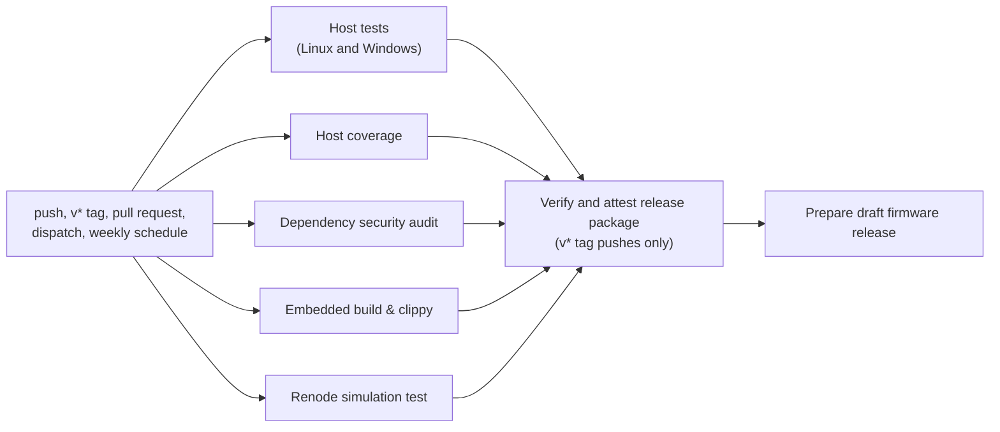

# Code Quality Guide

This guide defines the code-health rules for bt2usb. It covers the checks
that gate a change, the lint and formatting policy, every `unsafe` block in
the application, the panic and allocation rules, coverage, dependency hygiene,
binary size and memory budgets, and the review checklist. The
[testing guide](testing.md) covers how the tests themselves are organized,
the [development guide](development.md) covers the commands, and
[ADR 0004](adr/0004-layered-verification.md) and
[ADR 0013](adr/0013-pinned-toolchain-and-mask-tasks.md) record the
decisions behind layered verification and the pinned toolchain.

Three kinds of rule appear below, and the guide says which kind each one is:

- **Enforced**: a CI job or the build fails when the rule is broken.
- **Review rule**: a reviewer checks it; no tool does.
- **Gap**: the rule is wanted but not in place. Gaps are listed under
  [Known Gaps](#known-gaps), with the [TODO.md](../TODO.md) item that tracks
  each one.

Facts in this guide were read from the repository at commit `7fc99d6`, and
the passages on modules changed since then were updated with the 2026-10-09
reconnect, lock-key, connection-parameter, and reserved-byte fixes. Counts say
how they were taken. The builds, Clippy, tests, and audit were not re-run for
this guide.
The last recorded local run of the Rust checks is the
[2026-10-09 validation record](testing.md#validation-record--2026-10-09); the
last one that also ran Renode, the dependency audit, and actionlint is the
[2026-09-28 validation record](testing.md#validation-record--2026-09-28). No
figure in this guide was measured on a board.

## Quality Gates

[ci.yml](../.github/workflows/ci.yml) runs on pushes to `main` or `master`,
pushes of `v*` tags, pull requests, manual dispatch, and every Monday at 07:23
UTC (`cron: "23 7 * * 1"`). `mask ci` runs the local subset. A step fails its
job when its command exits non-zero, and `-D warnings` turns every compiler or
Clippy warning into an error.

| Gate | Command | Local | CI job | Failure effect |
| --- | --- | --- | --- | --- |
| Formatting | `cargo fmt --package bt2usb -- --check` | `mask ci`, `mask fmt-check` (`cargo fmt -- --check`, the same files) | Host tests, Linux and Windows | Fails the job |
| Host Clippy | `cargo clippy --locked --lib --tests -- -D warnings` | `mask ci` | Host tests, Linux and Windows | Fails on any warning |
| Embedded Clippy | `cargo clippy --locked --features embedded --target thumbv7em-none-eabihf -- -D warnings` | `mask ci`, `mask clippy` | Embedded build & clippy | Fails on any warning |
| Simulation Clippy | `cargo clippy --locked --features sim --target thumbv7em-none-eabihf -- -D warnings` | `mask ci` | Renode simulation test | Fails on any warning |
| Host rustdoc | `cargo doc --locked --no-deps --document-private-items --lib` with `RUSTDOCFLAGS=-D warnings` | `mask ci`, `mask doc-check` | Host tests, Linux and Windows | Fails on any rustdoc warning |
| Firmware rustdoc | The same flags with `--features embedded --target thumbv7em-none-eabihf`, once for `--lib` and once for `--bin bt2usb --bin bt2usb-selftest` | `mask ci`, `mask doc-check` | Embedded build & clippy | Fails on any rustdoc warning |
| Simulation rustdoc | The same flags with `--features sim --target thumbv7em-none-eabihf --bin bt2usb-sim` | `mask ci`, `mask doc-check` | Renode simulation test | Fails on any rustdoc warning |
| Coverage floor | `cargo llvm-cov --locked --lib --tests --no-report`, then `cargo llvm-cov report --summary-only --fail-under-lines "$COVERAGE_MIN_LINES"` (97), cargo-llvm-cov 0.9.1 | `cargo llvm-cov --locked --lib --tests --summary-only --fail-under-lines 97` | Host coverage | Fails when host line coverage drops below the floor; the report uploads first ([Coverage In CI](#coverage-in-ci)) |
| Host tests | `cargo test --locked --lib --tests` | `mask ci`, `mask test` | Host tests, Linux and Windows | Fails on any failed test |
| Release firmware build | `cargo build --locked --features embedded --target thumbv7em-none-eabihf --release` | `mask ci`, `mask build-release` | Embedded build & clippy | Fails the job; builds `bt2usb` and `bt2usb-selftest` |
| Simulation build | `cargo build --locked --features sim --target thumbv7em-none-eabihf` | `mask ci`, `mask sim-build` | Renode simulation test | Fails the job |
| Renode scenario | `renode-test --results-dir "$RUNNER_TEMP/renode-results" renode/bt2usb-sim.robot` | `mask sim-test` (needs `renode-test` on PATH; `mask sim-setup` installs it on Linux or WSL) | Renode simulation test | Fails the job; results upload even on failure |
| Dependency audit | `cargo audit`, cargo-audit 0.22.2 | None; install it as in [development](development.md#toolchain) | Dependency security audit | Fails on a vulnerability advisory; unmaintained-crate warnings do not fail it |
| Workflow lint | `actionlint`, 1.7.12, SHA-256 checked before use | None | Host tests, Linux only | Fails the Linux job |
| File length | `find src tests build.rs -name '*.rs' -exec wc -l {} +`, failing above 500 lines ([File Length](#file-length)) | Run the same command | Host tests, Linux only | Fails the Linux job and lists each file over the limit |
| Release helper tests | `python -m unittest discover -s scripts -p "release_test.py" -v` | None | Host tests, Linux and Windows | Fails the job; 12 tests (`grep -c 'def test' scripts/release_test.py`) |
| Tag matches version | `python scripts/release.py validate-tag --tag "$RELEASE_TAG"` | None | Host tests and the packaging job, `v*` tags only | Fails the tag run |
| Release staging | `python scripts/release.py stage …` | None | Embedded build & clippy | Refuses a modified tracked source tree, an existing output directory, an empty firmware file, or a commit that differs from `GITHUB_SHA` |

### How The Jobs Depend On Each Other

The five check jobs run in parallel. The packaging and draft-release jobs run
only for pushed `v*` tags, and only after all five check jobs pass:

A failed check job therefore blocks a release package. Whether it also blocks
merging a pull request depends on the branch protection settings on GitHub,
which are not stored in the repository; this guide cannot confirm them. The
weekly schedule runs the five check jobs against the default branch, so a new
advisory or a change in the hosted runner shows up without a code change.

A newer run for the same ref cancels an in-progress one, except for tag refs.
The [deployment guide](deployment.md#artifact-flow) explains how the release
jobs reuse the embedded job's bytes instead of rebuilding.

### Local Checks Before A Pull Request

`mask ci` covers formatting, the three Clippy configurations, host tests,
rustdoc for every build with warnings denied, and both firmware builds. It does
not run the coverage floor, actionlint, the release-helper tests, the audit, or
Renode, and it has no equivalent of the Windows host job, the tag check, or
release staging. Run the ones your change
can affect:

| Change touches | Also run |
| --- | --- |
| `///` or `//!` comments only | `mask doc-check`, which runs the four rustdoc builds without the rest of `mask ci` |
| Pure logic in `src/lib.rs` modules, or their tests | `cargo llvm-cov --locked --lib --tests --summary-only --fail-under-lines 97` |
| `.github/workflows/ci.yml` | `actionlint` |
| `scripts/release.py` or the release jobs | `python -m unittest discover -s scripts -p "release_test.py" -v` |
| `Cargo.toml` or `Cargo.lock` | `cargo audit` |
| UI, buttons, coordinator, `sim.rs`, `memory_sim.x`, or `renode/` | `mask sim-test` |

The [testing guide](testing.md#local-and-ci-coverage-compared) has the full
comparison, and the [development guide](development.md#checks-by-change)
lists the checks per kind of change.

## Lint And Formatting Policy

### Formatting

**Enforced.** Rust code uses rustfmt's default style for edition 2021. There
is no `rustfmt.toml`, so every contributor's rustfmt produces the same result
for the pinned toolchain (`channel = "1.95.0"` in
[rust-toolchain.toml](../rust-toolchain.toml), which installs the `rustfmt`
component).

`cargo fmt` formats the bt2usb package only. `cargo fmt -v -- --check` lists
its roots as `build.rs`, `src/lib.rs`, `src/main.rs`, `src/selftest.rs`,
`src/sim.rs`, and `tests/integration.rs`; rustfmt follows each root's module
tree, including the `#[path]` modules in `lib.rs`.

The vendored crate under `vendor/nrf-softdevice` is excluded. It is a path
dependency, not a workspace member (`cargo metadata --no-deps` lists only
bt2usb), so neither `cargo fmt` nor `cargo fmt --all` reaches it. Its files do
not follow rustfmt's default style, and keeping them byte-for-byte close to
upstream keeps the [vendor notes](../vendor/nrf-softdevice/README.bt2usb.md)
reviewable. An editor that formats on save will still rewrite them; the
[development guide](development.md#rustfmt-changes-vendored-files) explains
how to spot and discard that.

### File Length

**Enforced for Rust sources.** No `.rs` file under `src/`, `tests/`, or
`build.rs` may exceed 500 lines, counted with `wc -l` (blank and comment lines
included). The host-tests job runs the check on Linux and lists each file over
the limit. Split a file that grows past it along a responsibility, not at an
arbitrary line: tests go to a sibling `*_tests.rs` file included with
`#[cfg(test)] #[path = "..."] mod tests;` (as `ui_logic_tests.rs`,
`reconnect_tests.rs`, and `coordinator_tests.rs` are), and a shell module
splits by task or handler (as `multi_conn.rs` gave up `slot_worker.rs` and
`bonder.rs`, and `hid_device.rs` gave up `host_requests.rs`, on 2026-10-10).
Markdown guides and the vendored crate are not checked. On 2026-10-10 the
largest files were `storage.rs` (488 lines) and `hid_descriptor_tests.rs`
(486).

### Clippy

**Enforced.** Clippy runs with its default lint groups and `-D warnings`,
plus one restriction lint: the `[lints.clippy]` table in `Cargo.toml` turns
on `undocumented_unsafe_blocks` for every target, so an `unsafe` block
without a `// SAFETY:` comment fails each Clippy configuration below. The
host library also carries `#![forbid(unsafe_code)]` in
[lib.rs](../src/lib.rs). There is no `clippy.toml`, and no other pedantic,
restriction, or nursery lint is enabled.

Clippy runs in three configurations because `cfg` gating means each one sees
different code:

| Configuration | Targets checked | Code only this configuration sees |
| --- | --- | --- |
| Host (`--lib --tests`) | Library and its unit tests; `tests/integration.rs` | `#[cfg(test)]` modules and test files |
| Embedded (`--features embedded`) | Library; `bt2usb`; `bt2usb-selftest` | `main.rs`, `selftest.rs`, SoftDevice setup, USB, storage, power, stack, and the scanner, connection-worker, security-handler, and GATT HID client modules |
| Simulation (`--features sim`) | Library; `bt2usb-sim` | `src/sim.rs` and its UART output path |

The display driver and button tasks in `src/ui/` are compiled by both the
embedded and the simulation configurations (`sim.rs` declares `mod ui`), but
not by the host one.

A binary whose `required-features` are not enabled is skipped, which is why
each configuration lists different binaries.

### Lint Allowances

**Review rule.** Five allowances exist in `src/`, counted with
`grep -rn 'allow(' src` over attribute lines:

| Location | Allowance | Reason |
| --- | --- | --- |
| [selftest.rs](../src/selftest.rs) (crate level) | `dead_code, unused_imports` | The self-test reuses firmware modules without using all of their items or re-exports (comment in the file) |
| [sim.rs](../src/sim.rs) (crate level) | `dead_code` | The simulation reuses shared modules, such as the display driver, that it does not fully exercise (comment in the file) |
| [display.rs](../src/ui/display.rs) `init` | `dead_code` | Used only by the self-test (`ui::display::init` in `selftest.rs`) |
| [display.rs](../src/ui/display.rs) `draw_home` | `dead_code` | Used only by the self-test; no comment at the attribute |
| [hid_device.rs](../src/usb/hid_device.rs) `is_configured` | `dead_code` | Used only by the self-test (comment at the attribute) |

A `clippy::too_many_arguments` allowance on `multi_conn::manage_devices` was
removed on 2026-10-10, when the per-slot command senders became one array and
the function dropped to seven parameters; an `#[expect]` would have reported
the stale allowance by itself.

The bridge binary has no crate-level allowance, so an unused item in its
module tree fails embedded Clippy. The two crate-level allowances mean that
code reachable only from `selftest.rs` or `sim.rs` can go dead without a
warning.

Rules for a new allowance:

- Scope it to the item, not the module or crate.
- Say why on the same line or the line above.
- Prefer `#[expect(lint, reason = "…")]`, stable since Rust 1.81, so the
  attribute itself warns once the lint no longer fires. The existing five use
  `#[allow]`.
- Never allow a lint to silence a correctness finding; fix the code.

### Documentation Comments

**Enforced for every build since 2026-10-10.** CI documents each build with
private items included and warnings denied, so a rustdoc warning anywhere,
such as a broken intra-doc link in a firmware-only module, fails a job. Every
run uses
`RUSTDOCFLAGS="-D warnings" cargo doc --locked --no-deps --document-private-items`
plus one of these:

| Build | Extra arguments | CI job |
| --- | --- | --- |
| Host library | `--lib` | Host tests, Linux and Windows |
| Embedded library | `--features embedded --target thumbv7em-none-eabihf --lib` | Embedded build & clippy |
| Bridge and self-test binaries | `--features embedded --target thumbv7em-none-eabihf --bin bt2usb --bin bt2usb-selftest` | Embedded build & clippy |
| Simulation binary | `--features sim --target thumbv7em-none-eabihf --bin bt2usb-sim` | Renode simulation test |

The library and the bridge binary are both named `bt2usb`, so they are
documented in separate runs; one run would write both to the same output
directory. `mask doc-check` runs all four, and `mask ci` includes them.
`mask doc` still builds the embedded documentation with dependencies and
without denying warnings, for reading. `--no-deps` keeps the vendored
`nrf-softdevice` crates out of the check: their documentation is upstream's.

**Links across builds.** A module that more than one build compiles names a
firmware-only item in code formatting, not as an intra-doc link: the
coordinator, power policy, and `ble` module docs mention `ble::multi_conn` and
`power.rs` that way, because the host library and the `sim` build do not
contain them and the link would not resolve there.

**Review rule.** Every module starts with a `//!` comment that says what it
owns and what it must not depend on. Three files have none today, found with
`grep -L '^//!'` over `src/`: `src/ui/input_logic.rs`, `src/ble/adv_parser.rs`,
and `src/ble/coordinator_tests.rs`. Public items in pure
modules carry `///` comments that state units, bounds, and error meanings.

### Other Files

| Files | Check | Kind |
| --- | --- | --- |
| Line endings | [.gitattributes](../.gitattributes) forces LF for shell scripts, `maskfile.md`, Renode files, Rust, TOML, linker scripts, Markdown, JSON, and YAML | Enforced by Git when files are committed and checked out |
| `.github/workflows/ci.yml` | actionlint 1.7.12 in the Linux host job | Enforced |
| `scripts/release.py` | 12 unit tests in `scripts/release_test.py`; no linter or type checker | Tests enforced; style not checked |
| `scripts/*.sh`, `.devcontainer/post-create.sh`, Bash blocks in `maskfile.md` | None. actionlint checks workflow `run:` blocks with ShellCheck when `shellcheck` is installed; the workflow does not install it, and whether the hosted runner image provides it is not recorded | Gap |
| Markdown in `docs/` | None; links and quoted constants are checked by hand | Gap |
| Renode `.robot`, `.resc`, `.repl`, `.cs` | Exercised by the Renode job; not linted | Partial |

## Unsafe Code Policy

### Inventory

The application has six `unsafe` blocks in five files. They were counted with
`grep -rnw unsafe src build.rs tests`, which matches only these six lines;
`build.rs`, `tests/`, and the Python and shell scripts contain no `unsafe`.
There are no `unsafe fn`, `unsafe impl`, `static mut`, `transmute`,
`MaybeUninit`, `#[no_mangle]`, `#[link_section]`, or inline `asm!` in `src/`
(`grep -rn` for each returns nothing).

| # | Location | Operation | Purpose | Invariant the code relies on | `SAFETY` comment | Compiled into |
| --- | --- | --- | --- | --- | --- | --- |
| 1 | [stack.rs](../src/stack.rs) `high_water` | `core::ptr::read_volatile` of a `u32` | Find the first overwritten word of the painted stack | Each address is word-aligned and lies between the linker symbols `_stack_end` and `_stack_start`, which is RAM owned by the program; the read is volatile so the compiler cannot assume the contents | Yes | Bridge, self-test |
| 2 | [scanner.rs](../src/ble/scanner.rs) `scan` closure | `core::slice::from_raw_parts(params.data.p_data, params.data.len as usize)` | View advertisement bytes from a SoftDevice scan report | `p_data` and `len` describe the report inside the scan buffer, and the slice does not outlive the callback | Yes | Bridge |
| 3 | [bonder.rs](../src/ble/bonder.rs) `bonder`, first branch | `&*ptr` | Return the shared `&'static Bonder` | The pointer came from `StaticCell::try_init`, so it is non-null, aligned, initialized, and lives forever; after initialization the `Bonder` is only reached through shared references | Yes | Bridge |
| 4 | [bonder.rs](../src/ble/bonder.rs) `bonder`, spin fallback | `&*ptr` | Same as 3, after waiting for another caller's initialization | Same as 3 | Yes ("as above") | Bridge |
| 5 | [sd_setup.rs](../src/sd_setup.rs) `enable_usb_power_events` | `sd_power_usbdetected_enable`, `sd_power_usbremoved_enable`, `sd_power_usbpwrrdy_enable`, `sd_power_usbregstatus_get` | Turn on the SoftDevice's USB power events and read the USB regulator state | The SoftDevice is enabled before the call (the function's doc comment says it must run after `Softdevice::enable`); `status` is a valid local the SVC writes | Yes | Bridge, self-test |
| 6 | [selftest.rs](../src/selftest.rs) `check_ble_scan` closure | `core::slice::from_raw_parts(params.data.p_data, params.data.len as usize)` | Same as 2, in the self-test's scan stage | Same as 2 | Yes | Self-test |

The host library contains none of these blocks: `stack.rs`, `sd_setup.rs`,
`scanner.rs`, and `bonder.rs` are not compiled into it, and neither is
`selftest.rs`. The simulation binary contains none either, because
`src/ble/mod.rs` compiles `scanner` and `bonder` only with the `embedded`
feature and `sim.rs` does not declare `stack` or `sd_setup`.

### Notes On Each Block

- **Blocks 2 and 6.** The vendored `central::scan` gives the SoftDevice one
  static 256-byte buffer, calls the closure with the report, and restarts the
  scan with the same buffer when the closure returns `None`
  ([central.rs](../vendor/nrf-softdevice/src/ble/central.rs)). The bytes are
  valid only during the call. `from_raw_parts` returns a slice with an
  unbounded lifetime, so the compiler would not stop a closure from keeping it;
  a reviewer must check that the closure copies what it needs. Both closures
  pass the slice to functions that parse it and return owned values.
  `from_raw_parts` also requires a non-null pointer even when `len` is 0; the
  code relies on the SoftDevice always pointing `p_data` into the buffer that
  `central::scan` supplied. Both comments state the pointer and length
  guarantee; block 2's also says the bytes are copied before the callback
  returns.
- **Blocks 3 and 4.** `Bonder` holds a `RefCell`, so it is `!Sync` and cannot
  be a plain `static`. The function's doc comment explains why a
  `StaticCell` plus an `AtomicPtr` cache is used and why the spin fallback
  cannot be reached on the single-threaded cooperative executor. Sharing a
  `!Sync` value as `&'static` is sound only while every access happens on that
  one executor in thread mode; a change that touches the `Bonder` from an
  interrupt handler would break the invariant.
- **Block 5.** The block wraps the whole function body, including the
  comparisons, the warning log, and the early returns, rather than only the
  four SVC calls. Narrow it if the function changes.
- **Block 1.** `_stack_end` and `_stack_start` are declared in an
  `extern "C"` block; taking their addresses with `core::ptr::addr_of!` needs
  no `unsafe` on the pinned toolchain, and their values are never read.

### Vendored Unsafe

The vendored `nrf-softdevice` crate wraps the SoftDevice C API, so it uses
`unsafe` throughout: `grep -rw unsafe vendor/nrf-softdevice/src` matches 161
lines in 22 files, 18 of them in `src/ble/gatt_client.rs`, the file the local
patch changes. The patch's changes are recorded in the
[vendor notes](../vendor/nrf-softdevice/README.bt2usb.md) and
[ADR 0007](adr/0007-vendored-softdevice-patch.md). Review every change to
that file with the same rules as application `unsafe`.

### Review Rule

**Partly enforced.** Clippy's `undocumented_unsafe_blocks` lint, set in the
`[lints.clippy]` table of `Cargo.toml`, fails every Clippy run in CI and
`mask ci` when an `unsafe` block has no `// SAFETY:` comment, and
`#![forbid(unsafe_code)]` in [lib.rs](../src/lib.rs) rejects `unsafe` in any
module the host library compiles (rule 2). Whether the comment is correct,
and the rest of the rules below, stay with the reviewer.

1. Use `unsafe` only where no safe API does the job. Prefer `StaticCell`,
   Embassy channels and signals, and the safe wrappers in `nrf-softdevice`.
2. Keep pure, host-compiled modules free of `unsafe`; `#![forbid(unsafe_code)]`
   in `lib.rs` enforces this for every module the host library compiles.
3. Put a `// SAFETY:` comment directly above the block. Name each
   precondition of the operation (non-null, alignment, initialization,
   lifetime, aliasing, and which execution context may touch the data) and
   say why it holds at this call site.
4. Keep the block as small as the operation. Do not wrap logging, control
   flow, or safe calls.
5. Never let a borrow created from a raw pointer outlive the memory it points
   at, and never store such a slice.
6. Add the block to the inventory above and to the list in
   [security](security.md#unsafe-code) in the same change.
7. Reviewers re-derive the invariant from the code, not from the comment, and
   check that a test, the self-test, or a hardware step exercises the path.

## Panics, Allocation, And Arithmetic

**No heap.** bt2usb defines no global allocator and does not use the `alloc`
crate: `grep -rn` over `src/` for `global_allocator`, `extern crate alloc`,
`alloc::`, and `Box` returns nothing. Every buffer is a fixed-capacity
`heapless` type, a fixed array, or a static created with `StaticCell`. A full
buffer is a case the code must handle, not a crash. See
[ADR 0010](adr/0010-static-memory-layout.md).

**Panics stop the device.** All three binaries link `panic-probe`, which
prints the panic over RTT and stops the core; nothing resets the chip
afterwards ([architecture](architecture.md#what-is-fatal)). The macro-based
panic sites outside test code were listed with a script that stops at each
file's `#[cfg(test)] mod`:

| Site | Count | Why it cannot fire at runtime, or when it would |
| --- | --- | --- |
| `unwrap!(…)` on task spawns | 10 in `main.rs`, 2 in `selftest.rs`, 3 in `sim.rs` | Each spawn happens once at boot and fits the task's pool: one instance per task in `main.rs` and `selftest.rs`, and `pool_size = 3` for the simulation's `button_task`. A spawn beyond the pool would panic |
| `.expect("two u32 hex words fit in 16 characters")` | 1 in `usb/hid_device.rs` | Formatting two `{:08X}` words always yields 16 characters |
| `unreachable!()` after `join4` | 1 in `usb/hid_device.rs` | The four joined futures never complete |
| `unreachable!()` for `SlotEvent::Quiesced` | 1 in `ble/multi_conn.rs` | The loop handles `Quiesced` and continues before this match |
| `const _: () = assert!(…)` on the pairing record size | 1 in `storage.rs` | Compile time only: the build fails if four records with bonds exceed `MAX_RECORD_SIZE` |

That table covers the panic macros only. Slice indexing, `RefCell` borrows,
and `StaticCell` initialization can also panic; Clippy's `indexing_slicing`,
`unwrap_used`, and `panic` lints are not enabled, so no tool lists those
sites; listing them is the open item
[Inventory panic sites in firmware paths](../TODO.md#verification-and-code-quality).

**Review rule.** Data from a BLE peer, the USB host, or flash must never reach
a panic. Validate lengths and bounds first and return an error or drop the
input; the [security guide](security.md#input-validation-boundaries) lists
the boundaries. A panic is acceptable only for a programming error that is
caught at boot, and its message says what was violated.

**Arithmetic.** The release profile keeps Cargo's default
`overflow-checks = false`, so integer overflow wraps silently in release
firmware (the CI build, release artifacts, and `mask run --release`). The dev
profile keeps the default `true`, so overflow panics in host tests and in
debug firmware builds (`mask build`, `mask run`, `mask sim-build`). A host test
that overflows is a real defect even though the release firmware would not
stop. Use `saturating_*`,
`wrapping_*`, or `checked_*` where the intended behavior at the limit matters.

## Coverage

### Tasks

`mask coverage` runs `cargo llvm-cov --locked --lib --tests` when
cargo-llvm-cov is installed and falls back to cargo-tarpaulin (Linux only).
`--html` and `--json` select report formats, and `mask coverage-html` and
`mask coverage-json` are shortcuts. `mask coverage-install` installs
cargo-llvm-cov and the `llvm-tools-preview` component, which
`rust-toolchain.toml` does not list. Commands, options, and output paths are in
the [development guide](development.md#coverage) and the
[testing guide](testing.md#coverage).

Both tools run the same unit and integration tests (`--lib --tests`) since
2026-10-10. A tarpaulin figure is still not comparable with an llvm-cov figure:
tarpaulin counts lines from its own instrumentation, while llvm-cov uses the
compiler's source-based coverage regions, so the two report different totals
for the same run. Report which tool produced a figure.

### What Is Instrumented

Coverage measures only the code that host tests compile:

- the host library as built for tests: `src/hid/`, the BLE advertisement
  parser, connection-parameter bounds, coordinator, reconnect table,
  long-read assembler, and management logic, `src/power_logic.rs`, and the UI display, input, and state-machine
  logic
- `src/storage/framing.rs` and `src/storage/record.rs`, which `lib.rs`
  includes only under `cfg(test)`
- the inline `#[cfg(test)] mod tests` blocks inside those files, which count
  toward the file they sit in

The test code in separate files is compiled with instrumentation but left out
of the llvm-cov report: `tests/integration.rs`, the `src/*_tests.rs` files
that `lib.rs` includes, and the `#[path]` test files `coordinator_tests.rs`,
`reconnect_tests.rs`, `delivery_tests.rs`, and `ui_logic_tests.rs`. On
2026-10-10, cargo-llvm-cov 0.9.1's summary listed 22 files, all of them
source modules; passing
`--ignore-filename-regex '(_tests\.rs$|tests/)'` gave the same total, so no
test file reaches the figure.

Everything that depends on the SoftDevice, Embassy, or peripheral types is
not compiled for the host and is therefore not in the report: the connection
workers, security handler, GATT HID client, scanner, storage shell and codec,
USB device, display driver, buttons, power shell, stack monitor, SoftDevice setup, and the
three entry points. `config.rs` is compiled into the host library but holds
only constants, so it adds no lines to the report. The
[host library composition](testing.md#host-library-composition) table lists
the files. Renode runs, the self-test, and hardware sessions produce no
coverage data.

A coverage figure is therefore a figure for the pure logic, not for the
firmware.

### Coverage In CI

The Host coverage job in [ci.yml](../.github/workflows/ci.yml) runs on Ubuntu
on every trigger:

1. It adds the `llvm-tools` component to the pinned toolchain and installs
   cargo-llvm-cov 0.9.1 with `taiki-e/install-action`, the version
   `mask coverage-install` pins.
2. `cargo llvm-cov --locked --lib --tests --no-report` runs the host unit and
   integration tests once, instrumented.
3. `cargo llvm-cov report` writes three reports from that run into the
   runner's temporary directory: the per-file summary table (`summary.txt`,
   also printed in the log), `lcov.info` for tools that read lcov, and the
   HTML report under `html/`.
4. The reports upload as the `coverage-report-<attempt>` artifact.
5. `cargo llvm-cov report --summary-only --fail-under-lines "$COVERAGE_MIN_LINES"`
   fails the job when the total line coverage is below the floor.

The report uploads before the floor is checked, so a failed run still carries
the report that shows which files lost coverage.

**The floor.** `COVERAGE_MIN_LINES` is 97, set on 2026-10-10 from the baseline
of 97.59% of lines (98.17% of regions, 98.67% of functions) in the
[validation record](testing.md#validation-record--2026-10-10). At that baseline
59 of 2,452 lines were not covered; about 15 more uncovered lines at the same
size would cross the floor. It is a ratchet:

- Raise it when coverage rises enough to leave the same margin, in the commit
  that raises coverage.
- Lower it only with the reason in the commit message, for example code that
  moves out of the host library, and record the new baseline in a validation
  record.
- Do not lower it to make a change pass. Add the missing tests instead, or
  move hardware-coupled code out of the pure modules.

**What the figure includes.** The total is the one `--summary-only` prints:
the 22 source modules listed under [What Is Instrumented](#what-is-instrumented),
with their inline test modules and without the separate test files. Inline test
code is covered almost entirely by running, so files with large inline test
modules read slightly higher than their production code alone would. Region
and function coverage are reported but have no floor.

**Local reproduction.** Run
`cargo llvm-cov --locked --lib --tests --summary-only --fail-under-lines 97`
with the pinned toolchain and cargo-llvm-cov 0.9.1. With the same source,
toolchain, and tool version the figure should match the CI log; a different
toolchain or tool version can count regions differently and shift it.

### Reporting Coverage

CI checks the floor on every run, but a pull request that adds tests, or a
validation record, should still report the figure it measured. Include:

| Field | Example of what to write |
| --- | --- |
| Date and commit | The full commit SHA, and whether the tree was clean |
| Toolchain and tool | `rustc --version` and `cargo llvm-cov --version` |
| Command | The exact command, for example `cargo llvm-cov --locked --lib --tests` |
| Metric | Line, region, or function coverage; they differ |
| Scope | That only the host library and integration tests were measured, and whether test files were excluded from the figure |
| Change | The figure before and after, for a pull request that adds tests |

Do not put an undated percentage in the README or a guide. A number without
its commit and scope cannot be checked and goes stale silently.

## Dependency Hygiene

### Pinning

| Input | How it is pinned | Kind |
| --- | --- | --- |
| Rust toolchain | `channel = "1.95.0"` in `rust-toolchain.toml`; `rust-version = "1.95"` in `Cargo.toml` | Enforced: rustup installs exactly this version, and `release.py package` rejects a build whose `rustc` differs |
| Crate graph | `Cargo.lock` is tracked (the `.gitignore` comment says so), and every Cargo build, test, Clippy, doc, size, bloat, and llvm-cov command in CI and `maskfile.md` passes `--locked` | Enforced: Cargo fails instead of changing the lockfile |
| `nrf-softdevice`, `nrf-softdevice-s140` | Git `rev = "47d6121c6e823120e8b883a7ac75f44ce7daa3aa"`; `nrf-softdevice` is replaced by `vendor/nrf-softdevice` through `[patch]` | Enforced by Cargo |
| GitHub Actions | Each `uses:` names a full commit SHA with a tag comment | Enforced by the SHA; the comment is informational |
| cargo-audit, actionlint | `cargo-audit@0.22.2` through `taiki-e/install-action`; actionlint 1.7.12 with a SHA-256 check | Enforced in CI |
| Developer tools | `cargo install --locked` with an exact `--version` in `mask deps`, `mask coverage-install`, and the devcontainer setup; the tarpaulin hint `mask coverage` prints uses the same form | Pinned by hand: the versions repeat in `maskfile.md`, `post-create.sh`, and the [development guide](development.md#toolchain), cargo-llvm-cov 0.9.1 also in the CI coverage job, and nothing checks that they agree |
| SoftDevice, Renode, Robot Framework | Download URLs and versions without digests | Gap; see [security](security.md#supply-chain) |

The action pins and their comments are:

| Action | Tag comment |
| --- | --- |
| `actions/checkout` | `v4.4.0` |
| `Swatinem/rust-cache` | `v2` |
| `taiki-e/install-action` | `v2` |
| `actions/upload-artifact` | `v4.6.2` |
| `actions/download-artifact` | `v8.0.1` |
| `actions/attest` | `v4.2.2` |
| `softprops/action-gh-release` | `v2.6.2` |

Two comments name a major-version tag rather than an exact release, so they do
not say which release the SHA was taken from. Replacing them with exact tags
is part of the open item [CI runtime maintenance](../TODO.md#release-provenance-and-supply-chain).

### Auditing

`cargo audit` runs in every CI run, including the weekly schedule. It has no
configuration file, no ignore list, and no `--deny` option. It fails the job
for a vulnerability advisory; warnings, such as unmaintained crates, are
printed but do not fail it.

The last recorded audit, on 2026-09-28
([validation record](testing.md#validation-record--2026-09-28)), reported no
vulnerabilities and two unmaintained transitive dependencies. Both versions
are still in `Cargo.lock`. The chains below were traced from `Cargo.lock`
with a script, because `cargo tree` needs network access to the Git
dependencies; the audit itself was not re-run for this guide.

| Crate | Advisory | Pulled in by |
| --- | --- | --- |
| `bare-metal 0.2.5` | `RUSTSEC-2026-0110` (unmaintained) | `cortex-m 0.7.9`, which bt2usb, `embassy-executor`, `embassy-nrf`, `embassy-hal-internal`, `nrf-pac`, `nrf-softdevice`, and `panic-probe` depend on |
| `proc-macro-error 1.0.4` | `RUSTSEC-2024-0370` (unmaintained) | `maybe-async-cfg 0.2.4`, a dependency of `ssd1306 0.10.0` |

Both arrive through other crates, so removing them means upgrading or
replacing those crates rather than changing bt2usb code. The work is tracked in
[TODO.md](../TODO.md#release-provenance-and-supply-chain).

### Updates

Dependabot checks Cargo and GitHub Actions weekly and keeps at most five of
its pull requests open for each (`open-pull-requests-limit: 5` in
[dependabot.yml](../.github/dependabot.yml)). Treat each one as a
code change:

1. Read the upstream changelog. For Embassy, `nrf-softdevice`, `ssd1306`, and
   `sequential-storage`, look for changes to cancellation, I2C, USB, or flash
   behavior that bt2usb relies on.
2. Check that CI passes. Dependabot pull requests get the same jobs.
3. For an action, confirm the new SHA resolves to the tag in the comment
   (`git ls-remote https://github.com/<owner>/<repo> 'refs/tags/<tag>*'`;
   for an annotated tag, compare the peeled `^{}` line), and write the exact
   tag in the comment.
4. For a firmware dependency, run the affected
   [first-flash](first-flash.md) sections on a board before release, and
   check that an existing pairing store still loads.
5. Never change the `nrf-softdevice` revision without re-reviewing the
   vendored copy against the new upstream and updating the
   [vendor notes](../vendor/nrf-softdevice/README.bt2usb.md).

Adding a dependency needs a reason in the pull request, a check that it
supports `no_std` without an allocator if the firmware uses it, its license
(the crate is `GPL-3.0-only`), and a `cargo audit` run.

## Binary Size And Memory Budgets

### Hard Limits

These limits fail the build when they are exceeded:

| Limit | Value | Enforced by |
| --- | --- | --- |
| Application flash | `FLASH : ORIGIN = 0x00027000, LENGTH = 804K`, ending at the pairing store (page 240, `0xF0000`) | Linker: code or read-only data that does not fit fails the link |
| Application RAM | `RAM : ORIGIN = 0x20006000, LENGTH = 232K`, after the SoftDevice's 24 KiB | Linker: static data that does not fit fails the link |
| RAM placement | `ASSERT(__sdata == ORIGIN(RAM) && _stack_start == ORIGIN(RAM) + LENGTH(RAM), …)` | Linker assert in [memory_sd.x](../memory_sd.x) |
| Pairing boundary | `ASSERT(ORIGIN(FLASH) + LENGTH(FLASH) == __bt2usb_storage_start, …)` and `ASSERT(__bt2usb_storage_end <= 0x00100000, …)`, with the symbols written by [build.rs](../build.rs) from `STORAGE_FLASH_START`/`END` in [config.rs](../src/config.rs) | Linker assert in [memory_sd.x](../memory_sd.x): changing the page constants or the `FLASH` length alone fails the link |
| Pairing record | `3 + MAX_PAIRED_DEVICES * (1 + 9 + 32 + 1 + BOND_RECORD_SIZE) <= MAX_RECORD_SIZE`, that is 375 ≤ 512 bytes | `const` assert in [storage.rs](../src/storage.rs) |

The simulation build uses [memory_sim.x](../memory_sim.x), which gives the
whole 1024 KiB of flash and 256 KiB of RAM to the application and has no
assert. The [hardware guide](hardware.md#memory-layout) and
[ADR 0010](adr/0010-static-memory-layout.md) explain the map.

### What No Tool Checks

- **Stack depth.** The stack region runs from `_stack_end` up to the top of
  RAM, and every task and interrupt handler shares it. Nothing checks its
  depth at build time, and there is no guard region: without `flip-link`, an
  overflow runs into static data instead of faulting.
- **SoftDevice RAM.** The 24 KiB reservation is not derived from a
  measurement. `Softdevice::enable` panics at boot if it is too small.
- **Size growth.** No CI step records `mask size` or compares it with a
  previous build, and there is no size budget below the linker limits.

### Measuring

| Measurement | How | What it tells you |
| --- | --- | --- |
| Section sizes | `mask size` (`cargo size … --release --bin bt2usb -- -A`) | Size and address of each ELF section |
| Largest functions | `mask bloat` (needs cargo-bloat) | The 30 largest functions in the release bridge |
| SoftDevice RAM | The boot log line `softdevice RAM: N bytes`, printed by the vendored `Softdevice::enable` | What the SoftDevice needs for this configuration; must stay at or below 24576 |
| Stack high-water | `stack high-water: X of Y bytes`, logged by `main.rs` whenever the measured depth grows, checked once a second; the self-test logs the same line once, before its stack stage | Deepest stack use since reset (X) against the stack region (Y) |
| Self-test stack stage | `[PASS] stack: under half the stack region used` or `[FAIL] stack: over half the stack region used` | Whether the self-test image used less than half its stack; it says nothing about the bridge's worst case |

`mask size` lists every section in the ELF. The release profile keeps
`debug = 2`, so the file also carries DWARF sections, shown at address 0,
that are never programmed; the ELF file size is not the flash size. Sections
with addresses from `0x27000` up to `0xF0000` occupy application flash, and
sections from `0x20006000` up occupy application RAM. Initialized statics are
listed at their RAM address but also take the same number of bytes in flash,
from which they are copied at reset. `DEFMT_LOG` decides which log calls are
compiled in, so record it with every size result; release artifacts use
`info`.

The stack figure is only as good as the paths exercised since reset. The
[operations guide](operations.md#reading-the-stack-high-water-mark) lists the
worst case to drive before trusting it.

### Budget Status

No size, stack, or SoftDevice RAM figure has been recorded from a board in
this repository. Until one is, treat these as review rules:

- A change that adds a large static buffer, table, or channel capacity
  includes `mask size` output before and after, with `DEFMT_LOG` named.
- A change to deep call paths, recursion, large locals, or `join`/`select`
  of many futures records the stack high-water mark from a board after
  driving the worst case.
- Treat a high-water mark above half the stack region as a defect, as the
  self-test does.
- Never shrink the SoftDevice RAM reservation from one boot's log line.

Measuring and recording these margins is the P0 "Memory and endurance
budget" item in [TODO.md](../TODO.md#platform-memory-and-recovery).

## Review Checklist

Use this list for every pull request that changes code. The
[security checklist](security.md#security-review-checklist) adds the items
for pairing, storage, and input handling.

- [ ] `mask ci` passes, plus each CI-only check the change can affect
      ([local checks](#local-checks-before-a-pull-request)).
- [ ] New logic that needs no hardware lives in a module the host library
      compiles, with tests for normal, malformed, truncated, and
      at-capacity input ([testing](testing.md#test-design-rules)).
- [ ] No new `unsafe`, or the block follows the
      [review rule](#review-rule) and is added to the inventory here and in
      [security](security.md#unsafe-code).
- [ ] No new panic path on data from a peer, the host, or flash; new
      `unwrap!`, `expect`, or `unreachable!` sites are boot-time programming
      checks with a message.
- [ ] New lint allowances are item-scoped and say why.
- [ ] Buffers and channels are bounded, and the behavior when one is full is
      defined and tested.
- [ ] Shared capacities and limits are derived from `config.rs`, not repeated
      as literals ([development](development.md#add-a-configuration-constant)).
- [ ] Logs contain no key material, raw flash, or keystroke content, and new
      log strings are quoted correctly in the
      [operations guide](operations.md#log-message-reference).
- [ ] A storage format change follows the
      [schema change rules](data-model.md#schema-change-rules).
- [ ] `Cargo.lock`, action, and vendored-code changes were reviewed as in
      [Updates](#updates).
- [ ] Size or stack effects are measured when the change can have them
      ([Budget Status](#budget-status)).
- [ ] An ADR exists for a change that crosses one of the
      [ADR triggers](architecture.md#adr-process).
- [ ] Docs, [TODO.md](../TODO.md), and claims in the pull request say
      whether the behavior is implemented, software-verified, or
      hardware-verified.

## Known Gaps

The right-hand column names the [TODO.md](../TODO.md) item that tracks each
gap and its priority; this list does not repeat the acceptance criteria.

| Gap | Where it is tracked |
| --- | --- |
| No fuzzing or property tests for descriptors, advertisements, reports, or storage framing | [Parser fuzzing and property tests](../TODO.md#verification-and-code-quality) (P1) |
| The connection workers, security handler, GATT HID client, storage shell and codec, USB device, and display driver have no host tests | [Host tests for the I/O shells](../TODO.md#verification-and-code-quality) (P1); the storage shell also under [Host tests for the device store](../TODO.md#verification-and-code-quality) (P1) |
| Panic-prone indexing and borrows are not inventoried by any lint | [Inventory panic sites in firmware paths](../TODO.md#verification-and-code-quality) (P2) |
| No size, stack, or SoftDevice RAM budget is measured or enforced, and a stack overflow does not fault | [Memory and endurance budget](../TODO.md#platform-memory-and-recovery) (P0) and [Stack overflow detection](../TODO.md#platform-memory-and-recovery) (P1); release size budgets in [Reproducible firmware evidence](../TODO.md#release-provenance-and-supply-chain) (P1) |
| `cargo audit` does not fail on unmaintained crates, and two are in the graph | [Replace unmaintained transitive dependencies](../TODO.md#release-provenance-and-supply-chain) (P1) |
| No license check, SBOM, or digest check for SoftDevice and Renode downloads | [Supply-chain and tooling maintenance](../TODO.md#release-provenance-and-supply-chain) (P1) |
| Two action pin comments (`Swatinem/rust-cache`, `taiki-e/install-action`) say `# v2` instead of an exact release | [CI runtime maintenance](../TODO.md#release-provenance-and-supply-chain) (P1) |
| The devcontainer base image is a moving tag (`1-bookworm`), and the container runs `--privileged` | [Development environment hardening](../TODO.md#developer-experience) (P1) |
| No automated check of documentation links or documented constants | [Automated documentation checks](../TODO.md#documentation) (P1) |
| No linter for the Python release helper or the shell scripts | [Lint the release helper and shell scripts](../TODO.md#verification-and-code-quality) (P2) |

## Related Guides

- [Testing](testing.md)
- [Development](development.md)
- [Security](security.md)
- [Architecture and ADRs](architecture.md)
- [Hardware and memory layout](hardware.md)
- [Deployment](deployment.md)
- [Operations](operations.md)
- [ADR 0004: layered verification](adr/0004-layered-verification.md)
- [ADR 0007: vendored SoftDevice patch](adr/0007-vendored-softdevice-patch.md)
- [ADR 0010: static memory layout](adr/0010-static-memory-layout.md)
- [ADR 0013: pinned toolchain and mask tasks](adr/0013-pinned-toolchain-and-mask-tasks.md)
- [Work plan](../TODO.md)
