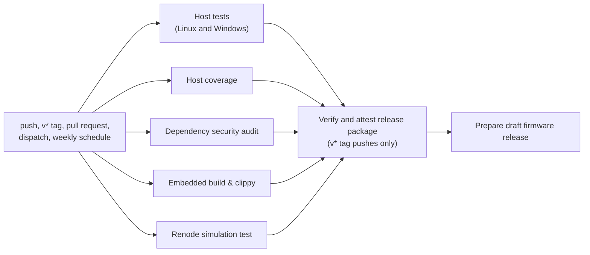

# Code Quality Guide

This guide defines the code-health rules for bt2usb. It covers the checks
that gate a change, the lint and formatting policy, every `unsafe` block in
the application, the panic and allocation rules, coverage, dependency hygiene,
binary size and memory budgets, and the review checklist. The
[testing guide](testing.md) covers how the tests themselves are organized,
the [development guide](development.md) covers the commands, and
[ADR 0004](adr/0004-layered-verification.md) and
[ADR 0013](adr/0013-pinned-toolchain-and-mask-tasks.md) record the
decisions behind layered verification and the pinned toolchain.

Three kinds of rule appear below, and the guide says which kind each one is:

- **Enforced**: a CI job or the build fails when the rule is broken.
- **Review rule**: a reviewer checks it; no tool does.
- **Gap**: the rule is wanted but not in place. Gaps are listed under
  [Known Gaps](#known-gaps), with the [TODO.md](../TODO.md) item that tracks
  each one.

Facts in this guide were read from the repository at commit `7fc99d6`, and
the passages on modules changed since then were updated with the 2026-10-09
reconnect, lock-key, connection-parameter, and reserved-byte fixes. Counts say
how they were taken. The builds, Clippy, tests, and audit were not re-run for
this guide.
The last recorded local run of the Rust checks is the
[2026-10-09 validation record](testing.md#validation-record--2026-10-09); the
last one that also ran Renode, the dependency audit, and actionlint is the
[2026-09-28 validation record](testing.md#validation-record--2026-09-28). No
figure in this guide was measured on a board.

## Quality Gates

[ci.yml](../.github/workflows/ci.yml) runs on pushes to `main` or `master`,
pushes of `v*` tags, pull requests, manual dispatch, and every Monday at 07:23
UTC (`cron: "23 7 * * 1"`). `mask ci` runs the local subset. A step fails its
job when its command exits non-zero, and `-D warnings` turns every compiler or
Clippy warning into an error.

| Gate | Command | Local | CI job | Failure effect |
| --- | --- | --- | --- | --- |
| Formatting | `cargo fmt --package bt2usb -- --check` | `mask ci`, `mask fmt-check` (`cargo fmt -- --check`, the same files) | Host tests, Linux and Windows | Fails the job |
| Host Clippy | `cargo clippy --locked --lib --tests -- -D warnings` | `mask ci` | Host tests, Linux and Windows | Fails on any warning |
| Embedded Clippy | `cargo clippy --locked --features embedded --target thumbv7em-none-eabihf -- -D warnings` | `mask ci`, `mask clippy` | Embedded build & clippy | Fails on any warning |
| Embedded Clippy, sensitive-logging opt-in | The same command with `--features embedded,log-sensitive-data` | `mask ci`, `mask clippy` | Embedded build & clippy | Fails on any warning; keeps the vendored opt-in branches compiling ([dependency logs](security.md#dependency-logs)) |
| Simulation Clippy | `cargo clippy --locked --features sim --target thumbv7em-none-eabihf -- -D warnings` | `mask ci` | Renode simulation test | Fails on any warning |
| Host rustdoc | `cargo doc --locked --no-deps --document-private-items --lib` with `RUSTDOCFLAGS=-D warnings` | `mask ci`, `mask rustdoc-check` | Host tests, Linux and Windows | Fails on any rustdoc warning |
| Firmware rustdoc | The same flags with `--features embedded --target thumbv7em-none-eabihf`, once for `--lib` and once for `--bin bt2usb --bin bt2usb-selftest` | `mask ci`, `mask rustdoc-check` | Embedded build & clippy | Fails on any rustdoc warning |
| Simulation rustdoc | The same flags with `--features sim --target thumbv7em-none-eabihf --bin bt2usb-sim` | `mask ci`, `mask rustdoc-check` | Renode simulation test | Fails on any rustdoc warning |
| Coverage floor | `cargo llvm-cov --locked --lib --tests --no-report`, then `cargo llvm-cov report --summary-only --fail-under-lines "$COVERAGE_MIN_LINES"` (97), cargo-llvm-cov 0.9.1 | `cargo llvm-cov --locked --lib --tests --summary-only --fail-under-lines 97` | Host coverage | Fails when host line coverage drops below the floor; the report uploads first ([Coverage In CI](#coverage-in-ci)) |
| Host tests | `cargo test --locked --lib --tests` | `mask ci`, `mask test` | Host tests, Linux and Windows | Fails on any failed test |
| Release firmware build | `cargo build --locked --features embedded --target thumbv7em-none-eabihf --release` | `mask ci`, `mask build-release` | Embedded build & clippy | Fails the job; builds `bt2usb` and `bt2usb-selftest` |
| Simulation build | `cargo build --locked --features sim --target thumbv7em-none-eabihf` | `mask ci`, `mask sim-build` | Renode simulation test | Fails the job |
| Renode scenario | `renode-test --results-dir "$RUNNER_TEMP/renode-results" renode/bt2usb-sim.robot` | `mask sim-test` (needs `renode-test` on PATH; `mask sim-setup` installs it on Linux or WSL) | Renode simulation test | Fails the job; results upload even on failure |
| Dependency audit | `cargo audit`, cargo-audit 0.22.2, with [.cargo/audit.toml](../.cargo/audit.toml) | None; install it as in [development](development.md#toolchain) | Dependency security audit | Fails on a vulnerability advisory or an unmaintained, unsound, or yanked crate, except the two advisories ignored by ID ([auditing](#auditing)) |
| Workflow lint | `actionlint`, 1.7.12, with ShellCheck 0.11.0 on `PATH` for the `run:` scripts; both SHA-256 checked before use | `actionlint` | Host tests, Linux only | Fails the Linux job |
| Python lint and formatting | `ruff check` and `ruff format --check` over every tracked `*.py` file, Ruff 0.16.9, settings in `ruff.toml`, run by `python scripts/lint_scripts.py` ([Python And Shell Checks](#python-and-shell-checks)) | `mask lint-scripts` | Host tests, Linux only | Fails the Linux job and lists each finding |
| Shell lint | `shellcheck` 0.11.0 over every tracked `*.sh` file and every Bash recipe in `maskfile.md`, run by the same script | `mask lint-scripts` | Host tests, Linux only | Fails the Linux job; a recipe finding names its `maskfile.md` line and recipe |
| Script linter tests | `python -m unittest discover -s scripts -p "lint_scripts_test.py" -v` | `mask lint-scripts` | Host tests, Linux only | Fails the Linux job; 7 tests (`grep -c 'def test' scripts/lint_scripts_test.py`) |
| File length | `find src tests build.rs scripts \( -name '*.rs' -o -name '*.py' \) -exec wc -l {} +`, failing above 500 lines ([File Length](#file-length)) | Run the same command | Host tests, Linux only | Fails the Linux job and lists each file over the limit |
| Documentation checks | `python scripts/check_docs.py` ([Markdown Checks](#markdown-checks)) | `mask ci`, `mask docs-check` | Host tests, Linux only | Fails the Linux job and lists each finding as file, line, and the value or name the repository has instead |
| Documentation checker tests | `python -m unittest discover -s scripts -p "check_docs_test.py" -v` | `mask docs-check` | Host tests, Linux only | Fails the Linux job; 27 tests (`grep -c 'def test' scripts/check_docs_test.py`) |
| Module comments | `find src tests build.rs -name '*.rs' -exec grep -L '^//!' {} +`, failing when it lists a file ([Documentation Comments](#documentation-comments)) | Run the same command | Host tests, Linux only | Fails the Linux job and lists each file without a `//!` line |
| Release helper tests | `python -m unittest discover -s scripts -p "release_test.py" -v` | None | Host tests, Linux and Windows | Fails the job; 17 tests (`grep -c 'def test' scripts/release_test.py`) |
| Tag matches version | `python scripts/release.py validate-tag --tag "$RELEASE_TAG"` | None | Host tests and the packaging job, `v*` tags only | Fails the tag run |
| Release staging | `python scripts/release.py stage …` | None | Embedded build & clippy | Refuses a modified tracked source tree, an existing output directory, an empty firmware file, or a commit that differs from `GITHUB_SHA` |
| Release notes | `python scripts/release.py notes …` ([release notes](deployment.md#release-notes)) | None | Verify and attest release package, `v*` tags only | Fails the tag run on a checksum entry that does not match its file, build metadata without the release's identity, a template field it cannot fill, or a SoftDevice version that `maskfile.md` and `memory_sd.x` disagree on |

### How The Jobs Depend On Each Other

The five check jobs run in parallel. The packaging and draft-release jobs run
only for pushed `v*` tags, and only after all five check jobs pass:



A failed check job therefore blocks a release package. Whether it also blocks
merging a pull request depends on the branch protection settings on GitHub,
which are not stored in the repository; this guide cannot confirm them. The
weekly schedule runs the five check jobs against the default branch, so a new
advisory or a change in the hosted runner shows up without a code change.

A newer run for the same ref cancels an in-progress one, except for tag refs.
The [deployment guide](deployment.md#artifact-flow) explains how the release
jobs reuse the embedded job's bytes instead of rebuilding.

### Local Checks Before A Pull Request

`mask ci` covers formatting, the four Clippy configurations, host tests,
rustdoc for every build with warnings denied, the Markdown checks, and both
firmware builds. It does not run the coverage floor, actionlint, the Python
and shell linters, the release-helper, documentation-checker, or script-linter
tests, the audit, or Renode, and it has no equivalent of the Windows host job,
the tag check, or release staging. Run the ones your change can affect:

| Change touches | Also run |
| --- | --- |
| `///` or `//!` comments only | `mask rustdoc-check`, which runs the four rustdoc builds without the rest of `mask ci` |
| Markdown only, `src/config.rs`, `memory_sd.x`, `memory_sim.x`, `maskfile.md`, or a renamed file | `mask docs-check` |
| Pure logic in `src/lib.rs` modules, or their tests | `cargo llvm-cov --locked --lib --tests --summary-only --fail-under-lines 97` |
| `.github/workflows/ci.yml` | `actionlint`, with `shellcheck` on `PATH` so it checks the `run:` scripts |
| A Python file, a `*.sh` script, a `maskfile.md` recipe, or `ruff.toml` | `mask lint-scripts` |
| `scripts/release.py` or the release jobs | `python -m unittest discover -s scripts -p "release_test.py" -v` |
| `Cargo.toml` or `Cargo.lock` | `cargo audit` |
| UI, buttons, coordinator, management, BLE messages, the pure `storage` modules, `sim.rs`, `sim_ble.rs`, `memory_sim.x`, or `renode/` | `mask sim-test` |

The [testing guide](testing.md#local-and-ci-coverage-compared) has the full
comparison, and the [development guide](development.md#checks-by-change)
lists the checks per kind of change.

## Lint And Formatting Policy

### Formatting

**Enforced.** Rust code uses rustfmt's default style for edition 2021. There
is no `rustfmt.toml`, so every contributor's rustfmt produces the same result
for the pinned toolchain (`channel = "1.95.0"` in
[rust-toolchain.toml](../rust-toolchain.toml), which installs the `rustfmt`
component).

`cargo fmt` formats the bt2usb package only. `cargo fmt -v -- --check` lists
its roots as `build.rs`, `src/lib.rs`, `src/main.rs`, `src/selftest.rs`,
`src/sim.rs`, and `tests/integration.rs`; rustfmt follows each root's module
tree, including the `#[path]` modules in `lib.rs`.

The vendored crate under `vendor/nrf-softdevice` is excluded. It is a path
dependency, not a workspace member (`cargo metadata --no-deps` lists only
bt2usb), so neither `cargo fmt` nor `cargo fmt --all` reaches it. Its files do
not follow rustfmt's default style, and keeping them byte-for-byte close to
upstream keeps the [vendor notes](../vendor/nrf-softdevice/README.bt2usb.md)
reviewable. An editor that formats on save will still rewrite them; the
[development guide](development.md#rustfmt-changes-vendored-files) explains
how to spot and discard that.

### File Length

**Enforced for Rust and Python sources.** No `.rs` file under `src/`,
`tests/`, or `build.rs`, and no `.rs` or `.py` file under `scripts/`, may
exceed 500 lines, counted with `wc -l` (blank and comment lines included). The
host-tests job runs the check on Linux and lists each file over the limit. Split a file that grows past it along a responsibility, not at an
arbitrary line: tests go to a sibling `*_tests.rs` file included with
`#[cfg(test)] #[path = "..."] mod tests;` (as `ui_logic_tests.rs`,
`reconnect_tests.rs`, and `coordinator_tests.rs` are), and a shell module
splits by task or handler (as `multi_conn.rs` gave up `slot_worker.rs` and
`bonder.rs`, and `hid_device.rs` gave up `host_requests.rs`, on 2026-10-10).
The device-store tests split the same way when the store moved into host
code: `devices_tests.rs` holds the list rules and `devices_format_tests.rs`,
a child module of it that shares its helpers, the codec and load tests.
A Python helper splits the same way: on 2026-10-10 the documentation checker
(775 lines once formatted) became a thin `scripts/check_docs.py` driver and one
module per check in `scripts/docs_checks/`. Markdown guides, `maskfile.md`, the
shell scripts, the Renode C# models (up to 700 lines each), and the vendored
crate are not checked. On 2026-10-10, after
the device-store move cut `storage.rs` from 488 lines to 350, the largest Rust
files were `hid_descriptor_tests.rs` (486) and `coordinator_tests.rs` (465),
and the largest Python file was `scripts/check_docs_test.py` (436).

### Clippy

**Enforced.** Clippy runs with its default lint groups and `-D warnings`,
plus nine restriction lints that the `[lints.clippy]` table in `Cargo.toml`
turns on for every target. `undocumented_unsafe_blocks` fails an `unsafe`
block without a `// SAFETY:` comment, and the host library also carries
`#![forbid(unsafe_code)]` in [lib.rs](../src/lib.rs). The other eight reject
constructs that can panic, such as unchecked indexing and `unwrap`, outside
tests ([panic lints](#panic-lints)); [clippy.toml](../clippy.toml) only allows
four of them in test code. No pedantic or nursery lint is enabled.

Clippy runs in four configurations because `cfg` gating means each one sees
different code:

| Configuration | Targets checked | Code only this configuration sees |
| --- | --- | --- |
| Host (`--lib --tests`) | Library and its unit tests; `tests/integration.rs` and `tests/oled_font.rs` | `#[cfg(test)]` modules and test files |
| Embedded (`--features embedded`) | Library; `bt2usb`; `bt2usb-selftest` | `main.rs`, `selftest.rs`, SoftDevice setup, USB, storage, power, stack, and the scanner, connection-worker, security-handler, and GATT HID client modules |
| Simulation (`--features sim`) | Library; `bt2usb-sim` | `src/sim.rs`, `src/sim_ble.rs`, and their UART output path |
| Embedded with the opt-in (`--features embedded,log-sensitive-data`) | Library; `bt2usb`; `bt2usb-selftest` | No bt2usb code. It compiles the opt-in branches of three log lines in the vendored `nrf-softdevice` ([dependency logs](security.md#dependency-logs)); Clippy does not lint that crate, which is a path dependency rather than a workspace member |

The display driver and button tasks in `src/ui/` are compiled by both the
embedded and the simulation configurations (`sim.rs` declares `mod ui`), but
not by the host one.

A binary whose `required-features` are not enabled is skipped, which is why
each configuration lists different binaries. Every configuration also lints
`build.rs`, the package's build script.

### Lint Allowances

**Review rule.** Five allowances exist in `src/`, counted with
`grep -rn 'allow(' src` over attribute lines:

| Location | Allowance | Reason |
| --- | --- | --- |
| [selftest.rs](../src/selftest.rs) (crate level) | `dead_code, unused_imports` | The self-test reuses firmware modules without using all of their items or re-exports (comment in the file) |
| [sim.rs](../src/sim.rs) (crate level) | `dead_code` | The simulation reuses shared modules, such as the self-test's display helpers, that it does not fully exercise (comment in the file) |
| [display.rs](../src/ui/display.rs) `init` | `dead_code` | Used only by the self-test (`ui::display::init` in `selftest.rs`) |
| [display.rs](../src/ui/display.rs) `draw_home` | `dead_code` | Used only by the self-test; no comment at the attribute |
| [hid_device.rs](../src/usb/hid_device.rs) `is_configured` | `dead_code` | Used only by the self-test (comment at the attribute) |

A `clippy::too_many_arguments` allowance on `multi_conn::manage_devices` was
removed on 2026-10-10, when the per-slot command senders became one array and
the function dropped to seven parameters; an `#[expect]` would have reported
the stale allowance by itself.

The bridge binary has no crate-level allowance, so an unused item in its
module tree fails embedded Clippy. The two crate-level allowances mean that
code reachable only from `selftest.rs` or `sim.rs` can go dead without a
warning.

Rules for a new allowance:

- Scope it to the item, not the module or crate.
- Say why on the same line or the line above.
- Prefer `#[expect(lint, reason = "…")]`, stable since Rust 1.81, so the
  attribute itself warns once the lint no longer fires. The existing five use
  `#[allow]`; the three panic-lint sites use `#[expect]` and are listed under
  [Panic Lints](#panic-lints).
- Never allow a lint to silence a correctness finding; fix the code.

### Documentation Comments

**Enforced for every build since 2026-10-10.** CI documents each build with
private items included and warnings denied, so a rustdoc warning anywhere,
such as a broken intra-doc link in a firmware-only module, fails a job. Every
run uses
`RUSTDOCFLAGS="-D warnings" cargo doc --locked --no-deps --document-private-items`
plus one of these:

| Build | Extra arguments | CI job |
| --- | --- | --- |
| Host library | `--lib` | Host tests, Linux and Windows |
| Embedded library | `--features embedded --target thumbv7em-none-eabihf --lib` | Embedded build & clippy |
| Bridge and self-test binaries | `--features embedded --target thumbv7em-none-eabihf --bin bt2usb --bin bt2usb-selftest` | Embedded build & clippy |
| Simulation binary | `--features sim --target thumbv7em-none-eabihf --bin bt2usb-sim` | Renode simulation test |

The library and the bridge binary are both named `bt2usb`, so they are
documented in separate runs; one run would write both to the same output
directory. `mask rustdoc-check` runs all four, and `mask ci` includes them.
`mask doc` still builds the embedded documentation with dependencies and
without denying warnings, for reading. `--no-deps` keeps the vendored
`nrf-softdevice` crates out of the check: their documentation is upstream's.

**Links across builds.** A module that more than one build compiles names a
firmware-only item in code formatting, not as an intra-doc link: the
coordinator, power policy, and `ble` module docs mention `ble::multi_conn` and
`power.rs` that way, because the host library and the `sim` build do not
contain them and the link would not resolve there.

**Review rule.** Every module starts with a `//!` comment that says what it
owns and what it must not depend on. Since 2026-10-10 the Linux host job fails
on any Rust file under `src/`, `tests/`, or `build.rs` that has no `//!` line
(`find src tests build.rs -name '*.rs' -exec grep -L '^//!' {} +`); whether the
comment says enough is still the reviewer's call. Public items in pure
modules carry `///` comments that state units, bounds, and error meanings.

### Other Files

| Files | Check | Kind |
| --- | --- | --- |
| Line endings | [.gitattributes](../.gitattributes) forces LF for shell scripts, `maskfile.md`, Renode files, Rust, TOML, linker scripts, Markdown, JSON, and YAML | Enforced by Git when files are committed and checked out |
| `.github/workflows/ci.yml` | actionlint 1.7.12 in the Linux host job, which passes each `run:` script to the pinned ShellCheck 0.11.0 | Enforced |
| Python: `scripts/release.py`, `scripts/check_docs.py` with `scripts/docs_checks/`, `scripts/lint_scripts.py`, and their tests | Ruff 0.16.9 lint and format check ([Python And Shell Checks](#python-and-shell-checks)); 12 release-helper, 27 documentation-checker, and 7 script-linter unit tests; no type checker | Enforced |
| `scripts/*.sh`, `.devcontainer/post-create.sh`, Bash recipes in `maskfile.md` | ShellCheck 0.11.0 ([Python And Shell Checks](#python-and-shell-checks)) | Enforced |
| Markdown: `docs/`, the root guides, `maskfile.md`, the issue templates, and the vendored patch README | `scripts/check_docs.py` in the Linux host job: links, the configuration table, inline constants, the memory map, and commands ([Markdown Checks](#markdown-checks)) | Enforced for what it covers; other figures are checked by hand |
| Renode `.robot`, `.resc`, `.repl`, `.cs` | Exercised by the Renode job, which compiles the C# models when it loads them; not linted | Partial |

### Markdown Checks

[scripts/check_docs.py](../scripts/check_docs.py) checks every tracked
Markdown file against the repository it describes, using the standard library
only. It skips `vendor/` except `vendor/nrf-softdevice/README.bt2usb.md`, and
prints each finding as `path:line: [check] message`, where the message gives
both what the document says and what the repository has.

| Check | What fails it |
| --- | --- |
| `links` | A relative link whose file does not exist or that leaves the repository, and a `#fragment` that matches no heading or `<a id>` in the target Markdown file. Anchors follow GitHub's rules: lower case, punctuation dropped, spaces to hyphens, and `-1`, `-2` for repeated headings. External links are not fetched |
| `config` | A `pub const` in [config.rs](../src/config.rs) missing from the [Configuration Defaults](hardware.md#configuration-defaults) table, a table name that is not a constant, a table value that differs from the evaluated constant (derived values such as `STORAGE_FLASH_END` included), and an inline mention of the form ``` `NAME` (8 s) ``` or ``` 4 seconds (`NAME`) ``` whose number disagrees. Inline values in seconds or milliseconds are converted with the constant's unit: `_SECS`, `_MS`, 10 ms for the supervision timeouts, 1.25 ms for connection intervals and event length, and 0.625 ms for the scan interval and window |
| `memory` | A memory-map table row (Application flash, Pairing/bond storage, Application RAM, and the other region labels in [hardware](hardware.md#memory-layout) and [ADR 0010](adr/0010-static-memory-layout.md)) whose range or KiB size differs from `memory_sd.x`, `memory_sim.x`, and the storage constants; a code-formatted address range that starts at a region's first address but ends elsewhere; and "pages N–M" near the words pairing, bond, or storage that differ from `STORAGE_FLASH_PAGE_START`/`COUNT` |
| `commands` | `mask <name>` in code with no such recipe, `--bin` or `--features` names that `Cargo.toml` does not define, and a code-formatted path (with a directory, or a `.rs` file name) that matches no tracked file |

Two kinds of text are exempt from the `config`, `memory`, and `commands`
checks, because they quote the tree as it was: everything under a heading that
starts with "Validation Record", and a line ending in
`<!-- check-docs: ignore -->`. A proposed ADR is exempt from the path check,
since it names files it would add. File names that may appear although no
tracked file has them, such as a removed module that an ADR's history
discusses, are listed in `KNOWN_ABSENT` in the script with the reason for each.

What it does not check: values written without the constant's name ("a 7.5 ms
interval"), test and file counts, firmware sizes, coverage figures, and the
content of external links. Those remain the reviewer's job, as the
[review checklist](#review-checklist) says.

### Python And Shell Checks

[scripts/lint_scripts.py](../scripts/lint_scripts.py) runs every script
linter in one pass, in the Linux host job and as `mask lint-scripts`. It needs
`ruff` and `shellcheck` on `PATH`, exits 2 when either is missing, and exits 1
after running every check when any of them reports a finding.

| Check | Files | Settings |
| --- | --- | --- |
| `ruff check` | Every tracked `*.py` file | [ruff.toml](../ruff.toml): Python 3.11 target (the helpers use `tomllib`), 100-character lines, and Ruff's default rule set, which includes pyflakes, the pycodestyle errors, import sorting, bugbear, pyupgrade, and the simplify and Ruff-specific rules. The en dash is allowed in strings, because the documentation checker matches ranges written with it |
| `ruff format --check` | The same files | Ruff's formatter at the same line length; `ruff format scripts/` applies it |
| `shellcheck` | Every tracked `*.sh` file: `scripts/install-renode.sh`, `scripts/run-tool.sh`, `.devcontainer/post-create.sh` | ShellCheck's defaults, every severity down to style; each script's shebang selects the shell |
| `shellcheck` on recipes | Every recipe in [maskfile.md](../maskfile.md) whose code block is `bash` or `sh` (all 34) | The recipe is checked as its own script under that shell |

Mask runs the first code block under each heading as the recipe and passes its
options and positional arguments as environment variables, with dashes turned
into underscores. The linter writes each recipe to ShellCheck padded with
blank lines, so a finding's line number is its line in `maskfile.md`, and
assigns those variables on the first line, so `${release}` in a recipe with a
`release` option is not reported as unassigned. A finding reads
`maskfile.md:399:26: note: … [SC2086] (recipe rustdoc-check)`.

Since actionlint runs after the linters are installed, the same ShellCheck
also checks the workflow's `run:` scripts. Before 2026-10-10 that relied on
whichever ShellCheck the runner image shipped.

Fix a finding rather than silence it. When a rule is wrong for one line, use
an inline `# noqa: <code>` or `# shellcheck disable=<code>` with the reason on
the same line; a repository-wide exception belongs in `ruff.toml` with a
comment, like the en-dash allowance. On 2026-10-10 the first run reported 19
Ruff findings (unsorted imports, an unused `sys` import in `release.py`,
`re.M` and `re.S` aliases, implicit string concatenation inside lists, and
shebang scripts without the executable bit), unformatted Python in all four
helper files, and six ShellCheck notes in `maskfile.md`, where
`mask rustdoc-check` and `mask ci` built the rustdoc command in word-split
strings. All were fixed: the rustdoc commands are Bash arrays, and the shebang
scripts are executable.

## Unsafe Code Policy

### Inventory

The application has six `unsafe` blocks in five files. They were counted with
`grep -rnw unsafe src build.rs tests`, which matches only these six lines;
`build.rs`, `tests/`, and the Python and shell scripts contain no `unsafe`.
There are no `unsafe fn`, `unsafe impl`, `static mut`, `transmute`,
`MaybeUninit`, `#[no_mangle]`, `#[link_section]`, or inline `asm!` in `src/`
(`grep -rn` for each returns nothing).

| # | Location | Operation | Purpose | Invariant the code relies on | `SAFETY` comment | Compiled into |
| --- | --- | --- | --- | --- | --- | --- |
| 1 | [stack.rs](../src/stack.rs) `high_water` | `core::ptr::read_volatile` of a `u32` | Find the first overwritten word of the painted stack | Each address is word-aligned and lies between the linker symbols `_stack_end` and `_stack_start`, which is RAM owned by the program; the read is volatile so the compiler cannot assume the contents | Yes | Bridge, self-test |
| 2 | [scanner.rs](../src/ble/scanner.rs) `scan` closure | `core::slice::from_raw_parts(params.data.p_data, params.data.len as usize)` | View advertisement bytes from a SoftDevice scan report | `p_data` and `len` describe the report inside the scan buffer, and the slice does not outlive the callback | Yes | Bridge |
| 3 | [bonder.rs](../src/ble/bonder.rs) `bonder`, first branch | `&*ptr` | Return the shared `&'static Bonder` | The pointer came from `StaticCell::try_init`, so it is non-null, aligned, initialized, and lives forever; after initialization the `Bonder` is only reached through shared references | Yes | Bridge |
| 4 | [bonder.rs](../src/ble/bonder.rs) `bonder`, spin fallback | `&*ptr` | Same as 3, after waiting for another caller's initialization | Same as 3 | Yes ("as above") | Bridge |
| 5 | [sd_setup.rs](../src/sd_setup.rs) `enable_usb_power_events` | `sd_power_usbdetected_enable`, `sd_power_usbremoved_enable`, `sd_power_usbpwrrdy_enable`, `sd_power_usbregstatus_get` | Turn on the SoftDevice's USB power events and read the USB regulator state | The SoftDevice is enabled before the call (the function's doc comment says it must run after `Softdevice::enable`); `status` is a valid local the SVC writes | Yes | Bridge, self-test |
| 6 | [selftest.rs](../src/selftest.rs) `check_ble_scan` closure | `core::slice::from_raw_parts(params.data.p_data, params.data.len as usize)` | Same as 2, in the self-test's scan stage | Same as 2 | Yes | Self-test |

The host library contains none of these blocks: `stack.rs`, `sd_setup.rs`,
`scanner.rs`, and `bonder.rs` are not compiled into it, and neither is
`selftest.rs`. The simulation binary contains none either, because
`src/ble/mod.rs` compiles `scanner` and `bonder` only with the `embedded`
feature and `sim.rs` does not declare `stack` or `sd_setup`.

### Notes On Each Block

- **Blocks 2 and 6.** The vendored `central::scan` gives the SoftDevice one
  static 256-byte buffer, calls the closure with the report, and restarts the
  scan with the same buffer when the closure returns `None`
  ([central.rs](../vendor/nrf-softdevice/src/ble/central.rs)). The bytes are
  valid only during the call. `from_raw_parts` returns a slice with an
  unbounded lifetime, so the compiler would not stop a closure from keeping it;
  a reviewer must check that the closure copies what it needs. Both closures
  pass the slice to functions that parse it and return owned values.
  `from_raw_parts` also requires a non-null pointer even when `len` is 0; the
  code relies on the SoftDevice always pointing `p_data` into the buffer that
  `central::scan` supplied. Both comments state the pointer and length
  guarantee; block 2's also says the bytes are copied before the callback
  returns.
- **Blocks 3 and 4.** `Bonder` holds a `RefCell`, so it is `!Sync` and cannot
  be a plain `static`. The function's doc comment explains why a
  `StaticCell` plus an `AtomicPtr` cache is used and why the spin fallback
  cannot be reached on the single-threaded cooperative executor. Sharing a
  `!Sync` value as `&'static` is sound only while every access happens on that
  one executor in thread mode; a change that touches the `Bonder` from an
  interrupt handler would break the invariant.
- **Block 5.** The block wraps the whole function body, including the
  comparisons, the warning log, and the early returns, rather than only the
  four SVC calls. Narrow it if the function changes.
- **Block 1.** `_stack_end` and `_stack_start` are declared in an
  `extern "C"` block; taking their addresses with `core::ptr::addr_of!` needs
  no `unsafe` on the pinned toolchain, and their values are never read.

### Vendored Unsafe

The vendored `nrf-softdevice` crate wraps the SoftDevice C API, so it uses
`unsafe` throughout: `grep -rw unsafe vendor/nrf-softdevice/src` matches 162
lines in 22 files, 18 of them in `src/ble/gatt_client.rs`, the file the local
patch changes most. One of the 162 is the patch's own
`on_gatts_evt_without_server` in `src/ble/mod.rs` (2026-10-10), an `unsafe fn`
like the crate's other event handlers. The patch's changes are recorded in the
[vendor notes](../vendor/nrf-softdevice/README.bt2usb.md) and
[ADR 0007](adr/0007-vendored-softdevice-patch.md). Review every change to the
vendored sources with the same rules as application `unsafe`.

### Review Rule

**Partly enforced.** Clippy's `undocumented_unsafe_blocks` lint, set in the
`[lints.clippy]` table of `Cargo.toml`, fails every Clippy run in CI and
`mask ci` when an `unsafe` block has no `// SAFETY:` comment, and
`#![forbid(unsafe_code)]` in [lib.rs](../src/lib.rs) rejects `unsafe` in any
module the host library compiles (rule 2). Whether the comment is correct,
and the rest of the rules below, stay with the reviewer.

1. Use `unsafe` only where no safe API does the job. Prefer `StaticCell`,
   Embassy channels and signals, and the safe wrappers in `nrf-softdevice`.
2. Keep pure, host-compiled modules free of `unsafe`; `#![forbid(unsafe_code)]`
   in `lib.rs` enforces this for every module the host library compiles.
3. Put a `// SAFETY:` comment directly above the block. Name each
   precondition of the operation (non-null, alignment, initialization,
   lifetime, aliasing, and which execution context may touch the data) and
   say why it holds at this call site.
4. Keep the block as small as the operation. Do not wrap logging, control
   flow, or safe calls.
5. Never let a borrow created from a raw pointer outlive the memory it points
   at, and never store such a slice.
6. Add the block to the inventory above and to the list in
   [security](security.md#unsafe-code) in the same change.
7. Reviewers re-derive the invariant from the code, not from the comment, and
   check that a test, the self-test, or a hardware step exercises the path.

## Panics, Allocation, And Arithmetic

**No heap.** bt2usb defines no global allocator and does not use the `alloc`
crate: `grep -rn` over `src/` for `global_allocator`, `extern crate alloc`,
`alloc::`, and `Box` returns nothing. Every buffer is a fixed-capacity
`heapless` type, a fixed array, or a static created with `StaticCell`. A full
buffer is a case the code must handle, not a crash. See
[ADR 0010](adr/0010-static-memory-layout.md).

**Panics stop the device.** All three binaries link `panic-probe`, which
prints the panic over RTT and stops the core; nothing resets the chip
afterwards ([architecture](architecture.md#what-is-fatal)). Since 2026-10-10
([ADR 0025](adr/0025-panic-lints-and-inventory.md)) Clippy rejects the
panic-prone constructs it can see, and the two lists below cover the rest: the
application's in [Panic Paths No Lint Flags](#panic-paths-no-lint-flags) and
the vendored crate's in [Vendored nrf-softdevice](#vendored-nrf-softdevice).

**Review rule.** Data from a BLE peer, the USB host, or flash must never reach
a panic. Validate lengths and bounds first and return an error or drop the
input; the [security guide](security.md#input-validation-boundaries) lists
the boundaries. A panic is acceptable only for a programming error that is
caught at compile time or at every boot, and its message says what was
violated.

### Panic Lints

**Enforced.** `[lints.clippy]` in [Cargo.toml](../Cargo.toml) sets eight
restriction lints to `warn` for every target, and each
[Clippy configuration](#clippy) denies warnings:

| Lint | What it rejects |
| --- | --- |
| `indexing_slicing` | `a[i]` and `a[i..j]` that may be out of bounds. A constant index into a fixed-size array that Clippy can see is in bounds passes |
| `string_slice` | `&s[i..j]` on a `str`, which panics off a character boundary |
| `unwrap_used`, `expect_used` | `.unwrap()` and `.expect()` on an `Option` or a `Result` |
| `panic`, `unreachable`, `todo`, `unimplemented` | The four `core` macros |

[clippy.toml](../clippy.toml) allows `unwrap_used`, `expect_used`,
`indexing_slicing`, and `panic` in `#[test]` functions and `#[cfg(test)]`
modules, where a panic is a failed test. `tests/oled_font.rs` and `build.rs`
allow the lints they use at crate level, with a reason: a panic there fails a
test or stops a build, never the device.

When the lints were turned on they flagged 112 sites outside tests in 20
files: 80 indexes, 29 slices, 2 `unreachable!`, and 1 `expect`. Each had a
bound check somewhere before it, so none was a live defect, but the check and
the access were separate. 109 were rewritten with the same behavior and no
panic path:

- `get` and `get_mut`, returning the function's existing `None` or error: a
  Report Map item whose data runs past the end (`HidDescriptor::parse`), a
  flash record shorter than its declared length (`record.rs`), a GATT read
  longer than its buffer (`hid_client.rs`);
- `first_chunk`, `split_first_chunk_mut`, and `split_at_checked` for fixed
  layouts: the keyboard, mouse, and consumer decoders and the record codec;
- slice patterns, such as `let &[byte] = data else { … }` for the host's LED
  report in `set_report`;
- iterators instead of index loops, such as `ad_structures`, which walks the
  advertising data and stops at a zero-length or overrunning structure;
- types that carry the bound: `encode_address` and `encode_bond` return
  fixed-size arrays, and `ble_slot_task` takes its command channel instead of
  an index into the array of channels;
- matching instead of `unreachable!()`: `hid_writer_task` returns the
  never-type result of its `join4`, and `handle_slot_event` returns on
  `SlotEvent::Quiesced` inside its own match.

Three sites keep the construct under `#[expect(lint, reason = "…")]`. Each
bound is a constant or a type, so a rewrite would only add a fallback that no
input can reach:

| Site | Lint | Bound stated in the reason |
| --- | --- | --- |
| `InputAggregator::keyboard` in [aggregate.rs](../src/hid/aggregate.rs) | `indexing_slicing` | `keys` is `[bool; 256]` and is indexed only by a `u8` keycode |
| The serial-number `write!` in `hid_device::init` ([hid_device.rs](../src/usb/hid_device.rs)) | `expect_used` | Two `{:08X}` words are exactly the 16 characters `serial` holds |
| `SimBle::scenario_step` in [sim_ble.rs](../src/sim_ble.rs), simulation only | `indexing_slicing` | The arm makes `index` 0 or 1, and `peripherals` is `[_; 2]` |

Rules for a new site:

- Data from a peer, the host, or flash takes a rewrite unless its type alone
  bounds the access, as a `u8` keycode indexing the 256-entry `keys` array
  does; a bound that rests on a length check never takes an `#[expect]`.
- Put the `#[expect]` on the narrowest item, the statement where Rust allows
  it, and state the bound in `reason`.
- Use `#[expect]`, not `#[allow]`: when a later change removes the construct,
  the stale attribute fails the build.

### Panic Paths No Lint Flags

**Review rule.** Some constructs panic without any enabled lint flagging them:
defmt's `unwrap!` and `assert!`, `RefCell` borrows, `StaticCell`
initialization, calls into dependencies that panic when their contract is
broken, and division by zero (overflow panics only in debug builds; see
[Arithmetic](#arithmetic)). This list was made on 2026-10-10 by reading every
non-test source file of the four crate roots and the dependency code each call
reaches, and a second reviewer, told to refute each entry, checked it. A change
that adds such a construct adds it here, and a change that breaks a reason
fixes the code.

Each entry has one of three classes:

- **Compile time:** the compiler evaluates it, so a violation fails the build.
- **Boot only:** it runs once per boot with constant inputs, so a violation
  stops every boot of a bad build, where the self-test, Renode, or the
  [first-flash checklist](first-flash.md) shows it, and never a good one.
- **Cannot fire:** an invariant in the code rules it out; the reason names it.

| Construct | Where | Class | Why it does not fire |
| --- | --- | --- | --- |
| `unwrap!` on task spawns | 9 in `main.rs`, 2 in `selftest.rs`, 4 in `sim.rs` | Boot only | Each task's pool fits its spawns: one per task, `pool_size = MAX_CONNECTIONS` for `ble_slot_task` (spawned once per slot), and `pool_size = 3` for the simulation's `button_task`. Every task returns `!`, so no pool slot is freed and no task is spawned twice |
| `StaticCell::init` and `init_with` | 10 in `hid_device::init`; `keyboard_handler` and `mouse_handler` in `host_requests.rs`; `TX_BUF` in `display::new_twim` | Boot only | `hid_device::init` runs once in the bridge and once in the self-test, and it is the only caller of the two handlers; `new_twim` runs once in each binary. `bonder()` uses `try_init` and caches the result, so it cannot panic |
| One-time peripheral setup | `embassy_nrf::init` (all three binaries), `Softdevice::enable` (bridge and self-test), `Flash::take` (`ble_task` and the self-test's `check_flash`), `Uarte::new` (simulation), `Twim::new` (`new_twim`) | Boot only | Each runs once per boot with a constant configuration. `Softdevice::enable` panics when `memory_sd.x` reserves too little RAM, which the self-test's first stage checks |
| embassy-usb builder checks | `hid_device::init` | Boot only | `max_power` is 100 mA (limit 500), endpoint 0 takes 64-byte packets, four handlers fill the four that `MAX_HANDLER_COUNT` allows (a comment at `builder.handler` says so), three interfaces use three of four, the configuration descriptor uses about 108 of its 256 bytes, and three of seven IN endpoints are taken |
| Compile-time assertions | `LINKS` and the event-size check in `sd_setup.rs`; the record-size check in `storage/devices.rs`; `MapConfig::new` in `const` blocks in `storage.rs` and `selftest.rs` | Compile time | A violation is a build error. `MapConfig::new` is a `const fn` that panics on a misaligned or empty flash range |
| `RefCell` borrows | `Bonder` (seven); the report coalescer in `run_notification_loop` (two); the reconnect table in `scanner.rs` (two); `EndpointMailbox` in `hid_device.rs` (six) | Cannot fire | Everything runs on the one thread-mode executor. No borrow is held across an `.await`, and nothing inside a borrow re-enters the same cell or dispatches SoftDevice events (a SoftDevice call never delivers an event synchronously). The scanner and mailbox borrows also sit inside a blocking-mutex closure |
| heapless capacity | `Vec::remove` in `DeviceList::without`, `DeviceList::add`, and `Bonder::on_bonded`; `collect()` into a fixed `Vec` in `DeviceStore::bonds`, `ble_task`, `handle_slot_event` (two), `publish_paired_devices`, and `SimBle::command` | Cannot fire | Each `remove` takes an index found by `position` on the same `Vec`, or index 0 of a full one. Each `collect` reads a source no longer than its target: `take(MAX_CONNECTIONS)` or `take(MAX_PAIRED_DEVICES)`, a `Vec` of capacity 1 collected into one of capacity 2, or a device list whose capacity is the target's |
| `copy_from_slice` | `decode_address`, `encode_bond`, `decode_bond`, and `write_device` in `codec.rs`; the simulation's `Flash::save` in `sim_ble.rs` | Cannot fire | Both sides have the same length by construction: fixed ranges of fixed-size arrays, or parts split off to exactly the length copied |
| Division by a runtime value | `max_latency_for` in `conn_params.rs`, while bounding a peer's connection parameter request | Cannot fire | It divides by the granted maximum interval, which `bound_request` keeps at or above the configured minimum interval, and it also returns early when that interval is 0, and when its timeout argument (the configured maximum supervision timeout) is 0, so `4 * timeout - 1` cannot underflow either. Every other `/` and `%` has a constant divisor |
| embassy-time arithmetic | `Instant` plus `Duration`, including the one inside every `Timer::after`, `Ticker`, and `with_timeout`; `Duration::from_secs` and `from_millis`; and `Instant::elapsed`. In `scanner.rs`, `slot_worker.rs`, `buttons.rs`, `power.rs`, `display.rs`, the flash retry in `storage.rs`, the USB retry clock, the main loop's `Ticker`, the simulation loop, and the self-test | Cannot fire | The operands are small constants or capped values (delivery retries wait at most 1 s, display recovery at most 30 s). `elapsed` subtracts an earlier `Instant::now()` on a monotonic clock, and the 64-bit tick counter would take millions of years to overflow |
| embassy-usb control handling | `UsbDevice::run_until_suspend`, `wait_resume`, and `remote_wakeup` in `run_usb_device`, which answer host requests; `HidWriter::write` in `UsbReportSink::write` | Cannot fire | The host chooses only a string index, and the longest string descriptor (42 bytes) fits the 128-byte control buffer. Out-of-range interfaces and OUT stages longer than the buffer are rejected. Reports are at most 8 bytes, the size each writer holds |
| TWIM and SSD1306 drivers | `Twim::transaction` through `StopSafeI2c`; the ssd1306 flush | Cannot fire | The display sends single, non-empty writes and never reads. The TWIM raises its error event only together with an `ERRORSRC` bit, a rule the Renode model `renode/nrf52840_twim.cs` follows too. The panel driver drops pixels outside 128 by 64 |
| Flash futures | `MapStorage::fetch_item` and `store_item` in `storage.rs`, the Factory reset `erase`, and `check_flash` | Cannot fire | The vendored `Flash::write` and `Flash::erase` arm a `DropBomb` that panics when the future is dropped before the SoftDevice reports completion. Every flash future is awaited directly; never put one in `select` or `with_timeout` |

### Vendored nrf-softdevice

Clippy does not lint the vendored crate, a path dependency outside the
workspace. This list covers the modules bt2usb's features compile (`ble-central`,
`ble-gatt-client`, `ble-sec`, `critical-section-impl`, `defmt`, `s140`,
`nrf52840`, and `evt-max-size-256`, plus the default `macros`): `fmt`, `util`,
`critical_section_impl`, `events`, `flash`, `raw_error`, `softdevice`,
`temperature`, `random`, and `ble/{mod, central, common, connection, gap,
gatt_client, gatt_traits, replies, security, types}`.
`advertisement_builder.rs`, `peripheral.rs`, `gatt_server.rs` with
`gatt_server/`, and `l2cap.rs` are not compiled.
With `defmt` on, the crate's `unwrap!`, `assert!`, `panic!`, and
`unreachable!` are defmt's, and its `debug_assert!` runs only in debug builds.

Four panics a peer could reach were removed on 2026-10-10, amending the patch
of [ADR 0007](adr/0007-vendored-softdevice-patch.md). Each change is marked
`bt2usb patch:` in the source, except the feature, which is in bt2usb's
`Cargo.toml`:

| Panic | Where | How a peer reached it | Now |
| --- | --- | --- | --- |
| `BLE_EVT_MAX_SIZE is too low, use larger evt-max-size feature` | `events::run_ble` | At ATT MTU 64, a primary-service discovery response with 15 handle ranges is a 132-byte event, over the default 128-byte buffer. The chip halts, and after a power cycle a bonded device sends the same response to the next discovery | The `evt-max-size-256` feature, and a compile-time check in `sd_setup.rs` that computes Nordic's `BLE_EVT_LEN_MAX(ATT_MTU)` from the S140 bindings and fails the build if the result exceeds the buffer. The panic arm stays and cannot fire |
| `unknown timeout src {:?}` | `gap::on_evt`, `BLE_GAP_EVT_TIMEOUT` arm | S140 reports source 3, the authenticated payload timeout, when an encrypted link carries no packet with a valid MIC for 480 s. A peer that ignores LE Ping and sends only empty packets causes it (not reproduced) | Logs `unhandled timeout src {:?}` and keeps the link: every report that does arrive is still authenticated |
| `unwrap!(state.disconnect())` | `Connection::drop` | `connect_inner` drops its only `Connection` when the MTU exchange fails. If the peer ended the link at that moment, before `softdevice_task` pulled the DISCONNECTED event, the disconnect returned `DisconnectedError` | Treats the error as "already going down", which is what a drop wants, and logs at trace |
| `unwrap!(RawError::convert(ret), "sd_ble_gap_disconnect")` | `ConnectionState::disconnect_with_reason` | Any SoftDevice error other than `NRF_ERROR_INVALID_STATE`, such as an invalid handle once the link is gone | Logs `sd_ble_gap_disconnect err {:?}` and returns the `DisconnectedError` callers already handle |

The same change hardens four waiters that no peer can reach today. On an event
other than their response, a GATT timeout, or a disconnect, the waiters in
`discover_service`, `discover_characteristics`, `discover_descriptors`, and
`att_mtu_exchange` panicked with `unexpected event {}`. The SoftDevice sends
nothing else while one procedure is outstanding, and bt2usb runs one procedure
per link at a time, so the panic could not fire; they now log the event at
trace and keep waiting. `read_by_offset` and `write` already kept waiting,
without logging.

The remaining panic paths, and why each does not fire:

| Group | Sites | Why it does not fire |
| --- | --- | --- |
| Boot only | `Softdevice::enable` and `cfg_set` (configuration, RAM, a second enable); `Flash::take` (a second take) | Each runs once per boot with a constant configuration (see the application table) |
| SoftDevice fault handler | `fault_handler`: an internal SoftDevice assertion, an application access to SoftDevice-protected memory or peripherals, an unknown fault | bt2usb touches TWIM0, USBD, GPIOTE, and RTC1 (the embassy-time driver) through embassy-nrf, plus GPIO and FICR, never POWER, CLOCK, or other SoftDevice-owned blocks directly, and runs the interrupts it uses at priority 2 |
| Event fetch | `run_soc`, `run_ble`, `on_soc_evt` | With a valid buffer the SoftDevice returns only "no event", "BLE not enabled", or "data size", and the buffer covers the largest event. SoC event IDs come from the same S140 bindings |
| Connection bookkeeping | Reference-count `checked_add` and `checked_sub`, `with_state_by_conn_handle`, `index_by_handle` (also behind the non-panicking `try_with_state_by_conn_handle`), `gatt_client::portal` and `hvx_portal` (which index by connection handle), `Connection::new`, `on_disconnected` | A link has a few `Connection` clones at most (the slot worker, the HID client, the LED forwarder) against a `u8` count. The SoftDevice sends one DISCONNECTED per handle and every other event for a handle after its CONNECTED, and the 20-entry state and portal tables cover the 2 links, whose handles S140 numbers from 0 |
| Event portals | `Multiple tasks waiting on same portal`; each portal's `RefCell` and thread-mode mutex; `unreachable!()` in `wait_many` | `GAP_PROCEDURE` serializes scans and connects, the GATT procedures on one link run one after another, and notifications and the LED write wait on different portals. Every portal call runs in thread mode, and no waiter closure re-enters a portal |
| Connect waiter | `unexpected event {}` in `central::connect_inner` | The connect portal receives only CONNECTED or the connect timeout |
| Notification loop | `unwrap!(Connection::from_handle(..))` in `gatt_client::run` | The notification portal receives events only while the link has an index, DISCONNECTED clears it, and the loop returns on DISCONNECTED |
| Security callbacks | The `SecurityHandler` defaults `display_passkey`, `enter_passkey`, and `recv_out_of_band`, and the passkey arm's `debug_assert_eq!` | `Bonder` declares no input, no output, and no out-of-band data, so pairing is Just Works and the SoftDevice never asks for a passkey or out-of-band data. `Bonder` implements `on_bonded` |
| Conversions and lengths | `Role::from_raw`, `IoCapabilities::to_raw`, `IdentityKey::is_match`, `Address::address_type` and `Address`'s `defmt::Format`, which calls it, the whitelist-length `assert!` in `ScanConfig::to_raw`, the `u16` length asserts in `write` | The role comes from the CONNECTED event and every link is central; `Bonder`'s I/O capabilities are a constant; `is_match` converts fixed 16-byte and 6-byte slices and calls `address_type` only on the address it is given, which is always a link's or an advertiser's address, whose type the SoftDevice sets, or one bt2usb built from a defined type; bt2usb logs no address, and the vendored crate logs only a link's address, with `log-sensitive-data`; the whitelist holds one address; GATT writes are 1 or 2 bytes |
| Role check | The central-role `assert!` in `request_pairing` | Every link comes from `central::connect_with_security`, and the build has no peripheral role |
| Discovery buffers | The `collect` of at most `DISC_CHARS_MAX` declarations; `no size in descriptors` | The source is cut to the target's capacity, and a descriptor overflow returns `TooManyAttributes` first |
| Flash | `DropBomb` in `Flash::write` and `Flash::erase` | See flash futures in the application table |
| Never called | `ble::get_address` and `ble::set_address` (in `ble/mod.rs`), `gap::set_whitelist`, `gap::set_device_identities_list`, `Uuid::new_128`, and the `gatt_traits` conversions | bt2usb does not call them |

`Address::address_type` unwraps the 7-bit address type, whose conversion
accepts only the four defined types and 0x7F, so bt2usb never calls it on a
type a peer chooses. During pairing the peer sends its own identity address,
which `Bonder::on_bonded` keeps as sent; the storage shell decodes its raw type
with `AddressKind::from_gap_type`, which returns `None` for a reserved type,
and stores the device without the bond ([data model](data-model.md#write-rules)).
`IdentityKey::is_match` and `Address`'s `defmt::Format` also call
`address_type`, on an address whose type the SoftDevice set (see the table).

### Arithmetic

The release profile keeps Cargo's default
`overflow-checks = false`, so integer overflow wraps silently in release
firmware (the CI build, release artifacts, and `mask run --release`). The dev
profile keeps the default `true`, so overflow panics in host tests and in
debug firmware builds (`mask build`, `mask run`, `mask sim-build`). A host test
that overflows is a real defect even though the release firmware would not
stop. Use `saturating_*`,
`wrapping_*`, or `checked_*` where the intended behavior at the limit matters.

Arithmetic on peer and flash data cannot overflow in either profile, as the
2026-10-10 inventory checked: offsets into a Report Map, advertising data, or a
flash record stay below the buffer length (at most 512 bytes) and the Report
Map's long-item end uses `checked_add`; record counters stop at `u8::MAX` or
zero before stepping; `LongRead::new` rejects an MTU below 23 before computing
`mtu - 1`; and the connection-parameter formulas fit `u32` for every `u16`
input. Mouse deltas are combined with `saturating_add` (`MouseReport::merged_with`).

## Coverage

### Tasks

`mask coverage` runs `cargo llvm-cov --locked --lib --tests` when
cargo-llvm-cov is installed and falls back to cargo-tarpaulin (Linux only).
`--html` and `--json` select report formats, and `mask coverage-html` and
`mask coverage-json` are shortcuts. `mask coverage-install` installs
cargo-llvm-cov and the `llvm-tools-preview` component, which
`rust-toolchain.toml` does not list. Commands, options, and output paths are in
the [development guide](development.md#coverage) and the
[testing guide](testing.md#coverage).

Both tools run the same unit and integration tests (`--lib --tests`) since
2026-10-10. A tarpaulin figure is still not comparable with an llvm-cov figure:
tarpaulin counts lines from its own instrumentation, while llvm-cov uses the
compiler's source-based coverage regions, so the two report different totals
for the same run. Report which tool produced a figure.

### What Is Instrumented

Coverage measures only the code that host tests compile:

- the host library as built for tests: `src/hid/`, the BLE advertisement
  parser, connection-parameter bounds, coordinator, reconnect table,
  long-read assembler, and management logic, `src/power_logic.rs`, and the UI display, input, and state-machine
  logic
- `src/storage/codec.rs`, `devices.rs`, `framing.rs`, and `record.rs`, which
  `lib.rs` includes only under `cfg(test)`
- the inline `#[cfg(test)] mod tests` blocks inside those files, which count
  toward the file they sit in

The test code in separate files is compiled with instrumentation but left out
of the llvm-cov report: `tests/integration.rs`, the `src/*_tests.rs` files
that `lib.rs` includes, and the `#[path]` test files `coordinator_tests.rs`,
`reconnect_tests.rs`, `delivery_tests.rs`, `ui_logic_tests.rs`,
`devices_tests.rs`, and `devices_format_tests.rs`. On 2026-10-10, after the device-store move,
cargo-llvm-cov 0.9.1's summary listed 24 files, all of them source modules; passing
`--ignore-filename-regex '(_tests\.rs$|tests/)'` gave the same total, so no
test file reaches the figure.

Everything that depends on the SoftDevice, Embassy, or peripheral types is
not compiled for the host and is therefore not in the report: the connection
workers, security handler, GATT HID client, scanner, storage shell,
USB device, display driver, buttons, power shell, stack monitor, SoftDevice setup, and the
three entry points. `config.rs` is compiled into the host library but holds
only constants, so it adds no lines to the report. The
[host library composition](testing.md#host-library-composition) table lists
the files. Renode runs, the self-test, and hardware sessions produce no
coverage data.

A coverage figure is therefore a figure for the pure logic, not for the
firmware.

### Coverage In CI

The Host coverage job in [ci.yml](../.github/workflows/ci.yml) runs on Ubuntu
on every trigger:

1. It adds the `llvm-tools` component to the pinned toolchain and installs
   cargo-llvm-cov 0.9.1 with `taiki-e/install-action`, the version
   `mask coverage-install` pins.
2. `cargo llvm-cov --locked --lib --tests --no-report` runs the host unit and
   integration tests once, instrumented.
3. `cargo llvm-cov report` writes three reports from that run into the
   runner's temporary directory: the per-file summary table (`summary.txt`,
   also printed in the log), `lcov.info` for tools that read lcov, and the
   HTML report under `html/`.
4. The reports upload as the `coverage-report-<attempt>` artifact.
5. `cargo llvm-cov report --summary-only --fail-under-lines "$COVERAGE_MIN_LINES"`
   fails the job when the total line coverage is below the floor.

The report uploads before the floor is checked, so a failed run still carries
the report that shows which files lost coverage.

**The floor.** `COVERAGE_MIN_LINES` is 97, set on 2026-10-10 from the baseline
of 97.59% of lines (98.17% of regions, 98.67% of functions) in the
[validation record](testing.md#validation-record--2026-10-10). At that baseline
59 of 2,452 lines were not covered; about 15 more uncovered lines at the same
size would cross the floor. It is a ratchet:

- Raise it when coverage rises enough to leave the same margin, in the commit
  that raises coverage.
- Lower it only with the reason in the commit message, for example code that
  moves out of the host library, and record the new baseline in a validation
  record.
- Do not lower it to make a change pass. Add the missing tests instead, or
  move hardware-coupled code out of the pure modules.

**What the figure includes.** The total is the one `--summary-only` prints:
the 22 source modules listed under [What Is Instrumented](#what-is-instrumented),
with their inline test modules and without the separate test files. Inline test
code is covered almost entirely by running, so files with large inline test
modules read slightly higher than their production code alone would. Region
and function coverage are reported but have no floor.

**Local reproduction.** Run
`cargo llvm-cov --locked --lib --tests --summary-only --fail-under-lines 97`
with the pinned toolchain and cargo-llvm-cov 0.9.1. With the same source,
toolchain, and tool version the figure should match the CI log; a different
toolchain or tool version can count regions differently and shift it.

### Reporting Coverage

CI checks the floor on every run, but a pull request that adds tests, or a
validation record, should still report the figure it measured. Include:

| Field | Example of what to write |
| --- | --- |
| Date and commit | The full commit SHA, and whether the tree was clean |
| Toolchain and tool | `rustc --version` and `cargo llvm-cov --version` |
| Command | The exact command, for example `cargo llvm-cov --locked --lib --tests` |
| Metric | Line, region, or function coverage; they differ |
| Scope | That only the host library and integration tests were measured, and whether test files were excluded from the figure |
| Change | The figure before and after, for a pull request that adds tests |

Do not put an undated percentage in the README or a guide. A number without
its commit and scope cannot be checked and goes stale silently.

## Dependency Hygiene

### Pinning

| Input | How it is pinned | Kind |
| --- | --- | --- |
| Rust toolchain | `channel = "1.95.0"` in `rust-toolchain.toml`; `rust-version = "1.95"` in `Cargo.toml` | Enforced: rustup installs exactly this version, and `release.py package` rejects a build whose `rustc` differs |
| Crate graph | `Cargo.lock` is tracked (the `.gitignore` comment says so), and every Cargo build, test, Clippy, doc, size, bloat, and llvm-cov command in CI and `maskfile.md` passes `--locked` | Enforced: Cargo fails instead of changing the lockfile |
| `nrf-softdevice`, `nrf-softdevice-s140` | Git `rev = "47d6121c6e823120e8b883a7ac75f44ce7daa3aa"`; `nrf-softdevice` is replaced by `vendor/nrf-softdevice` through `[patch]` | Enforced by Cargo |
| GitHub Actions | Each `uses:` names a full commit SHA, never an annotated tag object, with a comment naming the exact release that SHA is | Enforced by the SHA; the comment is informational |
| Runner images | `ubuntu-24.04` for every Linux job and `windows-2025` for the Windows host job, instead of the moving `ubuntu-latest` and `windows-latest` labels | Enforced by the label; GitHub still updates the image's software weekly within that release |
| cargo-audit, actionlint, Ruff, ShellCheck | `cargo-audit@0.22.2` through `taiki-e/install-action`; actionlint 1.7.12, Ruff 0.16.9, and ShellCheck 0.11.0 downloaded from their GitHub releases and checked against a SHA-256 before use | Enforced in CI. Ruff publishes a `.sha256` file per archive, and the recorded digest matches it; ShellCheck publishes none, so its digest was computed from the release archive on 2026-10-10. Ruff 0.16.9 was the newest release more than two weeks old on that date |
| Developer tools | `cargo install --locked` with an exact `--version` in `mask deps`, `mask coverage-install`, and the devcontainer setup; the tarpaulin hint `mask coverage` prints uses the same form | Pinned by hand: the versions repeat in `maskfile.md`, `post-create.sh`, and the [development guide](development.md#toolchain), cargo-llvm-cov 0.9.1 also in the CI coverage job, and nothing checks that they agree |
| SoftDevice, Renode, Robot Framework | Download URLs and versions without digests | Gap; see [security](security.md#supply-chain) |

The action pins and their comments are:

| Action | Tag comment | Runtime |
| --- | --- | --- |
| `actions/checkout` | `v7.0.1` | Node 24 |
| `Swatinem/rust-cache` | `v2.9.2` | Node 24 |
| `taiki-e/install-action` | `v2.87.21` | Composite (shell) |
| `actions/upload-artifact` | `v7.0.1` | Node 24 |
| `actions/download-artifact` | `v8.0.1` | Node 24 |
| `actions/attest` | `v4.2.2` | Node 24 |
| `softprops/action-gh-release` | `v3.0.3` | Node 24 |

On 2026-10-10 `git ls-remote` confirmed that each SHA is the commit of the
named tag (for annotated tags, the commit the tag object points to), and
`runs.using` in each action's `action.yml` at that SHA gave the runtime.
Updates take an older, settled release over one published days before:
`upload-artifact` v7.0.2 and `download-artifact` v8.0.2 were three days old,
so v7.0.1 and v8.0.1 stay. Before taking a new major release, read its
changelog for changed inputs and outputs; the 2026-10-10 updates kept every
input and output this workflow uses (`name`, `path`, `if-no-files-found`, and
the `artifact-id` output of upload-artifact; `persist-credentials` of
checkout; `draft`, `prerelease`, `target_commitish`, `files`,
`fail_on_unmatched_files`, and `generate_release_notes` of action-gh-release;
`body_path` was added afterwards for the [release notes](deployment.md#release-notes)).

### Auditing

`cargo audit` runs in every CI run, including the weekly schedule, with the
settings in [.cargo/audit.toml](../.cargo/audit.toml). Since 2026-10-10
`deny = ["warnings"]` makes it fail on unmaintained, unsound, and yanked crates
as well as on vulnerability advisories, so a new advisory against any crate in
`Cargo.lock` fails the next push or weekly run. Two advisories are ignored by
ID, each with a comment naming the chain and what would remove it; an ignore
covers that advisory only, so a different advisory against the same crate
still fails.

| Crate | Advisory (ignored) | Pulled in by | What removes it |
| --- | --- | --- | --- |
| `bare-metal 0.2.5` | `RUSTSEC-2026-0110` (deprecated, no patched version) | `cortex-m 0.7.9`, which bt2usb, `embassy-executor`, `embassy-nrf`, `embassy-hal-internal`, `nrf-pac`, `nrf-softdevice`, and `panic-probe` depend on | A cortex-m release without `bare-metal`, adopted by Embassy and nrf-softdevice. 0.7.9 is the newest release, and cortex-m's main branch still depends on `bare-metal` 0.2 (checked 2026-10-10, commit `f259e37`) |
| `proc-macro-error 1.0.4` | `RUSTSEC-2024-0370` (unmaintained) | `maybe-async-cfg 0.2.4`, which `ssd1306 0.10.0` pins with `=0.2.4` | `maybe-async-cfg 0.2.5` replaced it with `manyhow`, but neither the `ssd1306` 0.10.0 release nor its main branch (commit `79cb629`, checked 2026-10-10) accepts 0.2.5. Raising the pin alone does not work: `ssd1306` then fails to compile with 19 errors, because 0.2.5 generates the async variants differently (tried on 2026-10-10 with a patched copy), so `ssd1306` itself needs porting or replacing |

The 2026-10-10 run of cargo-audit 0.22.2 against the then-current advisory
database (1296 advisories, 169 locked crates) found no vulnerabilities and only
these two warnings; with the configuration it exits 0, and with either ignore
removed it exits 1. Removing them means upgrading or replacing other crates,
not changing bt2usb code; the options are in
[TODO.md](../TODO.md#release-provenance-and-supply-chain).

### Updates

Dependabot checks Cargo and GitHub Actions weekly and keeps at most five of
its pull requests open for each (`open-pull-requests-limit: 5` in
[dependabot.yml](../.github/dependabot.yml)). Treat each one as a
code change:

1. Read the upstream changelog. For Embassy, `nrf-softdevice`, `ssd1306`, and
   `sequential-storage`, look for changes to cancellation, I2C, USB, or flash
   behavior that bt2usb relies on.
2. Check that CI passes. Dependabot pull requests get the same jobs.
3. For an action, confirm the new SHA resolves to the tag in the comment
   (`git ls-remote https://github.com/<owner>/<repo> 'refs/tags/<tag>*'`;
   for an annotated tag, compare the peeled `^{}` line), and write the exact
   tag in the comment.
4. For a firmware dependency, run the affected
   [first-flash](first-flash.md) sections on a board before release, and
   check that an existing pairing store still loads.
5. Never change the `nrf-softdevice` revision without re-reviewing the
   vendored copy against the new upstream and updating the
   [vendor notes](../vendor/nrf-softdevice/README.bt2usb.md).

Adding a dependency needs a reason in the pull request, a check that it
supports `no_std` without an allocator if the firmware uses it, its license
(the crate is `GPL-3.0-only`), and a `cargo audit` run.

## Binary Size And Memory Budgets

### Hard Limits

These limits fail the build when they are exceeded:

| Limit | Value | Enforced by |
| --- | --- | --- |
| Application flash | `FLASH : ORIGIN = 0x00027000, LENGTH = 804K`, ending at the pairing store (page 240, `0xF0000`) | Linker: code or read-only data that does not fit fails the link |
| Application RAM | `RAM : ORIGIN = 0x20006000, LENGTH = 232K`, after the SoftDevice's 24 KiB | Linker: static data that does not fit fails the link |
| RAM placement | `ASSERT(__sdata == ORIGIN(RAM) && _stack_start == ORIGIN(RAM) + LENGTH(RAM), …)` | Linker assert in [memory_sd.x](../memory_sd.x) |
| Pairing boundary | `ASSERT(ORIGIN(FLASH) + LENGTH(FLASH) == __bt2usb_storage_start, …)` and `ASSERT(__bt2usb_storage_end <= 0x00100000, …)`, with the symbols written by [build.rs](../build.rs) from `STORAGE_FLASH_START`/`END` in [config.rs](../src/config.rs) | Linker assert in [memory_sd.x](../memory_sd.x): changing the page constants or the `FLASH` length alone fails the link |
| Pairing record | `3 + MAX_PAIRED_DEVICES * (1 + MAX_DEVICE_RECORD) <= MAX_RECORD_SIZE` with `MAX_DEVICE_RECORD` = 92, that is 375 ≤ 512 bytes | `const` assert in [storage/devices.rs](../src/storage/devices.rs) |

The simulation build uses [memory_sim.x](../memory_sim.x), which gives the
whole 1024 KiB of flash and 256 KiB of RAM to the application and has no
assert. The [hardware guide](hardware.md#memory-layout) and
[ADR 0010](adr/0010-static-memory-layout.md) explain the map.

### What No Tool Checks

- **Stack depth.** The stack region runs from `_stack_end` up to the top of
  RAM, and every task and interrupt handler shares it. Nothing checks its
  depth at build time, and there is no guard region: without `flip-link`, an
  overflow runs into static data instead of faulting.
- **SoftDevice RAM.** The 24 KiB reservation is not derived from a
  measurement. `Softdevice::enable` panics at boot if it is too small.
- **Size growth.** No CI step records `mask size` or compares it with a
  previous build, and there is no size budget below the linker limits.

### Measuring

| Measurement | How | What it tells you |
| --- | --- | --- |
| Section sizes | `mask size` (`cargo size … --release --bin bt2usb -- -A`) | Size and address of each ELF section |
| Largest functions | `mask bloat` (needs cargo-bloat) | The 30 largest functions in the release bridge |
| SoftDevice RAM | The boot log line `softdevice RAM: N bytes`, printed by the vendored `Softdevice::enable` | What the SoftDevice needs for this configuration; must stay at or below 24576 |
| Stack high-water | `stack high-water: X of Y bytes`, logged by `main.rs` whenever the measured depth grows, checked once a second; the self-test logs the same line once, before its stack stage | Deepest stack use since reset (X) against the stack region (Y) |
| Self-test stack stage | `[PASS] stack: under half the stack region used` or `[FAIL] stack: over half the stack region used` | Whether the self-test image used less than half its stack; it says nothing about the bridge's worst case |

`mask size` lists every section in the ELF. The release profile keeps
`debug = 2`, so the file also carries DWARF sections, shown at address 0,
that are never programmed; the ELF file size is not the flash size. Sections
with addresses from `0x27000` up to `0xF0000` occupy application flash, and
sections from `0x20006000` up occupy application RAM. Initialized statics are
listed at their RAM address but also take the same number of bytes in flash,
from which they are copied at reset. `DEFMT_LOG` decides which log calls are
compiled in, so record it with every size result; release artifacts use
`info`.

The stack figure is only as good as the paths exercised since reset. The
[operations guide](operations.md#reading-the-stack-high-water-mark) lists the
worst case to drive before trusting it.

### Budget Status

No size, stack, or SoftDevice RAM figure has been recorded from a board in
this repository. Until one is, treat these as review rules:

- A change that adds a large static buffer, table, or channel capacity
  includes `mask size` output before and after, with `DEFMT_LOG` named.
- A change to deep call paths, recursion, large locals, or `join`/`select`
  of many futures records the stack high-water mark from a board after
  driving the worst case.
- Treat a high-water mark above half the stack region as a defect, as the
  self-test does.
- Never shrink the SoftDevice RAM reservation from one boot's log line.

Measuring and recording these margins is the P0 "Memory and endurance
budget" item in [TODO.md](../TODO.md#platform-memory-and-recovery).

## Review Checklist

Use this list for every pull request that changes code. The
[security checklist](security.md#security-review-checklist) adds the items
for pairing, storage, and input handling.

- [ ] `mask ci` passes, plus each CI-only check the change can affect
      ([local checks](#local-checks-before-a-pull-request)).
- [ ] New logic that needs no hardware lives in a module the host library
      compiles, with tests for normal, malformed, truncated, and
      at-capacity input ([testing](testing.md#test-design-rules)).
- [ ] No new `unsafe`, or the block follows the
      [review rule](#review-rule) and is added to the inventory here and in
      [security](security.md#unsafe-code).
- [ ] No new panic path on data from a peer, the host, or flash. A kept
      lint site has an `#[expect]` whose reason states the bound, and a new
      construct no lint flags (`unwrap!`, a `RefCell` borrow, a `StaticCell`,
      a dependency call that can panic, a runtime divisor, a flash future
      inside `select` or a timeout) is added to the
      [panic list](#panic-paths-no-lint-flags) with its reason, as is a new
      panic path in the vendored crate ([vendored list](#vendored-nrf-softdevice)).
- [ ] New lint allowances are item-scoped and say why.
- [ ] Buffers and channels are bounded, and the behavior when one is full is
      defined and tested.
- [ ] Shared capacities and limits are derived from `config.rs`, not repeated
      as literals ([development](development.md#add-a-configuration-constant)).
- [ ] Logs contain no key material, raw flash, or keystroke content, and new
      log strings are quoted correctly in the
      [operations guide](operations.md#log-message-reference).
- [ ] A storage format change follows the
      [schema change rules](data-model.md#schema-change-rules).
- [ ] `Cargo.lock`, action, and vendored-code changes were reviewed as in
      [Updates](#updates).
- [ ] Size or stack effects are measured when the change can have them
      ([Budget Status](#budget-status)).
- [ ] An ADR exists for a change that crosses one of the
      [ADR triggers](architecture.md#adr-process).
- [ ] Docs, [TODO.md](../TODO.md), and claims in the pull request say
      whether the behavior is implemented, software-verified, or
      hardware-verified.

## Known Gaps

The right-hand column names the [TODO.md](../TODO.md) item that tracks each
gap and its priority; this list does not repeat the acceptance criteria.

| Gap | Where it is tracked |
| --- | --- |
| No fuzzing or property tests for descriptors, advertisements, reports, or storage framing | [Parser fuzzing and property tests](../TODO.md#verification-and-code-quality) (P1) |
| The connection workers, security handler, GATT HID client, storage shell, USB device, and display driver have no host tests | [Host tests for the I/O shells](../TODO.md#verification-and-code-quality) (P1) |
| The list of panic paths no lint flags is maintained by hand, and no test exercises the vendored crate's peer-facing paths | [Parser fuzzing and property tests](../TODO.md#verification-and-code-quality) (P1) for the parsers; the vendored paths need a deliberately misbehaving peer ([Hardware compatibility baseline](../TODO.md#board-bring-up-and-hardware-acceptance), P0) |
| No size, stack, or SoftDevice RAM budget is measured or enforced, and a stack overflow does not fault | [Memory and endurance budget](../TODO.md#platform-memory-and-recovery) (P0) and [Stack overflow detection](../TODO.md#platform-memory-and-recovery) (P1); release size budgets in [Reproducible firmware evidence](../TODO.md#release-provenance-and-supply-chain) (P1) |
| Two unmaintained crates stay in the graph, and the audit ignores their advisories by ID | [Replace unmaintained transitive dependencies](../TODO.md#release-provenance-and-supply-chain) (P1) |
| No license check, SBOM, or digest check for SoftDevice and Renode downloads | [Supply-chain and tooling maintenance](../TODO.md#release-provenance-and-supply-chain) (P1) |
| The devcontainer base image is a moving tag (`1-bookworm`), and the container runs `--privileged` | [Development environment hardening](../TODO.md#developer-experience) (P1) |

## Related Guides

- [Testing](testing.md)
- [Development](development.md)
- [Security](security.md)
- [Architecture and ADRs](architecture.md)
- [Hardware and memory layout](hardware.md)
- [Deployment](deployment.md)
- [Operations](operations.md)
- [ADR 0004: layered verification](adr/0004-layered-verification.md)
- [ADR 0007: vendored SoftDevice patch](adr/0007-vendored-softdevice-patch.md)
- [ADR 0010: static memory layout](adr/0010-static-memory-layout.md)
- [ADR 0013: pinned toolchain and mask tasks](adr/0013-pinned-toolchain-and-mask-tasks.md)
- [Work plan](../TODO.md)
