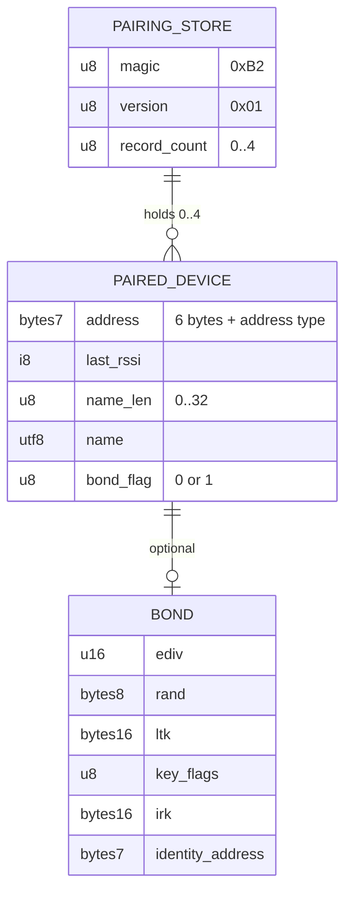

# Data Model Reference

bt2usb has one persisted data set, the pairing store, and a small set of fixed
wire contracts: the USB HID reports it sends to the host and the internal
channels between tasks. This guide defines their layout, ownership, and the
rules for changing them. The physical memory map is in
[hardware](hardware.md#memory-layout).

## Relationship Overview



A device record identifies a peer for the UI and for reconnect. Its bond, when
present, carries the keys that let the bridge reconnect without pairing again
and resolve the peer's rotating private address.

## Pairing Store

### Location

| Property | Value | Source |
| --- | --- | --- |
| Flash pages | 240–243 (`0x000F0000–0x000F4000`) | `STORAGE_FLASH_PAGE_START` / `COUNT` in [config.rs](../src/config.rs) |
| Container | One `sequential-storage` map item, key `0x01` | `KEY_PAIRED_DEVICES` in [storage.rs](../src/storage.rs) |
| Maximum item size | 512 bytes, checked at compile time against four bonded records with 32-byte names | `MAX_RECORD_SIZE` |
| Capacity | 4 peers; 2 can be connected at once | `MAX_PAIRED_DEVICES` |

The linker script excludes these pages from application flash, so firmware
growth cannot overwrite bonds ([ADR 0006](adr/0006-fail-closed-pairing-store.md)).

### Frame

Owned by [storage/framing.rs](../src/storage/framing.rs):

```text
[0]   magic        0xB2
[1]   version      0x01
[2]   record count 0..=4
[3..] repeated:    [len: u8][record bytes; len]
```

### Device record

Owned by [storage.rs](../src/storage.rs) and validated by
[storage/record.rs](../src/storage/record.rs):

| Offset | Size | Field | Rules |
| --- | --- | --- | --- |
| 0 | 6 | Address bytes | As reported by the SoftDevice |
| 6 | 1 | Address type | 0 public, 1 random static, 2 resolvable private, 3 non-resolvable private, 4 anonymous; anything else is invalid |
| 7 | 1 | Last RSSI | Signed; a sorting hint only |
| 8 | 1 | Name length | 0–32 bytes |
| 9 | n | Name | Valid UTF-8; truncated by characters to fit 32 bytes |
| 9 + n | 1 | Bond flag | 0 = no bond, record ends here; 1 = bond follows |
| 10 + n | 50 | Bond | Present only when the flag is 1; the record length must match exactly |

### Bond

Owned by [storage/codec.rs](../src/storage/codec.rs):

| Offset | Size | Field |
| --- | --- | --- |
| 0 | 2 | Master ID `ediv`, little-endian |
| 2 | 8 | Master ID `rand` |
| 10 | 16 | Long-term key (LTK) |
| 26 | 1 | Encryption key flags |
| 27 | 16 | Identity resolving key (IRK) |
| 43 | 7 | Identity address and type; must be public or random static |

### Load rules

1. No item in flash: the store is empty and writable.
2. Flash read error: the store is empty and **not writable**.
3. First byte is the magic: the frame must be complete, the version supported,
   the count at most four, and every record valid. Any failure loads nothing and
   makes the store not writable. A truncated or future-version frame is never
   reinterpreted as the legacy format.
4. No magic: the blob is parsed as the legacy unversioned format (count byte,
   then address/RSSI/name records without bonds) and is rewritten in the current
   format on the next save.
5. Records resolving to the same bonded identity are merged while loading, so
   two slots never chase the same peer.

A store that is not writable stays that way until the user confirms Factory
reset, which may erase the region. Ordinary saves refuse with
`StoreError::Unreadable`.

### Write rules

- Saves happen only when the cache is dirty and the store is writable.
- Serialization that would exceed the item size aborts before touching flash.
- A write is retried up to three times, 20 ms apart, because SoftDevice flash
  operations wait for radio-idle timeslots.
- Forget and Factory reset stop affected workers, write, and only then update
  the in-memory cache and SoftDevice bonder. A failed write leaves cached
  records and bonds unchanged and is shown to the user.

## USB HID Report Contracts

The composite device exposes three interrupt-IN interfaces. Report formats are
defined in [src/hid/](../src/hid/) and the descriptors in the same modules.

| Interface | Report mode | Boot mode | Notes |
| --- | --- | --- | --- |
| Keyboard | 8 bytes: modifiers, reserved, six key codes | Same 8 bytes | More than six keys sends the `ErrorRollOver` array; LED output report is forwarded to BLE keyboards |
| Mouse | 5 bytes: five buttons, X, Y, wheel, horizontal pan (signed 8-bit) | 3 bytes: three buttons, X, Y | Motion is relative and never replayed |
| Consumer control | 2 bytes: one usage, little-endian, at most `0x0FFF` | — | Lowest active BLE slot wins |

Incoming BLE reports are classified by the peripheral's Report Map and report
references into these internal types. Layouts that cannot be mapped are
rejected rather than guessed; see
[HID path and limits](architecture.md#hid-path-and-limits).

## Task Channel Contracts

Inter-task messages use bounded Embassy channels; capacities are listed in
[architecture](architecture.md#tasks-and-data-flow). Management commands
(`ListPaired`, `Forget`, `FactoryReset`) carry a request ID, and the UI accepts
only the reply that matches its single outstanding request. Forget names a
stable peer identity, never a list index.

## Data Ownership Rules

- The BLE coordinator owns the pairing store and the SoftDevice bonder; the UI
  reads the saved-device list only through management commands.
- Connection workers own their slot's link and held-input source state.
- The input aggregator owns the per-source union; endpoint workers own their
  queue and retained state.
- The USB task owns host-facing state: configuration, suspend, protocol mode,
  and keyboard LEDs (published to workers through a `Watch`).

## Schema Change Rules

- Any change to the frame or record layout bumps the version byte.
- Add fixture tests for the new version, every supported older version, and
  malformed and truncated input before changing the writer.
- Never relax validation of key material to accept a damaged record.
- Document the upgrade and downgrade path; an older firmware that sees a newer
  version must fail closed, not overwrite it.
- Keep `MAX_RECORD_SIZE`, `MAX_PAIRED_DEVICES`, and the flash reservation
  consistent; the compile-time assertion guards the first two.

Versioned migration beyond the legacy format is open work in
[TODO.md](../TODO.md).

## Privacy And Retention

Bond keys are stored unencrypted in internal flash. Device names and RSSI are
kept for display. Firmware logs must not print keys or keystroke content.
Logical deletion does not guarantee physical erasure; see
[security](security.md#key-storage-and-deletion).

## Related Guides

- [Architecture and ADRs](architecture.md)
- [Hardware and memory map](hardware.md)
- [Testing](testing.md)
- [Security](security.md)
