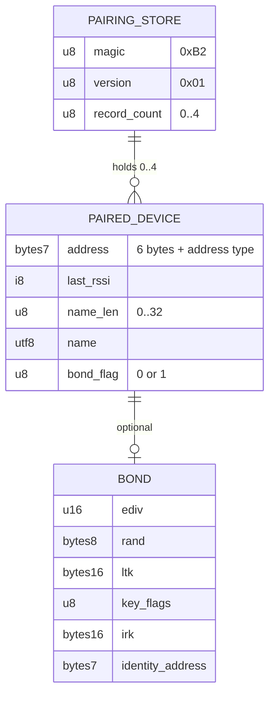
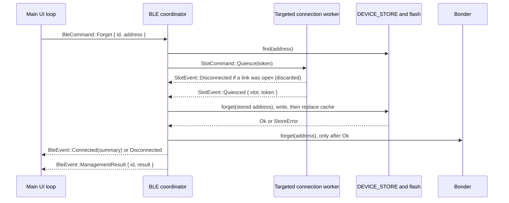

# Data Model Reference

bt2usb has one persisted data set, the pairing store, and a small set of fixed
contracts: the USB identity and HID reports it presents to the host, the BLE
HID payloads it accepts from peripherals, the messages its tasks exchange, and
the UI state the OLED renders. This guide defines their layout, ownership,
verification status, and the rules for changing them. The physical memory map
and pins are in [hardware](hardware.md#memory-layout); the runtime structure is
in [architecture](architecture.md).

Every value below is taken from the source files linked next to it. When a
behavior depends on a library default rather than on this repository's code,
the guide says so.

## Relationship Overview



A device record identifies a peer for the UI and for reconnect. Its bond, when
present, carries the keys that let the bridge reconnect without pairing again
and resolve the peer's rotating private address.

The data sets at a glance:

| Data set | Lifetime | Owner | Defined in |
| --- | --- | --- | --- |
| Pairing store | Persistent, internal flash pages 240–243 | BLE coordinator | [storage.rs](../src/storage.rs), [storage/](../src/storage/) |
| USB device identity and descriptors | Fixed at build time; serial per chip | USB task | [usb/hid_device.rs](../src/usb/hid_device.rs), [config.rs](../src/config.rs) |
| USB HID input and LED output reports | Transient, per USB transfer | Endpoint workers, USB control handler | [hid/](../src/hid/) |
| BLE HID payloads from peripherals | Transient, per GATT notification | Connection workers | [hid/mod.rs](../src/hid/mod.rs), [ble/hid_client.rs](../src/ble/hid_client.rs) |
| Internal messages | RAM, bounded channels and signals | Producing and consuming tasks | [main.rs](../src/main.rs), [ble/](../src/ble/), [hid/delivery.rs](../src/hid/delivery.rs) |
| UI state | RAM, main loop | Main UI loop; display task renders a copy | [ui/ui_logic.rs](../src/ui/ui_logic.rs) |

## Verification Status

"Host tests" counts `#[test]` functions with `grep -c '#\[test\]'` in the named
file. A module that is not compiled into the host library (`src/lib.rs`) is
not covered by `cargo test --lib --tests`, whatever tests it contains.

| Contract | Implementation | Software verification | Hardware verification |
| --- | --- | --- | --- |
| Store framing (magic, version, count, length prefixes) | [storage/framing.rs](../src/storage/framing.rs) | 8 host tests | None recorded |
| Record prefix and bond-flag validation | [storage/record.rs](../src/storage/record.rs) | 3 host tests | None recorded |
| Device, address, and bond record codec | [storage/codec.rs](../src/storage/codec.rs) | Round-trip and boundary tests in [devices_format_tests.rs](../src/storage/devices_format_tests.rs) | None recorded |
| Fail-closed load, legacy parse, merge, eviction, Forget and reset candidates | [storage/devices.rs](../src/storage/devices.rs) | 15 load and codec tests in [devices_format_tests.rs](../src/storage/devices_format_tests.rs), shared with the codec row, and 17 merge, identity, eviction, and transaction tests in [devices_tests.rs](../src/storage/devices_tests.rs) | None recorded |
| Flash load and save, write retries, SoftDevice type conversion, IRK resolution | [storage.rs](../src/storage.rs) | Firmware build and Clippy only; no tests | None recorded |
| Persist-then-publish commit, Forget targets, and quiescence barrier | [ble/management.rs](../src/ble/management.rs) | 6 host tests; Renode scenario | None recorded |
| USB report layouts and descriptors | [hid/](../src/hid/) | Host tests in [lib_tests.rs](../src/lib_tests.rs), [hid_classify_tests.rs](../src/hid_classify_tests.rs) and [hid_descriptor_tests.rs](../src/hid_descriptor_tests.rs), including `parses_actual_usb_descriptors_without_cross_classifying_pan` | None recorded |
| USB device identity and request handling | [usb/hid_device.rs](../src/usb/hid_device.rs), [usb/host_requests.rs](../src/usb/host_requests.rs) | Firmware build and Clippy only | Self-test enumeration stage exists; no recorded run |
| Coordinator reducers behind the BLE messages | [ble/coordinator.rs](../src/ble/coordinator.rs), [ble/messages.rs](../src/ble/messages.rs) | 32 host tests in [coordinator_tests.rs](../src/ble/coordinator_tests.rs) and 3 in `messages.rs`; Renode scenario | None recorded |
| UI state model and request tracking | [ui/ui_logic.rs](../src/ui/ui_logic.rs), [ui/controller.rs](../src/ui/controller.rs) | 30 host tests in [ui_logic_tests.rs](../src/ui/ui_logic_tests.rs) and 16 in [controller_tests.rs](../src/ui/controller_tests.rs); Renode scenario | None recorded |

[Testing](testing.md#known-verification-gaps) lists the missing fuzzing, fault
injection, and hardware evidence. The `mask selftest` flash stage exercises the
pairing region with a scratch key, not this record format.

## Pairing Store

### Location

| Property | Value | Source |
| --- | --- | --- |
| Flash pages | 240–243 (`0x000F0000–0x000F4000`), 4 KiB each | `STORAGE_FLASH_PAGE_START` / `COUNT`, `FLASH_PAGE_SIZE`, and the derived `STORAGE_FLASH_START` / `END` in [config.rs](../src/config.rs); `memory_sd.x` fails the link unless `FLASH` ends at `STORAGE_FLASH_START` |
| Container | One `sequential-storage` map item, key `0x01`, no cache (`NoCache`) | `KEY_PAIRED_DEVICES` in [storage.rs](../src/storage.rs) |
| Flash access | SoftDevice flash API (`nrf_softdevice::Flash`), so writes wait for radio-idle time | [ble/multi_conn.rs](../src/ble/multi_conn.rs) |
| Maximum item size | 512 bytes, checked at compile time against four bonded records with 32-byte names | `MAX_RECORD_SIZE` in [storage/devices.rs](../src/storage/devices.rs) |
| Capacity | 4 peers; 2 can be connected at once | `MAX_PAIRED_DEVICES`, `BLE_MAX_CONNECTIONS` in [config.rs](../src/config.rs) |
| Other keys | `0xFE` is written, read back and removed by the self-test image only | `SELFTEST_KEY` in [selftest.rs](../src/selftest.rs) |

The linker script excludes these pages from application flash, so firmware
growth cannot overwrite bonds ([ADR 0006](adr/0006-fail-closed-pairing-store.md),
[hardware](hardware.md#memory-layout)).

### Frame

Owned by [storage/framing.rs](../src/storage/framing.rs):

```text
[0]   magic        0xB2
[1]   version      0x01
[2]   record count 0..=4
[3..] repeated:    [len: u8][record bytes; len]
```

A record length of zero, a length that runs past the end of the item, or a
count that disagrees with the records present makes the frame incomplete. The
writer refuses a record that is empty, longer than 255 bytes, or does not fit
the buffer, so a full buffer never produces a corrupt frame.

### Device Record

Owned by [storage.rs](../src/storage.rs) and validated by
[storage/record.rs](../src/storage/record.rs):

| Offset | Size | Field | Rules |
| --- | --- | --- | --- |
| 0 | 6 | Address bytes | As reported by the SoftDevice |
| 6 | 1 | Address type | 0 public, 1 random static, 2 resolvable private, 3 non-resolvable private, 4 anonymous; anything else is invalid |
| 7 | 1 | Last RSSI | Signed dBm; see the note below |
| 8 | 1 | Name length | 0–32 bytes |
| 9 | n | Name | Valid UTF-8; truncated by characters to fit 32 bytes |
| 9 + n | 1 | Bond flag | 0 = no bond, record ends here; 1 = bond follows |
| 10 + n | 50 | Bond | Present only when the flag is 1; the record length must match exactly |

A bonded record is stored under the peer's identity address from the bond, not
the advertising address seen at connection time (`DeviceList::add` in
[storage/devices.rs](../src/storage/devices.rs)). This
keeps a peer that rotates its resolvable private address from creating a new
record on every rotation.

The RSSI byte holds the cached value at the most recent write. An RSSI-only
change updates the in-memory record but does not mark the store dirty, so the
flash copy can be older than the cache. No current code sorts or displays
saved devices by RSSI.

### Bond

Owned by [storage/codec.rs](../src/storage/codec.rs):

| Offset | Size | Field |
| --- | --- | --- |
| 0 | 2 | Master ID `ediv`, little-endian |
| 2 | 8 | Master ID `rand` |
| 10 | 16 | Long-term key (LTK) |
| 26 | 1 | Encryption key flags |
| 27 | 16 | Identity resolving key (IRK) |
| 43 | 7 | Identity address and type; must be public or random static |

The flags byte is copied verbatim from the SoftDevice `EncryptionInfo`, which
the vendored `nrf-softdevice` declares layout-compatible with the SoftDevice's
`ble_gap_enc_info_t` ([vendor/nrf-softdevice/src/ble/types.rs](../vendor/nrf-softdevice/src/ble/types.rs)).
The application does not interpret it. `codec::decode_bond` rejects an identity
that is not public or random static (byte 49 of the bond above 1), and a save
never writes one ([write rules](#write-rules)); both use
`AddressKind::is_identity` in [storage/devices.rs](../src/storage/devices.rs).

### Worked Example

One public-address device named `KB`, RSSI −60 dBm, without a bond:

```text
B2 01 01            magic, version 1, one record
0C                  record length 12
11 22 33 44 55 66   address bytes as stored by the SoftDevice
00                  address type: public
C4                  last RSSI: -60 as a signed byte
02                  name length
4B 42               "KB"
00                  bond flag: no bond
```

The item is 16 bytes. With a bond the record grows by 50 bytes and the flag is
`01`. After a successful Factory reset of a readable store the item is the
3-byte empty frame `B2 01 00`.

### Legacy Format

Firmware before the versioned format (introduced in commit c37d568) wrote an
unversioned blob. It is still accepted on load when the first byte is not
`0xB2`:

```text
[0]   record count 0..=4
[1..] repeated, no length prefix:
      [address 6][type 1][rssi 1][name_len 1][name; name_len]
```

Legacy records carry no bond. Each record passes the same address-type,
name-length and UTF-8 checks as a version 1 record, and the records must end
exactly at the end of the item; trailing or missing bytes reject the whole
blob. Because a legacy count is at most 4, a valid legacy blob never starts
with the `0xB2` magic. Legacy parsing (`DeviceList::decode_legacy` in
[storage/devices.rs](../src/storage/devices.rs)) is host-tested in
[devices_format_tests.rs](../src/storage/devices_format_tests.rs): a valid
legacy store loads without bonds and is rewritten in the versioned format by
the next change; a count above four, a truncated record or header, or
trailing bytes refuse the whole store; and a zero count alone is a valid,
empty store.

### Capacity And Compile-Time Checks

[storage/devices.rs](../src/storage/devices.rs) contains the assertion below,
and [storage/codec.rs](../src/storage/codec.rs) defines the largest record as
`MAX_DEVICE_RECORD = ADDRESS_RECORD_SIZE + 2 + 32 + 1 + BOND_RECORD_SIZE`:

```rust
const _: () = assert!(3 + MAX_PAIRED_DEVICES * (1 + codec::MAX_DEVICE_RECORD) <= MAX_RECORD_SIZE);
```

| Term | Bytes | Meaning |
| --- | --- | --- |
| `3` | 3 | Magic, version, count |
| `1` | 1 | Per-record length prefix |
| `ADDRESS_RECORD_SIZE` | 7 | Address and type (part of `MAX_DEVICE_RECORD`) |
| `2` | 2 | RSSI and name length |
| `32` | 32 | Longest name |
| `1` | 1 | Bond flag |
| `BOND_RECORD_SIZE` | 50 | Bond |

With four peers the worst case is 3 + 4 × 93 = 375 bytes, leaving 137 bytes of
the 512-byte item unused. The largest record body is 92 bytes, well inside the
255-byte length prefix. Five peers (468 bytes) would still fit; six (561
bytes) fail the assertion, so raising `MAX_PAIRED_DEVICES` past five also
requires a larger `MAX_RECORD_SIZE`. Load uses one 512-byte buffer; save uses
two. New versions of the item are appended across the four 4 KiB pages, and
`sequential-storage` handles wear levelling and garbage collection.

### In-Memory Cache

`DEVICE_STORE` is an async `Mutex` around a `DeviceStore`, the flash shell in
[storage.rs](../src/storage.rs). It holds one `DeviceList` from
[storage/devices.rs](../src/storage/devices.rs), which keeps the records in
the hardware-free `StoredDevice` form and converts them to `PairedDevice` and
`BondInfo` (SoftDevice address and key types) only at the shell's boundary:

| `DeviceList` field | Type | Meaning |
| --- | --- | --- |
| `devices` | `heapless::Vec<StoredDevice, MAX_PAIRED_DEVICES>` (4) | Cached records in insertion order, oldest first |
| `dirty` | `bool` | The cache differs from flash in a field that must persist |
| `writable` | `bool` | Ordinary saves are allowed |

`DeviceList::add` merges a new record into an existing one when the addresses
are equal or either side's IRK resolves the other's address; the IRK check is
the `resolve` function the shell passes in, which asks the SoftDevice's AES
block. An all-zero IRK, which the vendored crate stores for a peer that
distributed no identity key, resolves no address (`irk_present`), so a device
that builds a private address from it cannot pass for such a peer. A merge marks the store dirty only when the address, name, or bond
changed. A new record appended to a full store evicts the oldest entry.
Updating an existing record does not move it. `add` returns an `AddOutcome`,
and `DeviceStore::add` logs it: `"Updated existing paired device"`,
`"Added paired device - now storing {}"`, or, for an eviction,
`"Paired device store full - evicting oldest entry"` first. For a bond whose
identity is not public or random static it returns `AddOutcome::BondRefused`
and changes nothing; `DeviceStore::add` then logs
`"Device store refused a bond whose identity is not public or random static"`
and returns `Err(BondRefused)` ([write rules](#write-rules)). Loading merges
through the same `add` without logging.

`iter_recent` yields records newest-first by insertion. Boot reconnect gives the
first two of that order to slots 0 and 1 at once, without a scan, and the saved-devices list is shown in it. Because an
update does not move a record, "recent" means most recently added, not most
recently connected.

### Load Rules

1. No item in flash: the store is empty and writable (`"No paired devices in flash"`).
2. Flash read error: the store is empty and **not writable**
   (`"Flash read error: {:?}"`).
3. An item that exists but is empty is invalid.
4. First byte is the magic: the frame must be complete, the version supported,
   the count at most four, and every record valid. Any failure loads nothing and
   makes the store not writable. A truncated or future-version frame is never
   reinterpreted as the legacy format.
5. No magic: the blob is parsed as the [legacy format](#legacy-format) and is
   rewritten in the current format by the next save that a change triggers.
6. Records resolving to the same bonded identity are merged while loading, so
   two slots never chase the same peer. The merge is not written back until the
   next change.

An invalid item logs `"Invalid or unsupported device store; writes disabled"`
and the coordinator raises `BleEvent::Error(StorageFailed)` at boot. A store
that is not writable stays that way until the user confirms Factory reset,
which then erases pages 240–243 before writing an empty frame. Ordinary saves refuse with `StoreError::Unreadable`
(`"Device store is unreadable; refusing to overwrite stored bonds"`).

### Write Rules

- Saves happen only when the cache is dirty and the store is writable.
- `sequential-storage` writes item data to flash straight from the scratch
  buffer it is given, and the SoftDevice flash driver refuses a source that is
  not word aligned in RAM (`FlashError::BufferMisaligned`), so the load, the
  save, and the self-test pass a `FlashBuffer` (`#[repr(align(4))]`, in
  [sd_setup.rs](../src/sd_setup.rs)) rather than a plain byte array.
- Serialization that would exceed the item size aborts before touching flash
  (`"Device store exceeds serialization capacity; save aborted"`).
- A write is attempted up to three times in total (two retries), 20 ms apart,
  because SoftDevice flash operations wait for radio-idle timeslots
  (`FLASH_WRITE_ATTEMPTS`; `"Flash write busy (attempt {}), retrying"`, then
  `"Flash write failed after {} attempts: {:?}"`).
- Every successful connection adds or updates the record and saves if
  anything changed (`Action::PersistDevice`); a failure raises
  `BleEvent::Error(StorageFailed)` while the link stays up.
- A new pairing whose bond names an identity that is not a public or random
  static address stores nothing. The bond is refused because a reload would
  refuse it and with it the whole store; the device is refused too, because
  without keys it would be stored at the private address it connected from,
  and a peer that pairs again after each rotation would add a record each
  time and, in a full store, evict a bonded peer. `Bonder::on_bonded` checks
  the identity the peer sends (or, when it sends none, the connection address
  the vendored crate substitutes for it) with `storage::is_identity_address`,
  which
  decodes the raw type with `AddressKind::from_gap_type`, so a type the Core
  specification reserves is refused rather than passed to the vendored
  `Address::address_type`, which panics on one. It keeps no keys, logs
  `Bond refused: identity address is not public or random static`, and
  records the link; `execute_action` finds it with `Bonder::take_refused`,
  stores nothing, and raises `BleEvent::Error(BondRefused)`. `DeviceStore::add`
  refuses such a bond as well, a reserved type itself (`to_stored_bond`) and a
  private or anonymous one through `DeviceList::add` (`AddOutcome::BondRefused`,
  nothing changed or left to save). It logs
  `Device store refused a bond whose identity is not public or random static`,
  and `execute_action` drops exactly those keys from `Bonder` (`forget_bond`),
  so RAM holds what flash will hold after a reboot. A bond already stored for
  the same peer stays in flash and is loaded again at the next boot. Once the
  link ends, background reconnects cannot bring the device back, because they
  never pair; the user selects it from a scan to pair it again. If the
  device's own address had a reserved type, which the SoftDevice does not
  report, nothing is stored
  (`Paired device address has a reserved type; not stored`) and the same
  error is raised.
- Forget and Factory reset stop affected workers, build a candidate store,
  write it, and only then replace the in-memory cache and update the SoftDevice
  bonder (`management::commit`). A failed write leaves cached records and bonds
  unchanged and is shown to the user.
- Forget first looks the requested address up with `DeviceStore::find`, which
  also matches through a stored IRK, and then removes that record by its stored
  address with an exact comparison (`DeviceStore::forget`). Factory reset
  writes an empty frame through the same map append; it erases pages 240–243
  first only when the store was not writable.
- Removal is logical. Older copies of the item stay in flash until
  `sequential-storage` reclaims their page; see
  [security](security.md#key-storage-and-deletion).

### Store Errors

| `StoreError` | Raised when | Surfaces as |
| --- | --- | --- |
| `Unreadable` | Save or Forget on a store whose load failed | `StorageFailed` |
| `Serialization` | The frame does not fit `MAX_RECORD_SIZE` | `StorageFailed` |
| `Flash` | Three write attempts failed, or the recovery erase failed | `StorageFailed` |
| `NotFound` | Forget named an address with no exact match (the coordinator's earlier lookup normally prevents this) | `StorageFailed` |

A Forget whose identity is not in the cache fails earlier with
`ManagementFailed`, before any worker is stopped.

## USB Device Identity

The USB descriptors are assembled once by `hid_device::init` with
`embassy-usb`. Fields this repository does not set keep the `embassy-usb`
defaults; confirm the emitted descriptors with a descriptor dump on hardware.

| Field | Value | Source |
| --- | --- | --- |
| Controller | nRF52840 USBD, USB 2.0 full speed | [usb/mod.rs](../src/usb/mod.rs) |
| Vendor ID / Product ID | `0x1209` / `0x0001`: the pid.codes open-source VID, marked in `config.rs` as a test identity to replace for production | `USB_VID`, `USB_PID` in [config.rs](../src/config.rs) |
| Manufacturer string | `bt2usb` | `USB_MANUFACTURER` |
| Product string | `BT-to-USB HID Bridge` | `USB_PRODUCT` |
| Serial number | 16 uppercase hex characters: `FICR.DEVICEID[1]` then `FICR.DEVICEID[0]`, each `{:08X}` | `init` in [usb/hid_device.rs](../src/usb/hid_device.rs) |
| Control endpoint max packet | 64 bytes | `max_packet_size_0` |
| Max power | 100 mA, a declared budget, not a measurement | `max_power` |
| Remote wakeup | Advertised | `supports_remote_wakeup = true` |
| Self-powered, device class, device release | Not set by this repository | `embassy-usb` defaults |
| Descriptor buffers | 256 bytes each for configuration, BOS and MS OS descriptors; 128-byte control buffer | Static cells in `hid_device.rs` |

The serial is read from factory-programmed, read-only registers, so it is
stable across firmware updates and USB ports and differs between chips.
[TODO.md](../TODO.md) tracks a production VID/PID and unit-identity policy.

| Interface | Function | Subclass / protocol | Report descriptor | Endpoints | Class requests handled |
| --- | --- | --- | --- | --- | --- |
| 0 | Keyboard | Boot (1) / Keyboard (1) | 64 bytes, no report IDs | One interrupt IN, 8-byte max packet, 1 ms | `GET_PROTOCOL`, `SET_PROTOCOL`, `SET_REPORT` for the LED output report |
| 1 | Mouse | Boot (1) / Mouse (2) | 77 bytes, no report IDs | One interrupt IN, 8-byte max packet, 1 ms | `GET_PROTOCOL`, `SET_PROTOCOL` |
| 2 | Consumer control | None (0) / None (0) | 23 bytes, no report IDs | One interrupt IN, 8-byte max packet, 1 ms | None beyond the class defaults |

Interface numbers follow creation order in `init` and match the list in
[usb/mod.rs](../src/usb/mod.rs). Endpoint addresses are allocated by the
`embassy-usb` builder and `embassy-nrf` driver, not pinned in source. No
interface has an interrupt OUT endpoint: the host sends keyboard LED state with
`SET_REPORT` on the control endpoint. `GET_REPORT`, `SET_IDLE` and `GET_IDLE`
are left to the `embassy-usb` request-handler defaults; defining them is the
HID/USB conformance item in [TODO.md](../TODO.md). Descriptor lengths were
counted from the byte arrays in [hid/](../src/hid/).

### USB Lifecycle Effects

| Host event | Effect in [usb/hid_device.rs](../src/usb/hid_device.rs) and [usb/host_requests.rs](../src/usb/host_requests.rs) |
| --- | --- |
| Bus reset or USB disabled | Configured and suspended flags cleared, both interfaces back to report protocol, pending wake cleared, LED state reset to all off, resume signalled to the UI loop, all endpoints replay held state |
| Configured or deconfigured | Configured flag updated, endpoints replay, `"USB configured by host: {}"` |
| Suspend or resume | Pending wake cleared, suspended flag updated, signal to the UI loop's power manager, endpoints replay |
| `SET_PROTOCOL` on keyboard or mouse | That interface's boot flag updated and only its endpoint replays |
| `SET_REPORT` (keyboard, Output, ID 0, 1 byte) | Byte masked to 5 LED bits, published to the LED `Watch`, `"Host LEDs: num={} caps={} scroll={}"`; any other `SET_REPORT` to the keyboard or mouse interface is rejected |
| New press while suspended | Remote wakeup requested; `"USB remote wakeup sent"` or `"USB remote wakeup not possible: {}"` |

`host_requests.rs` handles `SET_PROTOCOL` and `SET_REPORT`, and its `reset`,
called from the bus reset handler in `hid_device.rs`, returns both interfaces
to report protocol and publishes all-off LEDs. The other effects are in
`hid_device.rs`.

An endpoint is available only while the device is configured and not
suspended. Replay invalidates in-flight transfers and requeues only held
state; relative motion is never replayed
([ADR 0005](adr/0005-two-slots-and-independent-endpoints.md)).

## USB HID Report Contracts

The composite device exposes three interrupt-IN interfaces. Report formats are
defined in [src/hid/](../src/hid/) and the descriptors in the same modules.

| Interface | Report mode | Boot mode | Notes |
| --- | --- | --- | --- |
| Keyboard | 8 bytes: modifiers, reserved, six key codes | Same 8 bytes | More than six keys sends the `ErrorRollOver` array; LED output report is forwarded to BLE keyboards |
| Mouse | 5 bytes: five buttons, X, Y, wheel, horizontal pan (signed 8-bit) | 3 bytes: three buttons, X, Y | Motion is relative and never replayed |
| Consumer control | 2 bytes: one usage, little-endian, at most `0x0FFF` | — | Lowest active BLE slot wins |

Incoming BLE reports are classified by the peripheral's Report Map and report
references into these internal types. Layouts that cannot be mapped are
rejected rather than guessed; see
[HID path and limits](architecture.md#hid-path-and-limits).

### Keyboard Interface

The descriptor is a Generic Desktop (`0x01`) Keyboard (`0x06`) application
collection in [hid/keyboard.rs](../src/hid/keyboard.rs).

| Input byte | Field | Usages |
| --- | --- | --- |
| 0 | Modifier bits, bit 0 Left Control to bit 7 Right GUI | Keyboard page `0x07`, `0xE0–0xE7` |
| 1 | Reserved, always 0 | Constant |
| 2–7 | Up to six key usages, 0 for none | Keyboard page `0x00–0xFF`, array |

The aggregator forces the reserved byte to 0. If the union of both sources has
more than six keys, or a source reports an error code `0x01–0x03`, all six key
bytes become `0x01` (`ErrorRollOver`) while modifiers are still sent.

| Output bit | LED usage (page `0x08`) |
| --- | --- |
| 0 | Num Lock |
| 1 | Caps Lock |
| 2 | Scroll Lock |
| 3 | Compose |
| 4 | Kana |
| 5–7 | Padding |

`KeyboardLeds` masks the byte to `0x1F`. Each connection worker that found a
keyboard LED output report on its peer writes the masked byte to that
characteristic when the link starts, if the host has sent one, and then
whenever the host changes it (`forward_host_leds` in
[host_leds.rs](../src/hid/host_leds.rs)).

### Mouse Interface

The descriptor is a Generic Desktop Mouse (`0x02`) application collection with
a Pointer physical collection in [hid/mouse.rs](../src/hid/mouse.rs).

| Input byte | Field | Range |
| --- | --- | --- |
| 0 | Buttons 1–5 in bits 0–4 (Button page `0x09`); bits 5–7 padding | — |
| 1 | X (`0x30`), relative | −128..127 |
| 2 | Y (`0x31`), relative | −128..127 |
| 3 | Wheel (`0x38`), relative | −128..127 |
| 4 | AC Pan (Consumer page `0x0238`), relative | −128..127 |

In boot protocol the interface sends 3 bytes: buttons masked to bits 0–2, then
X and Y with −128 clamped to −127 (`serialize_boot`). Wheel and pan are
dropped.

### Consumer Control Interface

The descriptor is a Consumer page (`0x0C`) Consumer Control (`0x01`)
application collection in [hid/consumer.rs](../src/hid/consumer.rs) with one
16-bit array field, usages and logical values `0x000–0xFFF`. The report is the
active usage, little-endian; `0x0000` is release. Only one usage can be active,
so when both sources hold a usage the lower-numbered slot's usage is sent.

### Accepted BLE Payloads

GATT values carry no report-ID prefix; the Report Reference descriptor and the
Report Map supply the kind ([hid/mod.rs](../src/hid/mod.rs)).

| Kind | Accepted payload | Rejected |
| --- | --- | --- |
| Keyboard | Exactly 8 bytes. When the characteristic's Report Reference resolves to the keyboard report of a numbered Report Map, or a Report Map without report IDs describes only a keyboard, byte 1 (OEM-reserved in HID 1.11) is ignored and becomes 0; when only the length or a conventional report ID suggests a keyboard, byte 1 must be 0 | Any other length; a nonzero reserved byte on a report nothing declares |
| Mouse | 3–5 bytes; buttons masked to 5 bits; missing wheel or pan read as 0 | Fewer than 3 or more than 5 bytes |
| Consumer | Exactly 2 bytes, usage at most `0x0FFF` | Other lengths, larger usages |

A notification longer than 32 bytes (`MAX_REPORT_LEN` in
[hid_client.rs](../src/ble/hid_client.rs)) is dropped, not truncated. Without a
Report Map, length alone selects the kind (8 keyboard, 3–5 mouse, 2 consumer
below `0x1000`). A Report Map without report IDs that declares only a keyboard
makes every input its keyboard report; any other map without report IDs
restricts that fallback to the kinds it declares; with report IDs, an input characteristic whose kind cannot
be resolved is not subscribed at all.

## Task Channel Contracts

Inter-task messages use bounded Embassy channels with `CriticalSectionRawMutex`;
the structure is drawn in [architecture](architecture.md#tasks-and-data-flow).
Management commands (`ListPaired`, `Forget`, `FactoryReset`) carry a request
ID, and the UI accepts only the reply that matches its single outstanding
request. Forget names a stable peer identity, never a list index.

| Channel | Message | Producer | Consumer | Capacity | Full-channel behavior |
| --- | --- | --- | --- | --- | --- |
| `BUTTON_CHANNEL` | `ButtonEvent` | Three button tasks | Main UI loop | 4 | Sender waits |
| `BLE_CMD_CHANNEL` | `BleCommand` | Main UI loop | BLE coordinator | 4 | `try_send`; the UI shows `"Busy; try again"` and abandons the request |
| `BLE_EVENT_CHANNEL` | `BleEvent` | BLE coordinator, including its scans | Main UI loop | 8 | Sender waits |
| `BLE_SLOT_CMD_CHANNELS[slot]`, one per link | `SlotCommand` | BLE coordinator | That slot's connection worker | 2 each | Sender waits |
| `BLE_SLOT_EVENT_CHANNEL` | `SlotEvent` | Both connection workers | BLE coordinator | 8 | Sender waits |
| `HID_REPORT_CHANNEL` | `HidEvent` | Both connection workers | HID dispatcher in `hid_writer_task` | 16 | Sender waits; a per-link coalescer absorbs bursts |

The UI never waits on `BLE_CMD_CHANNEL`, because the coordinator may be waiting
on a full `BLE_EVENT_CHANNEL` that only the UI drains (comment in
[main.rs](../src/main.rs)). The GATT notification callback cannot wait, so each
link pushes into a `ReportCoalescer` that keeps the latest keyboard and
consumer state and sums mouse motion, and a drain future sends with
backpressure ([hid/coalesce.rs](../src/hid/coalesce.rs)).

### Latest-Value Signals And Shared State

| Item | Type | Writer | Reader | Purpose |
| --- | --- | --- | --- | --- |
| `FRAMES` | `Signal<Frame>` | Main UI loop | Display task | Latest UI snapshot and display power; older frames are overwritten |
| `USB_SUSPEND_SIGNAL` | `Signal<bool>` | USB event handler | Main UI loop | Suspend or resume for the power manager |
| `REMOTE_WAKE` | `Signal<()>` | HID dispatcher | USB device task | Request remote wakeup |
| `KEYBOARD_LEDS` | `Watch<KeyboardLeds>`, 2 receivers | USB control handler | Connection workers | Latest host LED state, written to each keyboard link when it starts and on every change |
| `RECONNECTS` | Blocking `Mutex<RefCell<ReconnectTable<SavedPeer, Address>>>` | Connection workers, reconnect scan callback | Same | Each slot's background reconnect target (`reconnect::SavedPeer`: stored address and identity key), its last sighting, kept 2 s and marked when another slot's scan handed it over, and how long other slots' scans ignore it after a failed attempt ([reconnect.rs](../src/ble/reconnect.rs)) |
| `RECONNECT_WAKE` | `[Signal<()>; 2]` | Reconnect scan callback, through `scanner::update` after every table change | The other slot's worker | Wake a slot between attempts when another slot's scan handed it a sighting; kept equal to `ReconnectTable::wake_pending`, so it resets when the slot takes the sighting, when an attempt fails, when it stops reconnecting, or when it registers a different device |
| `KEYBOARD_DELIVERY`, `MOUSE_DELIVERY`, `CONSUMER_DELIVERY` | Endpoint mailboxes | HID dispatcher, USB event handler | Endpoint workers | 16-report FIFO, held state, transfer epoch |
| `USB_CONFIGURED`, `USB_SUSPENDED`, `KEYBOARD_BOOT_PROTOCOL`, `MOUSE_BOOT_PROTOCOL` | `AtomicBool` | USB handlers | USB tasks, self-test | Host-facing state |
| `HID_ACTIVITY` | `AtomicBool` | HID dispatcher | Power manager tick | Input counts as activity for display power |
| `DEVICE_STORE` | Async `Mutex<DeviceStore>` | BLE coordinator | BLE coordinator | Pairing cache; held across flash writes |
| `GAP_PROCEDURE` | Async `Mutex<()>` | Scanner, connection workers | Same | One SoftDevice scan or connection setup at a time |
| Bonder | `StaticCell` around a `RefCell` | SoftDevice security callbacks, coordinator | Same, plus connection workers | In-RAM bond table loaded from the store |

## Internal Message Contracts

### BleCommand

UI to coordinator. The variants are `messages::Command<A>` in
[ble/messages.rs](../src/ble/messages.rs), generic over the address type;
`BleCommand` in [ble/mod.rs](../src/ble/mod.rs) is that type over the
SoftDevice `Address`, and the host tests and the Renode build use stand-ins.
`UiController::button` in [ui/controller.rs](../src/ui/controller.rs) builds it
from the reducer's `UiCommand`.

| Variant | Fields | Meaning | Reply |
| --- | --- | --- | --- |
| `StartScan` | — | Scan for HID peripherals for `BLE_SCAN_DURATION_SECS`; if both slots are occupied, disconnect both first | `ScanStarted`, `DeviceFound`…, `ScanComplete`, or `Error(ScanFailed)` |
| `Connect(usize)` | Index into the coordinator's last scan result | Connect and allow pairing | `Connected` or `Error`; an out-of-range index or no free slot gives `Error(ConnectFailed)`; an already connected peer gives `Connected` at once |
| `Disconnect` | — | Disconnect every occupied slot; records are kept | `Disconnected` or `Connected(summary)` as slots free |
| `ListPaired { id }` | Request ID | Read the saved-device list | `PairedDevices { id, devices }` |
| `Forget { id, address }` | Request ID, stored identity address | Stop matching workers, remove the record, drop its bond | Link status event, then `ManagementResult { id, result }`; a failed lookup sends only `ManagementResult` with `ManagementFailed` |
| `FactoryReset { id }` | Request ID | Stop all workers, clear every record and bond; recover an unreadable store | Link status event, then `ManagementResult { id, result }` |

A Factory reset also discards the coordinator's last scan result, so a later
`Connect` needs a new scan.

### BleEvent

Coordinator to UI: `messages::Event<A>` in
[ble/messages.rs](../src/ble/messages.rs), aliased over `Address` as
`BleEvent` in [ble/mod.rs](../src/ble/mod.rs). `UiController::event` applies
it to the view; the coordinator's own `UiEvent` (link status and errors)
converts into it with `From`.

| Variant | Fields | Produced when |
| --- | --- | --- |
| `ScanStarted` | — | A user scan begins; reconnect scans send no UI events |
| `DeviceFound(DiscoveredDevice)` | Address, name (`"Unknown"` if none advertised), RSSI | Once per HID device at the end of a scan, up to 8 |
| `ScanComplete` | — | The scan window closed |
| `Connected(String<32>)` | One device's name, or `"2 devices"` | A slot connected, or a slot changed while another stays connected |
| `Disconnected` | — | No slot is connected |
| `Error(BleErrorTag)` | Error tag | A user-visible failure; see the table below |
| `PairedDevices { id, devices }` | Request ID, up to 4 `DiscoveredDevice`, newest first | Reply to `ListPaired` |
| `ManagementResult { id, result }` | Request ID, `Result<(), BleErrorTag>` | Reply to `Forget` or `FactoryReset`; `Ok` means the change reached flash |

`DiscoveredDevice` is `coordinator::DeviceInfo<Address>`: an address, a
`heapless::String<32>` name, and an `i8` RSSI.

### SlotCommand

Coordinator to one connection worker, defined in
[ble/multi_conn.rs](../src/ble/multi_conn.rs).

| Variant | Meaning |
| --- | --- |
| `Connect(DiscoveredDevice)` | User-selected connection; pairing may be initiated; a failure is reported |
| `Reconnect(DiscoveredDevice)` | Silent retry of a stored peer; never initiates pairing; for a bonded peer, resolves its current address before each attempt; waits `BLE_RECONNECT_BACKOFF_MS` between attempts until it connects or another command arrives |
| `Disconnect` | Close the link or stop retrying, then report `Disconnected` |
| `Quiesce(u32)` | Close the link, drop any retry target, then acknowledge with the same token |

### SlotEvent

Connection worker to coordinator, defined in
[ble/multi_conn.rs](../src/ble/multi_conn.rs).

| Variant | Fields | Meaning | Coordinator action |
| --- | --- | --- | --- |
| `Connected` | `slot`, `device` | Link encrypted, HID discovered and subscribed | Mark slot connected, persist the device and its bond, emit `Connected` |
| `Disconnected` | `slot` | The slot is free | Clear slot, emit link status |
| `LinkLost` | `slot`, `device` | An established link to a device `Bonder` holds keys for dropped; the worker is retrying. Without keys the worker sends `Disconnected` instead | Keep the slot reserved, emit link status |
| `Error` | `slot`, `tag` | A user connection failed, or a silent attempt failed for a reason other than `ConnectFailed` | Clear slot, emit `Error(tag)` and link status |
| `Quiesced` | `slot`, `token` | Reply to `Quiesce` | Counted only by the management barrier |

### HidEvent And HidReport

Connection workers to the HID dispatcher, defined in
[hid/delivery.rs](../src/hid/delivery.rs) and [hid/mod.rs](../src/hid/mod.rs).

| Variant | Fields | Meaning |
| --- | --- | --- |
| `HidEvent::Report` | `source` (slot index), `report: HidReport` | One classified input report |
| `HidEvent::Disconnected` | `source` | The source's link ended after it was established; its held input must be released |

`HidReport` is `Keyboard(KeyboardReport)`, `Mouse(MouseReport)` or
`Consumer(ConsumerReport)`, with the fields shown in the
[report contracts](#usb-hid-report-contracts). A worker sends `Disconnected`
after its final report, so the release follows the last input in channel order.
The dispatcher marks activity, merges the event into the per-source aggregate,
requests remote wakeup for a new press while suspended, and publishes up to
three endpoint reports.

### ButtonEvent

`Up`, `Down`, `Select` ([ui/ui_logic.rs](../src/ui/ui_logic.rs)), one event per
debounced press. Electrical details are in
[hardware](hardware.md#buttons).

### Error Tags And UI Messages

This table is the contract for user-visible errors. `BleErrorTag` is the
coordinator's `ErrorTag` ([ble/coordinator.rs](../src/ble/coordinator.rs)),
re-exported in [ble/mod.rs](../src/ble/mod.rs); the OLED text comes from
`controller::error_message` in [ui/controller.rs](../src/ui/controller.rs),
which a host test keeps distinct for every tag and within the 21 characters a
display line holds. How errors propagate is in
[architecture](architecture.md#how-errors-surface); what a user should do is in
[features](features.md#notices-and-errors).

| Tag | Raised by | OLED message |
| --- | --- | --- |
| `ScanFailed` | The SoftDevice refused a user scan or ended it with an error (`scanner::scan`) | `Scan failed` |
| `ConnectFailed` | `Connect` with an index outside the coordinator's last scan result (for example after Factory reset cleared it) or with no free slot (`plan_connect`); the whitelist connect timed out after 6 seconds or failed, including the MTU exchange; the link was not encrypted within 25 polls 200 ms apart, the pairing request failed, or the link dropped while securing; no keys during a background reconnect, which may not start pairing. A silent attempt that fails this way is retried, not shown | `Connect failed` |
| `HidNotFound` | GATT discovery of the HID service failed or found no Report characteristic (`discover_and_subscribe`) | `No HID service` |
| `NotifyFailed` | No input report characteristic could be subscribed | `Notify failed` |
| `StorageFailed` | The store was unreadable or invalid at boot; saving a device after a connection failed, including every save while the store is read-only; a Forget or Factory reset could not be persisted. Every `StoreError` maps here | `Storage failed` |
| `BondRefused` | A pairing's bond names an identity that is not a public or random static address, so neither the device nor its new keys were stored; or (which the SoftDevice does not cause) the connected device's own address has a reserved type and nothing was stored ([write rules](#write-rules)) | `Pairing not saved` |
| `ManagementFailed` | Forget named an identity that `DeviceStore::find` no longer matches | `Action failed; retry` |
| `ReportMapReadFailed` | The Report Map read returned an error, the ATT MTU is outside the 23–517 bytes the long-read assembler accepts, or a fragment or the end of the value was malformed | `HID map read failed` |
| `ReportMapTooLarge` | The Report Map is longer than 512 bytes | `HID map too large` |
| `ReportMapInvalid` | The Report Map is malformed, exceeds the parser's nesting bounds, or declares no supported keyboard, mouse, or consumer input | `Unsupported HID map` |

The UI raises three error messages without a tag: `Busy; try again` when
`try_send` finds `BLE_CMD_CHANNEL` full and `Device changed; retry` when the
chosen saved device is no longer in the UI's snapshot (both in
[ui/controller.rs](../src/ui/controller.rs)), and `No devices found` when a scan ends with an
empty list ([ui/ui_logic.rs](../src/ui/ui_logic.rs)). The completion notices
`Device forgotten` and `Pairings reset`, and the timeout messages
`Forget result unknown`, `Reset result unknown`, and `List not loaded`, also
come from `ui_logic.rs`.

### Management Request Lifecycle

`ManagementRequests`, private to the UI controller in
[ui/controller.rs](../src/ui/controller.rs), allows one request at a time. IDs increase with wrapping arithmetic; a reply whose ID does
not match the pending request is ignored. Each request also carries a deadline,
`UI_MANAGEMENT_TIMEOUT_SECS` (30 s) after it starts. While a request is
pending the UI ignores every button. Once the deadline passes, `expire` drops
the request on the next 1 s tick, the UI clears its saved-device snapshot and
shows **No reply**, and the abandoned ID can never complete a later request.

| State | Enters when | Leaves when |
| --- | --- | --- |
| Idle | Boot, a matching reply, or a timeout | `begin` starts a request with the next ID and a deadline |
| Pending | `begin` | `complete` with the matching ID (reply handled), or `expire` at or after the deadline (No reply shown) |



While the barrier is open, events from targeted slots are discarded, so a
queued `Connected` or `LinkLost` cannot re-save the peer being removed. Slots
that are not targeted keep running. Factory reset targets both slots and calls
`factory_reset` instead of `forget`. If `find` fails, the coordinator replies
`ManagementResult` with `ManagementFailed` immediately.

## UI State Model

The main loop owns a `UiController` ([ui/controller.rs](../src/ui/controller.rs)),
which holds the `UiState`, and publishes a copy of the state with the display
power flag to the display task after every event
([ADR 0009](adr/0009-isolated-display-task.md)). User-facing flows are in
[features](features.md#using-the-bridge).

| `UiState` field | Type | Meaning |
| --- | --- | --- |
| `screen` | `Screen` | Current view |
| `selected` | `usize` | Cursor in the current list or dialog |
| `devices` | `Vec<String<32>, 8>` | Names from the current scan, in scan order |
| `paired_names` | `Vec<String<32>, 4>` | Names from the last `PairedDevices` reply |
| `connected_name` | `String<32>` | Link summary; empty when nothing is connected |
| `message` | `String<32>` | Error or notice text, truncated by characters |
| `scan_dots` | `u8` | Scanning animation, advanced once per second while scanning with the display on |

The controller also keeps the addresses from the last `PairedDevices` reply,
to turn a Forget index into an address, and its `ManagementRequests` tracker;
the loop keeps the `PowerManager`. RSSI and addresses are never rendered.

`Screen` has the variants `Home`, `Scanning`, `DeviceList`, `Connecting`,
`Connected`, `Error`, `SavedDevices`, `ConfirmForget(usize)`, `ConfirmReset`,
`Managing`, `Notice`, and `NoReply`. The text each one shows and what UP, DOWN, and
SELECT do on it are listed once, in
[features: screens and buttons](features.md#screens-and-buttons).

Dismissing an error, a notice, or the saved-device list returns to
`Connected` when a link summary exists, otherwise `Home`, and clears the
message. Events change screens as follows:

| Event | Effect |
| --- | --- |
| `ScanStarted` | From `Home` or `Scanning`: enter `Scanning` and clear the list; other screens are kept |
| `DeviceFound` | Name appended only while `Scanning` |
| `ScanComplete` | From `Scanning`: `DeviceList`, or `Error` with `No devices found` |
| `Connected` / `Disconnected` | Update `connected_name`; `Home`, `Connecting` and `Connected` follow the link state; a scan's `Scanning` or `DeviceList`, dialogs, and errors are kept |
| `Error(tag)` | `Error` with the tag's message |
| `PairedDevices` (matching ID) | Store names; enter `SavedDevices` unless an error is showing |
| `ManagementResult` (matching ID) | `Ok`: `Notice` with `Device forgotten` or `Pairings reset` unless an error is showing; `Err`: `Error` |

When the display is off, the first button press only wakes it. The display
policy is in [hardware](hardware.md#power).

## Data Ownership Rules

- The BLE coordinator owns the pairing store and the SoftDevice bonder; the UI
  reads the saved-device list only through management commands.
- Connection workers own their slot's link and held-input source state.
- The input aggregator owns the per-source union; endpoint workers own their
  queue and retained state.
- The USB task owns host-facing state: configuration, suspend, protocol mode,
  and keyboard LEDs (published to workers through a `Watch`).
- The main UI loop owns `UiState`, the management request tracker and the
  power manager. The display task owns TWIM0 and the OLED and only reads
  published frames.
- The bonder and store change together and only after a successful write
  (`management::commit`); neither is edited directly by the UI.
- Flash pages 240–243 belong to the store. The self-test may add and remove its
  own key there; no other code writes them.

## Schema Change Rules

- Any change to the frame or record layout bumps the version byte.
- Add fixture tests for the new version, every supported older version, and
  malformed and truncated input before changing the writer.
- Never relax validation of key material to accept a damaged record.
- Document the upgrade and downgrade path; an older firmware that sees a newer
  version must fail closed, not overwrite it.
- Keep `MAX_RECORD_SIZE`, `MAX_PAIRED_DEVICES`, and the flash reservation
  consistent; the compile-time assertion guards the first two.
- Keep record parsing and store decisions in the host-compiled modules
  (`codec.rs`, `devices.rs`, `framing.rs`, `record.rs`); only the `storage.rs`
  shell, which does the flash I/O and converts SoftDevice types, is outside
  the host tests.
- A USB descriptor or report change updates the descriptor, the serializer,
  boot-protocol output, `hid_descriptor_tests.rs`, and this guide together, and
  needs enumeration evidence on each supported host.
- A new message variant is handled at every match site (the compiler enforces
  this), keeps channel capacities bounded, and updates the Renode scenario when
  coordinator or UI reducers change.

Versioned migration beyond the legacy format is open work in
[TODO.md](../TODO.md).

## Privacy And Retention

Bond keys are stored unencrypted in internal flash. Device names are kept for
display; RSSI is stored but not used. Logical deletion does not guarantee
physical erasure; see [security](security.md#key-storage-and-deletion).
Factory reset of a readable store appends an empty item rather than erasing
pages.

Which logs may contain this data, and at which level, is defined in
[security: logging and privacy](security.md#logging-and-privacy). In short,
no default build logs an address, key, passkey, or keystroke. The application's
own statements never print them, and the three vendored `nrf-softdevice` lines
that could (`connected role={:?} peer_addr={:?}` in
[central.rs](../vendor/nrf-softdevice/src/ble/central.rs), the notification
bytes of `GATT_HVX write handle={:?} type={:?} data={:?}` in
[gatt_client.rs](../vendor/nrf-softdevice/src/ble/gatt_client.rs), and
`on_passkey_display passkey={}` in
[gap.rs](../vendor/nrf-softdevice/src/ble/gap.rs)) print those values only
when the firmware is built with the `log-sensitive-data` feature. Without it, a
`trace` build still logs every notification's length, which records typing
rhythm. The trace line that prints a peer's master ID
(`ble evt sec info request`) is compiled only with the crate's `ble-peripheral`
feature, which bt2usb does not enable. No vendored log line prints an LTK or
IRK.

## Related Guides

- [Architecture and ADRs](architecture.md)
- [Hardware and memory map](hardware.md)
- [Features](features.md)
- [Testing](testing.md)
- [Security](security.md)
- [Operations](operations.md)
