# Deployment Guide

This guide covers how a bt2usb build becomes firmware on a board: the release
pipeline, provenance verification, flashing, and the gates a deployment release
must pass. The release workflow prepares a draft for review
([ADR 0008](adr/0008-attested-draft-releases.md)). It does not establish
hardware qualification or provide secure boot on the device.

## Delivery Flow

```mermaid
flowchart LR
    tag[Tag vX.Y.Z = Cargo version] --> checks[CI: host, audit, embedded, Renode]
    checks --> package[Verify and attest checked firmware]
    package --> draft[Draft GitHub release]
    draft --> verify[Verify provenance and checksums]
    verify --> flash[Flash with probe-rs]
    flash --> accept[Hardware acceptance record]
    accept --> publish[Publish after release-gate review]
```



Every push and pull request runs the same checks without packaging. Only tags
produce a draft, and only a person publishes it.

## Version And Build Policy

A release tag must equal `v` followed by the exact `package.version` in
`Cargo.toml`. For example, version `0.2.0-rc.1` requires tag `v0.2.0-rc.1`; tagging
the same source as `v0.2.0` fails. Build metadata, when present, must match too.
Numeric prerelease identifiers cannot have leading zeros. Prerelease versions
produce prerelease drafts.

Check a proposed tag without creating or pushing it:

```sh
python scripts/release.py validate-tag --tag v0.1.0
python -B -m unittest discover -s scripts -p release_test.py -v
```

The helper requires Python 3.11 or newer and uses only the standard library.
It never creates a tag, uploads an artifact, or publishes a release.

## Artifact Flow

1. The `embedded` job builds and lints the ARM firmware. It converts that ELF to
   Intel HEX and stages the application, self-test, build inputs, and metadata.
   Staging rejects changes to tracked source and a checkout that differs from
   the workflow's source commit.
2. After host checks, audit, embedded checks, and Renode succeed, `release-package`
   downloads the **immutable artifact ID** emitted by that build job. Artifact
   download digest mismatches fail the job. No firmware is rebuilt in this job.
3. The packaging helper checks every staged checksum, exact tag/version, source
   commit/ref, repository, workflow run ID, target/profile/features, log level,
   compiler version, and checked-out build-input hashes. It preserves firmware
   bytes, adds versioned filenames, and creates the release checksum manifest.
4. The SHA-pinned official `actions/attest` action signs provenance for all
   package files, including `SHA256SUMS`, using GitHub's OIDC identity. The bundle
   is attached as `provenance.sigstore.json` after signing.
5. A separate `release` job downloads the attested package by its immutable ID
   and prepares the draft. This job has `contents: write` but no signing
   permissions. The packaging job has `contents: read`, `id-token: write`, and
   `attestations: write`; it cannot publish a release. Both run only on tag pushes.

Staged and simulation outputs live in the runner's temporary directory, not in
the Rust-cached `target/`, so a restored cache cannot supply stale files.

### Re-running a tag workflow

Artifact names include the run attempt, so a rerun never collides with an
earlier attempt's uploads. The `release` job updates the tag's existing
**draft** in place, replacing same-named assets with the rerun's attested
package. It fails before any upload if a **published** release already exists
for the tag, and it also fails if the release API cannot be queried. To change
a published release, tag a new version; do not edit or re-run the old tag.

`BUILD-INFO.json` records the original build's commit, ref, repository, workflow
run/attempt, compiler/Cargo versions, target, profile, features, log level, input
hashes, and firmware hashes. `Cargo.toml`, `Cargo.lock`, and `rust-toolchain.toml`
are included. Source and vendored patches are identified by the same source
commit; they are not replaced by a later checkout or recompilation.

The release also contains the application ELF/HEX and self-test ELF. SoftDevice
is obtained separately. `SHA256SUMS` covers package payloads, not itself or the
attestation bundle; the manifest itself is an attested subject, and the bundle's
signature is checked by the verifier.

## Verify Before Flashing

Use a GitHub CLI version supporting `gh attestation verify`. Obtain the approved
release tag and full commit SHA through your review process; a checksum file
downloaded alongside a binary is not, by itself, proof of origin. The commands
below are for Bash/WSL and use this repository's identity. A fork must deliberately
use its own approved repository and workflow identity.

```sh
release_tag='v0.1.0'
approved_commit='REPLACE_WITH_REVIEWED_40_CHARACTER_COMMIT'
gh release download "$release_tag" --repo chefzaid/bt2usb --dir "downloads/$release_tag"
cd "downloads/$release_tag"

# Authenticate the checksum manifest against the expected source and workflow.
gh attestation verify SHA256SUMS \
  --repo chefzaid/bt2usb \
  --signer-workflow chefzaid/bt2usb/.github/workflows/ci.yml \
  --source-ref "refs/tags/$release_tag" \
  --source-digest "$approved_commit" \
  --deny-self-hosted-runners

# Validate every payload against that authenticated manifest.
sha256sum --strict --check SHA256SUMS

# Independently verify the firmware that will be flashed.
gh attestation verify "bt2usb-$release_tag.hex" \
  --repo chefzaid/bt2usb \
  --signer-workflow chefzaid/bt2usb/.github/workflows/ci.yml \
  --source-ref "refs/tags/$release_tag" \
  --source-digest "$approved_commit" \
  --deny-self-hosted-runners
```

All checks must succeed. Compare `BUILD-INFO.json` with the approved source and
hardware validation record. Use `--bundle provenance.sigstore.json` on the same
verification command to read the supplied attestation bundle instead of fetching
it from GitHub. Fully offline verification also requires a trusted root prepared
in advance; follow GitHub's
[offline verification guide](https://docs.github.com/en/actions/how-tos/secure-your-work/use-artifact-attestations/verify-attestations-offline).

These flags constrain the repository, signer workflow, source ref, and commit;
the CLI checks the artifact digest and attestation signature. See the official
[verification reference](https://cli.github.com/manual/gh_attestation_verify) and
[artifact attestation guide](https://docs.github.com/en/actions/how-tos/secure-your-work/use-artifact-attestations/use-artifact-attestations).

## Flash A Development Unit

On a new board, complete [first flash](first-flash.md) first: it installs
SoftDevice S140 v7.3.0 and runs the self-test. To update a board that already
has SoftDevice:

1. Record the installed version/commit, board revision, and known-working
   SoftDevice version. Keep the previous ELF and its checksum for recovery.
2. Review changed pin assignments, memory reservations, and storage format.
3. Build from the intended revision using the pinned toolchain and `--locked`,
   or verify a release package as above.
4. Flash with `mask run --release`, keeping the debugger and native USB paths
   connected appropriately.
5. Check boot logs, enumeration, reconnect, input release, and the relevant
   hardware acceptance cases. Preserve the results with the artifact checksum.

The application image does not include SoftDevice. Install S140 v7.3.0 separately
on a blank board or after a full-chip erase. Normal application flashing should
preserve the reserved pairing region; verify the flashing tool's erase settings
and test this assumption for the selected workflow before relying on it. If an
update fails, follow the [operations runbook](operations.md#recovery-and-diagnostics).

## Release Gates

The workflow builds on pushes/pull requests and runs scheduled dependency checks.
Tags matching the exact Cargo package version produce a **draft** release after
checks pass. Packaging reuses the successful embedded job's firmware rather than
rebuilding it. The package contains application ELF/HEX, a self-test ELF,
manifest/lockfile/toolchain inputs, `BUILD-INFO.json`, `SHA256SUMS`, and a signed
provenance bundle. The draft keeps hardware/release review explicit; it is not
evidence that those reviews passed.

An automated tag build alone is not production approval. Before publishing a
deployment release, reviewers should confirm:

- Reproducible source revision, pinned toolchain/dependencies, passing host,
  embedded, and Renode checks, and recorded build/size results.
- Hardware results for the supported peripheral/host/hub matrix, including
  sleep/wake, USB reconnect, link loss with held inputs, and both active slots.
- Security policy, pairing authentication/enrollment decision, key deletion and
  physical-access policy, and resolved or explicitly accepted security findings.
- Assigned USB identity, unit-unique identification, documented production
  hardware, memory and power margins, and a tested recovery procedure.
- Release notes listing supported versions, compatibility limits, migrations,
  rollback constraints, checksums, and the exact SoftDevice prerequisite.
- Dependency/license review, provenance/signing strategy, a security contact,
  ownership of support, and an update/support lifetime.

Open implementation and validation tasks live in [TODO.md](../TODO.md). Move an
item to completed only when its acceptance criteria are met; attach hardware or
release evidence rather than inferring it from compilation.

## Validation Limits

Local helper tests cover version mismatch/prerelease handling, tampered or missing
files, build/source identity mismatch, input drift, and unchanged firmware bytes.
`actionlint` checks workflow syntax and expressions. They cannot issue GitHub OIDC
credentials or exercise the hosted attestation/release APIs. The first successful
tag workflow must be reviewed, and the downloaded assets must pass the commands
above, before closing the hosted-provenance validation task.

Attestations establish the producing workflow/source identity and artifact bytes.
They do not prove hardware compatibility, absence of vulnerabilities, byte-for-byte
reproducible builds, or enforcement of signatures by firmware. Production secure
boot, signed device updates, and rollback policy remain separate work.

## Related Guides

- [First flash](first-flash.md)
- [Operations](operations.md)
- [Testing](testing.md)
- [Security](security.md)
