# Deployment Guide

This guide covers how a bt2usb build becomes firmware on a board: versioning,
the tag-driven release pipeline, provenance verification, SoftDevice
installation, flashing, rollback, and the gates a deployment release must pass.
The release workflow prepares a draft for review
([ADR 0008](adr/0008-attested-draft-releases.md)). It does not establish
hardware qualification or provide secure boot on the device. Diagnosing a unit
after it is flashed is covered by the [operations runbook](operations.md).

Deployment here means programming a unit through a debug probe. The firmware
has no application bootloader, over-the-air update, or USB firmware-update
path, so every install, update, and rollback is a probe operation (see
[security](security.md#firmware-integrity-and-updates)). The running firmware
does not report its version over USB or RTT; a unit is identified by the
artifact hash recorded when it was flashed.

No `v*` tag has been pushed to the repository yet, so the packaging,
attestation, and draft-release jobs described below have not run on GitHub.
Their configuration is checked by `actionlint` and by the release helper's
tests; the first hosted run is an open acceptance item in
[TODO.md](../TODO.md#release-provenance-and-supply-chain).

## Delivery Flow

```mermaid
flowchart LR
    tag[Tag vX.Y.Z = Cargo version] --> checks[CI: host, audit, embedded, Renode]
    checks --> package[Verify and attest checked firmware]
    package --> draft[Draft GitHub release]
    draft --> verify[Verify provenance and checksums]
    verify --> flash[Flash with probe-rs]
    flash --> accept[Hardware acceptance record]
    accept --> publish[Publish after release-gate review]
```



Every push and pull request runs the same checks without packaging. Only tags
produce a draft, and only a person publishes it.

| Event | Jobs in [ci.yml](../.github/workflows/ci.yml) | Result |
| --- | --- | --- |
| Push to `main` or `master`, pull request | Host tests (Linux, Windows), dependency audit, embedded build and Clippy, Renode simulation | Checks only; the embedded job also uploads a staged `bt2usb-checked-firmware-<attempt>` workflow artifact, which is not attested or released |
| Weekly schedule (Mondays, 07:23 UTC) and manual dispatch | Same as a push | Re-runs every check, including `cargo audit` against the current advisory database |
| Push of a tag matching `v*` | All of the above, then `release-package` and `release` | An attested draft release for that tag |

Runs for the same ref cancel an older in-progress run, except for tags: a tag
run always completes. The workflow-level environment sets `DEFMT_LOG: info`
for every job, so CI firmware is built at the info log level.

## Version Lifecycle

The firmware version has one source: `package.version` in
[Cargo.toml](../Cargo.toml), currently `0.1.0`. `Cargo.lock` repeats it in the
`bt2usb` package entry, and the release build records it in `BUILD-INFO.json`.
Nothing else carries it: the USB descriptors, the OLED, and the logs do not
show a firmware version, and the pairing-store format has its own version byte
that changes only with the [storage schema](data-model.md#schema-change-rules).

### What The Tag Check Enforces

[scripts/release.py](../scripts/release.py) `validate-tag` reads `Cargo.toml`
and enforces, in order:

1. The package is named `bt2usb` and has an explicit string version.
2. The version is valid Semantic Versioning: `MAJOR.MINOR.PATCH`, an optional
   dot-separated prerelease (numeric identifiers without leading zeros), and
   optional `+` build metadata.
3. The tag is exactly `v` followed by that version, byte for byte.

It prints `Validated release tag <tag>` on success, or
`Release check failed: <reason>` and exits with status 1. In CI it also writes
`version=` and `prerelease=` outputs; a version with a prerelease part produces
a prerelease draft. On a tag, the check runs in both host-test jobs (step
"Require tag to match Cargo package version") and again in `release-package`
before any firmware is touched.

| `Cargo.toml` version | Accepted tag | Draft type |
| --- | --- | --- |
| `0.2.0` | `v0.2.0` | Release |
| `0.2.0-rc.1` | `v0.2.0-rc.1` | Prerelease |
| `1.2.3-0+build.42` | `v1.2.3-0+build.42` | Prerelease |
| `1.2.3+build.42` | `v1.2.3+build.42` | Release (build metadata is not a prerelease) |

Rejected, per [release_test.py](../scripts/release_test.py): a tag without
the `v`, a tag for a different version (`v0.1.1` for `0.1.0`), a prerelease
tag for a stable version, versions such as `01.2.3`, `1.2`, or `1.2.3-01`, and
tags with trailing newlines or path characters.

The check does not enforce that the tag is on `main`, that the version
increased, that the tag is annotated or signed, or that release notes exist.
Those are review steps.

### Cut A Prerelease Or Release

1. Pick the version. Use a prerelease such as `0.2.0-rc.1` for a build that
   still needs hardware acceptance; the final release is a separate tag.
2. Change `package.version` in `Cargo.toml`. Every build uses `--locked`, so
   refresh the lockfile entry as well, for example with
   `cargo update --workspace`, and check that the `Cargo.lock` diff touches only
   the `bt2usb` entry. Merge the change through normal review with CI green.
3. Check the tag locally against the merged commit:

   ```sh
   python scripts/release.py validate-tag --tag v0.2.0-rc.1
   ```

4. Tag the reviewed commit and push only that tag:

   ```sh
   git tag v0.2.0-rc.1 <reviewed-commit>
   git push origin v0.2.0-rc.1
   ```

5. Wait for the workflow to create the draft. If a job fails before the draft
   exists, fix the cause and re-run; see
   [re-running a tag workflow](#re-running-a-tag-workflow).
6. [Verify the draft's assets](#verify-before-flashing), flash a unit with
   them, complete the [first-flash checklist](first-flash.md), and attach the
   evidence to the draft.
7. Complete the [release gates](#release-gates) and edit the generated release
   notes. Publish a prerelease only as a prerelease.

A published tag is final. The `release` job refuses to change a published
release, so a correction needs a new version. If a tag was pushed by mistake
and its draft was never published, delete the draft and the tag before tagging
again; never move a tag whose release is published.

## Version And Build Policy

A release tag must equal `v` followed by the exact `package.version` in
`Cargo.toml`; [Version Lifecycle](#version-lifecycle) gives the full rule. For
example, version `0.2.0-rc.1` requires tag `v0.2.0-rc.1`; tagging the same
source as `v0.2.0` fails.

Check a proposed tag without creating or pushing it, and run the helper's
regression tests:

```sh
python scripts/release.py validate-tag --tag v0.1.0
python -B -m unittest discover -s scripts -p release_test.py -v
```

The helper requires Python 3.11 or newer (it uses `tomllib`) and only the
standard library. It never creates a tag, uploads an artifact, or publishes a
release. The test module has twelve tests (counted with
`grep -c "def test_" scripts/release_test.py`).

Release firmware is built with these fixed inputs, and packaging rejects a
build that differs:

| Input | Value | Enforced by |
| --- | --- | --- |
| Toolchain | Rust `1.95.0` from [rust-toolchain.toml](../rust-toolchain.toml) | `BUILD-INFO.json` `rustc` must start with `rustc 1.95.0 ` |
| Dependencies | [Cargo.lock](../Cargo.lock), `--locked` | Lockfile hash must match the tagged source |
| Target and features | `thumbv7em-none-eabihf`, `embedded` | The `embedded` job's build command; `stage` writes both as fixed values, so the packaging comparison checks the metadata, not how the files were actually built |
| Profile | `release`: `opt-level = "s"`, fat LTO, one codegen unit, `debug = 2` | The `--release` build command; `stage` reads only `target/thumbv7em-none-eabihf/release` and records the fixed string `release` |
| Log level | `DEFMT_LOG=info` | Packaging requires `info` |

`debug = 2` keeps DWARF debug information in the ELF for probe-rs; it does not
add code to the flashed image.

## Artifact Flow

1. The `embedded` job builds and lints the ARM firmware. It converts that ELF to
   Intel HEX with the toolchain's `llvm-objcopy` and stages the application,
   self-test, build inputs, and metadata. Staging rejects changes to tracked
   source and a checkout that differs from the workflow's source commit.
2. After host checks, audit, embedded checks, and Renode succeed, `release-package`
   downloads the **immutable artifact ID** emitted by that build job. Artifact
   download digest mismatches fail the job. No firmware is rebuilt in this job.
3. The packaging helper checks every staged checksum, exact tag/version, source
   commit/ref, repository, workflow run ID, target/profile/features, log level,
   compiler version, and checked-out build-input hashes. It preserves firmware
   bytes, adds versioned filenames, and creates the release checksum manifest.
4. The SHA-pinned official `actions/attest` action signs provenance for all
   package files, including `SHA256SUMS`, using GitHub's OIDC identity. The bundle
   is attached as `provenance.sigstore.json` after signing.
5. A separate `release` job downloads the attested package by its immutable ID
   and prepares the draft. This job has `contents: write` but no signing
   permissions. The packaging job has `contents: read`, `id-token: write`, and
   `attestations: write`; it cannot publish a release. Both run only on tag pushes.

The staged firmware and the Renode results live in the runner's temporary
directory, not in the Rust-cached `target/`, so a restored cache cannot supply
stale files. Staging also refuses an output directory that already exists.

A release for tag `vX.Y.Z` contains:

| File | Content | Flashed |
| --- | --- | --- |
| `bt2usb-vX.Y.Z.elf` | Bridge firmware ELF with debug information and the `defmt` string table | Yes, with `probe-rs run`; also needed to decode RTT logs |
| `bt2usb-vX.Y.Z.hex` | Intel HEX converted from that same ELF | Yes, with `probe-rs download` or another programmer |
| `bt2usb-selftest-vX.Y.Z.elf` | Board self-test image | Only for bring-up; it replaces the bridge |
| `Cargo.toml`, `Cargo.lock`, `rust-toolchain.toml` | Build inputs from the tagged source | No |
| `BUILD-INFO.json` | Build identity and hashes | No |
| `SHA256SUMS` | SHA-256 of every file above | No |
| `provenance.sigstore.json` | Sigstore attestation bundle | No |

SoftDevice S140 is not part of the package; see
[SoftDevice Installation](#softdevice-installation).

### Re-running a tag workflow

Artifact names include the run attempt, so a rerun never collides with an
earlier attempt's uploads. A rerun is intended to refresh the tag's existing
**draft** with the rerun's attested package, through the pinned
`softprops/action-gh-release` action; this has not yet been exercised by a
hosted run. The `release` job fails before any upload if a **published**
release already exists for the tag, and it also fails if the release API cannot
be queried. To change a published release, tag a new version; do not edit or
re-run the old tag.

`BUILD-INFO.json` records the original build's commit, ref, repository, workflow
run/attempt, compiler/Cargo versions, target, profile, features, log level, input
hashes, and firmware hashes. `Cargo.toml`, `Cargo.lock`, and `rust-toolchain.toml`
are included. Source and vendored patches are identified by the same source
commit; they are not replaced by a later checkout or recompilation.

| Field | Meaning |
| --- | --- |
| `schema_version`, `package`, `version` | `1`, `bt2usb`, and the Cargo version |
| `source_commit`, `source_ref`, `repository` | The 40-character commit, `refs/tags/<tag>`, and `owner/repo` |
| `workflow_run_id`, `workflow_run_attempt` | The run that built the firmware |
| `target`, `profile`, `features`, `defmt_log` | `thumbv7em-none-eabihf`, `release`, `["embedded"]`, `info` |
| `rustc`, `cargo` | Compiler and Cargo version strings |
| `input_sha256` | SHA-256 of `Cargo.toml`, `Cargo.lock`, `rust-toolchain.toml` |
| `artifact_sha256` | SHA-256 of `bt2usb.elf`, `bt2usb-selftest.elf`, `bt2usb.hex`, under their staged (unversioned) names |

The release also contains the application ELF/HEX and self-test ELF. SoftDevice
is obtained separately. `SHA256SUMS` covers package payloads, not itself or the
attestation bundle; the manifest itself is an attested subject, and the bundle's
signature is checked by the verifier.

## Verify Before Flashing

Use a GitHub CLI version supporting `gh attestation verify`. Obtain the approved
release tag and full commit SHA through your review process; a checksum file
downloaded alongside a binary is not, by itself, proof of origin. The commands
below are for Bash/WSL and use this repository's identity. A fork must deliberately
use its own approved repository and workflow identity.

```sh
release_tag='v0.1.0'
approved_commit='REPLACE_WITH_REVIEWED_40_CHARACTER_COMMIT'
gh release download "$release_tag" --repo chefzaid/bt2usb --dir "downloads/$release_tag"
cd "downloads/$release_tag"

# Authenticate the checksum manifest against the expected source and workflow.
gh attestation verify SHA256SUMS \
  --repo chefzaid/bt2usb \
  --signer-workflow chefzaid/bt2usb/.github/workflows/ci.yml \
  --source-ref "refs/tags/$release_tag" \
  --source-digest "$approved_commit" \
  --deny-self-hosted-runners

# Validate every payload against that authenticated manifest.
sha256sum --strict --check SHA256SUMS

# Independently verify the firmware that will be flashed.
gh attestation verify "bt2usb-$release_tag.hex" \
  --repo chefzaid/bt2usb \
  --signer-workflow chefzaid/bt2usb/.github/workflows/ci.yml \
  --source-ref "refs/tags/$release_tag" \
  --source-digest "$approved_commit" \
  --deny-self-hosted-runners
```

All checks must succeed. If you will flash the ELF instead of the HEX, run the
last command on `bt2usb-$release_tag.elf`. Compare `BUILD-INFO.json` with the
approved source and hardware validation record, for example:

```sh
jq '{version, source_commit, source_ref, repository, workflow_run_id, defmt_log, rustc}' BUILD-INFO.json
jq -r '.artifact_sha256["bt2usb.hex"]' BUILD-INFO.json
grep " bt2usb-$release_tag.hex\$" SHA256SUMS
```

The two hashes must be equal: packaging renames files but never changes their
bytes. Use `--bundle provenance.sigstore.json` on the same
verification command to read the supplied attestation bundle instead of fetching
it from GitHub. Fully offline verification also requires a trusted root prepared
in advance; follow GitHub's
[offline verification guide](https://docs.github.com/en/actions/how-tos/secure-your-work/use-artifact-attestations/verify-attestations-offline).

Before publication the release is a draft, which GitHub shows only to accounts
with write access to the repository. Reviewers verifying a draft need that
access.

These flags constrain the repository, signer workflow, source ref, and commit;
the CLI checks the artifact digest and attestation signature. See the official
[verification reference](https://cli.github.com/manual/gh_attestation_verify) and
[artifact attestation guide](https://docs.github.com/en/actions/how-tos/secure-your-work/use-artifact-attestations/use-artifact-attestations).

## SoftDevice Installation

The application links at `0x00027000` and expects Nordic SoftDevice S140
v7.3.0 below it. [memory_sd.x](../memory_sd.x) reserves flash
`0x00000000–0x00027000` and RAM `0x20000000–0x20006000` for it (see the
[memory layout](hardware.md#memory-layout)). Install it once per board, again
after any full-chip erase, and never mix in a different SoftDevice version or
variant: the bindings and memory map are written for S140 v7.3.0.

The `softdevice` task in [maskfile.md](../maskfile.md) downloads Nordic's
archive if `s140_nrf52_7.3.0_softdevice.hex` is not already in the repository
root, extracts that file, and flashes it:

```bash
set -euo pipefail
SD_URL="https://nsscprodmedia.blob.core.windows.net/prod/software-and-other-downloads/softdevices/s140/s140_nrf52_7.3.0.zip"
SD_HEX="s140_nrf52_7.3.0_softdevice.hex"

if [ ! -f "$SD_HEX" ]; then
    echo "Downloading SoftDevice S140 v7.3.0..."
    curl -fL --retry 3 "$SD_URL" -o softdevice.zip
    unzip -o softdevice.zip "$SD_HEX"
    rm softdevice.zip
fi

echo "Flashing SoftDevice..."
./scripts/run-tool.sh probe-rs download "$SD_HEX" --chip nRF52840_xxAA --format hex
echo "Done! SoftDevice is ready."
```

Run it with `mask softdevice`. Without mask, place the HEX in the current
directory and run the same probe-rs command directly:

```sh
probe-rs download s140_nrf52_7.3.0_softdevice.hex --chip nRF52840_xxAA --format hex
```

The recipe stops on a download or extraction failure, but it does not check a
digest of Nordic's archive, and it reuses an existing HEX without re-checking
it. Record the archive's source and SHA-256 with the hardware evidence;
digest verification for non-Cargo downloads is open work in
[TODO.md](../TODO.md#release-provenance-and-supply-chain). The extracted HEX stays in the repository root; do not
commit it.

The SoftDevice is installed correctly when the self-test prints
`[PASS] softdevice` and the bridge logs `softdevice RAM: N bytes` followed by
`SoftDevice started`
([what healthy looks like](operations.md#what-healthy-looks-like)).

## Flashing Methods

All methods program the nRF52840 through a debug probe (on the nRF52840-DK, its
on-board debugger USB port). `--chip nRF52840_xxAA` is the probe-rs target for
every command. The Cargo runner in [.cargo/config.toml](../.cargo/config.toml)
is `probe-rs run --chip nRF52840_xxAA`, which flashes the ELF, starts it, and
streams decoded `defmt` RTT logs until you stop it.

| Command | What it builds and flashes | Use |
| --- | --- | --- |
| `mask run --release` or `mask flash` | Release `bt2usb` with the Cargo runner (the two recipes run the same command) | Normal development flashing, with logs |
| `mask run` or `mask flash-debug` | Debug-profile `bt2usb` (`opt-level = 1`, no LTO) | Debugging; not the configuration that releases use |
| `mask selftest` | Release `bt2usb-selftest` | Board bring-up; replaces the bridge until you flash it again |
| `mask rtt` | Nothing; attaches to the running target with the local release ELF | Read logs from a unit already flashed from this checkout |
| `mask softdevice` | Nordic S140 v7.3.0 HEX | Once per board; see above |

Without mask (for example in PowerShell), the equivalent Cargo commands are:

```sh
cargo run --locked --features embedded --target thumbv7em-none-eabihf --release --bin bt2usb
cargo run --locked --features embedded --target thumbv7em-none-eabihf --release --bin bt2usb-selftest
```

Local builds use `DEFMT_LOG=debug` from `.cargo/config.toml` unless the shell
already sets `DEFMT_LOG`; release artifacts use `info`. See
[collecting logs](operations.md#collecting-logs).

### Flashing A Released Artifact

The release ELF and HEX hold the same flashed bytes: the HEX is converted from
the ELF during staging. Verify whichever file you flash. The ELF is still
needed to decode logs, because the HEX carries no `defmt` string table.

```sh
# Flash the ELF and stream logs (the same command as the Cargo runner).
probe-rs run --chip nRF52840_xxAA "bt2usb-$release_tag.elf"

# Or program the HEX, reset the board, then attach with the matching ELF.
probe-rs download "bt2usb-$release_tag.hex" --chip nRF52840_xxAA --format hex
probe-rs attach --chip nRF52840_xxAA "bt2usb-$release_tag.elf"
```

These commands reuse the forms in `.cargo/config.toml` and `maskfile.md`, but
they have not been run against a published release. probe-rs option names
change between versions; check `probe-rs <command> --help` for the installed
version. Nordic's own programming tools can also program the HEX; this
repository does not use or test them.

### Erase Behavior

- The application image ends below `0x000F0000`: the linker's `FLASH` region
  stops there and fails the build if code would grow into the pairing pages.
- probe-rs erases the flash sectors it programs. Without a chip-erase option, a
  `run` or `download` is expected to leave sectors outside the image alone,
  including the SoftDevice (`0x00000000–0x00027000`) and the pairing pages
  (`0x000F0000–0x000F4000`). This has not been recorded on hardware for this
  project; confirm it once with disposable pairings and the probe-rs version you
  use.
- A full-chip erase (probe-rs's chip-erase option or its `erase` command)
  removes the SoftDevice and every stored bond. Reinstall the SoftDevice, flash
  the application, and pair every peripheral again.
- The self-test image occupies the same application region as the bridge. It
  stores and removes a scratch record (map key `0xFE`) in the pairing pages and
  only reads the saved-pairing record (key `0x01`).

## Flash A Development Unit

On a new board, complete [first flash](first-flash.md) first: it installs
SoftDevice S140 v7.3.0 and runs the self-test. To update a board that already
has SoftDevice:

1. Record the installed version/commit, board revision, and known-working
   SoftDevice version. Keep the previous ELF and its checksum for recovery.
2. Review changed pin assignments, memory reservations, and storage format.
3. Build from the intended revision using the pinned toolchain and `--locked`,
   or verify a release package as above.
4. Flash with `mask run --release`, keeping the debugger and native USB paths
   connected appropriately.
5. Check boot logs, enumeration, reconnect, input release, and the relevant
   hardware acceptance cases. Preserve the results with the artifact checksum.

The application image does not include SoftDevice. Install S140 v7.3.0 separately
on a blank board or after a full-chip erase. Normal application flashing should
preserve the reserved pairing region; verify the flashing tool's erase settings
and test this assumption for the selected workflow before relying on it. If an
update fails, follow the [operations runbook](operations.md#recovery-and-diagnostics).

## Rollback

There is no on-device rollback, anti-rollback counter, or second image slot.
Rolling back means flashing an earlier verified artifact with a probe, exactly
like an update.

1. Find the last known-good artifact in the hardware acceptance records: its
   tag or commit and the SHA-256 of the file that was flashed.
2. Prefer that archived file. A local rebuild of the same commit is not
   guaranteed to be byte-identical; reproducible-build evidence is open work in
   [TODO.md](../TODO.md#release-provenance-and-supply-chain).
3. For a release, run [Verify Before Flashing](#verify-before-flashing) with the
   old tag and its approved commit.
4. Flash it with one of the [flashing methods](#flashing-methods). Do not use a
   full-chip erase unless you intend to lose the SoftDevice and the bonds.
5. Check the boot log against
   [what healthy looks like](operations.md#what-healthy-looks-like), confirm
   that saved peripherals reconnect, and record the rollback with the hash.

### Storage Compatibility

Every build since commit `c37d568` keeps pairings in one map item (key `0x01`)
in pages 240–243, framed with magic `0xB2` and version `0x01`
([data model](data-model.md#pairing-store)). The map container is the
`sequential-storage` crate, which moved from major version 3 to 7 in commit
`dc11b4a`. The firmware version and the storage version are independent.

| Rollback target | Effect on the pairing store |
| --- | --- |
| Builds from `2479c79` onward | Same format and fail-closed loading: an unreadable or unsupported store disables writes instead of being replaced |
| Builds from `dc11b4a` up to `2479c79` | Same container and frame, but no fail-closed loading: a store they cannot fully parse may be overwritten on the next save. Builds before `f477d4c` also lack the linker guard; their `FLASH` region (868K) overlapped the pairing pages |
| Builds before `dc11b4a` | `sequential-storage` 3; whether it reads pages written by version 7 has not been checked. Treat this rollback as unsupported |
| A future firmware with a new storage version | Current firmware rejects that frame and disables writes; restore the newer firmware or accept a Factory reset |

Rolling back across a storage-version change is a migration decision, not a
routine operation. The [schema change rules](data-model.md#schema-change-rules)
require an older firmware to fail closed on a newer version.

### SoftDevice Reinstall After A Full Erase

If the board was fully erased, or the SoftDevice is missing:

1. Run `mask softdevice` (or the direct probe-rs command above).
2. Flash the chosen application artifact.
3. Pair each peripheral again. The bridge's bonds are gone; many peripherals
   also keep their side of the old bond and need to be reset or put back into
   pairing mode, which is peripheral-specific.

The [operations runbook](operations.md#recovery-and-diagnostics) lists the
recovery steps in order of impact.

## Release Gates

The workflow builds on pushes/pull requests and runs scheduled dependency checks.
Tags matching the exact Cargo package version produce a **draft** release after
checks pass. Packaging reuses the successful embedded job's firmware rather than
rebuilding it. The package contains application ELF/HEX, a self-test ELF,
manifest/lockfile/toolchain inputs, `BUILD-INFO.json`, `SHA256SUMS`, and a signed
provenance bundle. The draft keeps hardware/release review explicit; it is not
evidence that those reviews passed.

An automated tag build alone is not production approval. Before publishing a
deployment release, reviewers should confirm:

- Reproducible source revision, pinned toolchain/dependencies, passing host,
  embedded, and Renode checks, and recorded build/size results.
- Hardware results for the supported peripheral/host/hub matrix, including
  sleep/wake, USB reconnect, link loss with held inputs, and both active slots.
- Security policy, pairing authentication/enrollment decision, key deletion and
  physical-access policy, and resolved or explicitly accepted security findings.
- Assigned USB identity, unit-unique identification, documented production
  hardware, memory and power margins, and a tested recovery procedure.
- Release notes listing supported versions, compatibility limits, migrations,
  rollback constraints, checksums, and the exact SoftDevice prerequisite.
- Dependency/license review, provenance/signing strategy, a security contact,
  ownership of support, and an update/support lifetime.

Open implementation and validation tasks live in [TODO.md](../TODO.md). Move an
item to completed only when its acceptance criteria are met; attach hardware or
release evidence rather than inferring it from compilation.

## Validation Limits

Local helper tests cover version mismatch/prerelease handling, tampered or missing
files, build/source identity mismatch, input drift, and unchanged firmware bytes.
`actionlint` checks workflow syntax and expressions. They cannot issue GitHub OIDC
credentials or exercise the hosted attestation/release APIs. The first successful
tag workflow must be reviewed, and the downloaded assets must pass the commands
above, before closing the hosted-provenance validation task.

Attestations establish the producing workflow/source identity and artifact bytes.
They do not prove hardware compatibility, absence of vulnerabilities, byte-for-byte
reproducible builds, or enforcement of signatures by firmware. Production secure
boot, signed device updates, and rollback policy remain separate work.

## Related Guides

- [First flash](first-flash.md)
- [Operations](operations.md)
- [Testing](testing.md)
- [Security](security.md)
- [Hardware and memory map](hardware.md)
- [Data model](data-model.md)
- [Development](development.md)
- [Code quality](code-quality.md)
- [ADR 0008: attested draft releases](adr/0008-attested-draft-releases.md)
- [ADR 0013: pinned toolchain and mask tasks](adr/0013-pinned-toolchain-and-mask-tasks.md)
- [Task reference](../maskfile.md)
