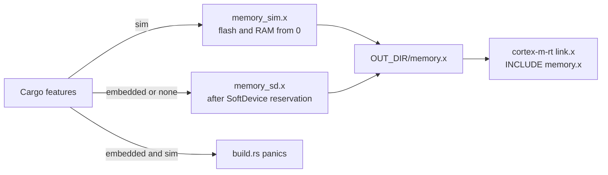

# Development Guide

This guide is for people changing the bt2usb firmware. It covers the pinned
toolchain, the three build configurations, every `mask` task, the Cargo and
environment settings that change a build, the devcontainer and Windows setups,
how to add the common kinds of capability, and how to fix the setup problems
the repository is known to produce.

Verification layers and the test map are in [testing](testing.md). Lint,
`unsafe`, coverage, dependency, and size rules are in
[code quality](code-quality.md). The reasons behind the structure are in the
[ADRs](architecture.md#accepted-adrs); toolchain and task pinning is
[ADR 0013](adr/0013-pinned-toolchain-and-mask-tasks.md).

## Repository Layout

```text
.
├── src/
│   ├── main.rs            bridge firmware entry point (feature `embedded`)
│   ├── selftest.rs        board bring-up image (feature `embedded`)
│   ├── sim.rs             Renode entry point (feature `sim`)
│   ├── lib.rs             host-test library of hardware-free modules
│   ├── config.rs          compile-time timing, USB, and storage constants; pin notes
│   ├── sd_setup.rs        SoftDevice configuration shared by bridge and self-test
│   ├── power.rs           activity and USB-suspend tracking (task side)
│   ├── power_logic.rs     pure power and display policy
│   ├── stack.rs           painted-stack high-water measurement
│   ├── ble/               scanning, connection workers, coordinator, GATT HID client
│   ├── hid/               report types, descriptors, aggregation, delivery, wake
│   ├── usb/               composite USB HID device
│   ├── storage.rs, storage/  pairing store and its framing/codec
│   ├── ui/                display, buttons, UI state machine
│   └── lib_tests.rs, lib_logic_tests.rs, hid_descriptor_tests.rs
│                          host test modules included by lib.rs
├── tests/                 host integration tests
├── renode/                platform description, GPIO/GPIOTE models, Robot test
├── scripts/               release helper and tests, Renode installer, WSL tool shim
├── vendor/nrf-softdevice/ pinned upstream crate with a small reviewed patch
├── .cargo/config.toml     probe-rs runner, ARM link flags, default DEFMT_LOG
├── .devcontainer/         VS Code devcontainer and its setup script
├── .github/               CI workflow, Dependabot, issue templates
├── Cargo.toml, Cargo.lock features, binaries, profiles, locked dependency graph
├── rust-toolchain.toml    pinned compiler, components, and ARM target
├── memory_sd.x            linker memory map for SoftDevice builds
├── memory_sim.x           linker memory map for the simulation
├── build.rs               linker-script selection and feature guards
├── maskfile.md            task recipes (`mask <task>`)
├── docs/                  guides and architecture decision records
└── TODO.md                complete work plan, done and open
```

The [architecture source map](architecture.md#source-map) describes what each
module is responsible for.

## Getting Started

Pick the path that matches what you have. Each one builds on the one before
it, and every command runs from the repository root.

1. **No hardware: host tests.** Needs rustup on Linux, macOS, or Windows.
   rustup reads [rust-toolchain.toml](../rust-toolchain.toml) and selects Rust
   1.95.0 with rustfmt, Clippy, and the ARM target; if that toolchain is
   missing, install it as shown under [Toolchain](#toolchain). Then run
   `mask test`, or without mask (for example in PowerShell)
   `cargo test --locked --lib --tests`. `mask ci` adds formatting, the three
   Clippy configurations, and the firmware and simulation builds. The
   release-helper tests also need Python 3.11 or newer.
2. **Simulation on Linux or WSL2.** Needs path 1, mask, Bash, `curl`, and
   `python3`. Run `mask sim-setup` once: it installs portable Renode and the
   Robot Framework packages under your home directory without root, and
   prints the line to add when `~/.local/bin` is not on `PATH`. Then run
   `mask sim-test` for the headless Renode scenario, or `mask sim` for the
   interactive window. No probe or board is needed
   ([Renode simulation](testing.md#renode-simulation)).
3. **A board.** Needs path 1, mask, `probe-rs` (`probe-rs-tools`), `curl`,
   `unzip`, an nRF52840-DK with its debug probe, and the OLED and buttons
   wired as in [hardware](hardware.md#parts-and-wiring). Run
   `mask probe-list` to see the probe, `mask softdevice` once per board to
   install S140 v7.3.0, `mask selftest` to check the board stage by stage, and
   `mask run --release` to flash the bridge and stream its logs. Then work
   through the [first-flash checklist](first-flash.md) and record the result.
   From WSL2, attach the probe first
   ([probe access](#probe-access-from-wsl2)).

## Toolchain

Use Rust through rustup. [rust-toolchain.toml](../rust-toolchain.toml) pins the
compiler used by the project, and [Cargo.lock](../Cargo.lock) pins dependency
resolution. Build and test with `--locked`; update dependencies intentionally in
a reviewed change. The BLE stack is based on a pinned upstream revision with a
small vendored patch (offset reads, timeout errors, and bounded discovery); see
[vendor notes](../vendor/nrf-softdevice/README.bt2usb.md) before updating it.

```sh
rustup target add thumbv7em-none-eabihf
rustup component add rustfmt clippy llvm-tools-preview
cargo install --locked mask --version 0.11.7
cargo install --locked probe-rs-tools --version 0.32.0
cargo install --locked cargo-llvm-cov --version 0.9.1
cargo install --locked cargo-binutils --version 0.4.0
cargo install --locked cargo-bloat --version 0.12.1
```

Only the compiler is needed for host tests. ARM builds need the target; flashing
needs `probe-rs` and a probe; coverage and size analysis need the corresponding
optional Cargo tools. Tool installation may require system libraries on the host.
Once mask is installed, `mask deps` runs the same installs. The Cargo tool
versions are pinned in three places that must change together: the `deps` and
`coverage-install` recipes in [maskfile.md](../maskfile.md),
[post-create.sh](../.devcontainer/post-create.sh), and the commands above.

| Tool | Version and where it is pinned | Needed for |
| --- | --- | --- |
| Rust compiler and Cargo | 1.95.0: `channel` in `rust-toolchain.toml`; `rust-version = "1.95"` in `Cargo.toml` | Everything |
| rustfmt, Clippy | `components` in `rust-toolchain.toml` (toolchain profile `minimal`) | `mask fmt`, `mask clippy`, `mask ci`, CI |
| `thumbv7em-none-eabihf` target | `targets` in `rust-toolchain.toml` | Bridge, self-test, and simulation builds |
| LLVM tools component | Matches the pinned toolchain but is not listed in `rust-toolchain.toml`; added by `mask deps`, `mask coverage-install`, the devcontainer setup, and the CI embedded job | `cargo-llvm-cov`, `mask size`, CI's `llvm-objcopy` HEX conversion |
| probe-rs (`probe-rs-tools`) | 0.32.0 in `mask deps` and the devcontainer setup | Cargo runner, `mask run`, `flash`, `selftest`, `rtt`, `probe-list`, `softdevice` |
| mask | 0.11.7 in `mask deps`, the devcontainer setup, and the `maskfile.md` header | Task recipes |
| cargo-llvm-cov | 0.9.1 in `mask coverage-install` (run by `mask deps`) and the devcontainer setup | `mask coverage*` |
| cargo-tarpaulin | 0.37.5 in the install hint `mask coverage` prints; optional, Linux only | Coverage fallback |
| cargo-binutils | 0.4.0 in `mask deps` and the devcontainer setup | `mask size` |
| cargo-bloat | 0.12.1 in `mask deps` (the devcontainer does not install it) | `mask bloat` |
| cargo-audit | 0.22.2 in the CI `audit` job | Dependency audit |
| actionlint | 1.7.12 plus SHA-256 in [ci.yml](../.github/workflows/ci.yml) | Workflow lint |
| Python | 3.11 or newer (`tomllib` in `scripts/release.py`) | Release helper and its tests |
| Renode | 1.16.1, default `RENODE_VERSION` in [install-renode.sh](../scripts/install-renode.sh) | `mask sim`, `mask sim-test` |
| Robot Framework stack | `robotframework==6.1`, `pyyaml==6.0.*`, `robotframework-retryfailed==0.2.0`, `telnetlib3==2.0.*`, `psutil>=5.9.8` in `install-renode.sh` | `renode-test` |
| SoftDevice S140 | 7.3.0, download URL in the `softdevice` recipe | Bridge and self-test on a board |
| Devcontainer base image | `mcr.microsoft.com/devcontainers/rust:1-bookworm` (tag, not digest) | Devcontainer |
| curl, unzip | System packages | `mask softdevice`; curl for `install-renode.sh` |
| usbipd-win | Not pinned; Windows host | Probe access from WSL2 |
| GitHub CLI | A version with `gh attestation verify` | [Verifying a release](deployment.md#verify-before-flashing) |
| VS Code `code` CLI, `xxd`, Dev Containers CLI | Not pinned | `mask devcontainer`, `mask devcontainer-build` |

rustup reads `rust-toolchain.toml` in the repository and selects 1.95.0 with
rustfmt, Clippy, and the ARM target. If that toolchain is missing, install it
explicitly:

```sh
rustup toolchain install 1.95.0 --profile minimal \
  --component clippy,rustfmt --target thumbv7em-none-eabihf
```

Release packaging refuses build metadata whose recorded compiler is not the
pinned 1.95.0, so do not override the toolchain (`cargo +stable`,
`RUSTUP_TOOLCHAIN`) for anything that becomes evidence. To reproduce CI's audit
locally, install the same version:

```sh
cargo install --locked cargo-audit --version 0.22.2
cargo audit
```

## Build Configurations

One source tree builds a host library and three ARM binaries. The `embedded`
and `sim` features select mutually exclusive configurations.

| Configuration | Command shape | Builds | Linker map | Critical section |
| --- | --- | --- | --- | --- |
| Host library and tests | `cargo test --locked --lib --tests` (no feature, no target) | `src/lib.rs` modules, `tests/integration.rs` | Not used | Not used |
| Firmware | `--features embedded --target thumbv7em-none-eabihf` | `bt2usb`, `bt2usb-selftest` | `memory_sd.x` | nrf-softdevice `critical-section-impl` |
| Simulation | `--features sim --target thumbv7em-none-eabihf` | `bt2usb-sim` | `memory_sim.x` | `cortex-m/critical-section-single-core` |

Binaries declare `required-features`, so a build without the matching feature
skips them; that is why host tests never try to link firmware. `embedded` also
turns on `cortex-m-rt/paint-stack`, which the
[stack high-water log](code-quality.md#binary-size-and-memory-budgets) relies
on; `sim` does not. The `defmt` feature, enabled by both firmware features,
switches on `defmt::Format` derives in the shared modules.

[build.rs](../build.rs) chooses the memory map by feature and refuses the
combined configuration:



The source maps are deliberately not named `memory.x`: rust-lld resolves
`INCLUDE memory.x` from the crate root before the search path, so a root
`memory.x` would silently replace the selected map. `build.rs` writes the
selected map after two symbols, `__bt2usb_storage_start` and
`__bt2usb_storage_end`, taken from `STORAGE_FLASH_START` and
`STORAGE_FLASH_END` in [config.rs](../src/config.rs), which it compiles in;
`memory_sd.x` asserts that `FLASH` ends at the first. `build.rs` reruns when
either map or `src/config.rs` changes, or when the `sim` feature toggles. The map contents are in
[hardware](hardware.md#memory-layout) and
[ADR 0010](adr/0010-static-memory-layout.md).

## Build And Check

Commands run from the repository root. The project deliberately has no global
Cargo target, so host tests use the native platform. Firmware commands select ARM
explicitly.

```sh
cargo fmt --package bt2usb -- --check
cargo clippy --locked --lib --tests -- -D warnings
cargo test --locked --lib --tests
cargo clippy --locked --features embedded --target thumbv7em-none-eabihf -- -D warnings
cargo build --locked --features embedded --target thumbv7em-none-eabihf --release
cargo clippy --locked --features sim --target thumbv7em-none-eabihf -- -D warnings
cargo build --locked --features sim --target thumbv7em-none-eabihf
python -B -m unittest discover -s scripts -p release_test.py -v
```

Build `embedded` and `sim` separately. The simulation supplies a different
critical-section implementation and excludes SoftDevice, USB, and flash drivers;
`--all-features` is not a supported firmware configuration.

Release-helper tests require Python 3.11 or newer. When changing GitHub Actions,
run `actionlint` as well; CI uses actionlint 1.7.12. The
[deployment guide](deployment.md) explains version and provenance checks.

Format only the application package, as CI does with `--package bt2usb`. The
vendored SoftDevice source carries a small reviewed patch and keeps its upstream
formatting: never run rustfmt on files under `vendor/`. With the current
manifest `cargo fmt`, and even `cargo fmt --all`, reach only bt2usb's own
targets, because the vendored crate is a `[patch]` replacement rather than a
workspace member; the ways vendor files do get reformatted are listed under
[troubleshooting](#rustfmt-changes-vendored-files).

[maskfile.md](../maskfile.md) wraps these tasks. Its recipes are Bash scripts.
On Windows, use WSL/Bash for mask tasks or run Cargo directly in PowerShell.

| Command | Purpose |
| --- | --- |
| `mask build --release` | Build firmware and self-test |
| `mask run --release` | Flash and run bridge with RTT logs |
| `mask selftest` | Flash board bring-up image |
| `mask test` | Host unit and integration tests |
| `mask coverage` | Coverage for host-testable modules |
| `mask check` / `mask clippy` | Embedded type check / lint |
| `mask ci` | Local software checks; see [what it covers](testing.md#local-and-ci-coverage-compared) |
| `mask sim-test` | Build simulation and run headless Renode test |
| `mask probe-list` | Discover available probes |
| `mask size` / `mask bloat` | Inspect release size |
| `mask doc` | Generate embedded API documentation |

The [mask command reference](#mask-command-reference) below lists all 31
recipes with their exact commands and options.

Flashing the bridge requires S140 to have been installed. Complete
[First flash](first-flash.md) before treating a successful download as a working
device. `mask run --release` updates the application; a full-chip erase also
removes SoftDevice and stored bonds.

## Mask Command Reference

Run `mask` from the repository root, where `maskfile.md` lives. Every recipe is
Bash. Recipes call `cargo`, `rustup`, and `probe-rs` through
[run-tool.sh](../scripts/run-tool.sh), which runs the tool from `PATH` or, if it
is not there, from the current user's Cargo bin directory (including the
Windows profile when called from WSL or Git Bash). Only three recipes take
options: `build` and `run` accept `--release`, and `coverage` accepts `--html`
or `--json`.

The target triple below is always `thumbv7em-none-eabihf`, abbreviated as
`<arm>`.

### Build

| Task | Runs | Notes |
| --- | --- | --- |
| `mask build` | `cargo build --locked --features embedded --target <arm>` | Dev profile (`opt-level = 1`); builds `bt2usb` and `bt2usb-selftest` into `target/thumbv7em-none-eabihf/debug/` |
| `mask build --release` | Same with `--release` | Release profile; output in `target/thumbv7em-none-eabihf/release/` |
| `mask build-release` | Same as `mask build --release` | Separate name for the same command |
| `mask check` | `cargo check --locked --features embedded --target <arm>` | Type-check only; nothing is linked, so the linker-script assertions do not run |
| `mask clean` | `cargo clean` | Deletes `target/`, including the simulation ELF that Renode loads |

### Board, Probe, And Logs

| Task | Runs | Notes |
| --- | --- | --- |
| `mask run` | `cargo run --locked --features embedded --target <arm> --bin bt2usb` | Dev build. Cargo's runner, `probe-rs run --chip nRF52840_xxAA`, flashes it and streams defmt logs until stopped |
| `mask run --release` | Same with `--release` | The normal way to flash and watch the bridge |
| `mask flash` | Same command as `mask run --release` | Also stays attached for logs |
| `mask flash-debug` | Same command as `mask run` | Every profile has RTT logging; this only selects the dev profile |
| `mask selftest` | `cargo run --locked --features embedded --target <arm> --release --bin bt2usb-selftest` | Needs S140; prints one `[PASS]`, `[FAIL]`, or `[SKIP]` line per stage. Flash the bridge afterwards |
| `mask softdevice` | Downloads `s140_nrf52_7.3.0.zip` from Nordic with `curl` only when `s140_nrf52_7.3.0_softdevice.hex` is missing, extracts the hex, then always runs `probe-rs download s140_nrf52_7.3.0_softdevice.hex --chip nRF52840_xxAA --format hex` | Stops on download or extraction failure. Checks no digest, of a download or of an existing hex. The hex stays in the repository root, excluded by `.gitignore`; do not commit it ([SoftDevice installation](deployment.md#softdevice-installation)) |
| `mask rtt` | `probe-rs attach --chip nRF52840_xxAA target/thumbv7em-none-eabihf/release/bt2usb` | Attaches to a running board without flashing. The ELF must be the release bridge that is on the board |
| `mask probe-list` | `probe-rs list` | First check for any probe problem |

### Host Tests, Lint, And Formatting

| Task | Runs | Notes |
| --- | --- | --- |
| `mask test` | `cargo test --locked --lib --tests` | Native host; library unit tests and `tests/integration.rs` |
| `mask test-verbose` | Same with `-- --nocapture` | Shows test output |
| `mask clippy` | `cargo clippy --locked --features embedded --target <arm> -- -D warnings` | Embedded configuration only; host and simulation Clippy run in `mask ci` |
| `mask fmt` | `cargo fmt` | Formats the bt2usb package only |
| `mask fmt-check` | `cargo fmt -- --check` | Same files as CI's `--package bt2usb` with the current manifest |
| `mask ci` | Format check; Clippy for host, embedded, and simulation; host tests; release firmware build; simulation build | `set -e` stops at the first failure; success prints `=== All checks passed! ===` |

`mask ci` does not run the release-helper tests, actionlint, rustdoc, the
audit, or Renode. The [testing guide](testing.md#local-and-ci-coverage-compared)
compares it with CI.

### Coverage

| Task | Runs | Notes |
| --- | --- | --- |
| `mask coverage` | `cargo llvm-cov --locked --lib --tests` when `cargo llvm-cov --version` succeeds; otherwise `cargo tarpaulin --locked --lib --tests --out Stdout`, so both tools measure the same unit and integration tests | Prints `No coverage tool found.` and exits 1 if neither tool runs |
| `mask coverage --html` | llvm-cov: `--html --output-dir coverage-html`; tarpaulin: `--out Html --output-dir coverage` | Prints the report path; does not open a browser |
| `mask coverage --json` | llvm-cov: `--json --output-path coverage.json`; tarpaulin: `--out Json --output-dir coverage` | If both flags are given, `--html` wins |
| `mask coverage-html` | Same as `mask coverage --html` | |
| `mask coverage-json` | Same as `mask coverage --json` | |
| `mask coverage-install` | `cargo install --locked cargo-llvm-cov --version 0.9.1`, then `rustup component add llvm-tools-preview` | Does not install tarpaulin; the `mask coverage` hint gives its pinned command |

The report files each tool writes are listed under
[coverage in the testing guide](testing.md#coverage). What coverage measures,
why a tarpaulin figure is not comparable with an llvm-cov one, and how to
report a figure are in [code quality](code-quality.md#coverage).

### Simulation

| Task | Runs | Notes |
| --- | --- | --- |
| `mask sim-setup` | `bash scripts/install-renode.sh` | Linux/WSL only, no root, idempotent. Installs portable Renode 1.16.1 under `~/.local/share/renode`, `renode` and `renode-test` wrappers in `~/.local/bin`, and the Robot Python packages with `pip --user` |
| `mask sim-build` | `cargo build --locked --features sim --target <arm>` | Debug ELF at `target/thumbv7em-none-eabihf/debug/bt2usb-sim` |
| `mask sim` | Builds, then `renode renode/bt2usb-sim.resc` | Interactive; UART0 appears in a Renode analyzer window. Exits 127 with `Renode not found on PATH` when `renode` is missing |
| `mask sim-test` | Builds, then `renode-test renode/bt2usb-sim.robot` | Headless; exits 127 with `renode-test not found on PATH` when it is missing |

Never flash `bt2usb-sim` to a board: it links from address 0, where the board
keeps the SoftDevice. The scenario and assertions are described in
[testing](testing.md#renode-scenario-map).

### Size And Documentation

| Task | Runs | Notes |
| --- | --- | --- |
| `mask size` | `cargo size --locked --features embedded --target <arm> --release --bin bt2usb -- -A` | Per-section sizes of the release bridge; needs cargo-binutils and the LLVM tools component |
| `mask bloat` | `cargo bloat --locked --features embedded --target <arm> --release --bin bt2usb -n 30` | The 30 largest functions |
| `mask doc` | `cargo doc --locked --features embedded --target <arm> --open` | Firmware API documentation, dependencies included. Warnings are not denied here; CI denies them only for the host library |

### Environment Setup

| Task | Runs | Notes |
| --- | --- | --- |
| `mask deps` | `rustup target add thumbv7em-none-eabihf`; `cargo install --locked` of probe-rs-tools 0.32.0, cargo-binutils 0.4.0, cargo-bloat 0.12.1, and mask 0.11.7; `mask coverage-install`; `rustup component add llvm-tools` | Needs mask already. Does not install Renode, cargo-audit, or actionlint |
| `mask devcontainer` | `code --folder-uri "vscode-remote://dev-container+<hex of $PWD>/workspaces/bt2usb"` | Opens the folder in the devcontainer; needs VS Code's `code` CLI and `xxd` |
| `mask devcontainer-build` | `devcontainer build --workspace-folder .` | Needs the Dev Containers CLI |

## Cargo Configuration

### `.cargo/config.toml`

[.cargo/config.toml](../.cargo/config.toml) holds settings that apply to every
Cargo command in the repository:

| Setting | Value | Effect |
| --- | --- | --- |
| `build.target` | Not set | Host tests build for the native platform; firmware tasks pass `--target` |
| `runner` for `cfg(all(target_arch = "arm", target_os = "none"))` | `probe-rs run --chip nRF52840_xxAA` | `cargo run` on any ARM bare-metal binary flashes it and streams RTT |
| `rustflags` for the same cfg | `-C link-arg=-Tlink.x`, `-C link-arg=-Tdefmt.x`, `-C link-arg=--nmagic` | cortex-m-rt linker script, defmt section script, no page alignment |
| `[env] DEFMT_LOG` | `debug` | Default defmt log filter for local builds |

There is no flip-link. nrf-softdevice reports `__sdata` to the SoftDevice as
the application RAM base, and flip-link would move `.data` above the stack, so
`memory_sd.x` asserts the layout instead. Cargo also merges configuration from
parent directories and `$CARGO_HOME/config.toml`; a personal linker or
`rustflags` setting for ARM targets applies to this repository too.

### `Cargo.toml`

| Section | Content |
| --- | --- |
| `[package]` | Edition 2021, `rust-version = "1.95"`, `license = "GPL-3.0-only"`, version used for release tags |
| `[lib]` | `bt2usb` from `src/lib.rs`, the host-test library |
| `[[bin]]` | `bt2usb` and `bt2usb-selftest` require `embedded`; `bt2usb-sim` requires `sim` |
| `[features]` | `embedded`, `sim`, and `defmt`; no default features. Every firmware dependency except `heapless` is optional |
| `[patch.'https://github.com/embassy-rs/nrf-softdevice']` | Replaces `nrf-softdevice` with `vendor/nrf-softdevice`; `nrf-softdevice-s140` stays a git dependency at the same revision |
| `[profile.release]` | `opt-level = "s"`, `lto = "fat"`, `codegen-units = 1`, `debug = 2` (DWARF for probe-rs), `incremental = false` |
| `[profile.dev]` | `opt-level = 1`, commented as required by SoftDevice timing |

Neither profile overrides `overflow-checks`, so Cargo's defaults apply: a dev
build panics on integer overflow, and a release build wraps.

## Environment Variables

| Variable | Read by | Default | Purpose |
| --- | --- | --- | --- |
| `DEFMT_LOG` | defmt at compile time; `scripts/release.py stage` | `debug` from `.cargo/config.toml`; `info` in CI | Log filter compiled into the firmware |
| `RENODE_VERSION` | `install-renode.sh` | `1.16.1` | Renode release to install |
| `RENODE_DIR` | `install-renode.sh` | `$HOME/.local/share/renode` | Install location |
| `BIN_DIR` | `install-renode.sh` | `$HOME/.local/bin` | Location of the `renode` and `renode-test` wrappers |
| `CARGO_HOME`, `HOME`, `USERPROFILE`, `USERNAME` | `run-tool.sh` | Shell environment | Where to look for a tool that is not on `PATH` |
| `RUSTDOCFLAGS` | `cargo doc` | Unset locally; `-D warnings` in CI | Deny rustdoc warnings |
| `RUSTUP_TOOLCHAIN` | rustup | Unset | Overrides `rust-toolchain.toml`; leave it unset |
| `CARGO_TARGET_DIR` | Cargo | Unset | Moves `target/`. `mask rtt`, the Renode script, the Robot test, and the CI staging step assume `target/` |
| `CARGO_FEATURE_SIM`, `CARGO_FEATURE_EMBEDDED` | `build.rs` | Set by Cargo from `--features` | Memory-map selection and the feature guard; never set them by hand |
| `GITHUB_SHA`, `GITHUB_REF`, `GITHUB_REPOSITORY`, `GITHUB_RUN_ID`, `GITHUB_RUN_ATTEMPT`, `GITHUB_OUTPUT` | `scripts/release.py` | Set by GitHub Actions | Build identity in `BUILD-INFO.json`; tag outputs |
| `CARGO_TERM_COLOR`, `PYTHONDONTWRITEBYTECODE` | CI workflow | `always`, `1` | Log color; no `.pyc` files |

The Robot test accepts `--variable ELF:/abs/path` and
`--variable PLATFORM:@/abs/nrf52840.repl`; the interactive script accepts
`renode -e "$bin=@/abs/path" renode/bt2usb-sim.resc`.

### Log Levels

`DEFMT_LOG` is read when the firmware is compiled; changing it requires a
rebuild, not a reflash with different settings. The levels are `trace`,
`debug`, `info`, `warn`, `error`, and `off`, and defmt also accepts
per-module filters such as `info,bt2usb::ble=debug`. This section covers how
the level is chosen; what each level reveals about peers and typing is in
[logging and privacy](security.md#logging-and-privacy), which also says why
`trace` must never be used on a unit for real typing.

| Level | Use |
| --- | --- |
| `debug` | Local default from `.cargo/config.toml`. Adds the application's two `debug!` sites and debug output from dependencies built with their `defmt` feature |
| `info` | CI and release builds. `release.py package` rejects build metadata whose `defmt_log` is not `info` |
| `warn` | Hides the self-test's `[PASS]` lines, which are `info`; avoid for bring-up |
| `trace` | Never on a unit used for real typing ([why](security.md#logging-and-privacy)) |

Cargo's `[env]` does not override a variable that is already set, so an
exported `DEFMT_LOG` wins over the config file:

```sh
DEFMT_LOG=info cargo build --locked --features embedded --target thumbv7em-none-eabihf --release
```

`release.py stage` records `DEFMT_LOG` from its own environment and assumes
`info` when it is unset; it cannot see the value Cargo applied from the config
file. Set `DEFMT_LOG` explicitly for both the build and the staging command
when you reproduce the CI staging step locally.

## Devcontainer And WSL2

The VS Code [.devcontainer](../.devcontainer/) installs Rust embedded tools and
uses a privileged container for probe access. It does not require a
`/dev/bus/usb` mount at startup. Review that privilege when using it on a shared
development host.

1. Attach the probe from Windows to WSL with `usbipd-win`.
2. Reopen the repository in the VS Code devcontainer.
3. Run `mask probe-list` and the host tests.

The probe and the board's native USB HID connection are separate. Keep the native
USB port attached to the PC whose enumeration/input behavior you are testing.

### What The Devcontainer Sets Up

[devcontainer.json](../.devcontainer/devcontainer.json) starts
`mcr.microsoft.com/devcontainers/rust:1-bookworm` as user `vscode` with
`--privileged`. [post-create.sh](../.devcontainer/post-create.sh) then:

1. adds the `thumbv7em-none-eabihf` target
2. installs `probe-rs-tools` 0.32.0, `mask` 0.11.7, `cargo-llvm-cov` 0.9.1, and
   `cargo-binutils` 0.4.0 with `cargo install --locked` (each with the
   lockfile it was published with)
3. adds the `llvm-tools` and `llvm-tools-preview` components
4. writes `/etc/udev/rules.d/69-probe-rs.rules` for J-Link (`1366`), the listed
   ST-Link IDs (`0483`), CMSIS-DAP products, and Nordic (`1915`) devices, but
   only when `probe-rs` and `sudo` are available; otherwise it prints a warning
   and continues
5. prints tool versions and runs `cargo test --locked --lib --tests`; setup
   fails if the host tests fail

It does not install Renode, cargo-bloat, cargo-audit, or actionlint; run
`mask sim-setup` inside the container for the simulation.

The editor settings point rust-analyzer at the firmware: target
`thumbv7em-none-eabihf`, feature `embedded`, and `checkOnSave.allTargets`
disabled. Its check-on-save diagnostics therefore cover the bridge and
self-test, not `sim.rs` or the host test modules; run `mask ci` for those.
`editor.formatOnSave` is on with rust-analyzer as formatter, which matters for
[vendored files](#rustfmt-changes-vendored-files).

### Probe Access From WSL2

With usbipd-win 4.x, from an administrator PowerShell on Windows:

```powershell
usbipd list
usbipd bind --busid <BUSID>          # once per device
usbipd attach --wsl --busid <BUSID>  # after every replug or WSL restart
```

On an nRF52840-DK the probe is the on-board SEGGER J-Link (vendor ID `1366`) on
the debugger USB port. Do not attach the board's nRF USB port to WSL; it must
stay with the host whose HID behavior you are testing. Then check `lsusb` and
`mask probe-list` inside WSL or the container. Problems are under
[WSL cannot see the probe](#wsl-cannot-see-the-probe) and
[probe not found](#probe-not-found).

## Windows And PowerShell

Mask recipes are Bash, so use WSL or Git Bash for `mask`. The Cargo and Python
commands behind them also work directly in PowerShell; CI runs its host job on
`windows-latest` that way.

| Goal | PowerShell |
| --- | --- |
| Host tests | `cargo test --locked --lib --tests` |
| Format check | `cargo fmt --package bt2usb -- --check` |
| Host Clippy | `cargo clippy --locked --lib --tests -- -D warnings` |
| Firmware build | `cargo build --locked --features embedded --target thumbv7em-none-eabihf --release` |
| Release-helper tests | `python -m unittest discover -s scripts -p "release_test.py" -v` |
| Host rustdoc with warnings denied | `$env:RUSTDOCFLAGS = "-D warnings"; cargo doc --locked --no-deps --lib` |
| Release-level logs | `$env:DEFMT_LOG = "info"` before the build |

Flashing from PowerShell uses the same `cargo run` commands as the mask
recipes and needs `probe-rs` on the Windows `PATH`; no validation record covers
this path yet. Renode must run in WSL: `install-renode.sh` refuses other
systems.

From WSL, `run-tool.sh` falls back to the current Windows user's
`.cargo\bin` when a tool is not on the Linux `PATH`, so a WSL shell can drive a
Windows Rust install. A tool found that way runs as a Windows program, with
Windows paths and USB devices; check which one ran when results differ.
[.gitattributes](../.gitattributes) keeps scripts, `maskfile.md`, Renode files,
and sources at LF line endings on every platform.

## Making A Change

Keep hardware-free decisions in the shared pure modules and asynchronous I/O in
the task layer. Add regression tests for behavior changes, particularly malformed
reports, bounded-buffer handling, reconnect transitions, and releases of held
inputs. Do not introduce dynamic allocation into firmware paths without an
explicit design review.

Changes that cross an [ADR process](architecture.md#adr-process) trigger
(task boundaries, persisted formats, USB descriptors, BLE security, memory map,
release flow) add or supersede an ADR in the same commit.

Run the relevant commands above and record which passed. Changes to pins, timing,
BLE security, flash, USB descriptors, or power also need the applicable hardware
checks. Include limitations and skipped checks in the review. Update
[TODO.md](../TODO.md) as its
[updating rules](../TODO.md#updating-this-checklist) describe: check an item
only with evidence and add new work as an unchecked item with a priority and
an acceptance criterion. Update the specific guide when behavior or commands
change.

Do not include private bond keys, raw memory dumps, or unsanitized input capture
in a public issue. See the [security policy](../SECURITY.md).

### Checks By Change

| You changed | Run before review | Also needed |
| --- | --- | --- |
| A module listed in `src/lib.rs` | `mask test`, then `mask ci` | `mask sim-test` for `coordinator` or `ui_logic` |
| Task, driver, or entry-point code | `mask ci` | The affected [first-flash](first-flash.md) steps on a board |
| `sim.rs`, `ui/buttons.rs`, or `renode/` | `mask ci`, `mask sim-test` | |
| `Cargo.toml`, `Cargo.lock`, or `vendor/` | `mask ci`, `mask sim-test`, `cargo audit` | Board checks when a HAL, USB, SoftDevice, or storage crate moved |
| `memory_sd.x`, storage constants, or `build.rs` | `mask ci`, `mask size` | Self-test flash stage and the `softdevice RAM` log |
| `.github/workflows/ci.yml` | `actionlint` | A hosted run |
| `scripts/release.py` | Release-helper tests | The first hosted tag run ([deployment](deployment.md#validation-limits)) |
| `maskfile.md` or `scripts/*.sh` | Run the changed recipe or script in Bash | |
| Documentation only | Check links and quoted constants by hand | |

The [code-quality review checklist](code-quality.md#review-checklist) lists
what a reviewer checks.

## Adding A Capability

Each walkthrough names the files to touch, the tests to add, the documents to
update, and when an ADR is required. The compiler enforces some of these
steps through exhaustive `match` statements; the others are only caught by
review.

### Add A Configuration Constant

Files:

- [config.rs](../src/config.rs): add a `pub const` under its section comment
  (BLE, USB, GPIO, paired-device storage) with a `///` comment that states the
  unit. Existing names carry the unit (`_SECS`, `_MS`) or say it in the comment
  ("1.25 ms units", "10 ms units").
- The module that uses it. `config.rs` is compiled into the three binaries
  (`mod config;` in `main.rs`, `selftest.rs`, and `sim.rs`), the host library
  (`pub mod config;` in `lib.rs`), and `build.rs`, so it holds `pub const`
  items only, with no imports. A pure module may read a capacity from it,
  such as `crate::config::BLE_MAX_CONNECTIONS`, so the host tests and the
  firmware use the same size. Behavior settings are better passed in as
  parameters, which lets a host test try other values:
  [power.rs](../src/power.rs) passes `SCREEN_AUTO_OFF_ENABLED` and
  `SCREEN_AUTO_OFF_TIMEOUT_SECS` into `power_logic::screen_should_be_on`.

The bridge has no crate-level `dead_code` allowance, so a constant that
`main.rs`'s module tree never reads fails `mask clippy`. The self-test and
simulation allow dead code at crate level and will not flag it.

Shared capacities are derived from `config.rs`, so a change follows
everywhere (the [hardware guide](hardware.md#constants-outside-configrs) lists
constants defined outside `config.rs`). `config.rs` must keep holding
constants only: `build.rs` compiles it too, so an import or a reference to
another module fails every build.

| Value | Derived from it |
| --- | --- |
| `BLE_MAX_CONNECTIONS` (2) | `coordinator::MAX_CONNECTIONS`, `hid::aggregate::SOURCES`, `usb::hid_device::LED_CONSUMERS`, `multi_conn::SlotSenders`, `conn_count`/`central_role_count`/`central_sec_count` in `sd_setup.rs`, and in `main.rs` the `BLE_SLOT_CMD_CHANNELS` array and the `ble_slot_task` pool, spawned once per slot |
| `BLE_MAX_DISCOVERED` (8) | `UiState::devices` capacity in `ui/ui_logic.rs`, the scan result list in `scanner.rs` |
| `MAX_PAIRED_DEVICES` (4) | `UiState::paired_names` capacity, the `paired` snapshot in `main.rs`, the saved-device list in `BleEvent`, and the store |
| `STORAGE_FLASH_PAGE_START`/`COUNT` | `STORAGE_FLASH_START`/`END`, used by the store, the self-test, and `build.rs`; the linker fails if `FLASH` in `memory_sd.x` disagrees |

The firmware and simulation build with any link count. The host tests encode
the two-link behavior (two-slot arrays and expectations in `reconnect.rs` and
`management.rs`), so they stop compiling when `BLE_MAX_CONNECTIONS` changes
and must be revised with it.

Tests: a boundary test in the pure module that consumes the value. Docs: the
[configuration defaults](hardware.md#configuration-defaults) table, and any
guide that quotes the value (features and first-flash quote timeouts). ADR: a
change to the memory map or flash partition, BLE security, USB identity, or
the two-slot design is an ADR trigger
([ADR 0005](adr/0005-two-slots-and-independent-endpoints.md),
[ADR 0010](adr/0010-static-memory-layout.md)). Timing values need board
evidence.

### Change A Pin Assignment

Pins are not constants. They are instantiated as `embassy_nrf` peripherals:

| File | Pins |
| --- | --- |
| [main.rs](../src/main.rs) | `P0_11`, `P0_12`, `P0_24` buttons; `P0_26` SDA, `P0_27` SCL |
| [selftest.rs](../src/selftest.rs) | The same, plus the stage names `button UP (P0.11)` and similar |
| [sim.rs](../src/sim.rs) | The three buttons; UART0 on `P0_08` (RX) and `P0_06` (TX) |
| [config.rs](../src/config.rs) | The pin comment block |
| [bt2usb-sim.robot](../renode/bt2usb-sim.robot), [bt2usb-sim.resc](../renode/bt2usb-sim.resc) | `${PIN_UP}`, `${PIN_DOWN}`, `${PIN_SELECT}`; the `OnGPIO` examples |

Update [hardware](hardware.md#parts-and-wiring), the
[first-flash](first-flash.md) wiring table, and the GPIO commands in
[testing](testing.md#renode-simulation). Run `mask sim-test`, then the
self-test button and OLED stages on the board.

### Add A UI Screen Or Button Action

Files:

- [ui/ui_logic.rs](../src/ui/ui_logic.rs): add the `Screen` variant, its
  transitions in `on_button`, and, if it asks the BLE side for work, a
  `UiCommand` variant. `on_button` ends in `_ => {}`, so a missing transition
  silently ignores the button; add explicit arms. `UiState` holds the view
  model the display renders.
- [ui/display.rs](../src/ui/display.rs): `draw_view` matches every `Screen`, so
  the compiler requires a rendering. Text uses `FONT_6X10` on a 128-pixel-wide
  panel, which fits 21 characters per line; `UiState::message` holds at most
  32 bytes.
- [main.rs](../src/main.rs): the button arm maps each `UiCommand` to a
  `BleCommand` in an exhaustive `match`. Management commands go through
  `ManagementRequests`, which allows one at a time, ignores buttons while
  one is pending, and gives up after `UI_MANAGEMENT_TIMEOUT_SECS`. The first press while the display is off only wakes it.
- [sim.rs](../src/sim.rs): the simulation matches `UiCommand` exhaustively and
  logs each command, so the `sim` build fails until the new variant is handled.

A new physical button also needs a pin, a `ButtonEvent` variant, a button task
in `main.rs` and `sim.rs`, a `check_button` stage in `selftest.rs`, and a
Renode pin.

Tests: transitions next to the existing `on_button` tests in `ui_logic.rs`,
including the ignored combinations. Extend the Robot test only when the screen
is reachable in the simulation's scenario. Docs:
[features](features.md#using-the-bridge) (controls and screen flow); the
first-flash checklist when it adds an acceptance step. ADR: only when the
change alters the display-task isolation
([ADR 0009](adr/0009-isolated-display-task.md)) or adds a task or channel.

### Add A BLE Command Or Event

Files:

- [ble/mod.rs](../src/ble/mod.rs): `BleCommand` and `BleEvent` (firmware only,
  `defmt::Format`). A management command carries `id: u32` so the UI can reject
  a stale reply.
- [ble/coordinator.rs](../src/ble/coordinator.rs): put the decision in a pure
  planner or reducer that returns `Action`s (`plan_connect`,
  `on_slot_link_lost`, and so on). A new failure needs an `ErrorTag` variant,
  and `ble_error_message` in `main.rs` must then map it to a message of at most
  21 characters.
- [ble/multi_conn.rs](../src/ble/multi_conn.rs): handle the command in
  `ble_task`, and add `SlotCommand`/`SlotEvent` variants if a connection worker
  must act. Scan and connection setup must hold `GAP_PROCEDURE`, because the
  SoftDevice runs one such procedure at a time.
- [ble/management.rs](../src/ble/management.rs): quiescence and commit
  primitives for anything that changes stored peers.
- [main.rs](../src/main.rs): send with `BLE_CMD_CHANNEL.try_send`, never an
  awaited send, so a full command channel cannot deadlock the UI against the
  BLE task; handle the new event in the fourth `select4` arm.
- [sim.rs](../src/sim.rs): `log_action` matches `Action` and `UiEvent`
  exhaustively; add a log line for a new variant.

Tests: reducer cases in
[coordinator_tests.rs](../src/ble/coordinator_tests.rs), management cases in
`management.rs`, and UI cases for the reply in `ui_logic.rs`. Docs: the
[task and channel tables](architecture.md#tasks-and-data-flow), the
[channel contracts](data-model.md#task-channel-contracts), and features.
ADR: a new task or channel, a changed capacity contract, or any pairing or
bonding change ([ADR 0011](adr/0011-interim-just-works-pairing.md)). Board
evidence: first-flash sections 4 and 6.

### Add Or Change A HID Report Type

Files:

- [hid/keyboard.rs](../src/hid/keyboard.rs), [mouse.rs](../src/hid/mouse.rs),
  or [consumer.rs](../src/hid/consumer.rs): the report struct,
  `*_REPORT_SIZE`, `from_ble_bytes`, `serialize`, and the USB
  `*_REPORT_DESCRIPTOR`.
- [hid/mod.rs](../src/hid/mod.rs): the `HidReport` variant and its
  `serialize`, plus `parse_by_kind`, `classify_report_id_prefix`, and the
  length-based `infer_from_length` fallback.
- [hid/report_protocol.rs](../src/hid/report_protocol.rs): `ReportKind` and
  the descriptor parser's kind detection.
- [hid/aggregate.rs](../src/hid/aggregate.rs),
  [coalesce.rs](../src/hid/coalesce.rs),
  [delivery.rs](../src/hid/delivery.rs), and [wake.rs](../src/hid/wake.rs):
  per-source union, coalescing, endpoint delivery, and remote-wake rules.
- [usb/hid_device.rs](../src/usb/hid_device.rs): one `HidWriter` per interface
  with `max_packet_size: 8` and `HidWriter<'static, UsbDriver, 8>`, boot
  protocol handling, the endpoint mailboxes, and 256-byte descriptor buffers.
  A report longer than 8 bytes needs these sizes, the 8-byte buffer in
  `UsbReportSink::write`, and `hid_writer_task` in `main.rs` changed together.
- [ble/hid_client.rs](../src/ble/hid_client.rs): `MAX_REPORTS` (8) and
  `MAX_REPORT_LEN` (32) bound what discovery and notifications accept.
- [selftest.rs](../src/selftest.rs) sends an all-zero mouse report; recheck it
  when the mouse format changes.

Tests: parsing and serialization in [lib_tests.rs](../src/lib_tests.rs),
descriptor and routing cases (including every truncated descriptor prefix) in
[hid_descriptor_tests.rs](../src/hid_descriptor_tests.rs), held-input release
in the aggregation and delivery tests, and a round trip in
[tests/integration.rs](../tests/integration.rs). Docs: the
[report contracts](data-model.md#usb-hid-report-contracts),
[HID path and limits](architecture.md#hid-path-and-limits), and
features. ADR: a USB descriptor change is an ADR trigger, as is any change to
delivery, loss, or wake guarantees
([ADR 0005](adr/0005-two-slots-and-independent-endpoints.md)). Board evidence:
enumeration on each host, boot protocol in firmware setup, and first-flash
section 5.

### Change The Storage Format

Files:

- [storage/framing.rs](../src/storage/framing.rs): `MAGIC` (`0xB2`),
  `VERSION` (`0x01`), the frame writer and reader.
- [storage/record.rs](../src/storage/record.rs): `ADDRESS_RECORD_SIZE` (7),
  `BOND_RECORD_SIZE` (50), and record validation.
- [storage/codec.rs](../src/storage/codec.rs): address and bond byte codec
  over SoftDevice types.
- [storage.rs](../src/storage.rs): load and save rules, the legacy format,
  `KEY_PAIRED_DEVICES`, `MAX_RECORD_SIZE` (512) and its compile-time
  assertion, and the three-attempt write retry.
- [config.rs](../src/config.rs) and [memory_sd.x](../memory_sd.x) when the
  capacity or the reserved pages change; the self-test flash stage uses the
  same constants.

Only `framing.rs` and `record.rs` are compiled into the host library, and
only for tests (`#[cfg(test)]` in `lib.rs`); `storage.rs` and `codec.rs` are
not. Put new parsing and validation in the
pure files so the host tests reach it, and add fixtures for the new version,
every supported older version, and malformed and truncated input. Docs: the
[pairing store](data-model.md#pairing-store) and
[schema change rules](data-model.md#schema-change-rules), plus
[memory layout](hardware.md#memory-layout) for a region change. ADR: a
persisted-format change always needs one; amend or supersede
[ADR 0006](adr/0006-fail-closed-pairing-store.md). Board evidence: the
self-test flash stage, reboot reconnect, Forget and Factory reset, and what an
older firmware does with the new format (it must fail closed).

## Troubleshooting

### Probe Not Found

`mask probe-list` prints no probe:

1. Use the DK's debugger USB port (J2), not the nRF USB port, with a data cable,
   and power the board.
2. On Linux, a permission error means the device node is not accessible; the
   devcontainer writes probe-rs udev rules, but they apply only where udev
   processes them. Check the node's permissions with `ls -l /dev/bus/usb/*/*`
   and install equivalent rules on the WSL or Linux host if needed.
3. In WSL, attach the probe with usbipd-win again after every replug
   ([probe access](#probe-access-from-wsl2)), then confirm with `lsusb`.
4. If `probe-rs` itself is missing, `run-tool.sh` prints
   `Error: 'probe-rs' was not found in PATH or the current user's Rust install locations.`
   and exits 127; install `probe-rs-tools`.

### WSL Cannot See The Probe

In `usbipd list` on Windows, the probe's state column shows where it is:

| State | Meaning | Action |
| --- | --- | --- |
| Not shared | usbipd-win has not been allowed to export it | `usbipd bind --busid <BUSID>` from an administrator shell, once |
| Shared | Exported but not attached | `usbipd attach --wsl --busid <BUSID>`; repeat after every replug or WSL restart |
| Attached | WSL owns it | Run `lsusb` in WSL; if WSL lists it but the devcontainer does not, reopen the container after attaching |

While attached to WSL, the probe is unavailable to Windows programs, including
a Windows `probe-rs.exe` that `run-tool.sh` may fall back to. Attach only the
debugger port; the nRF USB port must stay with the host under test.

### Linker Errors From `memory_sd.x`

- `stack must sit at the top of RAM and .data at ORIGIN(RAM): the SoftDevice uses __sdata as APP_RAM_BASE (is flip-link in use?)`
  means something moved `.data` or the stack: flip-link configured as the
  linker (for example in a user-level Cargo config) or a custom
  `_stack_start`. Remove it; the SoftDevice would otherwise claim and
  write-protect the stack.
- A section that "will not fit in region `FLASH`" means the application
  outgrew its 804 KiB. Do not extend `FLASH` past `0xF0000`: the four pages
  from there hold the pairing store and are erased at runtime. Reduce size
  with `mask bloat`.
- `FLASH in memory_sd.x must end at STORAGE_FLASH_START in src/config.rs; change both together`
  means the `FLASH` length in `memory_sd.x` and `STORAGE_FLASH_PAGE_START` in
  `config.rs` describe different boundaries. Change both, together with the
  [memory map](hardware.md#memory-layout).
- `pairing storage (STORAGE_FLASH_PAGE_START/COUNT in src/config.rs) must end within the 1 MB of flash`
  means the page constants put the store past `0x00100000`.
- At runtime, not link time, `too little RAM for softdevice. Change your app's RAM start address to <addr>`
  is a SoftDevice panic. The address is printed in hex without a `0x` prefix.
  Set `RAM : ORIGIN` in `memory_sd.x` to that address and shrink `LENGTH` by
  the same amount, as in
  [first flash](first-flash.md#2-self-test-image).
- A `memory.x` in the repository root is silently used instead of the selected
  map. Delete it.

### Feature Conflict From `build.rs`

``features `embedded` and `sim` are mutually exclusive; build each separately``
is the build-script guard. It fires for `--all-features`, for
`--features embedded,sim`, and for an editor configured to enable all
features. Build each feature in its own command.

A firmware feature without `--target thumbv7em-none-eabihf` targets the host,
because there is no default target, and the `no_std`, `no_main` ARM binaries
do not support the host; this combination was not tried for this guide. Adding a global
`build.target` instead breaks `cargo test`, since the ARM target has no `std`
or test harness. If rustc reports it cannot find crate `core` for
`thumbv7em-none-eabihf`, the target is not installed for the active toolchain.

### rustfmt Changes Vendored Files

The files under `vendor/nrf-softdevice` do not follow rustfmt's default style,
and no rustfmt configuration is vendored with them: `rustfmt --check` on the
vendored crate, at commit `7fc99d6`, reports changes in 19 of its files. They
get reformatted when:

- an editor formats on save; the devcontainer enables `editor.formatOnSave`
  with rust-analyzer, so saving any vendored file rewrites it
- `rustfmt` is run on a vendored path directly
- `cargo fmt` is run from inside `vendor/nrf-softdevice`, where it formats that
  crate as its own package

`mask fmt`, `mask fmt-check`, and CI do not touch vendor files. If they were
reformatted, discard those changes with Git before committing; the
[vendor notes](../vendor/nrf-softdevice/README.bt2usb.md) and
[ADR 0007](adr/0007-vendored-softdevice-patch.md) describe the only intended
differences from upstream.

### Renode Not Found On PATH

`mask sim` prints `Renode not found on PATH. Install it from https://renode.io`
and `mask sim-test` prints `renode-test not found on PATH. Install Renode from https://renode.io`;
both exit 127. Run `mask sim-setup` in Linux or WSL, add `~/.local/bin` to
`PATH` (the installer prints the exact line when it is missing), and open a new
shell. Run Renode from the repository root: the `.resc` script resolves
`@renode/...` and `@target/...` from there. Robot dependency and timeout
problems are in [testing](testing.md#troubleshooting).

### Mask On Windows PowerShell

The recipes are Bash scripts. Run `mask` in WSL or Git Bash, or use the direct
commands in [Windows and PowerShell](#windows-and-powershell). A recipe or
script that fails with `bash\r` or `$'\r'` has CRLF line endings; `.gitattributes`
forces LF, so re-checkout files created before it applied. `install-renode.sh`
refuses to run outside Linux with `ERROR: this installer targets Linux/WSL2.`

### Garbled Or Missing Logs

`mask rtt` decodes with `target/thumbv7em-none-eabihf/release/bt2usb`. If the
board runs a debug build, the self-test, or an older release, flash again with
`mask run --release`, which decodes with the ELF it flashed. Missing `info`
lines mean the firmware was built with `DEFMT_LOG` at `warn` or above; rebuild.

## Related Guides

- [Architecture and ADRs](architecture.md)
- [Code quality](code-quality.md)
- [Testing](testing.md)
- [Hardware](hardware.md)
- [Data model](data-model.md)
- [First flash](first-flash.md)
- [Deployment](deployment.md)
- [ADR 0013: pinned toolchain and mask tasks](adr/0013-pinned-toolchain-and-mask-tasks.md)
- [Task reference](../maskfile.md)
