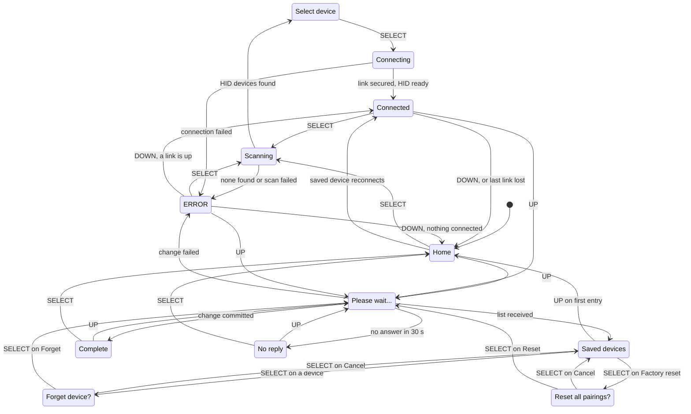
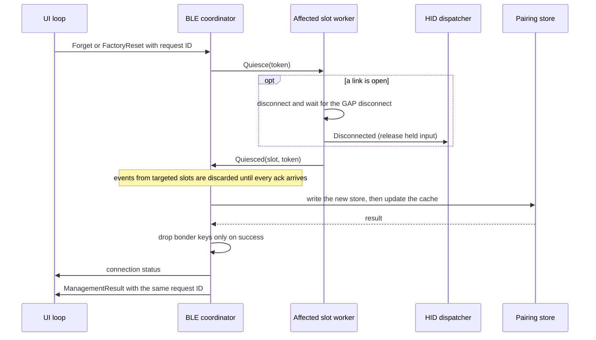

# Features

This guide is the complete catalog of behavior the bt2usb firmware implements
today, and the user guide for the device. Planned work lives in
[TODO.md](../TODO.md), which lists the same completed work as a checklist; this
guide describes it as behavior, grouped by capability. Anything not described
here is not implemented.

Every capability carries one of three evidence levels:

| Status | Meaning |
| --- | --- |
| Implemented | The source is present. No automated test exercises the behavior. |
| Software-verified | Host tests or the Renode scenario exercise the decision logic. Radio, USB, flash, and I2C I/O around that logic is implemented but not exercised. |
| Hardware-verified | A recorded [first-flash](first-flash.md) result covers the behavior on a real board. |

No completed first-flash result is recorded in the repository yet, so no
capability is hardware-verified. Behavior with a particular peripheral, host,
hub, sleep mode, or BIOS is a hardware acceptance question, not a guarantee.
The latest recorded software validation run is in [testing](testing.md).

## What It Does

bt2usb lets a Bluetooth LE keyboard and mouse be used through a monitor's USB
hub. The nRF52840 connects to BLE HID peripherals as a central and presents a
standard USB keyboard, mouse, and consumer-control device to the PC, so the
host needs no Bluetooth stack or driver. An SSD1306 OLED and three buttons
handle pairing, saved-device management, and status.

Up to two BLE peripherals can be connected at once, typically a keyboard and a
mouse, and up to four are remembered. Input from both is merged onto one USB
keyboard, one USB mouse, and one USB consumer-control interface. Saved devices
reconnect by themselves after they sleep, and the two most recently added ones
reconnect after a restart.

Bluetooth Classic devices are not supported. BLE peripherals must advertise the
HID service and use the fixed report layouts described under
[translation](#translation); NKRO, high-resolution, and vendor-specific layouts
are not translated.

## At A Glance

| Capability | Status | Source | More detail |
| --- | --- | --- | --- |
| BLE scan with HID filtering and name merging | Software-verified (parsing, merging) | [`ble/scanner.rs`](../src/ble/scanner.rs), [`ble/adv_parser.rs`](../src/ble/adv_parser.rs), [`ble/coordinator.rs`](../src/ble/coordinator.rs) | [Scanning](#scanning) |
| Just Works bonding with encrypted links required | Implemented | [`ble/bonder.rs`](../src/ble/bonder.rs), [`ble/slot_worker.rs`](../src/ble/slot_worker.rs) | [Connection And Security](#connection-and-security), [ADR 0011](adr/0011-interim-just-works-pairing.md) |
| Bounded peripheral connection parameter requests | Software-verified (bounding policy) | [`ble/conn_params.rs`](../src/ble/conn_params.rs), [`ble/bonder.rs`](../src/ble/bonder.rs), [`vendor/nrf-softdevice`](../vendor/nrf-softdevice/README.bt2usb.md) | [Connection And Security](#connection-and-security), [ADR 0007](adr/0007-vendored-softdevice-patch.md) |
| GATT HID discovery and report classification | Software-verified (classification) | [`ble/hid_client.rs`](../src/ble/hid_client.rs), [`hid/report_protocol.rs`](../src/hid/report_protocol.rs), [`hid/mod.rs`](../src/hid/mod.rs) | [HID Discovery And Report Maps](#hid-discovery-and-report-maps) |
| Report Map long reads up to 512 bytes | Software-verified (fragment assembly) | [`ble/long_read.rs`](../src/ble/long_read.rs), [`vendor/nrf-softdevice`](../vendor/nrf-softdevice/README.bt2usb.md) | [ADR 0007](adr/0007-vendored-softdevice-patch.md) |
| Two connection slots, immediate boot reconnect, shared reconnect scan, link-loss retry | Software-verified (slot reducers, reconnect table) | [`ble/coordinator.rs`](../src/ble/coordinator.rs), [`ble/reconnect.rs`](../src/ble/reconnect.rs), [`ble/scanner.rs`](../src/ble/scanner.rs), [`ble/multi_conn.rs`](../src/ble/multi_conn.rs), [`ble/slot_worker.rs`](../src/ble/slot_worker.rs) | [Boot And Reconnect](#boot-and-reconnect), [Reconnect And Link Loss](#reconnect-and-link-loss) |
| Keyboard LED forwarding to the BLE keyboard, current state on every link | Software-verified (LED byte handling, forwarding loop) | [`usb/host_requests.rs`](../src/usb/host_requests.rs), [`hid/host_leds.rs`](../src/hid/host_leds.rs), [`hid/keyboard.rs`](../src/hid/keyboard.rs), [`ble/hid_client.rs`](../src/ble/hid_client.rs) | [Keyboard LEDs](#keyboard-leds) |
| Composite USB keyboard, mouse, consumer control | Software-verified (descriptors, report formats) | [`usb/hid_device.rs`](../src/usb/hid_device.rs), [`hid/`](../src/hid/) | [USB HID Device](#usb-hid-device) |
| Boot protocol, per-unit serial, software VBUS | Implemented (boot mouse format software-verified) | [`usb/hid_device.rs`](../src/usb/hid_device.rs), [`usb/host_requests.rs`](../src/usb/host_requests.rs), [`sd_setup.rs`](../src/sd_setup.rs) | [USB HID Device](#usb-hid-device) |
| Two-source input aggregation | Software-verified | [`hid/aggregate.rs`](../src/hid/aggregate.rs) | [Two-Source Aggregation](#two-source-aggregation), [ADR 0005](adr/0005-two-slots-and-independent-endpoints.md) |
| Coalescing and independent endpoint workers | Software-verified (including async workers with fake sinks) | [`hid/coalesce.rs`](../src/hid/coalesce.rs), [`hid/delivery.rs`](../src/hid/delivery.rs) | [Endpoint Workers](#endpoint-workers) |
| Remote wakeup on new presses only | Software-verified (policy) | [`hid/wake.rs`](../src/hid/wake.rs), [`usb/hid_device.rs`](../src/usb/hid_device.rs) | [Remote Wakeup](#remote-wakeup) |
| Versioned, fail-closed pairing store | Software-verified (framing, record validation, commit) | [`storage.rs`](../src/storage.rs), [`storage/`](../src/storage/) | [Pairing Storage](#pairing-storage), [ADR 0006](adr/0006-fail-closed-pairing-store.md) |
| Saved-device Forget and Factory reset | Software-verified (UI reducer, request IDs, quiescence, commit) | [`ui/ui_logic.rs`](../src/ui/ui_logic.rs), [`ble/management.rs`](../src/ble/management.rs), [`ble/multi_conn.rs`](../src/ble/multi_conn.rs) | [Saved-Device Management](#saved-device-management) |
| OLED screens and three-button navigation | Software-verified (reducer; Renode drives the button driver) | [`ui/`](../src/ui/), [`main.rs`](../src/main.rs) | [Using The Bridge](#using-the-bridge) |
| Isolated display task with fault recovery | Software-verified (backoff policy) | [`ui/display.rs`](../src/ui/display.rs), [`ui/display_logic.rs`](../src/ui/display_logic.rs) | [Local UI And Power](#local-ui-and-power), [ADR 0009](adr/0009-isolated-display-task.md) |
| Activity-driven display power, no System-OFF | Software-verified (policy) | [`power_logic.rs`](../src/power_logic.rs), [`power.rs`](../src/power.rs) | [Wake and display](#wake-and-display), [ADR 0012](adr/0012-bus-powered-no-system-off.md) |
| Board self-test image | Implemented | [`selftest.rs`](../src/selftest.rs) | [Bring-Up And Diagnostics](#bring-up-and-diagnostics) |
| Memory layout guards and stack high-water | Implemented | [`memory_sd.x`](../memory_sd.x), [`build.rs`](../build.rs), [`stack.rs`](../src/stack.rs) | [ADR 0010](adr/0010-static-memory-layout.md) |
| SoftDevice-free Renode simulation | Software-verified (runs the scenario) | [`sim.rs`](../src/sim.rs), [`renode/`](../renode/) | [ADR 0014](adr/0014-renode-gpio-models.md) |
| CI, audit, and attested draft releases | Implemented (helper tests software-verified; check jobs pass on GitHub Actions; tag-only release jobs never run) | [`ci.yml`](../.github/workflows/ci.yml), [`release.py`](../scripts/release.py) | [Development And Release Tooling](#development-and-release-tooling), [ADR 0008](adr/0008-attested-draft-releases.md) |
| Pinned toolchain, mask tasks, WSL tooling, devcontainer | Implemented | [`rust-toolchain.toml`](../rust-toolchain.toml), [`maskfile.md`](../maskfile.md), [`run-tool.sh`](../scripts/run-tool.sh), [`.devcontainer/`](../.devcontainer/) | [ADR 0013](adr/0013-pinned-toolchain-and-mask-tasks.md) |

## Using The Bridge

### Controls

The bridge has three buttons, UP (P0.11), DOWN (P0.12), and SELECT (P0.24),
wired as switches to ground ([hardware](hardware.md#parts-and-wiring)). A press
counts when the pin still reads low 50 ms after it went low, and the button
re-arms only when it still reads released 50 ms after release, so holding a
button produces one press, not a repeat. A button already held at power-up
still produces one press.

Three rules apply before any screen sees a press:

- **A dark display only wakes.** When the OLED is off, the first press turns it
  on and is otherwise ignored, so waking never triggers a menu action.
- **USB suspend wins.** While the PC has suspended the USB bus, the OLED stays
  off and presses are ignored until the host resumes the bus.
- **A pending management request blocks input, for at most 30 seconds.** While
  the bridge waits for a saved-device list, Forget, or Factory reset to finish
  (the *Please wait...* screen), every press is ignored. With no answer after
  30 seconds (`UI_MANAGEMENT_TIMEOUT_SECS`), the bridge shows **No reply** and
  the buttons work again.

### Screens And Buttons

The screen text below is quoted from
[`ui/display.rs`](../src/ui/display.rs); transitions come from the reducer in
[`ui/ui_logic.rs`](../src/ui/ui_logic.rs), whose `Screen` variant is named in
the second column. A dash means the button does nothing on that screen. The
state behind these screens is in the
[data model](data-model.md#ui-state-model).

| Screen | `Screen` variant | What it shows | UP | DOWN | SELECT |
| --- | --- | --- | --- | --- | --- |
| Home | `Home` | `bt2usb / Idle`, `SELECT: scan`, `UP: saved devices` | Open saved devices | — | Start an 8-second scan |
| Scanning | `Scanning` | `Scanning` and a dot animation that advances once per second | — | — | — |
| Select device | `DeviceList` | `Select device`, up to four device names, `>` on the highlighted row | Move up, stopping at the first | Move down, stopping at the last | Connect to the highlighted device |
| Connecting | `Connecting` | `Connecting...` | — | — | — |
| Connected | `Connected` | `Connected`, the device name or `2 devices`, `SEL:add DOWN:disc`, `UP:saved devices` | Open saved devices | Disconnect every link and return to Home | Scan to add another device |
| ERROR | `Error` | `ERROR`, the message, `SEL:retry DOWN:back`, `UP:saved devices` | Open saved devices | Acknowledge: return to Connected if a link is up, otherwise Home | Start a new scan |
| Please wait... | `Managing` | `Please wait...` while a management request runs | — | — | — |
| Saved devices | `SavedDevices` | `Saved devices`, saved names newest first, a final `Factory reset` entry, `UP at first: back` | Move up; on the first entry, go back to Home or Connected | Move down, stopping at `Factory reset` | Open the confirmation for the highlighted entry |
| Forget device? | `ConfirmForget(i)` | The device name, `> Cancel`, `  Forget` | Highlight Cancel | Highlight Forget | Run the highlighted choice |
| Reset all pairings? | `ConfirmReset` | `Disconnect all`, `> Cancel`, `  Reset` | Highlight Cancel | Highlight Reset | Run the highlighted choice |
| Complete | `Notice` | `Complete`, `Device forgotten` or `Pairings reset`, `SELECT: back` | Open saved devices | — | Acknowledge: return to Connected if a link is up, otherwise Home |
| No reply | `NoReply` | `No reply`, `Forget result unknown`, `Reset result unknown`, or `List not loaded`, `SELECT: back`, `UP:saved devices` | Open saved devices | — | Acknowledge: return to Connected if a link is up, otherwise Home |

Lists show four rows at a time and scroll to keep the highlighted row visible.
A highlighted row that a newer list no longer contains is clamped to the last
row before any button acts on it, and SELECT on an empty device list does
nothing.
The OLED uses the 6×10 ASCII font on a 128-pixel line, about 21 characters, so
longer names do not fit and non-ASCII characters in a name are not drawn as
written. Names themselves are stored as UTF-8 of up to 32 bytes.

### Screen Flow

The diagram shows the transitions implemented by `on_button`,
`on_scan_complete`, `connection_status`, and the management handlers in
[`main.rs`](../src/main.rs). An error event from the BLE side replaces whatever
screen is showing, including a menu or confirmation.

Where the diagram returns to Home after a list or notice, the bridge shows
Connected instead when a link is up. An error that arrives while a request is
pending stays on screen when the request times out.

### Pair and connect

1. Put the BLE keyboard or mouse in pairing mode.
2. On Home, press SELECT. The bridge scans for 8 seconds and lists up to eight
   devices that advertise the HID service. If none answer, the screen shows
   `No devices found`; press SELECT to scan again.
3. Choose a device with UP/DOWN and press SELECT. The bridge connects, pairs
   with Just Works pairing if it holds no keys for that device, waits for an
   encrypted link, and discovers its HID reports. The screen then shows
   Connected and input reaches the PC.
4. To add a second device, press SELECT on Connected, then choose the other
   device. Both links stay up and the screen shows `2 devices`.
5. The device is saved when its link comes up. It reconnects automatically
   after a restart and after it sleeps.

Some details matter in daily use:

- Scanning is not cancellable. A scan normally ends after 8 seconds, but it
  first waits for any connection or reconnection attempt already holding the
  radio; each attempt's search for its device times out after 6 seconds.
- Starting a scan while both slots are in use, connected or reconnecting,
  disconnects both first so the list can be used to choose fresh devices. Their
  records stay saved. With one slot in use, the existing link stays up.
- If the chosen address already belongs to an established link, the screen
  returns to Connected without a new connection. If it belongs to a slot that is
  still reconnecting in the background, Connecting stays on screen until that
  attempt succeeds. If both slots are busy, the choice fails with
  `Connect failed`; a new scan frees them.
- DOWN on Connected disconnects every link and stops their background
  reconnects. Pairing records stay saved; the devices come back when you
  connect them again or restart the bridge.
- An explicit connection to a device with saved keys uses those keys and does
  not start a new pairing. If the peripheral no longer accepts them, the link is
  never encrypted and the attempt fails with `Connect failed` (read from the
  code path; not yet observed on hardware). Forget the device
  on the bridge first; the next explicit connection then pairs from scratch.
- Saving a fifth device evicts the oldest saved record without a prompt. The
  only trace is the log line `Paired device store full - evicting oldest entry`.

### Boot And Reconnect

At power-up the OLED shows Home, and the bridge at once assigns the two most
recently added saved devices to connection slots 0 and 1, without scanning
first. "Most recently added" means the order in which devices were first
saved: reconnecting or renaming a saved device does not move it
([data model](data-model.md#in-memory-cache)).

Each slot then keeps reconnecting in the background until it succeeds or the
user gives it another command. An attempt listens for up to 6 seconds for the
saved device, recognizing a bonded device by its identity key, so a rotating
private address still matches, and any other saved device by its stored
address. One slot's search also looks for the other slot's device and hands it
over when it hears it, so a mouse that is asleep never keeps the keyboard
waiting: whichever device advertises first connects first. A device that
advertises but fails to connect, for example a mouse paired again with a
laptop, is left out of the other slot's search for 6.5 seconds after each
failure, so it cannot keep cutting that search short. The device is then
connected at the address it was heard on, with a 6-second timeout. Between
attempts the slot pauses 500 ms so a user scan can use the radio.

For 30 seconds after power-up, and after a link is lost, the search listens
half of the time (a 50 ms window every 100 ms), so a keyboard that is awake is
heard within its first few advertisements. After 30 seconds without the device
the search drops to the SoftDevice default of a 312.5 ms window every 1.7
seconds to save power, so a device that wakes later is heard within about 1.7
seconds of starting to advertise. Both figures follow from the scan timing; the
times from power-up and from a key press on a sleeping keyboard to the first
keystroke on the PC are not measured yet
([TODO.md](../TODO.md#ble-central-and-pairing)). The application does not request a new pairing
for a background attempt (a peer's own Security Request is the exception; see
[Connection And Security](#connection-and-security)), and a failure to find,
connect, or secure the device is retried silently. Other failures, such as a
peer without a usable HID service or an unreadable Report Map, are shown as
errors and stop that slot's retries.

Background retries also stop when:

- you press DOWN on Connected, which disconnects every slot, including one
  that is still retrying;
- you start a scan while both slots are in use, connected or retrying, which
  disconnects both first;
- the device connects and is secured but its HID discovery then fails, as
  above.

In these cases the record stays saved, and the device comes back when you
connect it again from a scan, or after a restart if it is one of the two most
recently added. Forget and Factory reset also stop the retries of the slots
they target, and remove the record.

The screen stays on Home until a saved device connects, then shows Connected.
An error stays until acknowledged with DOWN. A scan you start yourself keeps its
list on screen even when a saved device reconnects in the background.

When an established link drops, for example because the peripheral went to
sleep, anything that link was holding down on the PC is released at once, the
slot stays reserved for the same device, and it reconnects silently once the
device advertises again. The screen shows only the links that are actually up.
The log shows `slot N link lost; reconnecting`, with the slot number. A link
that drops without a disconnect is detected by the supervision timeout, which
is never longer than 4 seconds, whatever the peripheral asks for
([Connection And Security](#connection-and-security)).

### Manage saved devices

Press UP on Home, Connected, ERROR, or Complete. The screen shows
`Please wait...` until the saved-device list arrives, then **Saved devices**,
newest first, followed by a final **Factory reset** entry. The reset entry is
present even when nothing is saved, which is how an unreadable store is
recovered.

1. Highlight a device and press SELECT to open **Forget device?**, or highlight
   **Factory reset** and press SELECT to open **Reset all pairings?**.
2. Every confirmation opens with Cancel highlighted, so pressing SELECT twice
   never deletes anything. Press DOWN to highlight Forget or Reset, then SELECT
   to run it. UP highlights Cancel again.
3. The bridge disconnects the affected devices, writes the change to flash, and
   only then shows **Complete** with `Device forgotten` or `Pairings reset`. The
   notice stays until you press SELECT.

Forget removes one device, chosen by its stable identity rather than its list
position, and leaves other links running. Factory reset disconnects every link
and removes every record; on an unreadable store it also erases the storage
pages. Neither action changes the installed firmware or SoftDevice. If the
write fails, the ERROR screen shows `Storage failed`, the saved records and
keys stay as they were, and the targeted device may stay disconnected until you
connect it again. Both are logical deletions, not certified physical key
erasure ([security](security.md#key-storage-and-deletion)).

If another error is showing when a management request finishes, that error
stays on screen and the completion notice is not shown; reopen saved devices to
check the result.

If the bridge gets no answer within 30 seconds, it stops waiting and shows
**No reply** with `Forget result unknown`, `Reset result unknown`, or
`List not loaded`. It does not guess: a Forget or reset may still have been
written, so press UP to reopen saved devices and see what is stored. An answer
that arrives later is ignored, because it carries the abandoned request's ID.
A reply normally takes a few seconds; it waits behind a scan in progress (up to
10 seconds) and a connection attempt that must end first (up to 6 seconds), so
**No reply** means the BLE task is stuck, and a reset of the board is the
remaining recovery ([operations](operations.md#a-management-action-stays-pending)).

### Notices And Errors

Errors and completion notices stay on screen until acknowledged, and background
connection updates or scans do not replace them. A newer error replaces
whatever is showing, including an earlier error or notice; a completion notice
never replaces an error. DOWN acknowledges an error,
SELECT acknowledges a notice; both then return to Connected if a link is up,
otherwise Home. SELECT on an error starts a new scan instead.

| Message | What to do |
| --- | --- |
| `No devices found` | Put the device in pairing mode, move it closer, and scan again |
| `Scan failed` | Scan again; if it repeats, check the log |
| `Connect failed` | Wake the device and scan again; for a peripheral that was paired again elsewhere, forget it on the bridge first |
| `No HID service` | Check that the device is a BLE HID keyboard or mouse |
| `Notify failed` | Check that the device is supported; see the log |
| `HID map read failed` | Retry; record the log for [Report Map interoperability](../TODO.md#ble-central-and-pairing) |
| `HID map too large` | The device is not supported |
| `Unsupported HID map` | The device's report layout is not supported |
| `Storage failed` | See [Pairing Storage](#pairing-storage); Factory reset recovers an unreadable store |
| `Action failed; retry` | Reopen saved devices; the device was already removed |
| `Busy; try again` | Wait a moment and retry |
| `Device changed; retry` | Reopen saved devices |
| `Device forgotten`, `Pairings reset` | Press SELECT |
| `Forget result unknown`, `Reset result unknown`, `List not loaded` | Press UP to reopen saved devices and check what is stored; if it happens again, reset the board |

Every cause that raises each message, and the error tag behind it, is listed
in the [data model](data-model.md#error-tags-and-ui-messages).

### Wake and display

The OLED turns off after 120 seconds without activity. Activity is a button
press, HID input forwarded from a BLE device (counted once per second), a BLE
status update that reports a connected device, or a USB resume. While the
display is on, the screen updates as state changes and the scan animation
advances once a second. The first button press on a dark display only turns it
back on.

When the PC suspends the USB bus, the OLED turns off at once and stays off,
whatever buttons are pressed, until the host resumes the bus. The BLE links stay
connected; the bridge never enters System-OFF
([ADR 0012](adr/0012-bus-powered-no-system-off.md)).

USB wake requires a newly pressed keyboard key or modifier, consumer key, or
mouse button. Mouse movement, scroll, releases, already-held input, disconnect
cleanup, and USB recovery replays do not request a wake. The host's wake
permission and the hub's power still decide whether the PC wakes; see
[Remote Wakeup](#remote-wakeup). Timing and USB settings are in
[`config.rs`](../src/config.rs) and listed in
[hardware](hardware.md#configuration-defaults).

## BLE Central

The BLE side runs one coordinator task and two connection-slot worker tasks on
the Nordic SoftDevice S140 in the central role
([ADR 0002](adr/0002-nrf52840-softdevice-embassy.md)). The coordinator's
decisions are pure reducers in [`ble/coordinator.rs`](../src/ble/coordinator.rs)
covered by host tests; the tasks that perform them are in
[`ble/multi_conn.rs`](../src/ble/multi_conn.rs) (the coordinator task) and
[`ble/slot_worker.rs`](../src/ble/slot_worker.rs) (the slot workers), and the
security handler is in [`ble/bonder.rs`](../src/ble/bonder.rs)
([ADR 0003](adr/0003-pure-core-and-task-shell.md)).

### Scanning

- Scans are active, so scan responses supply names, and last 8 seconds. The
  window is checked when an advertisement arrives; a 10-second timer ends the
  scan in a quiet radio environment and keeps what was found.
- A device is listed only if its advertisement carries the HID service UUID
  `0x1812` in a complete or incomplete 16-bit UUID list (AD types `0x03` and
  `0x02`). At most eight devices are kept per scan.
- Names come from the Complete Local Name (`0x09`), preferred over the
  Shortened Local Name (`0x08`). Names must be valid UTF-8 and are truncated at
  a character boundary to 32 bytes; a device without a name is listed as
  `Unknown`.
- A later name-only scan response updates a device that is already listed,
  even when the list is full. A name-only response cannot add a device that has
  not advertised the HID service.
- The SoftDevice allows one locally initiated scan or connection setup at a
  time, so scans and connection attempts share a GAP procedure lock. A scan
  releases the lock before it delivers results to the UI, so a full UI channel
  cannot hold up the other slot's radio work.

### Connection And Security

- Connections use a whitelist of the chosen address with a 6-second timeout, a
  7.5 to 15 ms connection interval, no slave latency, a 4-second supervision
  timeout, a 7.5 ms connection event length, and a 64-byte ATT MTU. The
  SoftDevice is configured for two central links and no advertising or
  peripheral role ([`sd_setup.rs`](../src/sd_setup.rs)).
- A peripheral can later ask for other connection parameters. The bridge
  answers with the nearest values inside fixed bounds: an interval of 7.5 to
  15 ms, a peripheral latency of at most 20 connection events, and a
  supervision timeout of 1 to 4 seconds that always exceeds
  `(1 + latency) × interval × 2`, as the Bluetooth Core requires. A peripheral
  that asks only for slower intervals gets the fastest one it asked for, up to
  30 ms, because some peripherals disconnect when given an interval outside
  their range. A request inside the bounds is granted as asked and logged as
  `peer connection parameters granted: …`; any other is logged as
  `peer asked for connection parameters …; granting …`, as a warning ending in
  `outside its interval range` when even 30 ms is too fast for it. So a held
  key is released within 4 seconds of a link silently failing, input still
  leaves the peripheral within one 15 ms interval (30 ms for a peripheral that
  will not go faster), and an LED change reaches the keyboard within about
  315 ms at 15 ms. The parameters named peripherals end up with are not
  recorded yet ([architecture](architecture.md#peripheral-connection-parameter-requests)).
- Pairing is Just Works with bonding: the security handler declares no input
  or output capability ([ADR 0011](adr/0011-interim-just-works-pairing.md)).
  This gives encryption but no protection against an active attacker in radio
  range during pairing ([security](security.md#pairing-and-authentication)).
- HID discovery starts only on an encrypted link. The bridge waits up to
  5 seconds for Just Works, MITM, or LE Secure Connections MITM security; signed
  modes are refused because they do not encrypt notifications. The log shows
  `slot N failed to secure BLE link` when this fails.
- The application requests a fresh pairing only for a connection the user
  chose from a list. Background reconnects use existing keys and never request
  a replacement pairing. The pinned nrf-softdevice event handler still answers
  a peripheral's own security request by pairing when it holds no keys for
  that peer ([`gap.rs`](../vendor/nrf-softdevice/src/ble/gap.rs)).
- Bonds are scoped to the peer's identity. Re-pairing replaces only the keys of
  the peer whose identity address or identity key matches, never another
  peer's, because the encryption master ID is not a peer identity. Keys are
  looked up by peer identity, and a lookup by master ID must also match the
  peer identity. When four bonds are held, a new bond replaces the oldest.
- If a new command reaches a slot while its link is being secured or
  discovered, the worker disconnects the link and waits for the SoftDevice to
  report the disconnection before acting on the command.

### HID Discovery And Report Maps

- Discovery collects every HID Report characteristic (`0x2A4D`), up to eight
  per device, plus the Report Map (`0x2A4B`) and Protocol Mode (`0x2A4E`)
  characteristics. If Protocol Mode exists, the bridge writes Report Protocol.
  Discovery failures are logged with their cause as
  `HID discovery failed: {:?}` and shown as `No HID service`.
- The Report Map is read by offset across MTU boundaries into a 512-byte
  buffer. A short final fragment ends the read, as does an Invalid Offset
  response at an exact fragment boundary or an Attribute Not Long response
  right after the first full fragment; any other ending is an error. A
  missing Report Map characteristic is the only case that falls back
  to legacy classification, logged as
  `HID report map absent; using legacy report classification`. A map that is
  present but unreadable, longer than 512 bytes, or unparsable fails the
  connection with `HID map read failed`, `HID map too large`, or
  `Unsupported HID map`.
- The Report Map parser only extracts routing metadata: which keyboard, mouse,
  and consumer inputs exist and their report IDs. It bounds collection and
  Push/Pop nesting to 16 levels, restores the usage page and report ID on Pop,
  skips long items without reading their payload as items, rejects truncated
  items, report ID 0, delimiters, and unbalanced collections, never multiplies
  untrusted Report Size or Report Count values, and ignores constant padding.
  A map must declare at least one keyboard, mouse, or consumer input. A report
  ID that carries more than one kind is not routed. At most one report ID is
  kept per kind ([`hid/report_protocol.rs`](../src/hid/report_protocol.rs)).
- Each Report characteristic's Report Reference descriptor (`0x2908`) must be
  exactly two bytes: report ID and direction. An Output or Feature report is
  never subscribed, even if it has a notification descriptor. An input whose
  report ID the map does not resolve is skipped with
  `Skipping unknown or ambiguous HID report reference` when the map uses report
  IDs.
- Notifications are enabled on every remaining input report. If none can be
  enabled, the connection fails with `Notify failed`. The log reports
  `Subscribed to {} of {} HID report characteristics`.
- Notifications are accepted only from subscribed handles. A notification
  longer than 32 bytes is rejected rather than truncated, because a prefix of a
  long report could look like a different valid report.
- The vendored nrf-softdevice GATT client no longer panics or loops on
  peer-controlled data. It resumes discovery after a truncated characteristic
  response, rejects descriptor overflow and out-of-range, non-advancing, or
  empty responses, saturates handle arithmetic, and returns timeout errors
  instead of panicking
  ([`vendor/nrf-softdevice/README.bt2usb.md`](../vendor/nrf-softdevice/README.bt2usb.md),
  [ADR 0007](adr/0007-vendored-softdevice-patch.md)).

### Reconnect And Link Loss

- At boot the two most recently added saved devices go to the two slots at
  once; no scan runs first.
- A slot that loses an established link reports it, keeps the slot reserved
  for that device, releases the link's held input, and retries every 500 ms
  after each attempt. A user command replaces the retry at any time.
- Retrying slots share one reconnect table
  ([`ble/reconnect.rs`](../src/ble/reconnect.rs)). Whichever slot holds the
  radio runs one passive scan for every slot's device, counting only
  advertisements that accept a connection, and a device heard for the other
  slot is handed to it with its address and wakes it, so that slot
  connects without a scan of its own. A handed-over address is used only
  within 2 seconds of being heard, and once.
- Every retry finds the device's current address first, so a private address
  that rotates after boot is still followed. This scan accepts the device even
  if its advertisement omits the HID UUID and does not change the UI's scan
  results.
- Reconnect scans listen 50 ms of every 100 ms for 30 seconds after power-up
  or a lost link, then fall back to the default 312.5 ms of every 1.7 s.
  Connection attempts always listen 50 ms of every 100 ms, because they start
  right after the device was heard.

### Keyboard LEDs

The host's Num Lock, Caps Lock, Scroll Lock, Compose, and Kana state arrives as
the USB keyboard's one-byte output report. The bridge masks undefined bits,
logs `Host LEDs: num={} caps={} scroll={}`, and writes the byte to the BLE
keyboard's own output report: the first Output report that shares the keyboard
input's report ID in the Report Map, or, for a keyboard-only map without report
IDs, the first Output report (`HidDescriptor::is_keyboard_report`, the same
rule that decides which input is the keyboard's). Both slots watch the latest
LED state, so it reaches the keyboard whichever slot holds it. When a keyboard
connects, including one that wakes from sleep and reconnects, the bridge first
writes the host's current state, then every change, so the keyboard shows the
right Caps Lock and Num Lock state at once, as a wired keyboard does when it is
plugged in. Nothing is written before the first USB bus reset. Each reset
publishes all LEDs off, so a keyboard that connects after enumeration but
before the host sends its state gets all off first, then the host's state when
it arrives. A failed write logs
`Failed to write LED state to BLE keyboard`; the next change is still written.

Hardware evidence still needed for the BLE central: pairing, reconnect, LED, and
long Report Map behavior with named peripherals, and the open authentication
policy ([TODO.md](../TODO.md)).

## USB HID Device

The bridge enumerates as one composite USB device with three HID interfaces,
built in [`usb/hid_device.rs`](../src/usb/hid_device.rs), with the host's
SET_PROTOCOL and SET_REPORT requests handled in
[`usb/host_requests.rs`](../src/usb/host_requests.rs):

| Interface | Report | Boot subclass | Report descriptor |
| --- | --- | --- | --- |
| Keyboard | 8 bytes: modifiers, reserved, six key codes; 5 LED output bits | Yes, boot keyboard | [`hid/keyboard.rs`](../src/hid/keyboard.rs) |
| Mouse | 5 bytes: five buttons, X, Y, wheel, horizontal pan (AC Pan), all signed 8-bit | Yes, boot mouse | [`hid/mouse.rs`](../src/hid/mouse.rs) |
| Consumer control | 2 bytes: one usage from `0x0000` to `0x0FFF` | No | [`hid/consumer.rs`](../src/hid/consumer.rs) |

Byte layouts are in the [data model](data-model.md#usb-hid-report-contracts).

- **Identity.** Manufacturer `bt2usb`, product `BT-to-USB HID Bridge`, and the
  development VID/PID `0x1209`/`0x0001`. The serial number is 16 uppercase
  hexadecimal characters built from the chip's two factory `FICR.DEVICEID`
  words, so it is stable across firmware updates and USB ports and differs
  between units. A production VID/PID is open work.
- **Configuration.** 100 mA maximum power, remote wakeup advertised, 1 ms
  polling interval, and 8-byte maximum packets on each interrupt endpoint.
- **Boot protocol.** The keyboard and mouse handle SET_PROTOCOL and
  GET_PROTOCOL. In boot protocol the mouse sends the three-byte boot report:
  three buttons and X/Y, with -128 clamped to -127. The keyboard report already
  has the boot layout. Every protocol change replays that interface's held
  state.
- **LED requests.** SET_REPORT is accepted only on the keyboard, only for
  output report ID 0, and only with exactly one byte; anything else is
  rejected.
- **Reset and configuration.** A USB reset or disable clears the configured,
  suspended, and boot-protocol flags, drops any pending wake request, sends LEDs
  off to the BLE keyboard, and replays held state. Configuration changes are
  logged as `USB configured by host: true` or `false`.
- **Bus power detection.** The SoftDevice owns the POWER peripheral, so the
  bridge enables the SoftDevice's USB detected, removed, and power-ready events
  and feeds them to a software VBUS detector seeded from `USBREGSTATUS` at boot
  ([`sd_setup.rs`](../src/sd_setup.rs)). If those events cannot be enabled, it
  logs `failed to enable USB power events; assuming VBUS present`.

The firmware defines no GET_REPORT or SET_IDLE behavior of its own; USB
conformance is open work. Hardware evidence still needed: enumeration through
named hubs, BIOS/UEFI boot protocol use, and unit identity on two boards
([first flash](first-flash.md#5-in-the-monitor)).

## Input Delivery

Input passes through four stages, each bounded:
per-link translation and coalescing in the slot worker, a 16-entry channel to
the dispatcher, per-source aggregation, and three independent endpoint workers
([architecture](architecture.md#hid-path-and-limits),
[ADR 0005](adr/0005-two-slots-and-independent-endpoints.md)).

### Translation

GATT notification values never carry a report-ID prefix; the Report Reference
supplies the report kind ([`hid/mod.rs`](../src/hid/mod.rs)):

- A report with a known kind is decoded only if its length matches that
  kind's fixed layout: exactly 8 bytes for a keyboard, 3 to 5 bytes for a
  mouse, exactly 2 bytes for consumer control. Other lengths are dropped rather
  than partially decoded.
- A keyboard report that the peer declares as its keyboard report, through a
  Report Reference naming the keyboard report ID of its Report Map or through
  a Report Map that describes only a keyboard, is accepted whatever its
  reserved second byte holds: HID 1.11 reserves that byte for OEM use and tells
  hosts to ignore it, so the bridge discards it and sends zero to the PC. Where only the length or a
  conventional report ID suggests a keyboard, a non-zero reserved byte is the
  best sign that the payload is something else, and the report is rejected.
  Mouse button bits above the fifth are cleared; absent wheel and pan bytes
  become zero.
  Consumer usages above `0x0FFF`, the USB descriptor's maximum, are rejected.
- With a Report Map that uses report IDs, an input must resolve to a known
  kind; an unknown ID or a malformed known report never falls back to another
  kind. With a map without report IDs, a keyboard-only map declares its 8-byte
  input as the keyboard report; any other map routes a report by length only to
  a kind the map advertises.
- With no Report Map characteristic at all, the legacy fallback routes by
  length: 8 bytes as keyboard, 3 to 5 as mouse, and 2 as consumer control below
  `0x1000`.

### Per-Link Coalescing

The GATT notification callback cannot wait, so each link pushes decoded reports
into a [`ReportCoalescer`](../src/hid/coalesce.rs) holding at most one pending
report per endpoint. A newer keyboard or consumer report replaces an unsent
older one, so the final state, including every release, is always delivered.
Mouse reports add their motion, wheel, and pan with saturation and take the
newest buttons, so total travel is kept. A drain loop sends pending reports to
the dispatcher with backpressure, round-robin across endpoints so none starves.
Under sustained backpressure an intermediate state, such as a very fast tap,
can be lost; a resting state cannot.

### Two-Source Aggregation

The dispatcher keeps each slot's latest keyboard report, mouse buttons, and
consumer usage separately ([`hid/aggregate.rs`](../src/hid/aggregate.rs)):

- Modifiers and key codes from both slots are unioned and listed in ascending
  usage order. More than six distinct keys, or an error code (`0x01` to `0x03`)
  from either keyboard, produces the standard rollover report of six `0x01`
  codes.
- Mouse buttons are unioned. Motion, wheel, and pan come only from the report
  being processed and are never combined with the other slot's.
- The consumer interface carries one usage. Slot 0's active usage wins over
  slot 1's; when it is released, slot 1's active usage takes over.
- When a slot's link ends, its state is cleared and all three unions are
  published again, so the other slot's held keys and buttons survive while the
  ended link's input is released.
- Every report marks HID activity for the display timeout.

### Endpoint Workers

The keyboard, mouse, and consumer endpoints each have their own worker, queue,
and retry state, so an endpoint the host does not poll cannot block the other
two ([`hid/delivery.rs`](../src/hid/delivery.rs)):

- Normal traffic keeps press and release order in a 16-report queue. A full
  queue collapses to the newest report.
- While USB is not configured or is suspended, an endpoint keeps only its
  latest absolute state: keys, consumer usage, or mouse buttons without motion.
- Each write has a 100 ms deadline. A failed or timed-out write replays the
  endpoint's current state, never the stale failed packet, after a backoff that
  starts at 20 ms and doubles to 1000 ms. The first failure logs
  `USB HID endpoint unavailable; retaining current input state`.
- USB reset, configuration, suspend, resume, and protocol changes invalidate
  any transfer in flight and replay held state. Relative mouse motion is never
  replayed.

Host tests run the actual asynchronous workers against fake endpoint sinks,
including an unpolled consumer endpoint, timed-out presses, bus changes, and
repeated errors ([`hid/delivery_tests.rs`](../src/hid/delivery_tests.rs)).

### Remote Wakeup

The aggregator compares each report with the same slot's previous state and
requests a wake only for a new press: a new modifier bit, a new key code above
`0x03`, a new mouse button, or a new non-zero consumer usage
([`hid/wake.rs`](../src/hid/wake.rs)). The request is honored only while the bus
is suspended, and each suspend starts with no stale request. The USB task then
sends remote wakeup and logs `USB remote wakeup sent`, or
`USB remote wakeup not possible: {}` when the host has not enabled it.

Hardware evidence still needed for input delivery: two real peripherals
sharing an endpoint, the measured release bound under USB stalls, and a
documented loss policy for intermediate input ([TODO.md](../TODO.md)).

## Pairing Storage

Saved devices live in four reserved 4 KiB flash pages starting at page 240
(`0x000F0000` to `0x000F4000`), managed by `sequential-storage`. The linker
keeps application code out of those pages
([hardware](hardware.md#memory-layout)). The byte format is in the
[data model](data-model.md#pairing-store); this section describes behavior
([`storage.rs`](../src/storage.rs),
[ADR 0006](adr/0006-fail-closed-pairing-store.md)).

- **What is stored.** For each of up to four devices: the address, the name,
  the last RSSI, and, when bonded, the encryption keys and identity key. A
  bonded device is stored under its stable identity address, not a rotating
  private address, and records that resolve to the same peer are merged on load.
- **Loading.** A versioned blob must be complete before any record is used:
  correct magic and version, a count of at most four, exact record lengths,
  valid address types, names of at most 32 bytes of valid UTF-8, a bond flag
  that matches the record size, and an identity address that is public or
  random static. The older unversioned format without bonds is still read.
- **Fail-closed.** If the blob is invalid, of an unknown version, or unreadable,
  the bridge starts with no saved devices, disables writes, shows
  `Storage failed`, and logs
  `Invalid or unsupported device store; writes disabled` or
  `Flash read error: {:?}`. Nothing overwrites the old data until an explicit
  Factory reset erases the region. Until then a newly paired device works for
  the current power cycle, and each save reports `Storage failed`.
- **Saving.** A record is written only when its address, name, or keys change;
  an RSSI change alone does not wear the flash. Serialization that does not fit
  the 512-byte record buffer aborts the save instead of writing a partial store.
  Writes are tried three times, 20 ms apart, because flash operations compete
  with the radio; log lines include `Saved {} devices to flash` and
  `Flash write failed after {} attempts: {:?}`.
- **Order and capacity.** Records are kept in the order they were first added,
  and an update does not move a record. Boot reconnect and the saved-device
  list use the most recently added first; a fifth device evicts the oldest
  ([data model](data-model.md#in-memory-cache)).

Host tests cover the framing and record validation
([`storage/framing.rs`](../src/storage/framing.rs),
[`storage/record.rs`](../src/storage/record.rs)) and the commit primitive. The
flash-backed store itself, including merging and eviction, depends on
SoftDevice types and has no host test. Power-loss safety, migration rules, and
physical key protection are open work.

## Saved-Device Management

Forget and Factory reset change persistent identities while links may be live,
so they run as a short transaction
([`ble/multi_conn.rs`](../src/ble/multi_conn.rs) `manage_devices`,
[`ble/management.rs`](../src/ble/management.rs)):

- **Request IDs.** The UI tags each saved-device list, Forget, and Factory reset
  request with a new 32-bit ID and allows one at a time. A reply completes the
  request only if its ID matches, so a late or duplicate reply cannot finish a
  newer request; IDs stay distinct across wraparound. The UI gives up on a
  request after 30 seconds, so a reply to it that arrives later is ignored too
  ([`ui/ui_logic.rs`](../src/ui/ui_logic.rs) `ManagementRequests`).
- **Stable targets.** Forget carries the device's address from the list
  snapshot, never a list index. The coordinator targets any slot holding that
  address or an address its identity key resolves.
- **Quiescence.** Each targeted worker acknowledges a unique token only after
  its link is closed, its input released, and its retry target dropped. Until
  all acknowledgements arrive, connection and link-lost events from those slots
  are discarded, so a queued event cannot re-save a device being forgotten.
  An ordinary disconnect event is not an acknowledgement.
- **Commit before cache.** The in-memory store and the bonder change only after
  the flash write succeeds; a failed write leaves both unchanged. Factory reset
  on an unreadable store erases the region first, which is the only path that
  erases unreadable data. Factory reset also discards the last scan list.

Host tests cover stale and wrapped request IDs, default-Cancel confirmations,
the quiescence barrier, and failed or cancelled commits. Hardware evidence still
needed: a forgotten device must not reconnect across a reboot, and an
interrupted write must leave a documented state ([TODO.md](../TODO.md)).

## Local UI And Power

- **Latest-frame display.** The UI loop in [`main.rs`](../src/main.rs) owns the
  screen state and publishes a snapshot after every event; it never waits for
  I2C. A separate display task owns the TWIM0 bus and the SSD1306, and renders
  only the newest snapshot it has not yet drawn
  ([ADR 0009](adr/0009-isolated-display-task.md)).
- **Fault recovery.** A failed display operation re-initializes the panel after
  a backoff of 1, 2, 4, 8, and 16 seconds, then every 30 seconds, logging
  `OLED operation failed; retry in {} ms (bridge remains active)` and, on
  success, `OLED initialized/recovered`. Frames published during the backoff
  are kept; the newest is drawn on the next attempt.
- **Safe stop.** An operation still running after 500 ms triggers a TWIM STOP
  request and the log line
  `OLED I2C stalled; requesting STOP, display task degraded until DMA completes`,
  but the DMA future is kept until it completes, because cancelling it is not
  safe in the pinned driver. The `StopSafeI2c` wrapper holds a NACK or overrun
  error until the peripheral reports STOPPED, so the retry cannot reuse a
  transfer buffer or clear the pending event during the stop sequence; it repeats
  the stop request with `OLED I2C error: STOP not complete; requesting again`.
  The self-test uses the same wrapper. A bus held low electrically leaves the
  display task degraded while input, USB, and the UI continue.
- **I2C bus.** SDA on P0.26 and SCL on P0.27 with the internal pull-ups enabled
  for modules that lack their own.
- **Buttons.** One task per button waits on pin levels, not edges, so a press
  during channel backpressure or at startup is not lost, and logs
  `Button: {}` per press ([`ui/buttons.rs`](../src/ui/buttons.rs)).
- **Housekeeping.** One persistent 1-second ticker drives the power state, the
  scan animation, and stack reporting.
- **Power policy.** The power state is Active, Idle after 60 seconds without
  activity, or LowPower during USB suspend or after more than 120 seconds idle
  with no BLE link; changes are logged as `Power: {:?} -> {:?}`. The state only
  decides whether the OLED may be on. Activity never overrides a USB suspend;
  only a resume does. The bridge keeps the 7.5 to 15 ms connection interval and
  never enters System-OFF because it is bus-powered
  ([`power.rs`](../src/power.rs), [`power_logic.rs`](../src/power_logic.rs)).

Hardware evidence still needed: OLED failure isolation and recovery with a
disconnected or faulted display
([first flash](first-flash.md#6-device-management-and-degraded-display)).

## Bring-Up And Diagnostics

The `bt2usb-selftest` image ([`selftest.rs`](../src/selftest.rs)) uses the same
SoftDevice configuration, USB device, and pins as the bridge and prints one
`[PASS]`, `[FAIL]`, or `[SKIP]` line per stage over RTT. Run it with
`mask selftest` before the first real flash; it never types anything on the PC.

It checks, in order, that the SoftDevice enables (and how much RAM it needs),
that a scratch record can be written, read back, and removed in the pairing
region without touching saved pairings, that the PC enumerates the device and
accepts an idle mouse report, that the OLED acknowledges and draws the Home
screen, that each button is released at rest and pressed when prompted, that
the radio hears advertisements, and that less than half of the stack has been
used. It ends with
`==== self-test done: {} passed, {} failed, {} skipped ====`. Each stage's log
lines, pass condition, and fix are in
[first flash: self-test image](first-flash.md#2-self-test-image).

The bridge logs over `defmt` RTT. Development builds use the `debug` level from
[`.cargo/config.toml`](../.cargo/config.toml); every CI build, including the
release artifacts, sets `DEFMT_LOG` to `info`.
Useful lines include `bt2usb firmware starting`, `SoftDevice started`,
`USB HID device started`, `BLE task started`,
`UI and isolated OLED tasks started`, `USB configured by host: true`, and
`stack high-water: {} of {} bytes`, printed whenever the painted-stack
high-water mark grows ([`stack.rs`](../src/stack.rs)). The
[first-flash checklist](first-flash.md) is the hardware acceptance procedure,
and the [operations runbook](operations.md#recovery-and-diagnostics) maps
symptoms to checks. Build identification, reset causes, and diagnostic counters
are open work.

## Development And Release Tooling

### Host Tests And Simulation

- The hardware-free modules are shared verbatim between the firmware and the
  host library [`lib.rs`](../src/lib.rs): HID types and policies (including
  host-LED forwarding), the BLE coordinator, the shared reconnect table, the
  connection parameter policy, long-read assembly, management primitives,
  advertisement parser, storage framing and record validation, power policy,
  and UI logic.
- The source contains 294 `#[test]` functions, counted with
  `grep -rh '#\[test\]' src tests | wc -l`: 291 unit tests and the 3
  integration tests in [`tests/integration.rs`](../tests/integration.rs), all
  of which run with `mask test`.
  Coverage reports come from `mask coverage` with `cargo-llvm-cov` or
  `cargo-tarpaulin` ([testing](testing.md#host-tests-and-coverage)), and CI
  fails when host line coverage drops below 97%
  ([coverage in CI](code-quality.md#coverage-in-ci)).
- The `bt2usb-sim` binary boots without the SoftDevice or USB on Renode's
  nRF52840 model. It runs the real button driver and the real UI and
  coordinator logic against a synthetic BLE scenario, writing to UART0. Custom
  GPIO and GPIOTE models implement the pin SENSE, LATCH, and PORT event chain
  that embassy-nrf waits on ([ADR 0014](adr/0014-renode-gpio-models.md)). The
  headless Robot test `Sim Boots And Runs Coordinator And UI Logic` presses the
  three buttons and checks the scenario output (`mask sim-test`,
  [testing](testing.md#renode-simulation)).

### Builds, Toolchain And Tasks

- Rust is pinned to 1.95.0 with Clippy, rustfmt, and the `thumbv7em-none-eabihf`
  target in [`rust-toolchain.toml`](../rust-toolchain.toml). Dependencies are
  locked in `Cargo.lock`, nrf-softdevice is pinned to Git revision
  `47d6121c6e823120e8b883a7ac75f44ce7daa3aa`, and every build task passes
  `--locked`. The Cargo license metadata is `GPL-3.0-only`, matching
  [LICENSE](../LICENSE) ([ADR 0013](adr/0013-pinned-toolchain-and-mask-tasks.md)).
- [`maskfile.md`](../maskfile.md) defines 34 tasks for building, flashing,
  testing, coverage, linting (Rust, and the Python and shell scripts),
  documentation checks, simulation, the SoftDevice, and the devcontainer. `mask softdevice` stops on a failed download or extraction
  before flashing anything.
- [`build.rs`](../build.rs) refuses to build the `embedded` and `sim` features
  together and selects `memory_sd.x` or `memory_sim.x`. The SoftDevice layout
  ends application flash before the pairing pages and asserts that `.data`
  starts at the RAM origin with the stack at the top, because the SoftDevice
  takes `__sdata` as the application RAM base
  ([ADR 0010](adr/0010-static-memory-layout.md)).
- Formatting and Clippy with warnings denied cover the host, embedded, and
  simulation builds; see [code quality](code-quality.md).

### Continuous Integration

[`.github/workflows/ci.yml`](../.github/workflows/ci.yml) runs on pushes to
`main` or `master`, `v*` tags, pull requests, manual dispatch, and every Monday
at 07:23 UTC:

| Job | What it checks |
| --- | --- |
| Host tests (ubuntu-24.04, windows-2025) | Formatting, the release helper's tests, tag/version match on tags, host tests, host Clippy, host rustdoc with warnings denied; on Linux only, the 500-line file limit, module comments, the Markdown checks, Ruff and ShellCheck over the scripts and mask recipes, and actionlint (actionlint 1.7.12, Ruff 0.16.9, and ShellCheck 0.11.0 downloaded and SHA-256 verified) |
| Host coverage | `cargo llvm-cov` over the host tests, report uploaded, fails below 97% of lines ([ADR 0023](adr/0023-host-coverage-floor.md)) |
| Dependency security audit | `cargo audit` with cargo-audit 0.22.2 |
| Embedded build & clippy | Embedded Clippy, firmware rustdoc with warnings denied, release build, staged firmware and build manifest |
| Renode simulation test | Simulation Clippy, simulation rustdoc with warnings denied, build, headless Robot test, results uploaded |
| Verify and attest release package; Prepare draft firmware release | Tags only; see below |

The default token permission is read-only; only the two release jobs get more.
Every action is pinned to a full commit SHA with a comment naming its exact
upstream release, all on the Node 24 runtime or composite, and the jobs run on
the pinned `ubuntu-24.04` and `windows-2025` images. Dependabot proposes weekly
Cargo and Actions updates.
Release inputs and Renode results are staged in the runner's temporary
directory, not in the cached `target/`.

GitHub Actions has run the check jobs: push runs 36441995385 (commit `8a04b25`,
2026-09-28) and 37932436721 (commit `7fc99d6`, 2026-10-09) and scheduled run
37338711407 (2026-10-05) passed all five check jobs. The push run for
`2479c79` failed at the earlier actionlint installation step, which `8a04b25`
replaced. No tag has been pushed, so the release jobs have never run.

### Release Packaging

Releases follow [ADR 0008](adr/0008-attested-draft-releases.md) and
[deployment](deployment.md#artifact-flow):

1. The tag must be exactly `v` plus the Cargo package version, including any
   prerelease suffix, which also marks the draft as a prerelease.
2. The embedded job stages the bridge and self-test ELFs, a HEX file, the
   Cargo and toolchain files, and `BUILD-INFO.json`, plus a `SHA256SUMS`
   manifest covering all of them. It refuses a modified tracked tree or a
   commit other than the workflow's.
3. The packaging job downloads that exact artifact by ID, verifies the
   checksums, commit, repository, run ID, `info` log level, input hashes, and
   pinned compiler against `SHA256SUMS` and `BUILD-INFO.json`, renames the
   files with the tag, and creates a GitHub provenance attestation whose
   bundle ships as `provenance.sigstore.json`.
4. The publishing job has no signing permission and runs no checked-out
   script. It refuses to touch a release that is already published and creates
   or refreshes only a draft.

Twelve regression tests cover the helper in
[`scripts/release_test.py`](../scripts/release_test.py). Hosted attestation
issuance and verification of a downloaded release are open work.

### Developer Environment

- Mask tasks call Cargo and probe-rs through
  [`scripts/run-tool.sh`](../scripts/run-tool.sh), which looks for the tool on
  `PATH`, then in `CARGO_HOME`, `~/.cargo/bin`, and the current Windows user's
  profile. Under WSL it asks Windows for the current `%USERPROFILE%` rather
  than scanning other users' profiles.
- The VS Code devcontainer ([`.devcontainer/`](../.devcontainer/)) installs the
  ARM target, probe-rs, mask, cargo-llvm-cov, and cargo-binutils, writes probe
  udev rules, and runs the host tests as a smoke check; setup stops if any
  required step fails. `mask devcontainer-build` builds it from
  `devcontainer.json` with `devcontainer build --workspace-folder .` (the
  earlier recipe pointed at a Dockerfile that does not exist). It still runs
  privileged; scoped probe access is open
  work ([development](development.md#devcontainer-and-wsl2)).

### Documentation And Records

The documentation is organized by reader: a short [README](../README.md), the
guides in `docs/`, an ADR log in [`docs/adr/`](adr/) indexed in
[architecture](architecture.md), a [security reference](security.md) separate
from the [reporting policy](../SECURITY.md), and [TODO.md](../TODO.md) as the
complete work plan ([ADR 0001](adr/0001-documentation-structure.md)). GitHub
issue templates cover bug reports, feature proposals, and hardware acceptance
results, and route suspected vulnerabilities to the security policy.

## Current Technical Boundaries

These are the limits a user of the bridge will notice today. None of them is
implemented, so do not describe them as features.

- **Pairing is not authenticated.** Pairing uses Just Works with no passkey,
  confirmation, or pairing window, so a device in radio range while you pair
  can intercept or impersonate the one you chose
  ([authenticated pairing](../TODO.md#ble-central-and-pairing)).
- **A background reconnect can still pair.** The bridge never starts pairing
  for a background reconnect, but if the device at the other end asks to pair
  and the bridge holds no keys for it, the pairing goes ahead without you
  choosing anything. This applies to a saved device stored without keys, for
  example one saved by firmware older than the bonding store, and to any
  device that copies its address
  ([Refuse peer-initiated pairing on background reconnects](../TODO.md#ble-central-and-pairing)).
- **The scan list holds the first eight devices heard.** In a crowded room, or
  with deliberate fake advertisers nearby, the device you want may be missing
  from the list; move it closer and scan again
  ([Scan list under crowding](../TODO.md#ble-central-and-pairing)).
- **Readiness for firmware setup keys is unmeasured.** The bridge starts
  reconnecting saved devices at power-up and listens for them half the time,
  but no board has yet shown that a keyboard types before a PC that powers on
  with the monitor stops waiting for F2 or Del
  ([Keyboard ready in time for firmware setup keys](../TODO.md#ble-central-and-pairing)).
- **Only fixed report layouts work.** NKRO keyboards, mice with 16-bit motion
  or packed buttons, and vendor-specific layouts are rejected or not
  translated. A keyboard without a Report Map that sends data in its report's
  reserved byte types nothing
  ([report translation](../TODO.md#hid-report-parsing-and-translation)).
- **Some keys and details do not reach the PC.** Power, sleep, and wake keys
  that a keyboard reports as System Control are dropped, more than six keys
  held at once produce a rollover report, scrolling comes in standard wheel
  steps without high-resolution scrolling, and neither the PC nor the bridge
  shows the battery level of a keyboard or mouse
  ([input fidelity](../TODO.md#input-fidelity)).
- **Bridge settings are fixed in the firmware.** The display timeout and
  orientation cannot be changed on the device, there are no keyboard
  shortcuts for bridge actions, and keys cannot be remapped
  ([control from the bridge](../TODO.md#control-from-the-bridge)). At
  power-up the bridge always reconnects the two most recently added saved
  devices, and another saved device connects only through a scan
  ([hand-off between hosts](../TODO.md#hand-off-between-hosts-and-kvms)).
- **The USB identity is a development one.** The bridge enumerates with the
  test VID/PID `0x1209`/`0x0001`, and `GET_REPORT` and `SET_IDLE` are left to
  library defaults, so behavior with strict hosts and BIOS/UEFI setups is
  unproven ([USB identity and conformance](../TODO.md#usb-hid-device)).
- **Fast input can be lost while USB stalls.** Under sustained USB stalls an
  intermediate tap or some mouse travel can be lost; final releases are kept,
  but the loss policy is not measured
  ([backpressure](../TODO.md#input-aggregation-and-delivery)).
- **Losing power while saving is untested.** What a power cut during a flash
  write leaves behind is not known, and there is no documented migration or
  downgrade path between storage versions
  ([power-loss-safe persistence](../TODO.md#pairing-storage)).
- **Errors are coarse and some events are silent.** A link that cannot be
  secured shows only `Connect failed`, a failed save only `Storage failed`, a
  fifth saved device replaces the oldest without a prompt, and an unsupported
  report is dropped without a message. After a **No reply** timeout the BLE
  task may still be stuck; only a board reset recovers it until a watchdog
  exists ([visible errors](../TODO.md#ui-display-and-power),
  [watchdog](../TODO.md#platform-memory-and-recovery)).
- **Power use is not measured.** The bridge keeps its radio and links active
  while the PC sleeps; whether a given hub accepts that current is untested
  ([power budget](../TODO.md#ui-display-and-power)).
- **A hang needs a power cycle.** There is no watchdog, no recorded reset
  cause, and no way to read the firmware version from the device
  ([watchdog and diagnostics](../TODO.md#platform-memory-and-recovery)).
- **Keys are readable with physical access.** Bond keys are stored
  unencrypted and readout protection is not enabled, so anyone with the board
  and a debug probe can read them
  ([provisioning and key protection](../TODO.md#device-security-and-provisioning)).
- **Updates need a debug probe.** There is no USB or BLE firmware update, no
  signed firmware, and no secure boot or rollback protection
  ([updates and host tools](../TODO.md#updates-and-host-tools)).
- **No profiles, host tools, or other boards.** There are no profile sets,
  monitor-input-aware switching, KVM compatibility mode, companion app or
  browser configuration page, plug-in dongle variant, or other supported
  boards, and no more than two peripherals connect at once
  ([product extensions](../TODO.md#product-extensions)).

No behavior in this guide is hardware-verified yet: pairing, reconnect,
enumeration through hubs, sleep and wake, two-device input on a real host,
Report Map long reads, and Forget across a reboot all wait for a recorded
[first-flash](first-flash.md) run
([hardware acceptance](../TODO.md#board-bring-up-and-hardware-acceptance)).
The check jobs pass on GitHub Actions, but no `v*` tag exists, so the tag-only
release jobs and their provenance attestation have never run
([release](../TODO.md#release-provenance-and-supply-chain)).

Every open engineering task, including the tests, measurements, tooling, and
supply-chain work that a user does not see, is in [TODO.md](../TODO.md) with
its priority and acceptance criterion, grouped by section:
[BLE central and pairing](../TODO.md#ble-central-and-pairing),
[HID report parsing](../TODO.md#hid-report-parsing-and-translation),
[USB HID device](../TODO.md#usb-hid-device),
[input delivery](../TODO.md#input-aggregation-and-delivery),
[pairing storage](../TODO.md#pairing-storage),
[UI, display and power](../TODO.md#ui-display-and-power),
[platform and recovery](../TODO.md#platform-memory-and-recovery),
[device security](../TODO.md#device-security-and-provisioning),
[hardware acceptance](../TODO.md#board-bring-up-and-hardware-acceptance),
[verification and code quality](../TODO.md#verification-and-code-quality),
[release and supply chain](../TODO.md#release-provenance-and-supply-chain),
[developer experience](../TODO.md#developer-experience),
[documentation](../TODO.md#documentation), and
[product extensions](../TODO.md#product-extensions).

## Related Guides

- [Architecture and ADRs](architecture.md)
- [Hardware](hardware.md)
- [Data model](data-model.md)
- [First flash](first-flash.md)
- [Testing](testing.md)
- [Operations](operations.md)
- [Security](security.md)
- [Deployment](deployment.md)
