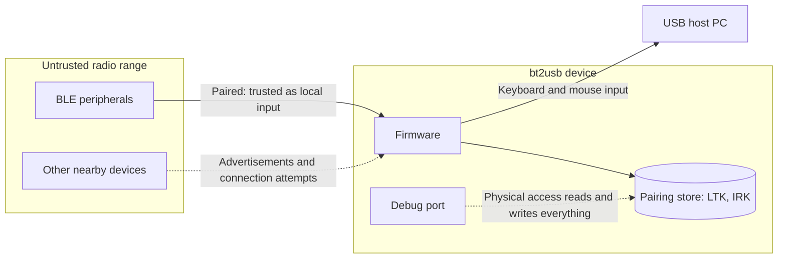

# Security Reference

This guide describes bt2usb's implemented security posture, trust boundaries,
and known limitations. bt2usb is development firmware, not a hardened or
certified input appliance. To report a vulnerability, follow the
[security policy](../SECURITY.md).

## Security Posture Summary

Implemented controls:

- BLE bonding with encrypted links required before HID discovery
- new pairing started only by an explicit user connection, never by a
  background reconnect
- bond lookup and replacement scoped to the peer's identity, not only the
  encryption master ID
- bounded, validated parsing of advertisements, Report Maps, report
  references, notifications, and stored records
- vendored GATT discovery that cannot be panicked or looped by a peer
- fail-closed pairing store that never overwrites unreadable bonds
- default-Cancel confirmations for Forget and Factory reset
- no logging of bond keys or keystroke content
- pinned toolchain, locked dependencies, SHA-pinned CI actions, a weekly
  dependency audit, and least-privilege workflow permissions
- attested release provenance for checked builds

Known limitations:

- Just Works pairing only (`IoCapabilities::None`): no MITM protection
- no enrollment allowlist or bounded pairing window
- bond keys stored unencrypted in internal flash
- no readout protection or production debug policy
- no signed update verification, secure boot, anti-rollback, or DFU
- logical deletion is not physical key erasure
- no published support lifetime, security contact, or response SLA

## Trust Boundaries

The bridge accepts data from nearby BLE peripherals and can inject keyboard and
mouse input into its USB host. A paired device is therefore trusted to act as a
local input device. Do not pair an untrusted device with a privileged host.

Anything in radio range can advertise, respond to discovery, and send
malformed data, so every peer-controlled length, handle, and field is bounded
before use. Anyone with physical access to the debug port can read keys and
replace firmware.

## Pairing And Authentication

The current BLE security handler declares `IoCapabilities::None`. It supports
bonding and encrypted links but has no passkey or numeric-comparison user flow.
Do not treat this pairing method as authenticated protection against a nearby
active attacker. There is no enterprise enrollment/allowlist policy or bounded
pairing-mode policy beyond the existing device-selection UI.

HID discovery waits for an encrypted link; signed-only modes are not sufficient.
The application initiates new pairing only for an explicit user connection, not
a background reconnect. Bond lookups and updates are tied to peer identity, not
just the encryption master ID. These controls do not add MITM authentication to
Just Works pairing.

## Key Storage And Deletion

Long-term encryption and identity keys are stored in the nRF52840's internal
flash as part of the paired-device record; see the
[data model](data-model.md#pairing-store). This application does not encrypt
those records at rest or provision a production debug/readout-protection policy.
Physical debug access and firmware artifacts that contain memory dumps must be
treated as sensitive. The UI's disconnect action does not erase stored bonds.

Malformed, unsupported, or unreadable stores disable ordinary persistence writes
to avoid silently overwriting existing keys. The saved-device menu provides
separate Forget and Factory reset confirmations, defaulting to Cancel. A
successful operation commits storage before changing cached bonds. Reset can
explicitly recover an unreadable region. These are logical device-management
operations, not certified physical key erasure; readable-store updates can leave
older flash records until garbage collection. A reported storage failure must
not be treated as successful deletion or enrollment.

## Firmware Integrity And Updates

Firmware updates currently use a debug probe. The application provides no signed
update verifier, anti-rollback mechanism, secure boot chain, or OTA/USB DFU flow.
The configured release workflow signs GitHub artifact provenance for the checked
build and its checksum manifest. Verify the expected source and workflow identity
using the [deployment guide](deployment.md#verify-before-flashing); an
unauthenticated checksum alone does not establish origin. Hosted signing and
verification still need a successful tag-run acceptance record. Artifact
attestations do not make the device enforce signed firmware. Production USB
identity, protected provisioning, and recovery are open tasks.

## Supply Chain

- `rust-toolchain.toml` and `Cargo.lock` pin the compiler and dependency graph;
  builds use `--locked`.
- The `nrf-softdevice` patch is vendored and reviewed
  ([ADR 0007](adr/0007-vendored-softdevice-patch.md)).
- CI actions are pinned to commit SHAs with the upstream tag in a comment, and
  the default workflow permission is read-only.
- `cargo audit` runs in CI and weekly; Dependabot proposes Cargo and Actions
  updates weekly.
- SoftDevice is obtained from Nordic separately; record its archive hash with
  hardware evidence.

License checks, an SBOM, and digest verification for non-Cargo downloads are
open in [TODO.md](../TODO.md).

## Contributor Expectations

Keep untrusted report lengths, IDs, descriptor fields, and persistence records
bounded and validated before use. Test malformed and truncated inputs alongside
normal cases. Security-sensitive changes need a review of pairing policy,
key lifetime, release behavior, and reset/recovery paths, plus hardware evidence
where host tests cannot exercise the driver behavior.

Do not log bond keys or keystroke contents to aid diagnostics. Review dependency
and build-tool updates before release. Link security decisions and exceptions to
the applicable [release gate](deployment.md#release-gates), rather than
describing an unfinished control as implemented.

## Security Review Checklist

- [ ] New peer-controlled input is bounded, validated, and covered by malformed
      and truncated test cases.
- [ ] No new path can panic, loop without bound, or allocate on peer input.
- [ ] Pairing, bonding, or key-handling changes have an ADR or a reviewed
      update to this guide.
- [ ] Storage changes fail closed and follow the
      [schema change rules](data-model.md#schema-change-rules).
- [ ] Logs contain no keys, raw flash, or keystroke content.
- [ ] Held input is released on every new failure path.
- [ ] Dependency, toolchain, or workflow changes keep pins and permissions.

## Related Guides

- [Security policy and reporting](../SECURITY.md)
- [Architecture and ADRs](architecture.md)
- [Data model](data-model.md)
- [Deployment](deployment.md)
- [Operations](operations.md)
