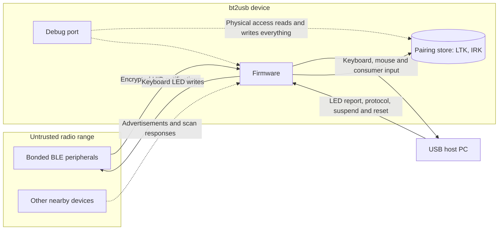

# Security Reference

This guide describes bt2usb's implemented security posture, trust boundaries,
threat model, and known limitations. bt2usb is development firmware, not a
hardened or certified input appliance: it bridges whatever a paired BLE device
types into a USB host, so its security depends on who can pair with it and who
can touch it. To report a vulnerability, follow the
[security policy](../SECURITY.md).

Statements below distinguish three levels of evidence. **Implemented** means
the code exists in this repository. **Software-verified** means a host test,
the Renode scenario, or a release-helper test exercises it. **Hardware-verified**
means a recorded board run demonstrates it; no security behavior in this guide
is hardware-verified yet (see [Testing](testing.md#known-verification-gaps)).

## Security Posture Summary

Implemented controls:

- BLE bonding with an encrypted link required before HID discovery
- the firmware itself requests new pairing only for an explicit user
  connection, never for a background reconnect (a peer-sent Security Request
  is a separate, untested path; see
  [Pairing And Authentication](#pairing-and-authentication) and TODO:
  [Refuse peer-initiated pairing on background reconnects](../TODO.md#ble-central-and-pairing))
- no fallback to fresh pairing when encryption with stored keys fails
- bond lookup and replacement scoped to the peer's identity, not only the
  encryption master ID
- no advertising or peripheral role, so nearby devices cannot connect to the
  bridge
- bounded, validated parsing of advertisements, Report Maps, report
  references, notifications, USB LED reports, and stored records
- vendored GATT discovery that rejects the peer responses that could
  previously panic it or make it loop forever, and no other panic a peer,
  the host, or flash can reach: Clippy rejects unchecked indexing and
  `unwrap` outside tests, and every remaining panic path is listed with the
  reason it cannot fire ([code quality](code-quality.md#panic-paths-no-lint-flags),
  [ADR 0025](adr/0025-panic-lints-and-inventory.md))
- fail-closed pairing store that never overwrites unreadable bonds
- default-Cancel confirmations for Forget and Factory reset
- no USB management, vendor, mass-storage, or firmware-update interface
- no application logging of bond keys or keystroke content
- pinned toolchain, locked dependencies, SHA-pinned CI actions, a weekly
  dependency audit, and least-privilege workflow permissions
- attested release provenance for checked builds, with packaging that rejects
  build metadata not recorded at the `info` log level (configured; no release
  tag has exercised it yet)

Known limitations:

- LE legacy Just Works pairing only (`IoCapabilities::None`, no LE Secure
  Connections): no MITM protection, and a recorded pairing exchange exposes the
  link keys
- no enrollment allowlist or bounded pairing window
- a newly paired device can claim the identity of an existing bond
- bond keys stored unencrypted in internal flash
- no readout protection or production debug policy: every boot keeps the
  SWD debug port open (see
  [Physical Access And Debug Port](#physical-access-and-debug-port))
- no signed update verification, secure boot, anti-rollback, or DFU
- logical deletion is not physical key erasure
- a `trace`-level build records typing rhythm through per-notification log
  lines, and the `log-sensitive-data` opt-in adds keystroke bytes and peer
  addresses
- a stable, factory-derived USB serial number is visible to every host
- no published support lifetime, security contact, or response SLA, and
  GitHub private vulnerability reporting is not enabled for the repository
  (checked through the GitHub API on 2026-10-09)

## Assets

| Asset | Where it lives | Why it matters | Current protection |
| --- | --- | --- | --- |
| Long-term key (LTK) and master ID per bonded peer | RAM in `Bonder` ([bonder.rs](../src/ble/bonder.rs)) and `DEVICE_STORE`; flash pages 240–243 (`0xF0000–0xF4000`) as a 50-byte bond record ([codec.rs](../src/storage/codec.rs)) | Decrypts that link's recorded traffic and lets an attacker impersonate either side of the bond | Never logged by application code; internal flash only. Not encrypted at rest, not readout-protected |
| Identity resolving key (IRK) and identity address | Same record and RAM copies as the LTK | Resolves the peripheral's private addresses, so the holder can track or impersonate its identity | Same as LTK |
| Keystroke and pointer stream | Transient: notification buffer (at most 32 bytes), per-link coalescer, 16-entry HID channel, aggregator, endpoint mailboxes | Passwords and private text pass through the bridge | Encrypted BLE link required; never persisted; content not logged by default. A `trace` build logs each notification's length and time, and only the `log-sensitive-data` opt-in logs its bytes (see [Logging And Privacy](#logging-and-privacy)) |
| Host access | The three USB HID interfaces ([hid_device.rs](../src/usb/hid_device.rs)) | Anything that can feed input can type commands as the logged-in user | Input comes only from bonded, encrypted peers; pairing needs a button press on the bridge |
| Paired-device metadata | Flash record (address, name, RSSI hint), OLED, RTT logs | Reveals which devices a person owns and uses | None beyond physical control of the unit |
| Firmware image | Application flash `0x27000–0xF0000` ([memory_sd.x](../memory_sd.x)); release ELF/HEX | Replacement firmware can log keystrokes or inject input | Attested release provenance checked by people before flashing; the device itself verifies nothing |
| Release signing identity | GitHub OIDC token of the `release-package` job in [ci.yml](../.github/workflows/ci.yml), used by `actions/attest` | Attestations from this workflow identity are what the [deployment guide](deployment.md#verify-before-flashing) trusts | Tag-only job, SHA-pinned actions, no `contents: write` in the signing job; no long-lived signing key exists in the repository |
| Unit identity | USB serial built from FICR `DEVICEID[1]` and `DEVICEID[0]` | Lets any host recognize the same physical unit | None; production identity is open work |

Repository settings that also protect the release identity, such as who may
push `v*` tags or approve workflow runs, live in GitHub and are not recorded in
this repository; they have not been verified here.

## Trust Boundaries



The bridge accepts data from nearby BLE peripherals and can inject keyboard and
mouse input into its USB host. A paired device is therefore trusted to act as a
local input device. Do not pair an untrusted device with a privileged host.

Anything in radio range can advertise, respond to discovery, and send
malformed data, so every peer-controlled length, handle, and field is bounded
before use. The bridge is a BLE central only: [sd_setup.rs](../src/sd_setup.rs)
configures `adv_set_count: 0` and `periph_role_count: 0`, so other devices can
answer its scans but cannot open a connection to it. Anyone with physical
access to the debug port can read keys and replace firmware.

Security assumptions:

- Whoever can press the bridge's buttons is its user; a button press is the
  only consent the firmware asks for before pairing, Forget, or Factory reset.
- The USB host is trusted with everything typed; the bridge cannot protect
  input from a compromised host.
- Nordic's SoftDevice binary is trusted for radio timing, link-layer
  encryption, and pairing, and for the AES-ECB block encryption
  (`sd_ecb_block_encrypt`) that the vendored crate's `IdentityKey::is_match`
  uses to resolve private addresses.
- GitHub Actions, its OIDC issuer, and artifact attestations are trusted for
  the release provenance chain.
- The debug port is not a security boundary in any current build.

## Threat Model

Each gap names the [TODO.md](../TODO.md) item that would close it and links to
its section; a gap inherent to the design says so instead. Mitigations are
implemented in the source cited; none is hardware-verified.

| Actor | Threat | Current mitigation | Gap |
| --- | --- | --- | --- |
| Nearby attacker | Record a pairing exchange, then decrypt later traffic | HID discovery requires an encrypted link (`wait_for_secure_link`, [slot_link.rs](../src/ble/slot_link.rs)) | Legacy Just Works pairing does not protect the key exchange from a passive recording; LE Secure Connections is not requested and a 7-byte key is accepted. TODO: [Authenticated pairing and enrollment policy](../TODO.md#ble-central-and-pairing) |
| Nearby attacker | Advertise a look-alike HID device so the user selects and pairs it, then inject input | Pairing only after an explicit Connect from the device list (`allow_pairing`, [slot_worker.rs](../src/ble/slot_worker.rs)); only advertisements carrying the HID UUID are listed (`merge_advertisement` in [scan_list.rs](../src/ble/scan_list.rs)) | Names are attacker-chosen and the list shows names only; no confirmation code, allowlist, or pairing window. TODO: [Authenticated pairing and enrollment policy](../TODO.md#ble-central-and-pairing) |
| Nearby attacker | Act as a man in the middle during pairing | None: `IoCapabilities::None` offers no user-confirmed authentication | TODO: [Authenticated pairing and enrollment policy](../TODO.md#ble-central-and-pairing); [ADR 0011](adr/0011-interim-just-works-pairing.md) records the interim decision |
| Nearby attacker | Impersonate a bonded peripheral during reconnect | Background reconnects never start pairing; the stored LTK must encrypt the link before discovery; key lookup needs both master ID and identity match (`Bonder::get_key`) | Keys exposed by a recorded pairing (first row) defeat this check. Since 2026-10-11 a background reconnect runs only while `Bonder` holds the device's keys, so a peer's Security Request on it is answered by encrypting with them; if a pairing on the other slot drops those keys while an attempt is under way or while the link it opened is up, a Security Request makes the vendored crate request pairing; untested. TODO: [Refuse peer-initiated pairing on background reconnects](../TODO.md#ble-central-and-pairing) |
| Nearby attacker | Fill the scan list with fake HID advertisers, or jam the radio | Scan list bounded to `BLE_MAX_DISCOVERED` (8), keeping the eight HID advertisers received most strongly (`merge_advertisement` in [scan_list.rs](../src/ble/scan_list.rs)); scan window 8 s plus a 2 s backstop; connect attempts bounded to 6 s ([config.rs](../src/config.rs), [scanner.rs](../src/ble/scanner.rs)) | Fake advertisers received more strongly than the intended device, such as a transmitter closer to the bridge, can still push it out of the list, and a listed name is whatever the advertiser chooses ([ADR 0011](adr/0011-interim-just-works-pairing.md)); jamming cannot be prevented |
| Nearby attacker | Crash or hang the bridge with malformed advertisements | Bounded AD-structure walk and UTF-8 name handling ([adv_parser.rs](../src/ble/adv_parser.rs)) | No fuzzing. TODO: [Parser fuzzing and property tests](../TODO.md#verification-and-code-quality) |
| Paired peripheral (malicious or compromised) | Type or click anything, including consumer usages and host wake | By design it is trusted as local input; consumer usages capped at `0x0FFF`; wake only on a newly pressed input ([wake.rs](../src/hid/wake.rs)) | No per-device capability limits: a peer whose Report Map declares a keyboard can type. TODO: [Authenticated pairing and enrollment policy](../TODO.md#ble-central-and-pairing) |
| Paired peripheral | Crash, hang, or misroute input with malformed GATT data, Report Maps, report references, or notifications | Bounded vendored discovery, an event buffer sized for the largest discovery response (checked at compile time), 512-byte Report Map limit, bounded descriptor parser, exact-length report decoders (see [Input Validation Boundaries](#input-validation-boundaries)); Clippy's panic lints and the [panic inventory](code-quality.md#panic-paths-no-lint-flags) ([ADR 0025](adr/0025-panic-lints-and-inventory.md)) | Vendored discovery has no automated tests; no real-peripheral evidence or fuzzing. TODO: [Report Map interoperability and legacy policy](../TODO.md#ble-central-and-pairing), TODO: [Parser fuzzing and property tests](../TODO.md#verification-and-code-quality) |
| Paired peripheral | Flood notifications to starve the other slot or the USB endpoints | Per-link coalescer holds at most one pending report per endpoint ([coalesce.rs](../src/hid/coalesce.rs)); bounded channel with backpressure; independent endpoint workers ([ADR 0005](adr/0005-two-slots-and-independent-endpoints.md)) | Fairness and loss under sustained load not measured. TODO: [Backpressure behavior and bounded recovery](../TODO.md#input-aggregation-and-delivery) |
| Paired peripheral | Hold keys down, or vanish while holding them | A slot's held state is cleared on disconnect (`HidEvent::Disconnected`); supervision timeout of 4 s, and a peripheral's request for a longer one is bounded to 4 s (`conn_params::bound_request`, [conn_params.rs](../src/ble/conn_params.rs)) | Hardware release timing unmeasured. TODO: [Multi-device aggregation hardware acceptance](../TODO.md#input-aggregation-and-delivery) |
| Newly paired device | Claim an existing peer's identity address to replace its bond | Requires the user to pair it explicitly | Identity is asserted by the peer; `on_bonded` and `DeviceStore::add` (`DeviceList::add` in [devices.rs](../src/storage/devices.rs)) replace the matching record without telling the user. TODO: [Visible storage/security errors](../TODO.md#ui-display-and-power) |
| Malicious USB host | Observe or log everything typed | None possible: the host is the input's destination | Inherent; pair only with hosts you trust |
| Malicious USB host | Send malformed control requests | `set_report` accepts only a one-byte keyboard output report and masks it to defined LED bits; protocol changes only switch report layout ([host_requests.rs](../src/usb/host_requests.rs)) | `GET_REPORT`/`SET_IDLE` behavior comes from `embassy-usb` defaults and is unreviewed. TODO: [HID/USB conformance](../TODO.md#usb-hid-device) |
| Malicious USB host | Read bonds, change pairings, or reflash over USB | Only keyboard, mouse, and consumer HID interfaces exist; no vendor, CDC, mass-storage, or DFU interface (`hid_device::init`) | A future DFU or host management interface (for a companion app or browser configuration page) would change this; the planned host management ADR requires every change from a host to be confirmed on the bridge, because every host behind a KVM shares it. TODO: [Signed USB/BLE DFU](../TODO.md#updates-and-host-tools), TODO: [ADR: host management interface](../TODO.md#updates-and-host-tools) |
| Malicious USB host | Fingerprint or track the unit | None | Development VID/PID `0x1209`/`0x0001` and a stable FICR-derived serial. TODO: [USB production identity](../TODO.md#usb-hid-device) |
| Physical attacker with SWD | Read LTK/IRK from flash, impersonate peers, or decrypt recorded traffic | None | No readout protection: every boot leaves the debug port open ([Physical Access And Debug Port](#physical-access-and-debug-port)); keys unencrypted. TODO: [Provisioning and physical key protection](../TODO.md#device-security-and-provisioning) |
| Physical attacker with SWD | Replace firmware with a keylogger | None on the device; release provenance helps only people who verify before flashing | No secure boot or signed updates. TODO: [Provisioning and physical key protection](../TODO.md#device-security-and-provisioning), TODO: [Signed USB/BLE DFU](../TODO.md#updates-and-host-tools) |
| Physical attacker with buttons | Pair their own keyboard, or Forget/reset the user's devices | Default-Cancel confirmations for destructive actions ([ui_logic.rs](../src/ui/ui_logic.rs)) | No lock or PIN on the local UI. TODO: [Authenticated pairing and enrollment policy](../TODO.md#ble-central-and-pairing) |
| Supply-chain attacker | Ship a malicious crate or toolchain update | `Cargo.lock` with `--locked`, pinned Rust 1.95.0, fixed `nrf-softdevice` revision with a reviewed vendored patch, `cargo audit` on every run and weekly, failing on any vulnerability, unmaintained, unsound, or yanked advisory | No license check or SBOM; two unmaintained transitive crates whose advisories the audit ignores by ID. TODO: [Supply-chain and tooling maintenance](../TODO.md#release-provenance-and-supply-chain), TODO: [Replace unmaintained transitive dependencies](../TODO.md#release-provenance-and-supply-chain) |
| Supply-chain attacker | Compromise a GitHub Action or a workflow job | Actions pinned to commit SHAs; default permission `contents: read`; `persist-credentials: false`; signing and publication split into separate jobs | Dependabot action updates have no assigned reviewer. TODO: [Supply-chain and tooling maintenance](../TODO.md#release-provenance-and-supply-chain) |
| Supply-chain attacker | Tamper with the SoftDevice, Renode, or pip downloads | HTTPS downloads; the CI actionlint, Ruff, and ShellCheck archives are checked against a SHA-256 | `mask softdevice` and `scripts/install-renode.sh` verify no digest. TODO: [Supply-chain and tooling maintenance](../TODO.md#release-provenance-and-supply-chain) |
| Supply-chain attacker | Substitute a release artifact | Attested `dist/*` subjects, draft-only releases, refusal to modify a published release ([ADR 0008](adr/0008-attested-draft-releases.md)) | Hosted attestation not yet exercised end to end. TODO: [Hosted provenance and release recovery acceptance](../TODO.md#release-provenance-and-supply-chain) |
| Supply-chain attacker | Abuse the development container | Tools installed with `cargo install --locked` | Container runs `--privileged`; tool versions and base image are not pinned by digest. TODO: [Development environment hardening](../TODO.md#developer-experience) |

## Pairing And Authentication

The current BLE security handler declares `IoCapabilities::None`. It supports
bonding and encrypted links but has no passkey or numeric-comparison user flow.
Do not treat this pairing method as authenticated protection against a nearby
active attacker. There is no enterprise enrollment/allowlist policy or bounded
pairing-mode policy beyond the existing device-selection UI.

The pairing parameters come from the vendored `nrf-softdevice` crate
(`default_security_params` and `SecurityHandler::security_params` in
`vendor/nrf-softdevice/src/ble/`). They request bonding with encryption and
identity keys distributed in both directions and accept a negotiated key size
of 7 to 16 bytes. They never set the LE Secure Connections flag, and the crate
has no handler for the SoftDevice's LESC DH-key request, so pairing runs as LE
legacy pairing with Just Works. In legacy Just Works the temporary key is zero,
so a passive observer who records the pairing exchange can derive the
resulting keys; the firmware does not check the negotiated key size either.
[ADR 0011](adr/0011-interim-just-works-pairing.md) records why this is the
interim choice.

HID discovery waits for an encrypted link; signed-only modes are not sufficient.
`wait_for_secure_link` polls the link up to 25 times at 200 ms and accepts only
`SecurityMode::JustWorks`, `Mitm`, or `LescMitm`. The application initiates new
pairing only for an explicit user connection, not a background reconnect. When
keys already exist for the peer, a failed encryption never falls back to fresh
pairing, even on an explicit connection; to re-pair a device that lost its
bond, Forget it first. Bond lookups and updates are tied to peer identity, not
just the encryption master ID. These controls do not add MITM authentication to
Just Works pairing.

Bond bookkeeping in `Bonder` ([bonder.rs](../src/ble/bonder.rs)):

- `on_bonded` replaces the entry whose identity address equals the new one, or
  whose IRK resolves the connection's address; otherwise it appends, evicting
  the oldest in-memory bond when `MAX_PAIRED_DEVICES` (4) are held.
- The identity address and IRK are asserted by the peer during pairing. A newly
  paired device that claims an existing peer's identity address replaces that
  peer's bond in memory and, on its first successful connection, in flash.
- A bond whose identity is not a public or random static address, the only
  types the Core specification allows for an identity, is not kept:
  `on_bonded` keeps no keys for it, `execute_action` stores nothing for the
  device and shows `Pairing not saved`, and the type is decoded without the
  vendored `Address::address_type`, which panics on a reserved one. Saving
  the bond would make the next boot refuse the whole store, and saving the
  device without it would let a peer that rotates its address evict bonded
  peers by pairing again ([data model](data-model.md#write-rules)).
- `get_key` requires both the master ID and an identity match;
  `get_peripheral_key` matches identity only.
- Every match of a bond against an address goes through `key_matches`, which
  decides as `IdentityKey::is_match` except that an all-zero IRK resolves no
  private address. The vendored crate stores that IRK for a peer that
  distributed no identity key, and any device can build a private address
  from it; before 2026-10-10 such a device could replace that peer's keys,
  overwrite its stored record, and draw its background reconnects. The
  reconnect scan and Forget's slot selection use the same check.
- `DeviceStore::add` evicts the oldest record when a fifth device is added,
  logging only `Paired device store full - evicting oldest entry`.

The application-level `allow_pairing` restriction covers the firmware's own
`encrypt()` and `request_pairing()` calls. A peer can also send a Security
Request, which the vendored crate answers by encrypting with stored keys or,
when it has none, by calling `request_pairing()`
(`vendor/nrf-softdevice/src/ble/gap.rs`). Since 2026-10-11 a background
reconnect starts an attempt only while `Bonder` holds the device's keys
(`connection_slot_task` checks before each attempt, and power-up skips a
stored peer without a bond), so the crate answers such a request by
encrypting. The keys can still disappear while an attempt is under way or
while the link it opened is up: a pairing on the other slot that bonds while
`Bonder` holds four keys drops the oldest, even if that device is never saved
(the RAM keys and the store's records are evicted separately, a
[FIXME](../TODO.md#fixme)). During an attempt the firmware's own `encrypt()`
then finds no keys and closes the link, but whether a peer-requested pairing
can complete first has not been tested; on a link already up nothing closes
it, and the crate answers the peer's request by pairing. Closing this path is
the P0 TODO
[Refuse peer-initiated pairing on background reconnects](../TODO.md#ble-central-and-pairing).

## USB Host Interface

The USB device built in [hid_device.rs](../src/usb/hid_device.rs) exposes three
HID interfaces and nothing else: a boot-subclass keyboard, a boot-subclass
mouse, and a consumer-control interface. There is no vendor, CDC, mass-storage,
or DFU interface, so a host cannot read flash, list or change pairings, or
update firmware over USB. `BootRequestHandler` in
[host_requests.rs](../src/usb/host_requests.rs) answers `SET_REPORT` and the
protocol requests on the keyboard and mouse interfaces.

| Host action | Firmware handling |
| --- | --- |
| `SET_REPORT` on the keyboard interface | Accepted only for output report ID 0 with exactly one byte; masked to the five defined LED bits; published through a `Watch` that keeps the latest value and written to the BLE keyboard's LED output report characteristic when the connected keyboard exposes one |
| `SET_REPORT` on the keyboard interface with another report ID or length | `OutResponse::Rejected` |
| `SET_REPORT` on the mouse interface | `OutResponse::Rejected` (the shared `BootRequestHandler` accepts reports only when `keyboard` is true) |
| Any request to the consumer-control interface's request handler | The consumer interface is built with `request_handler: None`, so `embassy-usb`'s default handling applies; unreviewed |
| `SET_PROTOCOL` / `GET_PROTOCOL` (keyboard, mouse) | `SET_PROTOCOL` switches between report and boot layouts and replays held state; `GET_PROTOCOL` returns the current mode |
| Bus reset, disable, configure, suspend, resume | Reset (and disable) clears the configured, suspended, boot-protocol, LED, and pending-wake state; every transition replays current held state, and replay never resends mouse motion |
| Other class requests (`GET_REPORT`, `SET_IDLE`, `GET_IDLE`) | Not handled in `src/`; left to `embassy-usb` defaults, unreviewed. TODO: [HID/USB conformance](../TODO.md#usb-hid-device) |

The device advertises remote wakeup and requests it only when a new key,
modifier, consumer usage, or mouse button is pressed while the bus is
suspended; the host decides whether to honor it. Descriptors identify the unit
with the pid.codes test VID `0x1209`, PID `0x0001`, manufacturer `bt2usb`,
product `BT-to-USB HID Bridge`, and a 16-hex-digit serial derived from the
chip's factory-programmed FICR `DEVICEID` words. That serial stays the same
across reflashes and ports, so every host the unit is plugged into can
recognize it.

## Input Validation Boundaries

Every place peer-, host-, or flash-controlled data is parsed, with the bound
applied and the result of a violation:

| Boundary | Source | Bound applied | On violation |
| --- | --- | --- | --- |
| Advertising and scan-response data | [adv_parser.rs](../src/ble/adv_parser.rs), `merge_advertisement` in [scan_list.rs](../src/ble/scan_list.rs) | AD walk stops at a zero length or a structure that runs past the end; UUID lists read in 2-byte chunks; names must be UTF-8 and are cut at a character boundary to 32 bytes; only HID UUID `0x1812` creates an entry; list capped at 8, where a new HID advertiser replaces the weakest entry only when received more strongly, and an unavailable RSSI (127) ranks below every measured one; name-only responses update existing entries only | Structure ignored; name shown as `Unknown`; device not listed |
| Reconnect scan | `find_saved_peer` in [scanner.rs](../src/ble/scanner.rs); `ReconnectTable` in [reconnect.rs](../src/ble/reconnect.rs) | Accepts only a connectable report whose address a registered slot's stored identity key resolves (an all-zero IRK resolves none, `key_matches`) or that equals its stored address; non-connectable and scannable-only reports are ignored; a sighting is handed only to the slot whose target matched, used once, and dropped after 2 s; bounded by `BLE_CONNECT_TIMEOUT_SECS` (6 s) | Silent retry after the 500 ms backoff |
| Connection parameter requests | `Bonder::conn_param_update_request` in [bonder.rs](../src/ble/bonder.rs); `bound_request` in [conn_params.rs](../src/ble/conn_params.rs) | Any 16-bit values accepted as input; interval kept within 7.5–15 ms, or the request's fastest up to 30 ms when it asks only for slower ones, latency at most 20, supervision timeout 1–4 s and always above `(1 + latency) × interval × 2`; reversed interval bounds read as a range | Nearest bounded values granted instead |
| GATT discovery | Vendored `gatt_client::discover`; `HidServiceClient` in [hid_client.rs](../src/ble/hid_client.rs) | Six characteristic declarations kept per response, resuming after the last kept handle; six descriptors per characteristic; declarations must lie in range and advance; empty responses rejected; saturating handle arithmetic; ATT timeouts return errors; at most `MAX_REPORTS` (8) Report characteristics tracked, at least one required | Discovery fails; UI shows `No HID service`; the cause is logged as `HID discovery failed: {:?}` |
| Report Map long read | [long_read.rs](../src/ble/long_read.rs), `read_report_map` | ATT MTU must be 23–517; each fragment at most MTU − 1 bytes; total at most 512 bytes; an exact-MTU end needs Invalid Offset, or Attribute Not Long after the first fragment only; response handle and offset must match the request; a partial value is never exposed | `HID map too large` or `HID map read failed`; only an absent Report Map permits legacy classification |
| HID Report Map parser | `HidDescriptor::parse` in [report_protocol.rs](../src/hid/report_protocol.rs) | Item sizes checked against the buffer; long items skipped with checked arithmetic; collection and Push/Pop stacks bounded to 16 and required to balance; Report ID one non-zero byte; Delimiter rejected; Report Size/Count never multiplied; at least one keyboard, mouse, or consumer input | `Unsupported HID map` |
| Report Reference descriptor | `subscribe_all` in [hid_client.rs](../src/ble/hid_client.rs), `ReportReference::parse` | Read into a 2-byte buffer; exactly 2 bytes required; Output/Feature never subscribed as input; with numbered maps an unknown or ambiguous ID is skipped | Characteristic skipped with `Skipping unknown or ambiguous HID report reference`; `Notify failed` if none remain |
| Notifications | `on_hvx` in [hid_client.rs](../src/ble/hid_client.rs); `classify_gatt_notification` in [hid/mod.rs](../src/hid/mod.rs) | Notifications only (indications ignored); subscribed handles only; payloads over 32 bytes rejected, not truncated; keyboard exactly 8 bytes, mouse 3–5 bytes, consumer 2 bytes; a keyboard report's reserved byte is ignored and zeroed when the characteristic's Report Reference resolves to the keyboard report of a numbered Report Map, or an unnumbered map describes only a keyboard, and must be zero when only the length or a conventional report ID suggests a keyboard; numbered maps need a known characteristic kind; other unnumbered maps route only advertised kinds | Report dropped |
| Consumer usages | `ConsumerReport::from_ble_bytes` in [consumer.rs](../src/hid/consumer.rs); [aggregate.rs](../src/hid/aggregate.rs) | Usage at most `MAX_CONSUMER_USAGE` (`0x0FFF`), matching the USB descriptor's logical maximum; rechecked in the aggregator | Report dropped |
| Aggregated report fields | [aggregate.rs](../src/hid/aggregate.rs) | Mouse buttons masked to five bits; keyboard reserved byte cleared; key codes 1–3 produce the rollover array; unknown source index ignored | Field normalized or event ignored |
| Pairing store frames | [storage.rs](../src/storage.rs), [devices.rs](../src/storage/devices.rs), [framing.rs](../src/storage/framing.rs), [record.rs](../src/storage/record.rs), [codec.rs](../src/storage/codec.rs) | 512-byte read buffer; magic `0xB2` selects the versioned path; version `0x01`; the whole frame must be complete with no trailing bytes; at most 4 records; address type at most 4; name at most 32 bytes of UTF-8; bond flag 0 or 1 with an exact 50-byte bond; identity address public or random static, which a save also requires (`DeviceList::add`). A blob without the magic byte is read as the legacy unversioned format with the same count, address, and name bounds and no bonds | Store loaded empty, writes disabled, `Invalid or unsupported device store; writes disabled`; UI shows `Storage failed` |
| USB control requests | `BootRequestHandler` in [host_requests.rs](../src/usb/host_requests.rs) | See [USB Host Interface](#usb-host-interface) | `OutResponse::Rejected` |

The [data model](data-model.md#pairing-store) documents the stored layout; the
[architecture overview](architecture.md#hid-path-and-limits) explains the
supported report layouts.

## Key Storage And Deletion

Long-term encryption and identity keys are stored in the nRF52840's internal
flash as part of the paired-device record; see the
[data model](data-model.md#pairing-store). This application does not encrypt
those records at rest or provision a production debug/readout-protection policy
(see [Physical Access And Debug Port](#physical-access-and-debug-port)).
Physical debug access and firmware artifacts that contain memory dumps must be
treated as sensitive. The UI's disconnect action does not erase stored bonds.

The pairing region is flash pages 240–243 (`0xF0000–0xF4000`), which
[memory_sd.x](../memory_sd.x) keeps outside the linker's `FLASH` region so code
can never be placed there. Each bond record holds the EDIV, Rand, LTK, key
flags, IRK, and identity address in plain form ([codec.rs](../src/storage/codec.rs)).
Working copies also live in RAM (`Bonder` and `DEVICE_STORE`); the firmware does
not explicitly zeroize them. The self-test writes and removes a scratch record
in the same region and logs only the size of any saved pairing record.

Malformed, unsupported, or unreadable stores disable ordinary persistence writes
to avoid silently overwriting existing keys. The saved-device menu provides
separate Forget and Factory reset confirmations, defaulting to Cancel. A
successful operation commits storage before changing cached bonds. Reset can
explicitly recover an unreadable region. These are logical device-management
operations, not certified physical key erasure; readable-store updates can leave
older flash records until garbage collection. A reported storage failure must
not be treated as successful deletion or enrollment.

Enrollment differs from deletion: a new bond enters the in-memory bonder when
pairing completes, and the device record enters the in-memory store before the
flash write. A failed save shows `Storage failed` while the link keeps working;
the record survives a reboot only if a later save succeeds. A full-chip erase
with the debug probe removes the pairing region together with SoftDevice; see
[operations](operations.md#saved-devices-and-storage).

## Physical Access And Debug Port

This section is source-derived: it follows the code path in the pinned
`embassy-nrf` 0.7.0 (`Cargo.lock`) and has not been observed on hardware.

The bridge ([main.rs](../src/main.rs)) and the self-test
([selftest.rs](../src/selftest.rs)) both call `embassy_nrf::init` with
`embassy_nrf::config::Config::default()`, changing only the GPIOTE and time
driver interrupt priorities. The default `debug` setting is
`Debug::Allowed`. [Cargo.toml](../Cargo.toml) enables `embassy-nrf` with the
features `defmt`, `nrf52840`, `time-driver-rtc1`, `gpiote`, and `unstable-pac`;
it does not enable `reset-pin-as-gpio` or `nfc-pins-as-gpio`, and no other crate
in `Cargo.lock` depends on `embassy-nrf`. On every boot `init` therefore checks
these UICR words, before the SoftDevice is enabled:

| UICR word | Value written when it differs | Effect |
| --- | --- | --- |
| `APPROTECT` | `0x5A`, the library's "disabled" value, only on chips whose FICR build code is `F` or later (`APPROTECT_MIN_BUILD_CODE` in `chips/nrf52840.rs`); `init` also writes `0x5A` to the `APPROTECT.DISABLE` register on those chips. Older build codes are left alone | Keeps the SWD debug port open on every boot |
| `PSELRESET[0]`, `PSELRESET[1]` | `18` (`RESET_PIN`) | P0.18 becomes the pin reset |
| `NFCPINS` bit 0 | `1` | P0.09 and P0.10 stay in NFC antenna mode; an erased UICR already holds this value |

The library writes a word only when its value differs, and only when the write
clears bits; a word that would need bits set back to 1 is left unchanged, and
for `PSELRESET` and `NFCPINS` a warning says to erase UICR. If any word was
written, `init` resets the chip (`SCB::sys_reset`) before returning. The first
boot after UICR is erased therefore writes `PSELRESET` (and `APPROTECT` on
build-code `F` or later chips) and resets once, so the boot log shows
`bt2usb firmware starting` (or `==== bt2usb self-test ====`) twice; later boots
find the values in place and do not reset. Which build code the development
boards carry has not been recorded.

Consequences: no current build enables readout protection. Anyone with SWD
access can read flash, including the bond records in pages 240–243, read RAM,
and write new firmware. P0.18 resets the chip when driven low, and P0.09/P0.10
are not free GPIOs ([hardware](hardware.md#pin-and-peripheral-usage)).

Enabling readout protection would require:

1. Setting `nrf_config.debug = embassy_nrf::config::Debug::Disallowed` before
   `embassy_nrf::init` in both [main.rs](../src/main.rs) and
   [selftest.rs](../src/selftest.rs), so neither image reopens the port. With
   `Disallowed`, `init` writes `0x00` to UICR `APPROTECT` and resets once. That
   write only clears bits, so it needs no erase, even over the `0x5A` that
   earlier builds wrote.
2. Accepting that the probe can then no longer flash, attach, or read RTT logs.
   The only way back is the debug port's erase-all through the CTRL-AP, which
   erases flash, RAM, and UICR: the SoftDevice, the application, and every
   bond. Then reinstall the SoftDevice, flash, and pair every peripheral again,
   as after any [full-chip erase](deployment.md#softdevice-reinstall-after-a-full-erase).
   The exact probe-rs command for this recovery has not been tried here.
3. Recognizing what it does not do: the erase-all still lets someone with the
   board install other firmware, and the bonds stay unencrypted in flash.

None of this is implemented or tested. The policy decision and the hardware
demonstration are the P0 TODO items
[ADR: provisioning, debug access, and readout protection](../TODO.md#device-security-and-provisioning)
and
[Provisioning and physical key protection](../TODO.md#device-security-and-provisioning).

## Logging And Privacy

Firmware logs go over RTT through `defmt`, so reading them needs the debug
probe. The level is fixed at build time by `DEFMT_LOG`:

| Build | Level | Set by |
| --- | --- | --- |
| Local `cargo`/`mask` builds | `debug` | `[env]` in [.cargo/config.toml](../.cargo/config.toml) |
| CI and release artifacts | `info` | `env` in [ci.yml](../.github/workflows/ci.yml); `scripts/release.py` refuses to package build metadata whose `defmt_log` is not `info` |

Application log statements were checked by listing every `defmt` macro under
`src/`. None formats a `BondInfo`, `EncryptionInfo`, `IdentityKey`, `MasterId`,
`HidReport`, `HidEvent`, notification bytes, or flash record bytes. `BleCommand`
and `BleEvent` derive `defmt::Format` and contain addresses, but no statement
logs them. What application code does log:

| Level | Content | Example strings | Sensitivity |
| --- | --- | --- | --- |
| info | Task lifecycle, counts, results | `SoftDevice started`, `Loaded {} BLE bonds into security handler`, `Saved {} devices to flash` | None |
| info | Peer's advertised name | `slot {} connecting to {}` | Names can identify a person ("Alex's keyboard") |
| info | Nearby HID device names (self-test only) | `BLE: HID device '{}' (RSSI {})` | Names of other people's devices in range |
| info | Host lock-key LED state | `Host LEDs: num={} caps={} scroll={}` | Reveals when Caps/Num/Scroll Lock change, not other keys |
| info | Local button events and link security mode | `Button: {}`, `BLE security mode updated: {}` | None |
| warn/error | Failure causes | `HID discovery failed: {:?}`, `Flash read error: {:?}` | Error codes only |
| debug | Store and descriptor diagnostics | `DeviceStore: no changes to save`, `HID descriptor: no recognized usages found` | None |

### Dependency Logs

Dependency log statements were reviewed on 2026-10-10 by listing every `defmt`
macro in the crates the firmware builds, at the versions in `Cargo.lock`. Only
the rows below print values; every other dependency line is a fixed string.

| Crate | Level | What it logs | Sensitivity |
| --- | --- | --- | --- |
| `nrf-softdevice` (vendored) | info, warn | The SoftDevice's RAM requirement and the error codes of rejected SoftDevice calls | None |
| `nrf-softdevice` (vendored) | debug | `connected role={:?}`, then connection-parameter, ATT MTU, and data-length values | None |
| `nrf-softdevice` (vendored) | trace | Connection handles, PHY and pairing-procedure flags, `on_passkey_display`, and `GATT_HVX write handle={:?} type={:?} len={}` for every notification | Notification lengths and their uptime timestamps show when keys go down and up, so a trace log records typing rhythm |
| `embassy-usb` 0.6.0 | info, warn | A Boot-protocol request rejected on an interface without a request handler; oversized or failed control transfers | None |
| `embassy-usb` 0.6.0 | debug | `SET_CONFIGURATION` state | None |
| `embassy-usb` 0.6.0 | trace | Every control request and the bytes of each control OUT data stage (`control out data: {:02x}`, `HID control_out {:?} {=[u8]:x}`) | Output reports from the host, which are the lock-key LED state the application already logs at info |
| `embassy-nrf` 0.7.0 | warn | UICR already holds a different reset-pin or NFC-pin setting ([Physical Access And Debug Port](#physical-access-and-debug-port)) | None |
| `embassy-nrf` 0.7.0 | debug, trace | USB endpoint enable state, aborted control transfers, and DMA buffer copies | None |
| `embassy-sync`, `embassy-hal-internal` | trace | Ring-buffer indices, not contents | None |
| `sequential-storage` 7.2.0, `embassy-executor`, `embassy-time`, `ssd1306` | None | No log statements; `sequential-storage` is also built without its `defmt` feature | None |

Three lines of the vendored `nrf-softdevice` print a peer address, a passkey,
or input bytes. bt2usb patches them so that only its `log-sensitive-data`
Cargo feature prints those values
([README.bt2usb.md](../vendor/nrf-softdevice/README.bt2usb.md)):

| Source line | Level | Default build | With `log-sensitive-data` |
| --- | --- | --- | --- |
| `central.rs`, on connect | debug | `connected role={:?}` | `connected role={:?} peer_addr={:?}` |
| `gatt_client.rs`, every notification | trace | `GATT_HVX write handle={:?} type={:?} len={}` | `GATT_HVX write handle={:?} type={:?} data={:?}`, the raw report bytes: keystrokes and pointer motion |
| `gap.rs`, passkey display | trace | `on_passkey_display` | `on_passkey_display passkey={}` |

The Just Works pairing used today
([ADR 0011](adr/0011-interim-just-works-pairing.md)) never displays a passkey,
so the third line matters only once authenticated pairing lands. The trace line
that prints a bond's master ID and peer address (`ble evt sec info request` in
`gap.rs`) is compiled only with the crate's `ble-peripheral` feature, which
bt2usb does not enable, and no vendored line prints an LTK or IRK.

The feature exists to debug a peripheral's reports on a bench unit:

```sh
DEFMT_LOG=trace cargo build --locked --features embedded,log-sensitive-data --target thumbv7em-none-eabihf
```

Release artifacts cannot carry these values: CI builds them with
`--features embedded` at `info`, where defmt removes every debug and trace
statement. CI also runs Clippy with the feature, so the opt-in branches keep
compiling. Never build at `trace` on a unit used for real typing, with or
without the feature, and never share such a log; even without the feature, it
records typing rhythm.

Checked on 2026-10-10 by building `bt2usb` and listing the defmt format strings
in the ELF with `llvm-nm`: the default `debug` build has `connected role={:?}`
and no `peer_addr`; a `trace` build has the `len={}` form and no notification
bytes or passkey; only a `trace` build with `log-sensitive-data` has
`peer_addr`, `data={:?}`, and `passkey={}`; an `info` build has none of the
three lines.

### Data Outside The Logs

Data that leaves the device without a probe: the USB descriptors (including the
per-unit serial) go to every host, the OLED shows device names, and stored
names, addresses, and RSSI hints stay in flash until Forget or Factory reset.
The bridge does not advertise. Before attaching a log to an issue, remove
device names, addresses, and the USB serial, and state the log level; the
[operations runbook](operations.md#reporting-a-defect) describes what a report
needs.

## Firmware Integrity And Updates

Firmware updates currently use a debug probe. The application provides no signed
update verifier, anti-rollback mechanism, secure boot chain, or OTA/USB DFU flow.
The configured release workflow signs GitHub artifact provenance for the checked
build and its checksum manifest. Verify the expected source and workflow identity
using the [deployment guide](deployment.md#verify-before-flashing); an
unauthenticated checksum alone does not establish origin. Hosted CI check jobs
pass (for example push run 37932436721 on commit `7fc99d6`), but the tag-only
`release-package` and `release` jobs have never run and no `v*` tag exists, so
hosted signing and verification still need a successful tag-run acceptance
record. Artifact
attestations do not make the device enforce signed firmware. Production USB
identity, protected provisioning, and recovery are open tasks.

The release path in [ci.yml](../.github/workflows/ci.yml) and
[release.py](../scripts/release.py) enforces, before anything is signed:

- the tag is exactly `v` followed by the Cargo package version, including any
  prerelease or build-metadata suffix
- packaging reuses the embedded job's uploaded artifact by ID, with
  `digest-mismatch: error`, instead of rebuilding
- build metadata must name the expected commit, repository, run ID, target,
  profile, `embedded` feature, and `info` log level
- build inputs (manifest, lockfile, toolchain file) and firmware digests must
  match the recorded values, and the recorded `rustc` version must match the
  channel in `rust-toolchain.toml`
- only the `release-package` job holds `id-token: write` and
  `attestations: write`; the `release` job holds `contents: write`, checks out
  no code, creates a draft, and refuses to touch a release already published

The device itself accepts any image written through SWD. See
[ADR 0008](adr/0008-attested-draft-releases.md) for the release design.

## Supply Chain

- `rust-toolchain.toml` and `Cargo.lock` pin the compiler and dependency graph;
  builds use `--locked`.
- The `nrf-softdevice` patch is vendored and reviewed
  ([ADR 0007](adr/0007-vendored-softdevice-patch.md)).
- CI actions are pinned to commit SHAs with the upstream tag in a comment, and
  the default workflow permission is read-only.
- `cargo audit` runs in CI and weekly and fails on unmaintained, unsound, and
  yanked crates as well as vulnerabilities, apart from two advisories ignored
  by ID in [.cargo/audit.toml](../.cargo/audit.toml); Dependabot proposes Cargo
  and Actions updates weekly.
- SoftDevice is obtained from Nordic separately; record its archive hash with
  hardware evidence.

| Input | Pinned by | Integrity check | Gap |
| --- | --- | --- | --- |
| Rust toolchain | `channel = "1.95.0"` in [rust-toolchain.toml](../rust-toolchain.toml) | rustup | — |
| Crates | `Cargo.lock`, `--locked` | crates.io checksums in the lockfile; `cargo-audit@0.22.2` on every CI run and Mondays 07:23 UTC | No license check or SBOM |
| `nrf-softdevice` | Git revision `47d6121c…` in `Cargo.toml`, replaced by the vendored copy through `[patch]` | Source committed under `vendor/` | Upstream changes need a manual re-review |
| `nrf-softdevice-s140` (SoftDevice bindings) | Same Git revision, not vendored | Git commit identity in `Cargo.lock` | Not covered by the vendored review |
| GitHub Actions | Commit SHAs in [ci.yml](../.github/workflows/ci.yml) | Git object identity | Dependabot bumps need review |
| `actionlint` 1.7.12, Ruff 0.16.9, ShellCheck 0.11.0 | Version and SHA-256 in CI | `sha256sum --check --strict` | ShellCheck publishes no checksum file; its digest was taken from the release archive on 2026-10-10 |
| SoftDevice S140 7.3.0 | URL in the `softdevice` task of [maskfile.md](../maskfile.md) | None | No digest verification |
| Renode 1.16.1, `get-pip.py`, Robot Framework | [install-renode.sh](../scripts/install-renode.sh) | None | No digests; some Python versions are ranges |
| Devcontainer | `mcr.microsoft.com/devcontainers/rust:1-bookworm`; `cargo install --locked` without versions | None | Tag not digest; `--privileged` container |

License checks, an SBOM, and digest verification for non-Cargo downloads are
open in [TODO.md](../TODO.md). The two ignored unmaintained-crate advisories,
their dependency chains, and what would remove them are in
[code quality](code-quality.md#auditing). Toolchain and task
pinning is recorded in
[ADR 0013](adr/0013-pinned-toolchain-and-mask-tasks.md).

## Unsafe Code

Application `unsafe` is limited to six blocks, each reviewed in
[code quality](code-quality.md#unsafe-code-policy): building the
advertisement slice from SoftDevice-provided pointer and length
([scanner.rs](../src/ble/scanner.rs), [selftest.rs](../src/selftest.rs)),
dereferencing the `StaticCell`-backed `Bonder` pointer
([bonder.rs](../src/ble/bonder.rs)), SoftDevice power SVCs
([sd_setup.rs](../src/sd_setup.rs)), and the volatile stack-paint read
([stack.rs](../src/stack.rs)). The vendored SoftDevice crate wraps the
SoftDevice C API with `unsafe` FFI. No separate audit record exists; rules for
adding or reviewing `unsafe` are in the same
[code quality](code-quality.md#unsafe-code-policy) section.

## Security Testing

Host tests run with `cargo test --locked --lib --tests` (or `mask test`) on
Linux and Windows in CI. Malformed and hostile input is covered here:

| Area | File | Tests that feed hostile or malformed input |
| --- | --- | --- |
| Advertisements | [adv_parser.rs](../src/ble/adv_parser.rs), [lib_logic_tests.rs](../src/lib_logic_tests.rs), [scan_list_tests.rs](../src/ble/scan_list_tests.rs) | Invalid UTF-8 and empty names, truncation at a character boundary, `ble_adv_parser_handles_malformed_lengths`, `name_without_hid_uuid_cannot_enroll_an_unknown_device`, `name_only_scan_response_updates_known_hid_even_when_list_is_full` |
| Report Map reads | [long_read.rs](../src/ble/long_read.rs) | Oversized maps, exact-MTU endings, `malformed_termination_never_exposes_partial_value` |
| Descriptor parser and routing | [hid_descriptor_tests.rs](../src/hid_descriptor_tests.rs) | `malformed_descriptors_never_return_partial_metadata`, `parser_nesting_is_bounded`, `untrusted_report_dimensions_cannot_overflow_routing_parser`, `long_item_payload_is_not_parsed_as_short_items`, `mixed_kind_report_id_is_not_routable`, `malformed_known_id_never_falls_back_to_another_kind` |
| Report references and payloads | [hid_descriptor_tests.rs](../src/hid_descriptor_tests.rs), [hid_keyboard_report_tests.rs](../src/hid_keyboard_report_tests.rs), [lib_tests.rs](../src/lib_tests.rs), [hid_classify_tests.rs](../src/hid_classify_tests.rs) | `report_reference_rejects_short_descriptor`, `report_reference_rejects_trailing_bytes`, `known_kind_rejects_unsupported_extended_payloads`, `all_consumer_routes_enforce_usb_descriptor_usage_range`, `the_legacy_paths_keep_the_reserved_byte_check`, `a_report_id_shared_by_two_kinds_is_not_the_keyboard`, `an_unnumbered_map_with_other_kinds_keeps_the_reserved_byte_check`, short/empty/single-byte reports |
| Connection parameter requests | [conn_params.rs](../src/ble/conn_params.rs) | `every_request_gets_a_valid_answer` (a sweep over the Core's legal ranges), `a_32_second_supervision_timeout_is_capped`, `reversed_interval_bounds_are_read_as_a_range`, `latency_is_lowered_when_the_timeout_cap_cannot_cover_it` |
| Aggregation and wake | [aggregate.rs](../src/hid/aggregate.rs), [wake.rs](../src/hid/wake.rs) | `invalid_sources_cannot_modify_state_or_wake`, release and motion never waking the host |
| LED output | [keyboard.rs](../src/hid/keyboard.rs) | `masks_undefined_upper_bits_and_round_trips` |
| Stored records | [framing.rs](../src/storage/framing.rs), [record.rs](../src/storage/record.rs), [devices_format_tests.rs](../src/storage/devices_format_tests.rs) | Truncated and zero-length records, count mismatch, future versions, invalid names and address types, bond flag/size mismatch, non-identity address types; malformed, future, and unreadable stores loading empty with saves refused; legacy count and length checks |
| Deletion transactions | [management.rs](../src/ble/management.rs), [ui_logic.rs](../src/ui/ui_logic.rs) | Failed and cancelled persistence, stale quiescence tokens, default-Cancel confirmation, stale management replies |
| Held-input release | [delivery.rs](../src/hid/delivery.rs), [coalesce.rs](../src/hid/coalesce.rs) | `queue_overflow_preserves_final_release`, `keyboard_latest_state_wins_but_release_survives` |
| Release integrity | [release_test.py](../scripts/release_test.py) | Artifact tampering, lockfile change, metadata and build-policy mismatch (including a `debug` log level), bad checksum entries, dirty source; release notes refused for a package whose checksums or metadata do not match, or a SoftDevice the linker script does not expect |

Not covered by automated tests:

- the vendored GATT discovery hardening (`vendor/` has no tests)
- the `src/storage.rs` shell: flash reads and writes, write retries, the
  conversion to SoftDevice address and key types, and IRK resolution through
  the SoftDevice
- USB `set_report` validation and the `slot_link.rs`, `slot_worker.rs`, and
  `bonder.rs` security flow (encryption wait, `allow_pairing`, bond replacement)
- fuzzing, power-loss injection, and any on-air security test

Hardware security acceptance (sniffed pairing, spoofed reconnect, forgotten
peer staying forgotten) has not been performed. See the
[testing guide](testing.md) for layer boundaries.

## Contributor Expectations

Keep untrusted report lengths, IDs, descriptor fields, and persistence records
bounded and validated before use. Test malformed and truncated inputs alongside
normal cases. Security-sensitive changes need a review of pairing policy,
key lifetime, release behavior, and reset/recovery paths, plus hardware evidence
where host tests cannot exercise the driver behavior.

Do not log bond keys or keystroke contents to aid diagnostics. Review dependency
and build-tool updates before release. Link security decisions and exceptions to
the applicable [release gate](deployment.md#release-gates), rather than
describing an unfinished control as implemented.

Changes to BLE security policy, USB descriptors, or persisted formats need an
ADR under the [ADR process](architecture.md#adr-process). Never raise a
dependency's log level to `trace` on hardware used for real input, and keep
new peer-controlled parsing in a hardware-free module so the host tests can
reach it.

## Security Review Checklist

- [ ] New peer-controlled input is bounded, validated, and covered by malformed
      and truncated test cases.
- [ ] No new path can panic, loop without bound, or allocate on peer input.
- [ ] Pairing, bonding, or key-handling changes have an ADR or a reviewed
      update to this guide.
- [ ] Storage changes fail closed and follow the
      [schema change rules](data-model.md#schema-change-rules).
- [ ] Logs contain no keys, raw flash, or keystroke content.
- [ ] Held input is released on every new failure path.
- [ ] Dependency, toolchain, or workflow changes keep pins and permissions.
- [ ] No new USB interface or control request exposes pairing, flash, or
      firmware update to the host.
- [ ] New log statements at any level, including dependency upgrades, were
      checked for addresses, names, and report bytes.
- [ ] The [threat model](#threat-model) and [TODO.md](../TODO.md) reflect any
      gap the change opens or closes.

## Related Guides

- [Security policy and reporting](../SECURITY.md)
- [Architecture and ADRs](architecture.md)
- [Data model](data-model.md)
- [Code quality](code-quality.md)
- [Testing](testing.md)
- [Deployment](deployment.md)
- [Operations](operations.md)
- [First flash](first-flash.md)
